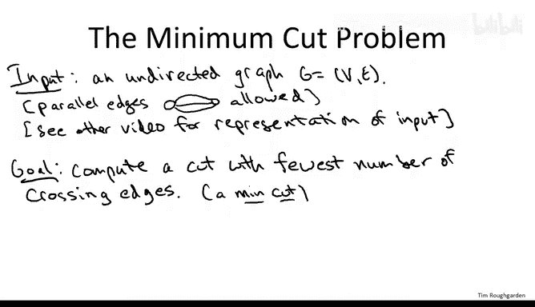
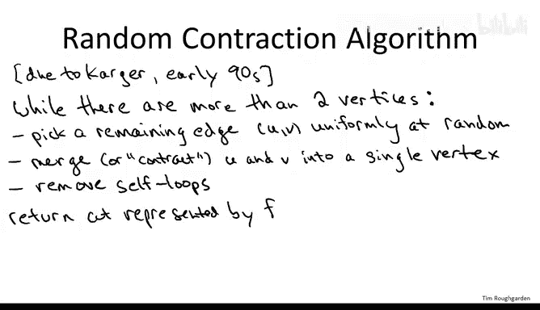
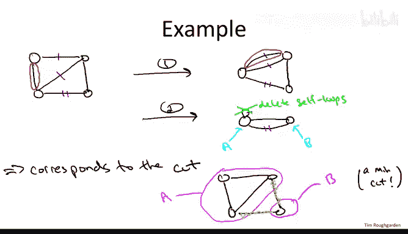
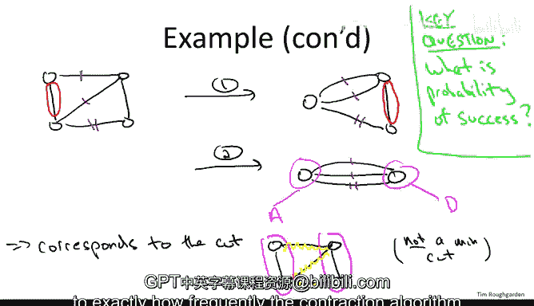

# 算法课程：P42：随机收缩算法

## 概述

在本节课中，我们将学习一个非常巧妙的随机算法——随机收缩算法，用于计算图的最小割。我们将首先回顾最小割问题的定义，然后详细解释随机收缩算法的工作原理，并通过示例演示其执行过程。最后，我们将探讨该算法成功的概率，这需要一些条件概率的知识。

## 最小割问题回顾

给定一个无向图作为输入，图中允许存在平行边（即连接同一对顶点的多条边）。事实上，在算法执行过程中，平行边会自然产生。我们的目标是计算图的一个割。

一个割是将图的顶点划分为两个非空集合 **A** 和 **B**。穿过割的边数是指那些一个端点在 **A** 中、另一个端点在 **B** 中的边的数量。在所有指数级数量的可能割中，我们希望找到一个具有最少穿越边数的割，即最小割。

## 随机收缩算法

这个算法由 David Karger 在 20 世纪 90 年代初于斯坦福大学攻读博士学位时提出。其基本思想是使用随机抽样。就像我们在快速排序中了解到的那样，随机抽样在某些场景下（特别是排序和搜索）是一个好主意。Karger 收缩算法的突破性在于，它证明了随机抽样对于解决基本的图问题也非常有效。

以下是算法的工作原理。我们只有一个主循环。

### 算法主循环

该算法的核心是一个 `while` 循环。循环的每一次迭代都会将图中的顶点数量减少一个。当图中只剩下两个顶点时，算法终止。

在每一次迭代中，我们进行随机抽样：从当前图中剩余的所有边中，**均匀随机地选择一条边**（每条边被选中的概率相同）。

选择一条边后，我们进行**收缩**操作：取这条边的两个端点，称为顶点 **U** 和顶点 **V**，然后将它们融合成一个代表两者的单一顶点。

这种合并可能会产生平行边，即使之前没有。这是允许的，我们会保留这些平行边。合并也可能产生自环（即两个端点是同一个顶点）。自环是无意义的，因此一旦出现，我们就会将其删除。

每次迭代都会减少剩余顶点的数量。我们从 **n** 个顶点开始，最终剩下 **2** 个。因此，在 **n-2** 次迭代后，我们停止。此时，我们返回由最后两个顶点所代表的割。

你可能会疑惑“由最后两个顶点所代表的割”是什么意思，接下来的示例会使其变得清晰。

## 算法示例

假设输入图是一个包含 4 个节点和 5 条边的图，形状像一个正方形加上一条对角线。

### 示例执行轨迹一

由于是随机算法，它可能以不同的方式运行。我们来看两种不同的执行轨迹。

在第一次迭代中，这 5 条边被选中的概率相等，均为 20%。为具体起见，假设算法恰好选择了左边的这条边进行收缩。

收缩后，左边的两个顶点融合成了一个“超节点”，而右边的两个顶点保持不变。原来连接这两个被收缩顶点的边消失了。剩下的边被“拉入”融合过程：顶部的边和对角线现在变成了连接超节点和右上顶点的平行边。此外，底部的边连接右下节点和超节点。

这就是一次迭代。现在图中剩下 3 个顶点（一个超节点和两个原始节点）和 4 条边（包括平行边）。

我们进入第二次迭代。此时剩余 4 条边，每条边被选中的概率为 25%。假设我们选择了两条平行边中的一条（例如，带有一条标记的那条）进行收缩。

现在，顶点数从 3 减少到 2。右下顶点从未参与任何收缩，保持不变。另一个顶点是一个超节点，代表了原始的三个顶点（左两个在第一次迭代中融合，右上顶点在本次迭代中融合进来）。

被收缩的边消失。其他三条边：最右边的边（无标记）连接两个最终节点；带两条标记的边也连接相同的两个节点（只是超节点变得更大了）；而那条与我们收缩边平行的边（另一条带一条标记的边）变成了一个自环。根据算法，自环被自动删除。

现在，我们完成了 **n-2** 次迭代，只剩下两个节点。我们返回对应的割：割的一个集合 **A** 是所有融合到超节点中的原始顶点（本例中是除右下节点外的三个节点），集合 **B** 是对应另一个超节点的原始顶点（本例中就是右下节点本身）。

这个割确实是一个最小割，它有两条穿越边（最右边和最底下的边）。可以验证，该图中不存在穿越边少于两条的割。

### 示例执行轨迹二

现在来看另一种可能的执行情况。假设第一次迭代与之前相同，收缩了最左边的边。

但在第二次迭代中，假设我们选择了最右边的边进行收缩（这也是 25% 的概率）。

收缩后，我们同样剩下两个节点。被收缩的边消失，而其他三条带标记的边保留下来，成为连接这两个最终节点的平行边。

这对应一个割：**A** 是左边的两个顶点，**B** 是右边的两个顶点。这个割有三条穿越边。由于我们已经知道存在一个只有两条穿越边的割，因此这个割不是最小割。

## 算法分析

从示例中我们了解到，收缩算法有时能识别出最小割，有时则不能。这取决于它做出的随机选择，即它选择了哪些边进行收缩。

一个显而易见的问题是：这个算法有用吗？具体来说，它得到正确答案的概率是多少？我们知道这个概率大于 0 且小于 1，但它究竟是接近 1 还是接近 0？

我们处于一个熟悉的位置：我们有一个看似相当不错的算法，但并不知道它是否真的有效，也不知道它成功的频率。为了回答这个问题，我们需要进行一些数学分析，特别是会用到**条件概率**。

对于需要复习条件概率和独立性的同学，可以参考相关资源进行回顾。一旦掌握了这个数学工具，我们就能彻底解决这个问题，得到关于收缩算法成功计算最小割频率的精确答案。

## 总结

本节课我们一起学习了用于求解最小割问题的随机收缩算法。我们回顾了最小割的定义，详细阐述了算法的步骤，并通过具体图例演示了算法可能产生的不同结果。我们看到，算法的成功与否取决于其随机选择。为了量化其性能，我们需要借助概率论（尤其是条件概率）进行分析，这将是下一部分内容的核心。