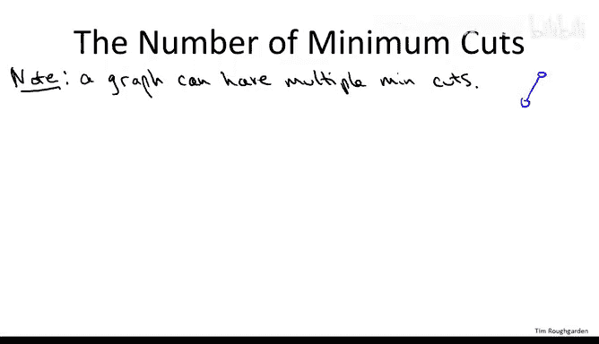
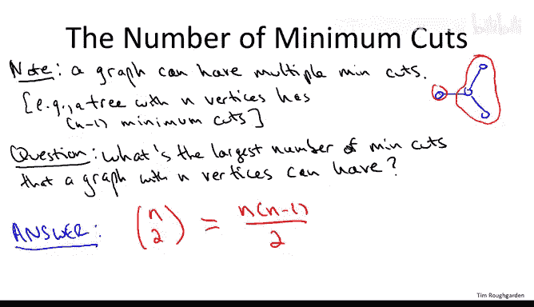
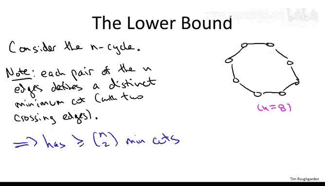
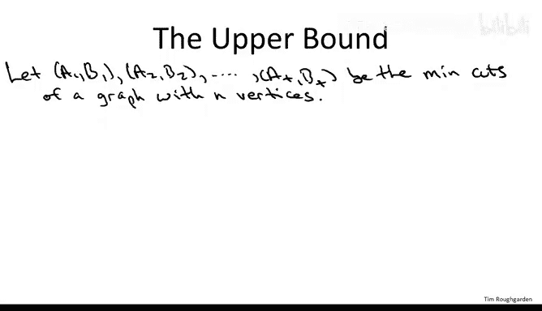
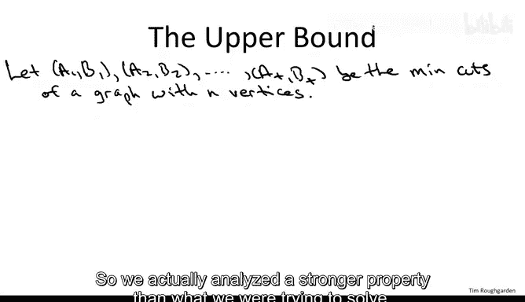
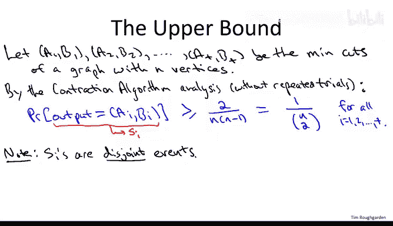

# 斯坦福大学《算法（分治／排序／搜索／随机算法、图搜索／最短路径／数据结构、贪心算法／最小生成树／动态规划、最短路径／NP）｜Algorithms》中英字幕 - P44：44_04_05_最小割计数.zh_en - GPT中英字幕课程资源 - BV1Rx4y1U7sZ

So in this short optional video， really just for fun。

 I want to point out an interesting consequence the traction algorithm has about a problem that's in pure graph theory。

So to motivate the question， I want to remind you of something that we discussed in passing。

 which is that a graph may have more than one minimum cut， so they may be distinct cuts。

 which are tied for the fewest number of crossing edges。For a concrete example。

 you can think about a tree， so if you just look at a star graph that is hubs and spokes。

 it's evident that if you isolate any leaf by itself。

 then you get a minimum cut with exactly one crossing edge。

In fact， if you think about it for a little while， you'll see that in any tree。

 you'll have n minus one different minimum cuts each with exactly one crossing edge。

The question concerns counting the number of minimum cuts， namely。

 given that a graph might have more than one minimum cut。

 what is the largest number of minimum cuts that a graph with in vertices can have。

We know the answer is at least n minus1， we already discussed how trees have n minus1 distinct minimum cuts。

 we know the answer is most something like2 to the n because a graph only has roughly2 to the n cuts。

In fact， the answer is both very nice and wedged in between。

 so the answer is exactly n choose2 where n is the number of vertices。

 this is also known as n times n minus1 divided by two。

 so it can be bigger than it is in trees but not a lot bigger in particular。

 graphs have only undirected graphs have only polynomly many minimum cuts。

 and that's been a useful fact that a number of different applications。

So I'm going to prove this fact to you， all I need is one short slide on the lower bound and then one slide for the upper bound which follows from properties of the random contraction algorithm。

So for the lower bound， we don't have to look much beyond our trees example。

 We're just going to look at cycles。So for any value of n， consider the n cycle。So here， for example。

 is the n cycle with n equal to8， that would be an octagon。

And the key observation is that just like in a tree。

 how removing each of the n minus1 edges breaks the tree into two pieces and defines a cut with a cycle。

 if you remove just one edge， you don't get a cut。The thing remains connected。

 But if you remove any pair of edges， then that induces a cut of the graph corresponding to the two pieces that remain。

 No matter which pair of edges you remove， you get a distinct pair of groups， distinct cuts。

 So arranging overall entries to choices of pairs of edges， you generate n to different cuts。

 Each of those cuts has exactly two crossing edges。 And it's easy to see that's the fewest possible。

So that's the lower bound， which was simple enough， let's now move on to the upper bound。

 which a purely combatorial fact will follow from an algorithm。

So consider any graph that has n vertices and let's think about the different minimum cuts of that graph。

What we're going to use is that the analysis that the contraction algorithm proceeded in a fairly curious way。

 So remember how we defined the success probability of the contraction algorithm。

 We fixed upfronts some min cut a comma B， and we defined the contraction algorithm。

 the basic contraction algorithm before the repeated trials。

 we define the contraction algorithm as successful。

 if and only if it outputs the minimum cut A comma B that we designated up front。

 If it outputs other min cut， we didn't count it。 we said nope that's a failure。

 So we actually analyzed a stronger property than what we were trying to solve。

 which is outputting a given min cut A B rather than just any old min cut。 So how is that useful。

 well， let's apply it here for each of these t minimum cuts of this graph。

 we could think about the probability that the contraction algorithm outputs that particular min cut。

So we can instantiate the analysis with a particular minimum cut AI BI。

And what we proved in the analysis is that the probability that the algorithm outputs the cut AI B。

 not just any oldman cut。 but in fact， this exact cut AI comm B is bounded below by。We， in the end。

 we made a sloppy inequality。 we said it's at least one over n squared。

 but if you go back to the analysis， you'll see that it was in fact，2 over n times n minus-1。

 also known as1 over n choose 2。So instantating the contraction algorithm。

 success probability analysis without all of the repeated trials business。

 we show that for each of these T cuts， for each fixed cut AIBI。

 the probability that this algorithm outputs to that particular cut is at least one over and choose two。

Let's introduce a name for this event， the event that the。

Contraction algorithm outputs the itemmin cut。 Let's call this S I。

The key observation is that the SIs are disjoint events。

Remember an event is just a subset of stuff that could happen。

 so one thing that could happen is that the algorithm outputs the I min cuts and by thisjo we just mean that there's no outcome that's in a given pair of events and that's because the contraction algorithm at the end of the day once it makes its coin flips。

 it outputs a single cut these are distinct cuts it can only output at best one of them。

Why is it important that these SIs are disjoint events， well with disjoint events。

 the probabilities add， the probability of the union of a bunch of disjoint events is the sum of the probabilities of the constituent events？

If you want to think about this pictorially， you can just draw a big box denoting everything that could happen。

 mega， and then these S's are just these blobs that don't overlap。So S1， S2， S3， and so on。

Now the sum of probabilities of disjoint events can sum to at most one。

 right the probability of all of mega is1， and these si's have no overlap and are packed into mega so that sum of their probabilities can only be smaller。

Writing that formally。We have some of their probabilities。

Whi we can lower bound by the number of different events and remember there are T different min cuts for some parameter T for each min cut AI B。

 a lower bound in the probability that that gets spit out as output is one over N choose2。

 so a lower bound on sum of all these probabilities is the number of them T times the probability lower bound。

 one over N choose2 and this has got to be a most one。Rearranging what do we find？T。

 the number of different min cuts is bounded above by N shoes 2。

 exactly the lower bound provided by the end cycle。

 The end cycle has N choose two distinct minimum cuts。 No other graph has more。

 Every graph has only a polynomial number need at most a quadratic number of minimum cuts。

