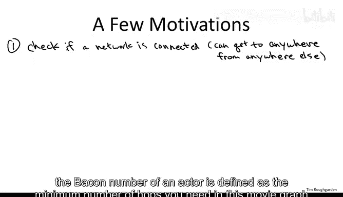
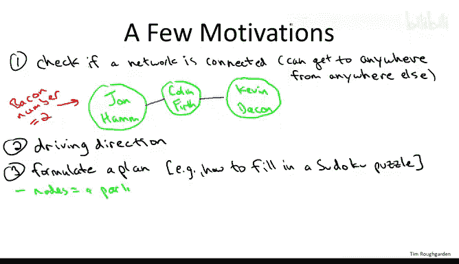
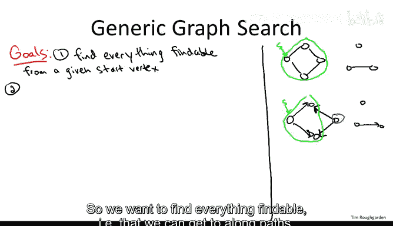
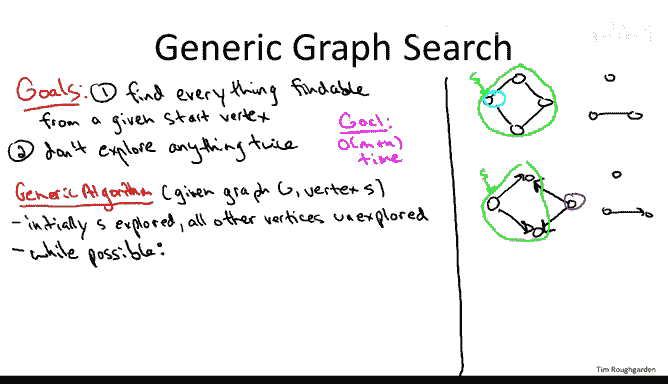
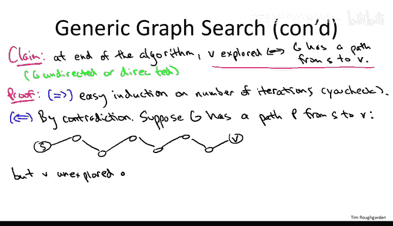
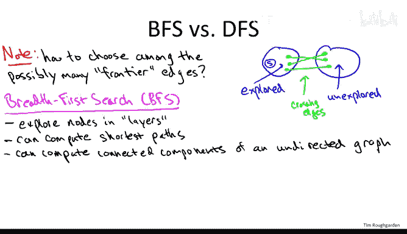

# 斯坦福大学《算法（分治／排序／搜索／随机算法、图搜索／最短路径／数据结构、贪心算法／最小生成树／动态规划、最短路径／NP）｜Algorithms》中英字幕 - P45：01_01_04_图搜索概述.zh_en - GPT中英字幕课程资源 - BV1Rx4y1U7sZ

So let's talk about the absolutely fundamental problem of searching a graph and the very related problem of finding paths through graphs。

 So why would one be interested in searching a graph for figuring out if there's a path from point A to point B。

 while there's many， many reasons I'm going to give you a highly non- exhausthausive list on this slide。

So let me begin with a very sort of obvious and literal example。

 which is if you have a physical network， then often you want to make sure that the network is fully connected in the sense that you can get from any starting point to any other point。

 so for example， think back to the phone network， it would have been a disaster if calls from California could only reach colleges in Nevada but not their family members in Utah so obviously a minimal condition for functionality of something like a phone network is that you can get from any place to any other place。

 similarly for road networks within a given country and so on。

It can also be fun to think about other nonphysical networks and ask if they're connected。

 so one network that's fun to play around with is the movie network。

 so this is the graph where the nodes correspond to actors and aes and you have an edge between two nodes if they played a role in a common movie。

 so is's going to be an undirected graph where the edges correspond to not necessarily costarring but both the actors appearing at least at some point in the same movie。

So versions of this movie network you should be able to find publicly available on the web and there's lots of fun questions you can ask about the movie network like。

 for example， what's the minimum number of hops where a hop here again is a movie that two people both play a role in。

 the minimum number of hops or edges you can get from one actor to another actor So perhaps the most famous statistic that's been thought about with the movie network is the Bacon number so this refers to the fairly ubiquitous actor Kevin Bacon and the question the bacon number of an actor is defined as the minimum number of hops you need in this movie graph to get to Kevin Bacon So for example。

 you could ask about John Hamm also known as Don Draper from Madmin。

And you could ask how many edges do you need on a path through the movie graph to get to Kevin Bacon？

And it turns out that the answer is one。 excusecuse me， two edges。 You need one intermediate point。

 namely Colin Fth。And thats that's because Colin Fth and Kevin Bacon both starred in the Adam Mcguyian movie where the Tru lies and John Hamm and Colin Fth were both in the movieA single Man。

 so that would give John Hamm a Ba number of two。 So these are the kind of questions you can ask about connectivity not just in physical networks like telephone and telecommunication networks but also logical networks about pairwise relationships between objects more generally。

So the bacon number is fundamentally not just about any pass， but actually shortest pass。

 the minimum number of edges you need to traverse to get from one actor to Kevin Bacon。

 and shortest paths are also have a very practical use that you might use yourself in driving directions。

So when you use a website or a phone app and you ask for the best way to get from where you are now to say some restaurant where you're going to have dinner。

 obviously you're trying to find some kind of path through a network through a graph。

 and indeed often you want the shortest path， perhaps in mileage or perhaps in anticipated travel time。

Now I realize that when you're thinking about paths and graphs。

 it's natural to focus on sort of very literal paths and quite literal physical networks。

 things like routes through a road network or path through the internet and so on。

 but you should really think more abstractly as a path as just a sequence of decisions。

 taking you from some initial state to some final state。And it's this abstract mentality。

 which is what makes graphs search so ubiquitous and feels like artificial intelligence where you want to formulate a plan of how to get from an initial state to some goal state。

So to give a simple recreational example， you could imagine just trying to understand how to compute automatically a way to fill in a Sudoku puzzle so that you solve the puzzle correctly。

So you might ask what is the graph that we're talking about when we want to solve the Sudoku puzzle。

 well this is going to be a directed graph where here the nodes correspond to partially completed puzzles。

So for example， at one node of this extremely large graph。

 perhaps 40 out of the 81 cells are filled in with some kind of number and now again。

 remember a path is supposed to correspond to a sequence of decisions。

 so what are the actions that you take in solving Sudoku while you fill in a number into a square。

 so an edge which here is going to be directed is going to move you from one partially completed puzzle to another where one previously empty square gets filled in with one number。

And of course， then the path that you're interested in computing or what you're searching for when you search this graph。

 you begin with the initial state of the Sudoku puzzle and you want to reach some goal state where the Sudoku puzzle is completely filled in without any violations of the rules of Sudoku and of course it's easy to imagine millions of other situations where you want to formulate some kind of plan like this like for example。

 if you have a robotic hand and you just want to graph some object you need to think about exactly how to approach the object with this robotic hand so that you can grab it without for example first knocking it over and you can think of millions of other examples Another thing which turns out to be closely related to graph search as we'll see and has many applications in its own right is that of computing connectivity information about graphs so in particular the connected components so especially for undered graphs corresponds to the pieces of a graph we'll talk about these topics in their own right and I'll give you applications for them later。

So for underer graphs， I'll briefly mention an easy clustering heuristic you can derive out of computing connected components。

For directed graphs where the very definition of computing components is a bit more subtle。

 I'll show you applications to understanding the structure of the web。

So these are a few of the reasons why it's important for you to understand how to efficiently search graphs。

 It's a fundamental and widely applicable graph primitive and I'm happy to report that in this section of the course。

 pretty much anything any questions we want to answer about graph search。

 computing connectedinetic components and so on there's going to be really fast algorithms to do it so this will be a part of the course where there's lots of what I call four free primitives processing steps subroutines you can run without even thinking about it。

 all of these algorithms we're going to discuss in the next several lectures are going run in linear time and they're going to have quite reasonable constants so they're really barely slower than reading the input So if you have a graph and you're trying to reason about it。

 you're trying to make sense about it， you should in some sense feel free to apply any of these subroutines we're going to discuss to draw and glean some more information about what they look like how you might use the network data。

There's a lot of different approaches to systematically searching a graph。

 So there's many methods in this class we're going focus on two very important ones。

 namely breadth first search and depth first search。

 but all of the graph search methods share some things in common。 So on this slide。

 let me just tell you the high order bits of really any graph search algorithm。

 So graph search subtines generally are past as input a starting vertex from which the search originates。

 So that's often called a source vertex。 and your goal then is to find everything findable from this search vertex。

 and obviously you're not going to find anything that you can't find It's not findable。

 What I mean by findable， I mean there's a path from the starting point to this other node。

 So for any other nodes to which you can get along a path from the starting point。

 you should discover it。So for example， if you're given an undirected graph that has three different pieces like this one I'm drawing on the right。

 and perhaps S is this leftmost node here。Then the findable vertices starting from S。

 Ie the ones to which you can reach from a path to S is clearly precisely these four vertices。

 So you would want graph search to automatically discover and efficiently discover these four vertices。

 if you started at S。 You can also think about a directed version of the exact same graph where I'm going to direct the vertices like so。

So now the definition of the findable nodes is a little bit different。

 We're only expecting to follow arcs forward along the forward direction。

 so we should only expect at best to find all of the nodes that you can reach by following a succession of forward arcs that is any any node that there's a path to from S。

 So in this case these three nodes would be the ones we'd be hoping to find this。

Blue node to the right， we would no longer expect to find because the only way to get there from S is by going backward along arcs。

 and that's not what we're going to be thinking about in our graph searches。

So we want to find everything findable that we can get to along paths but we want to do it efficiently and efficiently means we don't explore anything twice so the graph has M arcs。

 M edges and nodes and vertices， and really we want to just look at H piece of the graph only once or a small constant number of times。

 So we're looking for running time， which is linear in the size of the graph that is big O of M plus n。

Now when we were talking about representing graphs I said that in many applications it's natural to focus on connected graphs in which case M is going to dominate n you're going to have at least as many edges as nodes essentially。

 but connectivity is the classic case where you might have the number of edges being much smaller than the number of nodes。

 there might be many pieces and the whole point of what you're trying to do is discover them so for this sequence of lectures where we talk about graph search and connectivity we will usually write m plus n we' think that either one could be bigger or smaller than the other So let me now give you a generic approach to graph search it's going to be underspecified。

 there'll be many different ways to instantiate it two particular instantiations will get us breadth first search and depth first search。

 but here's just a general systematic method for finding everything findable without exploring anything more than once。

So motivated by the second goal， the fact that we don't want to explore anything twice with each node。

 with each vertex， we're going to remember whether or not we've explored it before。

 so we just need one boolean per node and we'll initialize it by having everything unexplored except S。

 our starting point will have it start off as explored。

And it's useful to think of the nodes thus far as being， in some sense。

 territory conquered by the algorithm。 And then there's going to be a frontier in between the conquered and unconquered territory。

 and the goal of the generic algorithm is that each step we supplement the conquered territory by one new node。

 assuming that there is one adjacent to the territory we've already conquered。 So， for example。

 in this top example with the underdirected network。 Initially。

 the only thing we've explored is the starting point S。 So that's sort of our home base。

 It's all that we have conquered so far。 And then in our main while loop。

 which we as many times as we can until we don't have any edges meeting the following criterion。

 we look for an edge。

With one endpoint that we've already explored， one endpoint inside the Con territory and then the other endpoint outside。

 so this is how we can in one hop supplement the number of nodes we've seen by one new one if we can't find such an edge。

 then this is where the search stops if we can find such an edge well then we suck V into the conquer territory we think of it being explored。

And we return to the main wild loop。 So for example， in this example on the right。

 we start with the only explored node being S。 Now there's actually two edges that cross the frontier。

 in the sense， one of the endpoints is explored， namely one of the endpoints is S and the other one is some other vertex right there's this there's these two edges to the left two odes adjacent to S。

 So in this algorithm we pick either one it's under specifiedified which one we pick。

 but maybe we pick the top one。 And so then all of a sudden this second top vertex is now also explored。

 So the conquered territory is the union of them。And so now we have a new frontier。 So now again。

 we have two edges that cross from the explored nodes， the unexplored nodes。

 These are the edges that are in some sense， going from northwest to southeast。 Again。

 we pick one of them。 it's not clear how the algorithm doesn't tell us we just pick any of them。

 So maybe， for example， we pick this rightmost edge crossing the frontier。

 Now the right edge of most vertex of these four is explored。

 So our conquer territory is the top three vertices。 and now again。

 we have two edges crossing the frontier。 The two edges that are incident to the bottom node。

 we pick one of them， not clear which one， maybe this one。 And now the bottom node is also explored。

 and now there are no edges crossing the frontier。 So there are no edges who on the one hand have one endpoint being explored and the other endpoint being unexplored。

 So these will be the four vertices as one would hope that the search will explore， started from S。

Well， generally， the claim is that this generic graph search algorithm does what we want。

 It finds everything findable from the starting point。 And moreover。

 it doesn't explore anything twice。 I think it's fairly clear that it doesn't explore anything twice。

 right as soon as you look at a node for the first time， you suck it into the conquer territory。

 never to look at it again。 Similarlyly， as soon as you look at an edge， you suck it in。

 But when we explore breadth and depth first search will be more precise about the running time and exactly what I mean by you don't explore something twice。

 So at this level of generality， I just want to focus on the first point that any you instantiate the search algorithm。

 it's going to find everything findable。 So what do I really mean by that。

The formal claim is that at the termination of this algorithm。

 the nodes that we've marked explored are precisely the ones that can be reached via a path from S。

 that's the sense in which the algorithm explores everything that could potentially be findable from the starting point S。

One thing I want to mention is that this claim and the proof I'm going to give of it holds whether or not G is an undirected graph or a directed graph。

 In fact， almost all of the things that are' going to say about graph search and in particular about breath first search and depth first search work in essentially the same way。

 either an undirected graph or directed graphs。 The obvious difference being in an undirected graph。

 you can traverse an edge in either direction in a directed graph we're only supposed to traverse it in the forward direction from the tail to the head。

 the one big difference between undirected and directed graphs is when we do connectivity computations and I'll remind you when we get to that point。

 which one we're talking about but for the most part， when we just talk about basic graph search。

 it works essentially the same way， whether it's undirected or directed， so keep that in mind。

All right， so why is this true， why are the nodes that get explored precisely the nodes for which there's a path to them from S？

Well， one direction is easy。Which is you can't find anything which is not findable。

 that is if you wind up exploring a node， the only reason that can happen is because you traversed a sequence of edges that got you there and that sequence of edges obviously defines a path from S to V If you really want to be pedantic about the forward direction that explored nodes have to have paths from S then you can just do an easy induction and I'll leave this for you to check if you want。

The privacy of your own home。So the important direction of this claim is really the opposite。

 why is it that no matter how we instantiate this generic graph search procedure。

 it's impossible for us to miss anything， that's the crucial point。

 we don't miss anything that we could in principle find via a path。

But we're going proceed by contradiction。 So what does that mean。

 We're going to assume that the statement that we want to prove is true is not true。

 which means that it's possible that G has a path from S to V。

 And yet somehow our algorithm misses it。 doesn't mark as explored。

 right That's the thing we're really hoping doesn't happen。 So let's suppose it does happen。

 and then derive a contradiction。 So suppose G does have a path from S to some vertex V。

Call the path P。I'm going to draw the picture for an undirected graph。

 but the situation would be same in the directed case。So there's a bunch of hops。

 there's a bunch of edges。And then eventually this path ends at。Now， the bad situation。

 the situation from which we wanted to rather contradiction。

 is that V is unexplored at the end of this algorithm。

So let's take stock of what we know。 S for sure is explored， right。

 We initialize the search procedure so that S is marked as explored V by hypothesis。

 in this proof by contradiction is unexplored。 So S is explored V is unexplored。

 So now imagine we just in our heads as a thought experiment， we traverse this path P。

We started S and we know it's explored。 We go to the next vertex。

 It may or may not have been explored。 We're not sure We go to the third vertex again。

 Who knows might be explored might be unexplored and so on。 But by the time we get to V。

 we know it's unexplored。 So we started S， it's been explored。 we get to V it's been unexplored。

 So at some point there's some hop along this path P from which we move from an exploreored vertex to an unexplored vertex。

 There has to be a switch at some point because the end of the day at the end of the path at an unexplored node。

 So consider the first edge and there must be one。That we switch from being at an explored node to being at an unexplored node。

So I'm going to call the endpoints of this purported edge U and W where U is the explored one and W is the unexplord one Now for all we know U could be exactly the same as S。

 that's Po possibility or for all we know W could be the same as V that's also a possibility in the picture I'll draw it as if this edge UX was somewhere in the middle of this path but again。

 it may at one to the ends that's totally fine。But now， in this case。

 there's something I need you to explain to me。 How is it possible that on the one hand。

 our algorithm terminated， and on the other hand， there's this edge U comma X where U has been explored and X has not been explored。

That my friends， is impossible。 Our generic search algorithm does not give up。

 It does not terminate unless there are no edges where the one endpoint is explored and the other endpoint is unexplored。

 As long as there's such an edge， it has going to suck in that unexplored vertex into the concrete territory。

 It's going to keep going。 So the upshot is there's no way that our algorithm terminated with this picture with there being an edge。

 you X， you explored X unexplored。 So that's the contradiction。

 this contradicts the fact that our algorithm terminated with V unexplored。

So that is a general approach to graph search， so that I hope gives you the flavor of how this is going to work。

 but now there's two particular instantiations of this generic method that are really important and have their own suites of applications so we're going focus on breath first search and depth first search we'll cover them in detail in the next couple of videos I want to give you the highlights to conclude this video。

Now let me just make sure it's clear where the ambiguity in our generic method is。

 why we can have different instantiations of it that potentially have different properties and different applications。

 The question is at a given iteration of this while loop， what do you got。

 You got your nodes that you've already explored So that includes S plus probably some other stuff。

 And then you've got your nodes that are unexplored。

 And then you have your crossing edges right to their edges with one point in each so。

And for an undirected graph， there's no orientation to worry about these crossing edges just have one endpoint on the exploreed side。

 one endpoint in the unexplored side In the directed case you focus on edges or the tail of the edges in the exploreed side and the head of the edges in the unexplored side so they go from the exploreored side to the unexplored side And the question is in general。

 in iteration of this while loop there's going to be many such crossing edges。

 there are many different unexplored nodes we could go to next and different strategies for picking the unexplored node to explore next leads us to different graph search algorithms with different properties。

So the first specific search strategy we're going to study is Bth first search colloquially known as BFS。

 so let me tell you sort of the high level ID and applications of breathth first search。

So the goal is going to be to explore the nodes in what I call layers。

 So the starting point S will be in its own layer layer 0。

 The neighbors of S will constitute layer 1， and then layer 2 will be the nodes that are neighbors of layer 1。

 but that are not already in layer 0 or layer 1 and so on。

 So layer I plus1 is the stuff next to layer I that you haven't already seen yet。

You can think of this as a fairly cautious and tentative exploration of the graph and it's going to turn out that theres a close correspondence between these layers and shortest path distances so if you want to know the minimum number of hops。

 the minimum of edges you need in a path to get from point A to point B in a graph。

 the way we wanted to know the fewest number of edges in the movie graph necessary to connect John Hamm to Kevin Bacon that corresponds directly to these layers so if a node is in layer I then you need eye edges to get from S to I in the graph。

Once we discuss breathth for search we'll also discuss how to compute the connecting components or the different pieces of an undirected graph。

 Turns out this isn't that special the breadth for search。

 you can use any number of graph search strategies to compute connected components in undirected graphs。

 but I'll show you how to do it using a simple looped version of breathth for a search。

And we'll be able to do this stuff in the linear time that we want the very ambitious goal of getting linear time to get the linear time implementation。

 You do want to use the right data structure， but it's a super simple data structure。

 something probably you've seen in the past， namely a queue。 So something that's first in， first out。

 So the second search strategy that's super important to know is depth first search also known as DFS to its friends。

Deepth first search has a rather different field than breath first search。

 it's a much more aggressive search where you immediately try and plunge as deeply as you can。

 it's very much in the spirit of how you might explore a maze where you go as deeply as you can only backtracking when absolutely necessary。

De first search will also have its own set of applications， It's not for example。

 very useful for computing shortest path information， but especially in directed graphs。

 it's going to do some remarkable things for us so in a directed acyclic graph so a directed graph with no directed cycles it will give us what's called the topological ordering so itll sequence the nodes in a linear ordering from the first to the last so that all of the arcs of the directed graph go forward so this is useful for example。

 if you have a number of tasks that have to get completed with certain precedence constraints like for example you have to take all of the classes in your undergraduate major and there are certain prerequisites a topological ordering will give you a way in which to do it respecting all of the prerequisites。

And finally， where for underdirected graphs， it doesn't really matter whether you use BFS or DFS to compute connected components in directed graphs where even defining connected components is a little tricky。

 it turns out depth for search is exactly what you want。

 that's what you're going to get a linear time implementation for computing the right notion of connected components in the directed graph case。

Time wise， both of these are superb strategies for exploring a graph。

 They're both linear time with very good constants。 So depth for search again。

 we're going to get O of M plus N time。In a graph with M edges and in vertices。

 you do want to use a different data structure reflecting the different search strategy。

 so here because you're exploring aggressively as soon as you get to a node you immediately start exploring its neighbors。

 you want to last in first out data structure， also known as a stack。

Deepth for search also admits a very elegant recursive formulation。

 and in that formulation you don't even need to maintain a stack data structure explicitly。

 the stack is implicitly taken care of in the recursion。So that concludes this overview of G search。

 both what it is， what our goals are， what kind of applications they have。

 and two of the most common strategies， the next couple of videos are going to explore these search strategies as well as a couple of these applications in greater depth。

