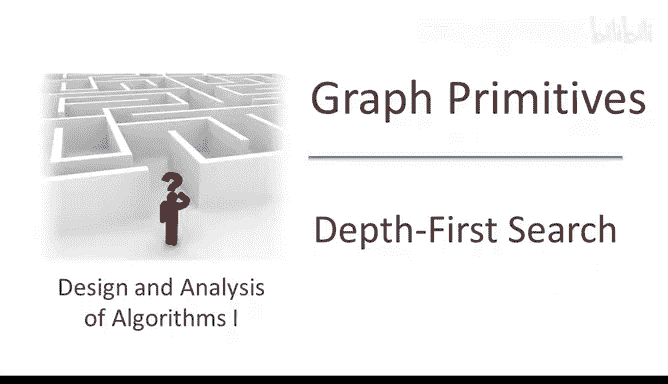
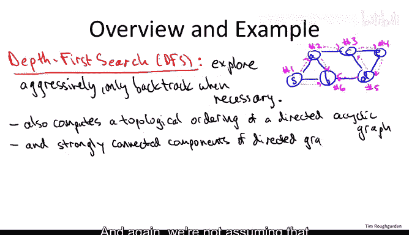
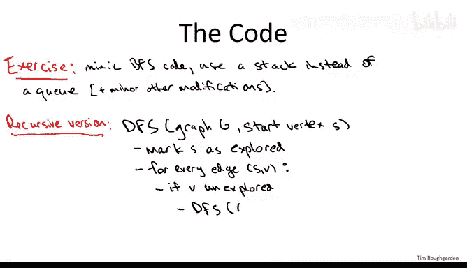
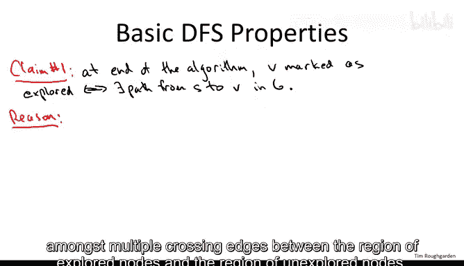
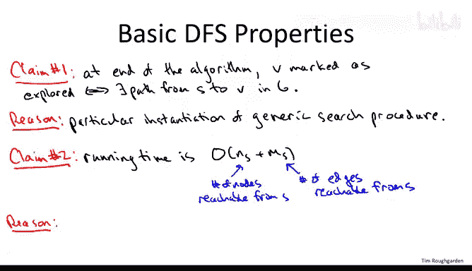

# 斯坦福大学《算法（分治／排序／搜索／随机算法、图搜索／最短路径／数据结构、贪心算法／最小生成树／动态规划、最短路径／NP）｜Algorithms》中英字幕 - P49：05_01_08_深度优先搜索-DFS-基础.zh_en - GPT中英字幕课程资源 - BV1Rx4y1U7sZ

Let's explore our second strategy for graph search namely depth first search， and again。

 like with breathth first search， I'll open by just reminding you what depth first search is good for and we'll trace through it in a particular example and then we'll tell you what the actual code is。

So if B first search is the cautious and tentative exploration strategy。

 then depth first search or DFS for short is its more aggressive cousin。

So the plan is to explore aggressively。And only back track when necessary。

 And this is very much the strategy one often users when trying to solve a maze to explain what I mean。

 Let me show you how this would work in the same running example we used when we discussed breath first search。

 So here， if we invoke depth first search from the node number S。Here's what's going to happen。

 So obviously we started S and obviously there's two places where we can go next。

 we can go to a or to B and depth for search is underdetermined like breathth for search。

 we can pick either one。 So like with the breath for search example， let's go to a first。

So it will be the second one that we explore。But now unlike Bre Church where we automatically went to node B next。

 since that was the other layer one node， here the only rule is that we have to go next to one of A's immediate neighbors。

So we might go to be， but we're not going to be because it's one of the neighbors of S。

 we go because it's one of the neighbors of A and actually to make sure the difference is clear。

 let's assume that we aggressively pursue deeper and we go from A to C。

And now the depth for a search strategy is again， just to pursue deeper。

 so you go to one of see's immediate neighbors so maybe we go to E next。

 So he is going to be the fourth one visited。Now from E there's only one neighbor not counting the one that we came in on。

 so from E we go to D and D is the fifth one we see Now from D。

 we have a choice we could either go to B or we could go to C so let's suppose we go to C from D。

Well， then we get to a node number 3， where we've been before。 Okay， and as usual。

 we're going to keep track of where we've already been。 So at this point。

 we have to backtrack from C back to D。 We retreat to D。 Now。

 there's still another outgoing edge from D to explore。 nearly the one to B。

And so what happens is we actually wind up wrapping all the way around this outer cycle and we hit B sixth。

And now， of course， anywhere we try to explore， we see somewhere we've already been， So from B。

 we try to go to S， but we've been there， so we retreat to B， we can try to go to A。

 but we've been there， so we retreat to B。 Now we've explored all of the options out of B。

 so we have to retreat from B。 we have to go back to D。 Now from D， we've explored both B and C。

 so we have to retreat back to E E， we've explored the only outgoing Arc D so we have to retreat to C。

 C， we retreat to A from A， we actually haven't yet looked along this arc。

But that just sends us to B where we've been before。

 so then we retreat back to A finally we retreat back to S and S even at S there's still an extra edge to explore at S we say oh we haven't tried this asB edge yet。

 but of course when we look across we get to B where we've been before and then we' back trackrack to S then we've looked at every edge once and so we stop so that's how depth first search works。

 you just pursue your path you go to an immediate neighbor as long as you can and so you hit somewhere you've been before and then you retreat。

So you might be wondering you know why bother with another graph search strategy After all we have breath first search。

 which seem pretty awesome right it runs in linear time。

 it's guaranteed to find everything you might want to find。

 it computes shortest paths it computes connected components if you embeddedbed it in a for loop。

 kind of seems like what else would you want。Well it turns out depth first search is going to have its own impressive catalog of applications which you can't necessarily replicate with breathth first search and I'm going to focus on applications in directed graphs so there's going to be a simple one that we discussed in this video and then there's going to be a more complicated one that has a separate video devoted to it so in this video we're going to be discussing computing topological orderings of directed acyclic graphs that is directed graphs that have no directed cycle。

The more complicated application is computing strongly connected components in directed graphs The runtime will be essentially the same as it was for Beth for a search and the best we could hope for which is linear time and again we're not assuming that there's necessarily that many edges。

 there may be much fewer edges than in vertices， so linear time in these connectivity applications means O of M plus n。

So let's not talk about the actual code of depth first search。 There's a couple ways to do it。

 One way to do it is to just make some minor modifications to the code for breathth first search。

 the primary difference being instead of using a queue and it first in first out behavior you swap in a stack with its last in first out behavior again if you don't know what a stack is you should read about that in a programming textbook or on the web it's something that supports constant time insertions to the front and constant time deletions from the front unlike a queue which is meant to support constant time deletions to the back Okay so stack that operates just like those cafeteria trays that you know where you put in a tray and the last one that got pushed in when you take the first one out that's the last one that got put in So these are called push and pop and a stack context both are constant time So if you swap out the queue you swap in the stack make a couple other minor modifications breath first search turns into depth first search。

For the sake of both variety and elegance， I'm instead going to show you a recursive version。

 so depth first search is very naturally phrased as a recursive algorithm。

 and that's what we'll discuss here。So depth for a search of course takes as input a graph G and again it could be undirected or directed。

 it doesn't matter just with a directed graph， be sure that you only follow Arcs in the appropriate direction。

 which should be automatically handled in the adjacency lists of your graph data structure anyways。

 so as always we keep a boolean local to each vertex of the graph remembering whether we've been there before or not。

And of course as soon as we start exploring from S。

 we better make a note that now we have been there， we better plan a flag as it were。

 and remember depth first search is an aggressive search so we immediately try to recursively search from any of us's neighbors that we haven't already been to and if we find a Di vertex if we find somewhere we've never been。

 we recursively call depth first search from that node。

The basic guarantees of depth for a search are exactly the same as they were for B first search。

 we find everything we could possibly hope to find and we do it in linear time and once again。

 the reason is this is simply a special case of the generic search procedure that we started this sequence of videos about So just corresponds to a particular way of choosing amongst multiple crossing edges between the region of exploreed nodes in the region of unexplored nodes。

 essentially always being biased toward the most recently discovered explored nodes and just like breath first search。

 the running time is going to be proportional to the size of the component that you're discovering。

And the basic reason is that each node is looked at only once。

 right this Boolean makes sure that we don't ever explore a node more than once。

 and then for each edge we look at it at most twice once from each endpoint。

And given that these exact same two claims hold for depth first search as for breathth first search。

 that means if we wanted to compute connected components in an undirected graph。

 we could equally well use an outer for loop with depth first search as our workhorse in the inner loop。

 it wouldn't matter。 either of those for underdirected graphs depth first search breathth first search is going to find all the connected components in O of M plus N time in linear time So instead I want to focus on an application particular to depth first search。

 and this is about finding a topological ordering of a directed ascyclic graph。

