# 斯坦福大学《算法（分治／排序／搜索／随机算法、图搜索／最短路径／数据结构、贪心算法／最小生成树／动态规划、最短路径／NP）｜Algorithms》中英字幕 - P4：04_01_07_关于本课程.zh_en - GPT中英字幕课程资源 - BV1Rx4y1U7sZ

In this video I'll talk about various aspects of the course， the topics that we willll cover。

 the kinds of skills you can expect to acquire， the kind of background that I expect。

 the supporting materials， and the available tools for self assessmentsment。

Let's start with the specific topics that this course is going to cover The course material corresponds to the first half of a 1week Stanford course that's taken by all computer science undergraduates as well as many of our graduate students。

 there will be five high-level topics and at times these will overlap the five topics are first of all the vocabulary for reasoning about algorithm performance the design and conquer algorithm design paradigm。

 randomization in algorithm design primitives for reasoning about graphs and the use and implementation of basic data structures The goal is to provide an introduction to and basic literacy in each of these topics。

 much much more can be said about each of them than will have time for here。

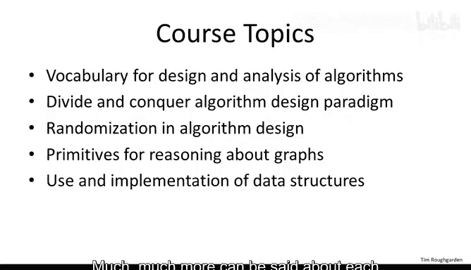

The first topic is the shortest and probably also the driest。

 but it's a prerequisite for thinking seriously about the design and analysis of algorithms。

 The key concept here is bignotation， which conceptually is a modeling choice about the granularity with which we measure a performance metric like the running time of an algorithm。

 It turns out that the sweet spot for clear high level thinking about algorithm design is to ignore constant factors in lower order terms and to concentrate on how well algorithm performance scales with large input sizes。

 big anotation is the way to mathematicize this sweet spot。

Now there's no one silver bullet in algorithm design。

 no single problem solving method that's guaranteed to unlock all of the computational problems that you're likely to face。

 That said， there are a few general algorithm design techniques。

 high level approaches to algorithm design that find successful application across a range of different domains。

 these relatively widely applicable techniques through the backbone of a general algorithms course like this one。

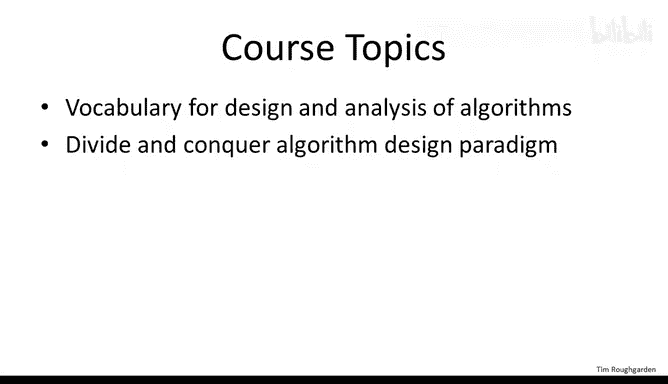

In this course we'll only have time to deeply explore one such algorithm design paradigm。

 namely that of divide and conquer algorithms in the SQL course， as we'll discuss。

 there's two other major algorithm design paradigms that get covered， but for now。

 divide and conquer algorithm， the idea is to first break the problem into smaller subproblem which then get solved recursively and then to somehow quickly combine the solutions to the subproble into one for the original problem that you actually care about So for example。

 in the last video we saw two algorithms of this sort。

 two divide and conquer algorithms for multiplying two large integers in later videos we'll see a number of different applications we'll see how to design fast divide and conquer algorithms for problems ranging from sorting to matrix multiplication to nearest neighbor type problems and computational geometry in addition we'll cover some powerful methods for reasoning about the running time of recursive algorithms like these。

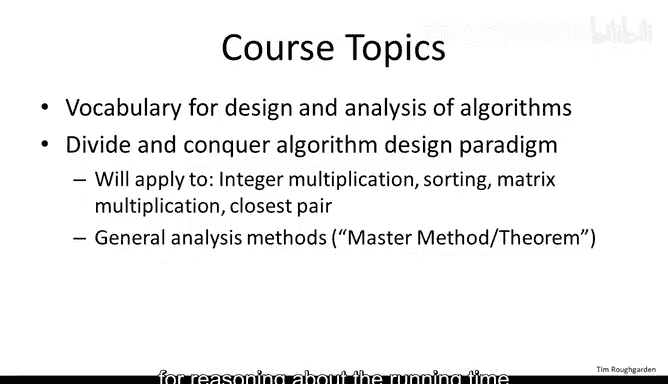

As for the third topic， a randomized algorithm is one that in some sense flips coins while it executes that is a randomized algorithm will actually have different executions if you run it over and over again on a fixed input it turns out and this is definitely not intuitive that allowing randomization internal to an algorithm often leads to simple。

 elegant and practical solutions to various computational problems The canonical example is randomized quick sort and that algorithm and analysis we will cover in detail in a few lectures。

 randomized prim testing is another killer application that we'll touch on and will also discuss a randomized approach to graph partitioning and finally we'll discuss how randomization is used to reason about hash functions and hash maps。

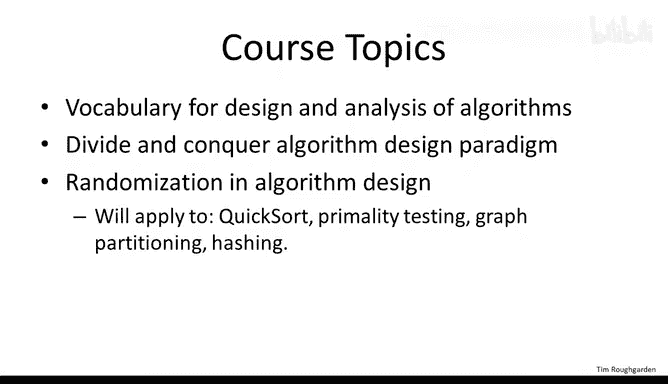

One of the themes of this course and one of the concrete skills that I hope you take away from the course is literacy with a number of computational primitives for operating on data that are so fast that they're in some sense。

 essentially free， that is the amount of time it takes to invoke one of these computational primitives is barely more than the amount of time you're already spending just examining or reading the input when you have a primitive which is so fast that the running time is barely more than what it takes to read the input。

 you should be ready to apply it for example， in a preprocessing step whenever it seems like it might be helpful。

 it should just be there on the shelf waiting to be applied at will sorting is one canonical example of a very fast almost for free primitive of this form but there are ones that operate on more complex data as well。

 So recall that a graph data structure that has on the one hand vertices and on the other hand edges which connect pairs of vertices graph model among many of the things different types of networks So even though graphs are much more complicated than me arrays there are still。

a number of blazingly fast primitives for reasoning about their structure in this class we'll focus on primitives for computing connectivity information and also shortest paths we'll also touch on how such primitives have been used to investigate the structure of information in social networks。

Finally， data structures are often a crucial ingredient in the design of fast algorithms。

 Data structures is responsible for organizing data in a way that supports fast queries。

 Different data structures support different types of queries。

 I'll assume that you're familiar with the structures that you typically encounter in a basic programming class。

 including arrays and vectors， lists， stacks and cues。 Hopefully， you've seen at some point。

 both trees and heaps， or you're willing to read a bit about them outside of the course。

 but will also include a brief review of each of those data structures as we go along。

 There's two extremely useful data structures that will discuss in detail。

 The first is balanced binary search trees。 These data structures dynamically maintain an ordering on a set of elements while supporting a large number of queries that run in time logarithmic in the size of the set。

The second data structure we'll talk a fair bit about is hash tables or hash maps。

 which keep track of a dynamic set while supporting extremely fast insert and lookup queries。

 we'll talk about some canonical uses of such data structures as well as what's going on under the hood in a typical implementation of such a data structure。

There's a number of important concepts in the design and analysis of algorithms that we won't have time to cover in this fivewe course。

 some of these will be covered in the SQL course design and analysis of algorithmrims 2。

 which corresponds to the second half of Stanford's 10we course on this topic The first part of this SQL course focuses on two more algorithm design paradigms First of all。

 the design analysis of G algorithms with applications to minimum spanning trees scheduling and information theoreticalore coding and secondly。

 the design and analysis of dynamic programming algorithms with example applications being in genome sequence alignment and shortest path protocols in communication networks。

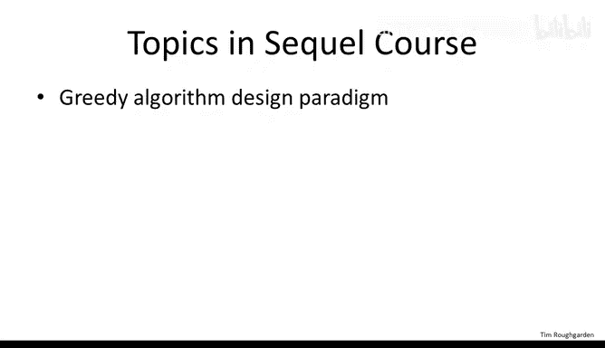

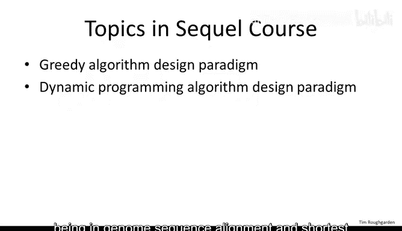

The second part of the SQL course concerns NP complete problems and what to do about them Now NP complete problems are problems that assuming a famous mathematical conjecture you might have heard of。

 which is called the P equal to NP conjecture， are problems that cannot be solved under this conjecture by any computationally efficient algorithm。

 we'll discuss the theory of NP completeness and with a focus on what it means for you as an algorithm designer。

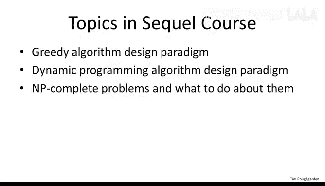

We'll also talk about several ways to approach and becomp problems。

 including fast algorithms that correctly solve special cases。

 fast heuristics with provable performance guarantees and exponential time algorithms that are qualitatively faster than brute force search Of course there are plenty of important topics that can't be fit into either of these two five recourses。

 depending on the demand there might well be further courses on more advanced topics。

Following this course is going to involve a fair amount of time and effort on your part。

 So it's only reasonable to ask what can you hope to get out of it。

 what skills will you learn Well primarily even though this isn't a program in class per se。

 it should make you a better programr you'll get lots of practice describing and reasoning about algorithms you'll learn algorithm design paradigms so really high level problem solving strategies that are relevant for many different problems across different domains and tools for predicting the performance of such algorithms。

 you'll learn several extremely fast subroutines for processing data and several useful data structures for organizing data that can be deployed directly in your own programs second。

 while this is not a math class per se well we end up doing a fair amount of mathematical analysis and this in turn will sharpen your mathematical and analytical skills you might ask why is mathematics relevant for a class in the design and analysis of algorithms seemingly more of a program class Well let me be clear I am totally uninterested in merely telling you facts or regurgitating code that you can already find on the web or in any number of good programs。

BookMy goal here in this class and the way I think I can best supplement the resources that you probably already have access to is to explain why things are the way they are。

 why we analyze the algorithms in the way that we do， why various superfat algorithms are， in fact。

 super fast and so on。 And it turns out that good algorithmic ideas usually require nontrivial mathematical analysis to understand properly。

 You'll require fundamental insights into the specific algorithms and data structures that we discuss in the course and hopefully many of these insights will prove useful more generally in your other work。

Third， and perhaps most relevant for those of you who work in some other discipline。

 this course should help you learn how to think algorithmically indeed， after studying algorithms。

 it's hard not to see them pretty much everywhere， whether you're riding an elevator。

 watching a flock of birds， buying and selling stocks out of your portfolio or even watching an infant learn。

 as I said in the previous video， algorithmic thinking is becoming increasingly useful and prevalent in fields outside of computer science and technology。

 like in biology， statistics and economics。Fourth， if you're interested in feeling like a card carrying computer scientist in some sense。

 then you'll definitely want basic literacy in all of the topics that we'll be covering。 Indeed。

 one of the things that makes setting algorithms so fun is it really feels like you're studying a lot of the greatest hits from the last 50 years of computer science。

 So after this class， no longer will you feel excluded at that computer science cocktail party when someone cracks a joke about Dkester's algorithm。

 Now you'll know exactly what they mean。Finally， there's no question that studying this material is helpful for technical interview questions。

 To be clear， my sole goal here is to teach you algorithms and not to prepare you for interviews per se。

 But over the years， countless students of mine have regaled me with stories about how mastering the concepts in this class enabled them to ace every technical question they were ever asked。

 I told you this is fundamental stuff。😊。

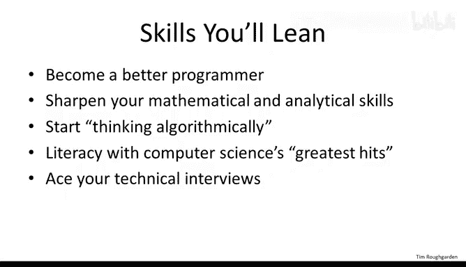

So what do I expect from you， well， honestly， the answer is nothing。After all。

 isn't the whole point of a free online class like this one that anyone can take it and devote as much effort to it as they like？

So that said， as a teacher， it's still useful to have one or more canonical students in mind。

 and I thought I'd go ahead and be transparent with you about how I'm thinking about these lectures。

 who I have in mind that I'm teaching to， though again。

 please don't feel discouraged if you don't conform to this canonical student template。

 I'm happy to have the opportunity to teach you about algorithms no matter who you are。So first。

 I have in mind someone who knows at least some programming。 For example。

 consider the previous lecture。 We talked about a recursive approach to multiplying two numbers。

 and I mentioned how a certain mathematical expression back then we labeled at star and circled it in green。

 how that expression naturally translated into a recursive algorithm in particular。

 I was certainly assuming that you had some familiarity with recursive programs。

 if you feel comfortable with my statement in that lecture。

 If you feel like you could code up a recursive inte or multiplication algorithm based on the highle outline that I gave you。

 then you should be in good shape for this course。 you should be good to go。

 if you weren't comfortable with that statement。 Well。

 you might not be comfortable with the relatively high and conceptual level at which we discuss programs in this course。

 but I encourage you to watch the next several videos anyways to see if you get enough out of them to make it worth your while。

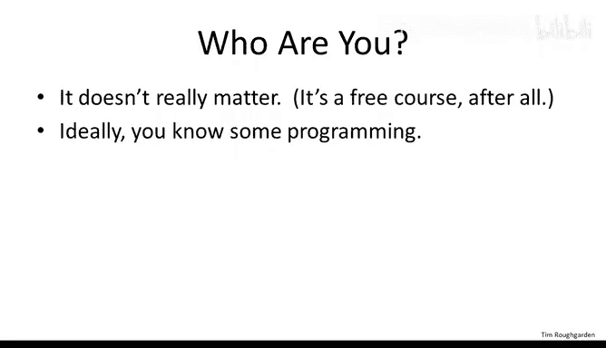

Now while I'm aiming these lectures at people who know some programming。

 I'm not making any assumptions whatsoever about exactly which programming languages you know any standard imperative language。

 you know something like C Java or Python is totally fine for this course Now to make these lectures accessible to as many programmers as possible and to be honest。

 know also to promote thinking about programming at a relatively abstract and conceptual level。

 I won't be describing algorithms in any particular programming。

Rather when I discuss algorithms I'll use only high levelvel pseudocode or often simply English my inductive hypothesis is that you are capable of translating such a highlel description into a working program in your favorite programming language In fact。

 I strongly encourage everyone watching these lectures to do such a translation of all of the algorithms that we discuss this will ensure your comprehension and appreciation of them Indeed many professional computer scientists and programmers don't feel that they really understand an algorithm until they've coded it up。

 many of the courses assignments will have a problem in which we ask you to do precisely this put another way。

 if you're looking for a sort of coding cookbook code that you can copy and paste directly into your own programs without necessarily understanding how it works。

 and this is definitely not the course for you， there are several books out there that cater to programmers looking for such coding cookbooks。

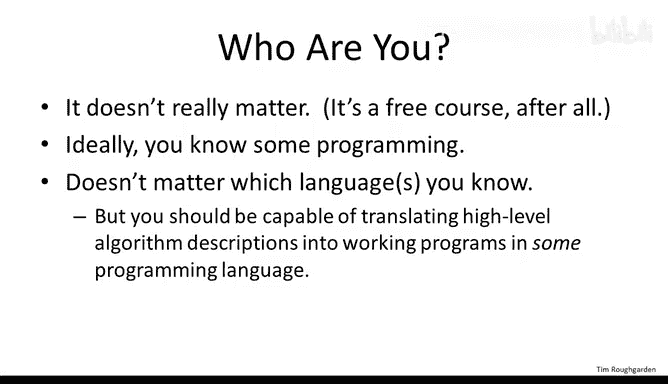

Second， for these lectures， I have in mind someone who has at least a modest amount of mathematical experience。

 though perhaps with a fair bit of accumulated rust concretely。

 I expect you to be able to recognize a logical argument that is a proof。 In addition。

 two methods of proof that I hope you've seen before are proof by induction and proof by contradiction。

 I also need you to be familiar with basic mathematical notation like the standard quantifier and symbols。

 a few of the lectures on randomized algorithms and hashing will go down much easier for you if you've seen discrete probability at some point in your life。

 but beyond these basics， the lectures will be self-contained。

 you don't even need to know any calculus， say for a single simple integral that magically pops up in the analysis of the randomized Quick sort algorithm。

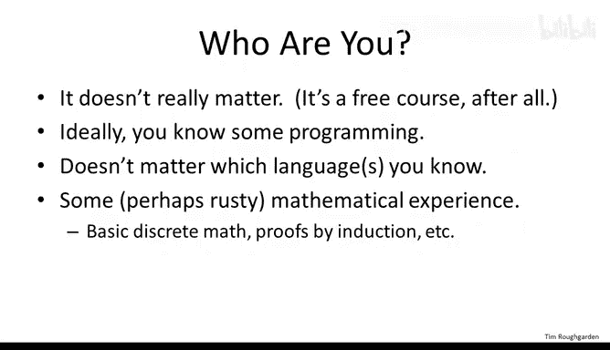

I imagine that many of you have studied math in the past， but you could use a refresher。

 you're a bit rusty and there's plenty of free resources out there on the web and I encourage you to explore and find some that you like。

 but one that I want to particularly recommend is a great set of free lecture notes it's called mathematics for computer science it's authored by Eric Lehman and Tom Leyton and it's quite easy to find on the Web if you just do a web search and those notes cover all of the prerequisites that we'll need in addition to tons of other stuff。

In the spirit of keeping this course as widely accessible as possible。

 we're keeping the required supporting materials to an absolute minimum。

 lecturecs are meant to be self- containedtained and will always provide you with the lecture notes in PowerPoint and PDF format once in a while we'll also provide some additional lecture notes。

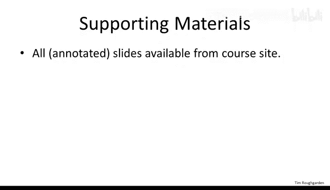

No textbook is required for this class， but that said。

 most of the material that we'll study is well covered in a number of excellent algorithms books that are out there。

 so I'll single out four such books here， The first three I mentioned because they've all had a significant influence on the way that I both think about and teach algorithms so it's natural to acknowledge that debt here one very cool thing about the second book the one bys Guta Papa Diicu and Vazrai is that the authors have made a version of it available online for fruit and again if you search on the authors's names and the textbook in the textbook title。

 you should have no trouble coming up with it with a web search Similarlyly that's the reason I've listed the fourth book those authors have likewise made essentially complete version of that book available online and it's a good match with the material that we're going to cover here。

If you're looking for more details about something covered in this class or simply a different explanation than the one that I' give you。

 all of these books are going to be good resources for you。

 there are also a number of excellent algorithms textbooks that I haven't put on this list。

 I encourage you to explore and find your own favorite。

And our assignments we'll sometimes ask you to code up an algorithm and use it to solve a concrete problem that is too large to solve by hand Now we don't care what programming language or development environment you use to do this。

 as we're only going to be asking you for the final answer。

 thus we're not requiring anything specific just that you are able to write and execute programs if you need help or advice about how to get set up with a suitable coding environment。

 we suggest that you ask other students for help via the course discussion forum。Finally。

 let's talk a bit more about assessment Now this course doesn't have official grades per se but we will be assigning weekly homeworks Now we're going to assign homeworks for three different reasons the first is just for self-assessment it's to give you the opportunity to test your understanding of the material so that you can figure out which topics you've mastered in which ones that you have it The second reason we do it is to impose some structure on the course including deadlines to provide you with some additional motivation to work through all of the topics deadlines also have a very important side effect that it synchronizes a lot of the students in the class and this of course makes the course discussion forum a far more effective tool for students to seek and provide help in understanding the course material the final reason that we give homeworks is to satisfy those of you who on top of learning the course material are looking to challenge yourself intellectually。

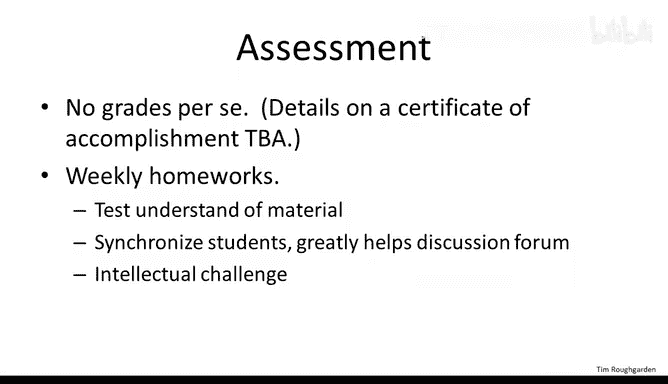

Now this class has tens of thousands of students， so it's obviously essential that the assignments can be graded automatically Now we're currently only in the 1。

0 generation of free online courses such as this one。

 so the available tools for auto graded assessment are currently rather primitive so we'll do the best we can but I have to be honest with you is's difficult or maybe even impossible to test deep understanding of the design and analysis of algorithms using the current set of tools thus while the lecture content in this online course is in no way water down from the original Stanford version the required assignments and exams well give you are not as demanding as those that are given in the oncampus version of the course to make up for this fact will'll occasionally propose optional algorithm design problems either in a video or via a supplementary assignment we don't have the ability to grade these。

 but we hope that you'll find them interesting and challenging and that you'll discuss possible solutions without the students via the course discussion form So I hope this discussion answered most of the questions that you have about the course。

 let's move on to the real reason that we're all here to learn more about algorithms。

