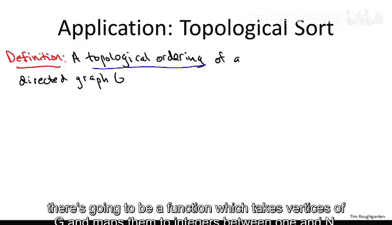
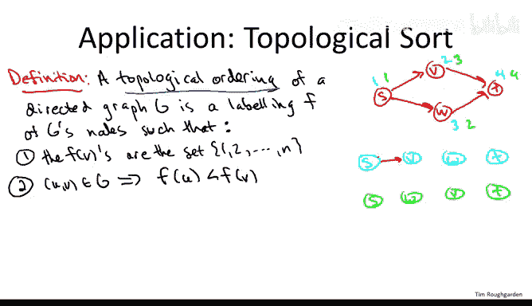
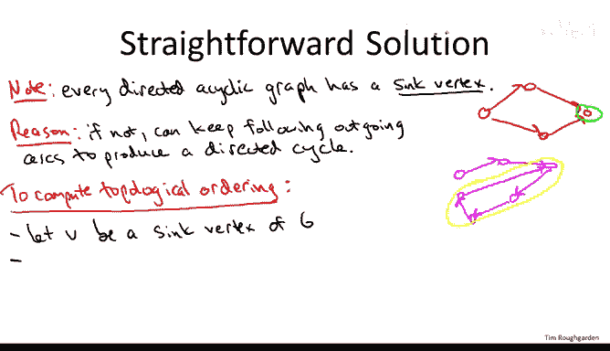
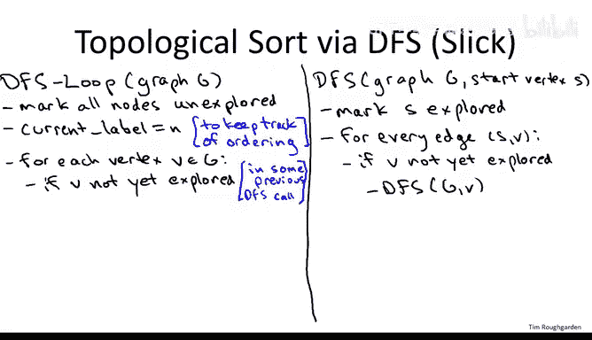
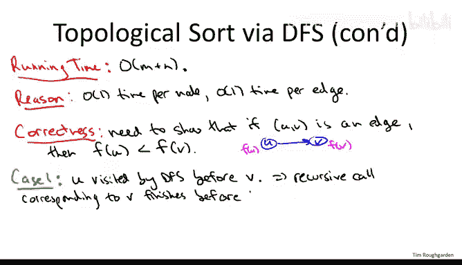

# 斯坦福大学《算法（分治／排序／搜索／随机算法、图搜索／最短路径／数据结构、贪心算法／最小生成树／动态规划、最短路径／NP）｜Algorithms》中英字幕 - P50：06_01_09_拓扑排序.zh_en - GPT中英字幕课程资源 - BV1Rx4y1U7sZ

So let me begin by telling you what a topological ordering of a directed graph is。

Essentially， it's an ordering of the vertices of the graph so that all of the arcs。

 the directed edges of the graph only go forward in the ordering。

 so let me encode an ordering by a labeling of the vertices with the numbers1 through n。

 this is just to encode the position of each vertex in this ordering。So formally。

 there's going to be a function which takes vertices of G and maps them to integers between1 and n。

 each of the numbers1 through n should be taken on by exactly one vertex here n is the number of vertices of G。

So that's just a way to encode an ordering。 And then here's really the important property that every directed edge of G goes forward in the ordering that is if U V is a directed edge of the directed graph G。

 then it should be that the F value of the tail is less than the F value of the head。

 that is this directed edge has a higher F value as you traverse it in the correct direction。

 let me give you an example just to make this more clear。

 So suppose we have this very simple directed graph with four vertices。

Let me show you two different totally legitimate topological orderings of this graph。

So the first thing you could do is you could label S1， V2， W3， and T4。

Another option would be to label them the same way， except you can swap the labels of V and W。

 so if you want， you can label V3 and W2。So again， what these labelings really meant to encode is the ordering of the vertices。

 so the blue labeling you can think of as encoding the ordering in which we put S first， then V。

 then W and then T， whereas the green labeling can be thought of as the same ordering of the nodes except with W coming before V。

What's important is that the pattern of the edges is exactly the same in both cases and in particular。

 all of the edges go forward in this ordering。 So in either case。

 we have S with edges from S to V and S to W。So that looks the same way pictorially。

 whichever order V and W arere in， and then symmetrically there are edges from V and W to T。

So you'll notice that no matter which order we put V and W in。

 all four of these edges go forward in each of these orderings。 Now， if you try to put。

V before S， it wouldn't work because the edge from S to V would be going backward if the preceded S。

 Similarlyly， if you put T anywhere other than the final position。

 you would not have a topological ordering。 So， in fact。

 these are the only two topological orderings of this directed graph。

 I encourage you to convince yourself of that。Now， who cares about topological orderings？

Well this is actually a very useful subroutine this has been come up in all kinds of applications。

 really whenever you want to sequence a bunch of tasks when there's precede's constraints among them by a precede's constraint。

 I mean one task has to be finished before another you can think， for example。

 about the courses in some kind of undergraduate major like computer science major here the vertices are going to correspond to all of the courses and there's a directed edge from course A to course B if course is a prerequisite for course B if you have to take it first so then of course you'd like to know a sequence in which you can take these courses so that you always take a course after you've taken its prerequisites and that's exactly what a topological ordering will accomplish。

So it's reasonable to ask the question， when does a directed graph have a topological ordering and when a graph does have such an ordering。

 how do we get our grubby little hands on it？Well， there's a very clear necessary condition for a graph to have a topological ordering。

 which is it had better be a cyclic。Put differently， if a directed graph has a directed cycle。

 then there's certainly no way there's going to be a topological ordering。

So I hope the reason for this is fairly clear。 Consider any directed graph which does have a directed cycle and consider any purported way of ordering the vertices。

 Well， now just traverse the edges of the cycle one by one。 So you start somewhere on this cycle。

 And if the first edge goes backward。 well， you're already screwed。

 you already know that this ordering is not topological。 no edges can go backward。 So evidently。

 the first edge of this cycle has to go forward。 But now you have to traverse the rest of this edges on this cycle。

 and eventually you come back to where you started。

 So if you start out by going forward at some point， you have to go backward。

 So that edge goes backward and the ordering violating the property of a topological ordering。

 That's true for every ordering。 So directed cycles exclude the possibility of topological orderings。

Now the question is， well what if you don't have a cycle。

 is that a strong enough condition that you're guaranteed to have a topological ordering is the only obstruction to sequencing jobs without conflicts。

 the obvious one of having circular precedence constraints。

 so it turns out not only is the answer yes， if as long as you don't have any directed cycles。

 you're guaranteed a topological ordering， but we can even compute one in linear time no less via depth first search。

So before I show you the super slick and super efficient reduction of computing topological orderings to depth first search。

 let me first go over a pretty good but slightly less slick and slightly less efficient solution to help build up your intuition about directed ocyclic graphs and their topological orderings。

So for the straightforward solution， we're going to begin with a simple observation。

Every directed as graph has what I'm going to call a sync vertex that is a vertex without any outgoing arcs。

So in the fourn directed acyclicalgraph we were exploring on the last slide。

 there is exactly one source of vertex and that's excuse me sync vertex。

 that's this rightmost vertex here， but that has no outgoing arcs。

 the other three vertices all have at least one outgoing arc。Now。

 why is it the case that a directed acyclic graph has to have？A sync vertex。Well。

 supposeose it didn't。 Suppose it had no sync vertex。

 That would mean every single vertex has at least one outgoing arc。

 So what could we do if every vertex has one outgoing arc， Well we could start in an arbitrary node。

 we know it's not a sync vertex because we're assuming there aren't any， So there's an outgoing arc。

 so let's follow it。We get to some other note。By assumption there's no sink for a text。

 so this isn't a sink for a text， so there's an outgoing arc， So let's follow it。

 We get to some other node。That also has an outgoing a， let's follow that。And so on。So we just keep。

Following outgoing arcs。 and we do this as long as we want because every vertex has at least one outgoing arc。

 Well， there's a finite number of vertices right， this graph has say n vertices。

 So if we follow n arcs， we're going to see n plus1 vertices。 So by the pigeonhole principle。

 we're going to have to see a repeat right So if n plus one vertices there's only n distinct vertices。

 we're going to see some vertex twice。 So for example。

 maybe after I take the outgoing arc from this vertex， I get back to this one that I saw previously。

Well， what have we done， what happens when we get a repeated vertex by tracing these outgoing arcs and repeating a vertex。

 we have exhibited a directed cycle。And that's exactly what we're assuming doesn't exist。

 We're talking about directed ascyclic graphs。 So but differently we just prove that a vertex with no sync vert has to have a directed cycle。

 so a directed ascyclic graph therefore has to have at least one sync vert。

So here's how we use this very simple observation now to compute a topological ordering of a directed acyclic graph。

Well， let's do a little thought experiment。Suppose， in fact。

 this graph did have a topological ordering。Let's think about the vertex which goes last in this topological ordering。

Remember， any arc which goes backward in the ordering is a violation， so we have to avoid that。

 we have to make sure every arc goes forward in the ordering。Now， any vertex。

 which has an outgoing arc。We better put somewhere other than in the final position。

 right So the node that we put in the final position。

 all of its arcs are going to wind up all of its outgoing arcs are going to wind up going backward in the topologic ordering。

 There's nowhere else they can go。 This vertex is last。So in other words。

 if we plan to successfully compute a topological ordering。

 the only candidate vertices for that final position in the ordering are the sync vertices。

 that's all that's going to work， we put a non sync vertex there， we toast， it's not going to happen。

Fortunately， if it's directed ascyclic， we know there is a sync vertex。

So let V be a sync vertex of G， if there's many sync vertices， we pick one arbitrarily。

We said V's label to be the maximum possible。So if there's n vertices。

 we're going to put that in the n position。And now we just recurse。On the rest of the graph。

Which has only n minus1 vertices。So how would this work in the example on the right。

 Well in the first iteration or the first outermost recursive call。

 the only sync vertex is this rightmost one circled in green， so there's four vertices。

 we're going to give that the label4。

So then having labeled that for， we delete that vertex and all the edges incident to it。

 and we recurse on what's left of the graph so that would be the leftmost three vertices plus the leftmost two edges。

Now， this graph has two sync vertices after we've deleted four and everything from it。

 So both this top vertex and this bottom vertex are syncs in the residual graph。

 So now in the next recursive call， we can choose either of those as our sync vertex because we have two choices that generates two topological orderings。

 those are exactly the ones that we saw in the example。 But if for example。

We choose this one to be our sync of vertex， then that gets the label3。

 then we recurse just on the northwesternmost two edges。

 this vertex is the unique sink in that graph that gets the label2 and then we recurse on the one node graph and that gets the label one。

So why does this algorithm work， Well there's just two quick observations we need， So， first of all。

 we need to argue that it makes sense that in every iteration or in every recursive call。

 we can indeed find a syncer text that we can assign in the final position that's still unfilled。

And the reason for that is just if you take a directed acyclic graph and you delete one or more vertices from it。

 you're still going to have a directed ascyclic graph right you can't create cycles by just getting rid of stuff。

 you can only destroy cycles and we started with no cycles so through all the intermediate recursive calls we have no cycles by our first observation there's always a sink。

So the second thing we have to argue is that we really do produce a topological ordering。

 so remember what that means， that means for every edge of the graph it goes forward in the ordering that is the head of the arc is given a position later than the tail of the arc。

And this simply follows because we always use sync vertices。 So consider the vertex V。

 which is assigned to the position I， This means that when we're down to a graph that has only I vertices remaining。

 V is a sync vertex。 So if I is V is a sync vertex for when only the first i vertices remain。

 what property does it have in the original graph。 Well。

 it means all of the outgoing arcs that it has have to go to vertices that were already deleted and assigned higher positions。

 So for every vertex by the time it actually gets assigned a position。

 it's a sync and it only has incoming arcs from the as yet unsigned to vertices。

 It's outgoing arcs all go forward to vertices that were already assigned higher positions and got deleted previously from the graph。

So now we have under our belt a pretty reasonable solution for computing a topological ordering of a directed ascyclic graph in particular。

 remember we observed that if a graph does have a directed cycle。

 then of course there's no way there's a topological ordering。However you order the vertices。

 some of the cyclega is going to have to go backward and the solution on the previous slide shows that as long as you don't have a cycle。

 it guarantees a topological ordering does indeed exist， and in fact it's a constructive proof。

 a constructive argument that gives an algorithm what you do is you just keep plucking off sink vertices one at a time and populating the ordering from right to left as you keep peeling off these sinks。

So that's a pretty good algorithm， it's not too slow and actually if you implement it just so you can even get it to run in linear time。

 but I want to conclude this video with an application of depth first search， which is a very slick。

 very efficient computation of a topological ordering of a directed acyclic graph。

So we're just going to make two really quite minor modifications to our previous depth first search subroutine。

 The first thing is we have to embed it in a for loop just like we did with breadth first search when we were computing the connected components of an underdirected graph that's because in computing a topological ordering we better give every single vertex a label we better look at every vertex at least once so to do that we'll just make sure there's an outer for loop and then if we have multiple components we'll just make sure to invoke DFS as often as we need to the second thing we'll do is we'll add a little bit of bookkeeping and this will make sure that every node gets a label and in fact these labels will define a topological ordering。

So let's not forget the code for depth first search， this is where you're given a graph G。

 in this case we're interested a directed acyclic graph and you're given a start vertex S。

And what you do is you as soon as you get to SU very aggressively start trying to explore its neighbors。

Of course， you don't visit any vertex you've already been to。Do you keep track of who you visited？

And if you find any vertex that you haven't seen before。

 you immediately start recursing on that node。So I said the first modification we need is to embed this into outer for loop to ensure that every single node gets labeled。

 So I'm going to call that subroutine DFS dash loop。 It does not take a start vertex initialization。

 I'll node start out and explored， of course。 And we're also going to keep track of a global variable。

 which I'll call current label。This is going to be initialized to N and we're going to count down each time we finish exploring a new node。

 and these will be precisely the F values， these will be exactly the positions of the vertices in the topological ordering that we output。

In the main， in the main loop， we're going to iterate over all of the nodes of the graph。 So。

 for example， we just do a scan through the node array。 As usual， we don't want to do any work twice。

 So for the vertex has already been explored in some previous indication of DFS， we don't。

 We don't search from it。This should all be familiar from our embedding a breath first search and a for loop when we computed the connected components of an underreed graph。

 and if we get to a vertex V of the graph that we haven't explored yet， then we just invoke DFS。

In the graph with that vertex as the starting point。

 So the final thing I need to add is I need to tell you what the F values are。

 what the actual assignments of vertices to positions are。 And as I foreshadted。

 we're going to use this global current label variable。

 and that'll have us assigned vertices to positions from right to the left。

 very much mimicking what was going on in our recursive solution where we plucked off sync vertices one at a time。

 So when's the right time to assign a vertex。 Its position。

 what turns out the right time is when we completely finished with that vertex。

 So we're about to pop the recursive call from the stack corresponding to that vertex。

So after we've gone through the for loop of all the edges outgoing from a given vertex。

We've set F of S。Equal to whatever the current label is， and then we decrement the current label。

And that's it。 That is the entire algorithm。 So the claim is going to be that the F values produced。

 which you'll notice are going to be the integers between n through one because Dfs will be called eventually once on every vertex and it will get some integer assignment at the end and everybody is going to get a distinct value and the largest one is n and the smallest one as1。

 So claim is that is a topological ordering。 Clearly。

 this algorithm is just as blazingly fast as dfs itself with just a trivial amount of extra bookkeeping。

 Let's see how it works on our running example。 So let's just say we have this four nodeode directed graph that we're getting quite used to。

 So this has four vertices， So we initialize the current label variable to be equal to4。

 So let's say that in the outer Dfs loop， let's say we start somewhere like the vertex V。

 So notice in this outer four loop we wind up considering the vertices in a totally arbitrary order。

 So let's say we first call Dfs from this vertex V。 So what happens。

 the only place you can go from V is to T and then a T there's nowhere to go so。

We were cr called DFSA T， there's no edges to go through， we finished the for loop。

 and so T is going to be assigned an f value equal to the current label。

 which is n and here n is the number of vertices which is four。So FFT is going to get。Sorry。

 T is going to get the assignment， the label for。So then now we're done with T。

 we backtrack back to V。We decrement the current label as we finish up with T。

 we get to V and now there's no more a Rs to explore so it four loops finish。

 so we're done with it with depth first search， so it gets what's the new current label which is now three。

And again， having finished with V， we decrement the current label， which is now down to2。

So now we go back to the outer for loop， maybe the next vertex we consider is the vertex T。

 but we've already been there， so we won't don't bother DFS on T and then maybe after that we try it on S。

 so maybe S is the third vertex that the for loop considers we haven't seen S yet so we invoke DFS starting from the vertex S。

From S， there's two arcs to explore the one with V V we've already seen。

 so nothing's going to happen with the Arc S V， but on other hand。

 the a SW will cause us to recursively call DFS on W from W， we try to look at the arc from W to T。

 but we've already been to T so we don't do anything that finishes up with W So depth first search then finishes up at the vertex WW gets the assignment of the current label。

 So F of W equals 2。We decre current label now its value is1， now we backtrack to S。

 we've already considered all of s as aling arcs so we're done with S。

 it gets the current label which is one。And this is indeed one of the two topological orderings of this graph that we exhibited a couple slides ago。

So that's the full description of the algorithm and how it works in a concrete example。

 Let's just discuss what are its key properties， its running time and its correctness。

 So as far as the running time。Of this algorithm， the running time is linear。

 it's exactly what you'd want it to be and the reason the running time is linear is for the usual reasons that these graph search algorithms have run in linear time。

 you're explicitly keeping track of which nodes you've been to so that you don't visit them twice so you only do a constant amount of work for each of the end nodes and each edge in a directed graph you actually only look at each edge once when you visit the tail of that edge so you only do a constant amount of work per edge as well。

Of course， the other key property is correctness， that is we need to show that you all are guaranteed to get a topological ordering。

So what does that mean， that means every edge， every arc travels forward in the ordering。

 so if UVV is an edge。Then， F of U。The label assigned to you。

And this algorithm is less than the label assigned to V。

The proof of correctness splits into two cases， depending on which of the vertices U or V is visited first by depth first search。

Because of our for loop， which iterates over all of the vertices of the graph G depth first search is going to be invoked exactly once from each of the vertices。

 either U or V could be first both are possible。 So first let's assume that U is visited by Dfs before V。

 So then what happens Well， remember what depth first search does when you invoke it from a node it's going to find everything findable from that node。

 So if you is visited before V that means V isn't get explored。

 So it's a candidate for being discovered。 Moreover， there's an arc straight from U to V。

 So certainly Dfs invoked at U is going to discover V。 Furthermore。

 the recursive call corresponding to the node V is going to finish is going to get popped off the program stack before that of U。

 the easiest way to see this is just to think about the recursive structure of depth first search So when you call depth first search from U that recursive call that's going to make further recursive calls to all of the relevant neighbors including V and use call is not going to get popped off the stack until V does。

Beforehand， that's because of the last and first out nature of a stack or of a recursive algorithm。

So because V's recursive call finishes before that of you。

 that means it will be assigned a larger label than you。 Remember。

 the labels keep decreasing as more and more recursive calls get popped off the stack。

 So that's exactly what we wanted。 Now， what's up in the second case， casese2。

So this is where V is visited before you。And here's where we use the fact that the graph has no cycles。

 so there's a direct arc from U to V， that means there cannot be any directed path from V all the way back to U that would create a directed cycle。

Therefore， DFS invoked from V is not going to discover U there's no directed path from V to U again if there was to be a directed cycle。

 so it doesn't find you at all， so the recursive call of V again is going to get popped before use is even pushed under the stack so we're totally done with V before we even start to consider U so therefore for the same reasons since V's recursive call finishes first its label is going to be larger which is exactly what we wanted to prove。

So that concludes the first quite interesting application of depth first search in the next video we'll look at an even more interesting one which computes the strongly connected components of a directed graph this time we can't do it in one depth first search we'll need to。

