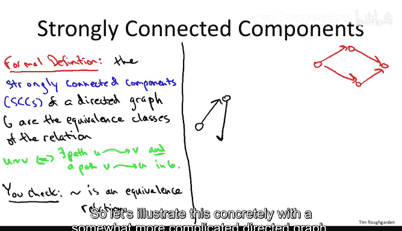
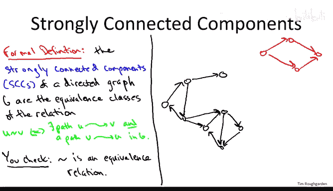
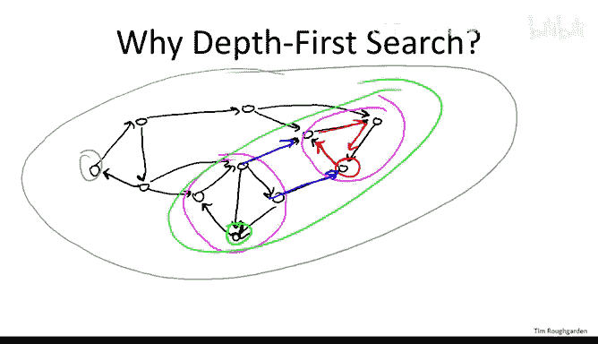
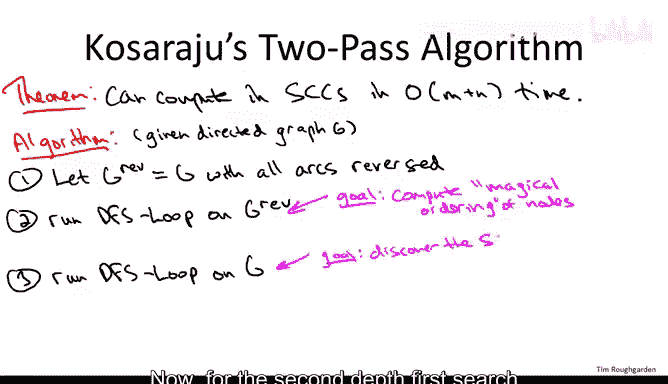
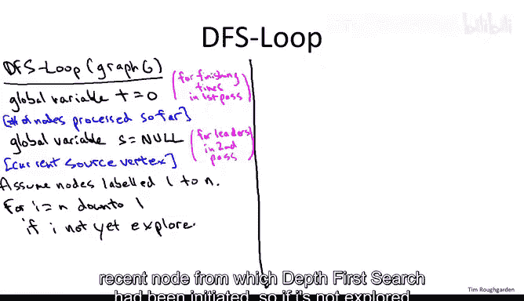
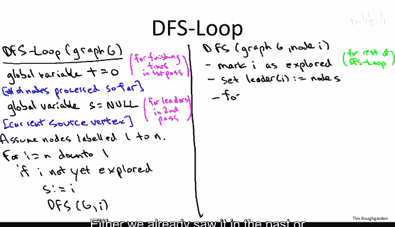
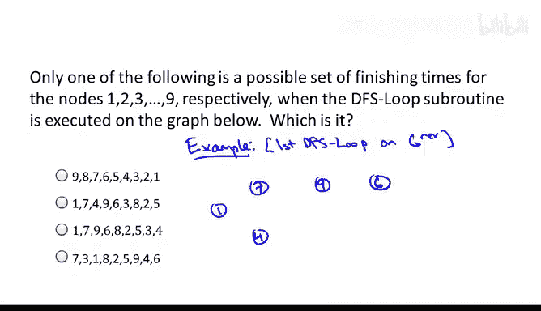
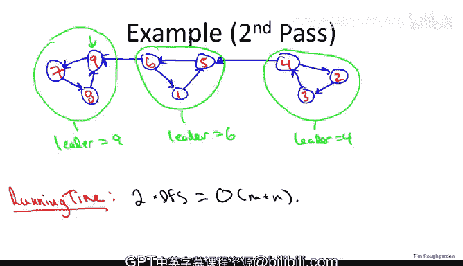

# 算法：07：计算强连通分量-算法 🔗

## 概述
在本节课中，我们将学习如何为有向图计算强连通分量。我们已经掌握了在线性时间内计算无向图连通分量的方法，现在将注意力转向有向图。好消息是，我们同样可以获得一个极其快速的算法来计算有向图的连通性信息。我们将学习一个基于深度优先搜索的线性时间算法，其常数因子非常小。

## 强连通分量的定义
上一节我们介绍了无向图的连通分量，本节中我们来看看如何定义有向图的“连通块”。对于有向图，我们通常研究的是**强连通性**。





一个图是**强连通**的，如果你可以从任意一点通过有向路径到达任意其他点，反之亦然。**强连通分量**则是图中内部强连通的**最大区域**，即从区域内任意节点A到任意节点B都存在有向路径。

更正式地，我们可以在图的节点上定义一个等价关系。我们说节点U与节点V相关，如果存在从U到V的有向路径，**并且**也存在从V到U的有向路径。强连通分量就是这个等价关系的等价类。


## 算法动机与挑战
以下是理解算法为何有效的一些关键点：

*   **从正确节点开始DFS的重要性**：如果我们从一个强连通分量内部的节点开始深度优先搜索，DFS将发现该分量内的所有节点。然而，如果从一个“错误”的节点开始，DFS可能会发现多个强连通分量的并集，甚至整个图，这无法揭示分量结构。
*   **算法的核心思想**：Kosaraju算法的巧妙之处在于，它通过一个预处理步骤（本身也是一次DFS）来计算出后续DFS应该从哪些节点开始，以确保每次调用DFS都能恰好发现一个强连通分量。

## Kosaraju算法 🧠
Kosaraju算法证明了以下定理：有向图的强连通分量可以在线性时间`O(m + n)`内计算出来，其中`m`是边数，`n`是节点数。该算法本质上只是两次深度优先搜索。



算法包含三个步骤：

1.  **反转所有弧**：将有向图`G`的所有边方向反转，得到反向图`G_rev`。
2.  **在反向图上进行第一次DFS**：在`G_rev`上运行深度优先搜索（`DFS-Loop`）。这次搜索的主要目的是计算每个节点的**完成时间**。
3.  **在原图上进行第二次DFS**：在原始图`G`上再次运行深度优先搜索（`DFS-Loop`）。但这次，我们按照**完成时间递减**的顺序来处理节点。在这次搜索中，我们会为每个节点标记一个**领导者**，属于同一个强连通分量的节点将具有相同的领导者。

### 算法子程序详解
算法的核心是`DFS-Loop`子程序，它会被调用两次。



**全局变量**：
*   `t`：全局时间计数器，用于在第一次DFS中记录节点的完成顺序（完成时间）。
*   `s`：全局领导者变量，用于在第二次DFS中记录当前DFS调用的发起节点。

**`DFS-Loop(Graph G)` 伪代码**：
```
t = 0
s = NULL
for each vertex i in G (processed in a specified order):
    if i is not explored:
        s = i
        DFS(G, i)
```

**`DFS(Graph G, start node i)` 伪代码**：
```
标记 i 为已探索
设置 leader[i] = s  // 记录i的领导者是当前DFS的源点s
for each edge (i, j) in G.outgoingEdges(i):
    if j is not explored:
        DFS(G, j)
// 所有从i出发的边都已处理完毕
t = t + 1
设置 finishing_time[i] = t // 记录i的完成时间
```

**两次调用`DFS-Loop`的区别**：
*   **第一次调用（在`G_rev`上）**：
    *   处理节点的顺序：按节点原始编号`n, n-1, ..., 1`。
    *   目的：计算`finishing_time[]`。忽略`leader[]`。
*   **第二次调用（在`G`上）**：
    *   处理节点的顺序：按`finishing_time`值**递减**的顺序（即完成时间最晚的节点最先处理）。
    *   目的：计算`leader[]`。忽略`finishing_time[]`（它们已在上一步计算好）。



## 算法示例演示
让我们通过一个具体例子来理解算法如何工作。



### 第一步：在反向图上计算完成时间
假设我们有一个9个节点的有向图，并已将其反向。节点初始编号为1到9。我们在反向图上运行`DFS-Loop`，按编号9到1的顺序处理节点。



以下是DFS探索的一种可能顺序及其结果：
*   从节点9开始DFS，最终探索顺序可能为：9 -> 6 -> 3 -> (回溯) -> 6 -> 8 -> 2 -> 5 -> (回溯) -> 2 -> 8 -> 6 -> 9。
*   然后从节点7开始新的DFS：7 -> 4 -> 1 -> (回溯) -> 4 -> 7。

最终计算出的**完成时间**（`finishing_time`）可能如下（节点：完成时间）：
*   节点3: 1
*   节点5: 2
*   节点2: 3
*   节点8: 4
*   节点6: 5
*   节点9: 6
*   节点1: 7
*   节点4: 8
*   节点7: 9

**关键点**：完成时间反映了在反向图`G_rev`上DFS结束处理每个节点的顺序。

### 第二步：在原图上按完成时间顺序进行DFS并寻找领导者
现在，我们回到原始图`G`（将边方向恢复）。我们**不再使用节点原始编号**，而是使用上一步计算出的**完成时间作为节点的新标签**。

然后，我们在`G`上运行第二次`DFS-Loop`，但处理节点的顺序是**按新标签（完成时间）从大到小**，即：节点9（原节点7）-> 节点8（原节点4）-> ... -> 节点1（原节点3）。

过程如下：
1.  从**节点9（原7）**开始DFS。它只能访问节点9、8、7（按新标签）。这些节点获得领导者 **9**。这恰好是一个强连通分量。
2.  外层循环继续。下一个未探索的、标签最大的节点是**节点6（原9）**。从它开始DFS，新探索节点6、1、5（按新标签）。它们获得领导者 **6**。这是另一个强连通分量。
3.  下一个未探索的、标签最大的节点是**节点4（原6）**。从它开始DFS，新探索节点4、2、3（按新标签）。它们获得领导者 **4**。这是最后一个强连通分量。

最终，每个节点都被赋予了一个领导者，相同领导者的节点集合就构成了一个强连通分量。

## 算法性能与总结
**性能分析**：Kosaraju算法的主体是两次深度优先搜索。每次DFS的时间复杂度是`O(m+n)`。额外的簿记操作（如记录完成时间、领导者）是常数时间或线性时间。因此，总时间复杂度为`O(m+n)`，非常高效。

**实现细节**：在第二次DFS时，要按完成时间递减顺序处理节点，无需排序（`O(n log n)`）。可以在第一次DFS后，直接将节点按完成时间存入一个数组，第二次循环时逆序读取即可，只需`O(n)`时间。



**总结**：本节课我们一起学习了Kosaraju算法，这是一个用于计算有向图强连通分量的优雅而高效的算法。其核心在于：
1.  通过**在反向图上进行DFS**，计算出一个神奇的节点处理顺序（完成时间）。
2.  然后**在原图上按此顺序（完成时间递减）进行DFS**，每次DFS调用会自动“剥离”出一个完整的强连通分量，并通过领导者标签记录下来。
这个算法充分利用了深度优先搜索的特性，以线性时间解决了问题，是图算法中的一个经典范例。