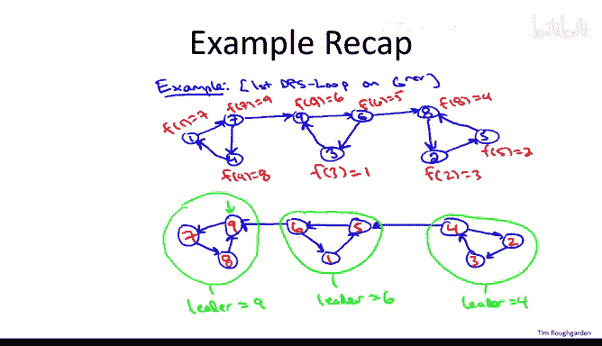
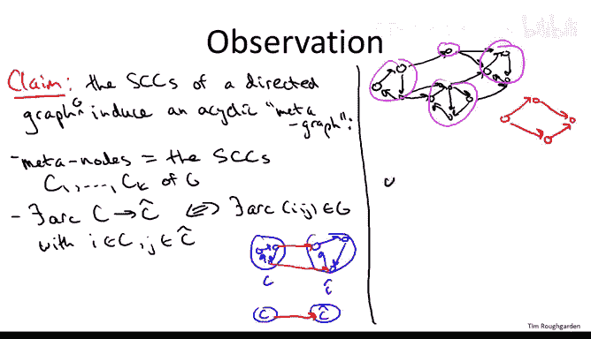
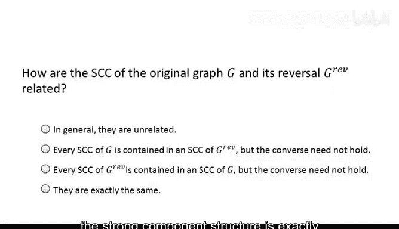
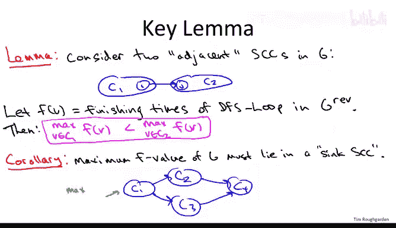
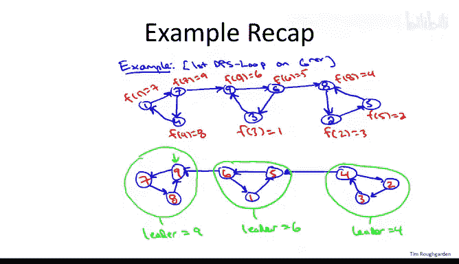
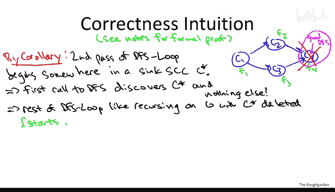
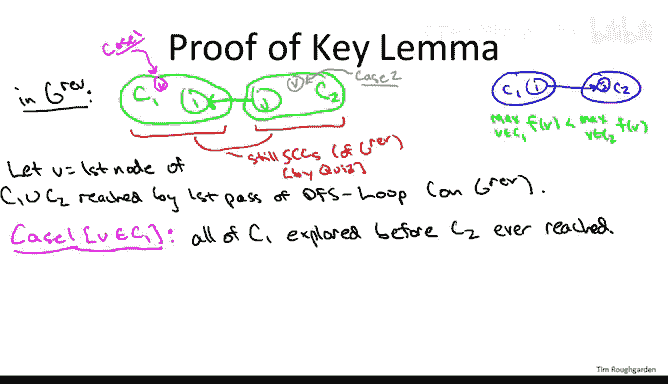

# 斯坦福大学《算法（分治／排序／搜索／随机算法、图搜索／最短路径／数据结构、贪心算法／最小生成树／动态规划、最短路径／NP）｜Algorithms》中英字幕 - P52：08_01_11_计算强连通分量-分析.zh_en - GPT中英字幕课程资源 - BV1Rx4y1U7sZ

So the goal of this video is to prove the correctness of Kaeraraju's two past depth first search based linear time algorithm that computes the kinetic components of a directed graph。

So I've given you the full specification of the algorithm I've also given you a plausibility argument of why it might work in that at least it does something sensible on an example。

 namely it first does a pass of depth first search on the reverse graph it computes this magical ordering and what's so special about this ordering is then when we do a depth first search using this ordering on the forward graph it seems to do exactly what we want every invocation of depth first search to some new node discovers exactly the nodes of the strong opponent and no extra stuff remember that was our first observation that was unclear whether the depth first search would be useful or not for computing strong opponent if you call depth first search from just the right place you're going to get exactly the nodes of an SEC and nothing more if you call it from the wrong place you might get all of the nodes of the graph and get no information at all about the structure of the strong components and at least in this example this first pass with the finishing time seems to be accomplishing seems to be leading us invoking depth first search from exactly the right places So remember how this in the example so in the top graph I've shown you the graph。

With the arcs reversed this is where we first invoked DFS loop with a loop over the nodes going from the highest node name nine all the way down to the node name one and here we compute finishing times that's the bookkeeping that we do in the first pass so we just keep a running count of how many nodes we've finished processing that is how many we both explored that node as well as explored all of the outgoing arcs and so that gave numbers in red these finishing times between one and one and9 for the various nodes those became the new node names in the second graph and then we reversed the arcs again to get the original graph back and then we saw that every time we invoked DFS and our second pass we uncover exactly the nodes of an SCC so when we invoked it from the node 9 we discovered98 and7 those all have the leader vertex9 then when we next invoke DFS from 6 we discovered65 and1 and nothing else and then finally we invoked it from four and we discovered two。

 three and4 and nothing else and those are exactly the three Ss of this graph so let's now understand why this works in any directed graph。

Not just in this one example。

So let's begin with a simple observation about directed graphs。

 which is actually interesting in its own right。The claim is that every directed graph has two levels of granularity if you squint。

 if you sort of zoom out， then what you see is a directed acyclic graph course comprising its strongly connected components and if you want you can zoom in and focus on the fine grain structure with one SCC a little bit more precisely。

The claim is that the strongly connected components。Of a directed graph。Induce in a natural way。

An acyclic。Meedtagraph。So what is this meta， what are the nodes and what are the arcs。

 what are the edges？Well， the metaodes are just the SECs。

 so we think of every strong count component as being a single node in this metagraph。So call them。

 say C1 up to C。So what are the arcs in this metagraph。

 well they're basically just the ones corresponding to the arcs between Ss and the original graph？

That is， we include in the middlegraph in Arc。Between the strong components C and C hat from C2 C hat。

 if and only if there's an arc from a node in C to a node in C hat in the original graph G。

So for example， if this is your C。And this other triangle is your sea hat。

And you have one or maybe multiple edges going from sea to sea hat。

Then in the corresponding metagraph， you're just going to have a node for C。A node for C hat。

And it directed arc from sea to sea hat。So if we go back to some of the drafted graphs that we've used as running examples。

 so if we go back to the one that at the beginning of the previous video。

Which looked maybe something like this。The corresponding directed acyclic graph。Has four nodes。And。

Fors。And for the running example， we used to illustrate Kasraji's algorithm with the three triangles。

The corresponding metagraph would just be a path。Three notess。

So why is this meta guaranteed to be acyclic？Well remember meta nodes correspond to strong components and in a strong component you can get from anywhere to anywhere else。

 so if you had a cycle that involved two different meta nodes that is two different strong connecttic components。

 remember on a directed cycle you can also get from anywhere to anywhere else so if you had two supposedly distinct SCCs but you can get from the one to the other and vice versa they would collapse into a single SCC you can get from anywhere anywhere in one。

 anywhere from anywhere in the other one and you can also go between them it will so you can get from anywhere you can get from anywhere in this union to anywhere in the union。

So not just in this context of computing strong components。

 but also just more generally this is a useful fact to know about directed graphs。

 on the one hand they can have very complex structure within a strong component。

 you have paths going from everywhere everywhere else and it may be sort of complicated looking。

 but at a higher level if you're abstract out at the level of SCCCs。

 you're guaranteed to have this simple dag， the simple directed ascyclic graph structure。

So to reinforce these concepts and also segue into thinking about Kaserraj's algorithm in particular。

 let me ask you a question about how reversing arcs affects the strong components of a directed graph。

So the correct answer to this quiz is the fourth one。

The strong components are exactly the same as they were before。 In fact。

 the relation that we described is exactly the same as it was before。

 so therefore the equivalence classes or the strong components is exactly the same。

 So if two nodes are related in the original graph that is just a path from U to V and a path from V to U that's still true after you reverse all the arcs you just use the reversal of the two paths that you had before Similarlyly if the two nodes weren't related before。

 for example， because you could not get from U to V well then after you reverse everything。

 then you can't get from V to U So again， you don't have this relation holding So the secs are exactly the same in the forward or the backward graph in particular in Kaerraji's algorithm。

 the strong components structure is exactly the same in the first pass of DFS and in the second pass of DFS。

So now that we understand how every directed graph has a metagraph where the nodes correspond to string connect components and you have an arc from one SCC to another。

 if there's any arc from any node in that SCC to the other S in the original graph。

 I'm in a position to state what's the key limitmma that drives the correctness of Kasras to pass algorithm for computing the string connect components of a directed graph。

 so here's the Lema statement。It considers two stronglyling kinetic components that are adjacent in the sense that there's an arc from one node in one of them to one node in the other one。

So let's say we have one SCCCCC1 with a node I and another SCCCCC2 with a node J。

 and an NG in the graph there's an arc directly from I to J。

 so in this sense we say that these SECCCs are adjacent with the second one being in some sense after the first one。

Now let's suppose we've already run the first pass of the DFS loop subroutine and remember that works on the reverse graph。

 so we've invoked it on the reverse graph he computed these finishing times， as usual。

 we'll let F denote the finishing times computed in that depth first search subroutine on the reverse graph。

The Lemma then asserts the following， it says first amongst all the nodes in C1。

 look at the one with the largest finishing time， similarly amongst all nodes in C2 look at the one with the biggest finishing time amongstt all of these the claim is the biggest finishing time will be in C2。

 not in C1。So what I want to do next is I want to assume that this lemma is true temporarily and I want to explore the consequences of that assumption and in particular。

 what I want to show you is that if this lemma holds。

 then we can complete the proof of correctness of Kasraji's two-pa secCC computation algorithm so if the lemma is true then I'll give you the argument about why we're done about why we just peel off the strong connect components one at a time with the second pass of depth first search Now。

 of course， a proof of the hole in it ist a proof so at the end of the lecture I'm going to fill in the hole that isn't going to supply a proof of this key lemma。

 but for now as a working hypothesis let's assume that it's true。

Let's begin with a corollary that is a statement which follows essentially immediately from the statement of the Lemma。

So for the corollary， let's forget about just trying to find the maximum the maximum finishing time in a single S。

 Let's think about the maximum finishing time in the entire graph Now。

 why do we care about the maximum finishing time in the entire graph Well notice that's exactly where the second pass of depth first search is going to begin right so it processes nodes in order from largest finishing time to smallest finishing time So equivalently let's think about the node at which the second pass of depth first search is going to begin even the maximum finishing time Where could it be Well the corollary is that it has to be in what I'm going to call a sync strongly connected component that is a strongly connected component without any outgoing arcs。

So for example， let's go back to the metagraph of FCCs for the very first directed graph we looked at。

 you recall that in the very first directorgraph we looked at in when we started talking about this algorithm。

 there were four SCCCs。So there was a C1。AC2。The C3。And a C4。

And of course within each of these components there could be multiple nodes that they're all connected to each other Now let's use F1。

 F2， F3 and F4 to denote the maximum finishing time in each of these SECCCs。

So we have F1， F2， F3， and F4。So now we have four different opportunities to apply this lemma there's four different pairs of adjacent SCCs and so what do we find we find that well comparing F1 and F2 because C2 comes after C1 that is there's an arc from C1 to C2 the max finishing time in C2 has to be bigger than that in C1 that is F2 is bigger than F1 for the same reasoning F3 has to be bigger than F1 symmetricsymmetrically we can apply the lemma to the pairs C2 C4 and C3 C4 and we get that F4 has to dominate both of them。

You'll notice we actually have no idea whether F2 or F3 is bigger so that pair we can't resolve。

 but we do know these relationships。 F1 is the smallest and F4 is the smallest and you'll also notice that C4 is a sync SCC in the sense that it has no outgoing arcs and if you think about it that's a totally general consequence of this lemma So a simple proof of contradiction will go as follows。

 consider the strongly kine component with the maximum f value。

 supposeuppose it was not a sync SCC that it has an outgoing arc follow that outgoing arc to get to some other SCC by the lemma。

 the SEC you've gotten to as an even bigger maximum finishing time so that contradicts the fact that you started in the Se with the maximum finishing time so just like in this cartoon where the unique sync SCC has to have the largest finishing time that's totally general as another sanity check we might return to the ninende graph or we actually ran Karaju's algorithm and looking at the forward version of the graph which is the one on the bottom we see。

AtThe maximum finishing times in the three SCCs are four， six， and nine。

Hey， it turns out're the same as the leader nodes， which is not an accident if you think about it for a little while and again。

 you'll observe the maximum finishing time in this graph， namely9 is indeed in the leftmost S。

 which is the only S with no outgoing arcs but it's totally general。

 basically you can keep following arcs and you keep seeing bigger and bigger finishing times So the biggest one of all it has to be somewhere where you get stuck where you can't go forward there's no outgoing arcs and that's what I'm calling a sync S so assuming the lemma' is true。

 we now though this corollary is true。 Now using this corollary。

 let's finish the proof of correctness of Kaeraraji's algorithm modular proof of the key lemma So I'm not going to do this super rigorously although everything I say is correct and can be made rigorous and if you want a more rigorous version I'll post some notes on the course website which you can consult for more details。

So with the previous corerollator accomplished， it allows us to locate the node with maximum finishing time。

 we can locate it somewhere in some sync SCC。Let me remind you about the discussion we had at the very beginning of talking about computing strong components。

 We are trying to understand whether depth first search would be a useful workhorse for finding the strong components。

 And the key observation was that it depends where you begin that depth first search。 So。

 for example， in this graph with4 SCC is shown in blue on the right。

 a really bad place to starts a DfS called depth first search would be somewhere in C1。

 somewhere in this source SCC。 So this is a bad DfS。 Why is it bad。

 Well remember what depth first search does， It finds everything findable from its starting point。

 And from C1， you can get to the entire world。 you can get to all the nodes in the entire graph。

 So you'll discover everything And this is totally useless because we wanted to discover much more fine grain structure。

 We want to discover C1 C2 C3 and C4 individually。 So that would be a disaster。

 if we invoked depth first search somewhere from C1。 Fortunatelyly， that's not what's going happen。

 we compute this map。ag ordering in the first pass to ensure that we look at the node with the maximum finishing time first and by the corollary。

 the maximum finishing time is going to be somewhere in C4。That's going to be a good DFS。

In the sense that when we start exploring from anywhere in C4， there's no outgoing arcs。

 so of course we're going to find everything in C4。

 everything in C4 is jolly connected to each other， but we can't get out。

 we will not have the option of trespassing on other strong components and we're not going to find them。

 so we're only going to find C4， nothing more。Now here's where we're going to be a little informal。

 although again everything I'm going to say is going to be correct so what happens now once we've discovered everything in C4 well all the nodes in C4 get marked as explored as we're doing depth first search and then they're basically dead to us right the rest of our depth first search loop will never explored them again they're already marked as explored if we ever see them we don't even go there。

So the way to think about that is when we proceed with the rest of our for loop in DFS loop。

 it's as if we're starting afresh， we're doing depth first search from scratch on a smaller graph on the residual graph。

 the graph G with this newly discovered strong component C star deleted。

So in this example on the right， all of the nodes in C4 are dead to us and it's as if we run DFS andU just on the graph containing the strong components C1 C2 and C3。

So in particular， where is the next indication of depth for search going to come from。

 it's going to come from some sync SCC in the residual graph where it's going to start at the node that remains and that has the largest finishing time left。

So there's some ambiguity in this picture again recall we don't know whether F2 is bigger or F3 is bigger it could be either one。

 so maybe F2 is the largest remaining finishing time in which case the next DFS in is going to begin somewhere from C2 Again。

 the only things outgoing from C2 are these already explored nodes they're effectively deleted we're not going to go there again。

 so this is essentially a sync SCCC。

we newly discover the nodes in C2 and nothing else。

 those are now effectively deleted now the next im of DFS will come from somewhere in F3。

 somewhere in C3， that's the only remaining syncSCC in the residual graph。

 so the third call the DFS will discover this stuff and now of course we're left only with C1 and so the final indication of DFS will emerge from and discover the nodes in C1。

And in this sense， because we've ordered the nodes by finishing times with a DFS with a reverse graph。

 that ordering has this incredible property that when we process the nodes in the second pass。

 we will just peel off the strongly connected components one at a time， if you think about it。

 it's in reverse topological order with respect to the directed acyclic graph of the strongly connected components。

So we've constructed a proof of correctness of Kaserraju's algorithm for computing St K components。

 but again there's a hole in it， so we completed the argument assuming a statement that we haven't proof so let's fill in that last gap in the proof and we'll be done and so what we need to do is prove the key lemma let me remind you what it says it says if you have two adjacent SCCCs。

C1 and C2 is an arc。From a node in C1。Call it I to a node in C 2， say J。

Then the max finishing time in C2 is bigger than the max finishing time in C1。

 whereas always these finishing times are computed in that first pass of depth first search loop in the reversed graph。

All right， now the finishing times are computed in the reversed graph。

 so let's actually reverse all the arcs and reason about what's happening there。

 but we still have C1。 it still contains the node I。We still have C2， it still contains the node J。

But now， of course， the orientation of the arc has reversed， so the arc now points from J to I。

 recall we had a quiz which asked you to understand the effect of reversing all arcs on the SCCs and in particular there is no effect。

 so the SCCs in the reverse graph are exactly the same as in the forward graph。

So now we're going to have two cases in this proof and the cases correspond to where we first encounter a node of C1 union C2。

 Now remember when we do this DFS loop this second pass because we have this outer for loop that iterates over all of the nodes。

 we're guaranteed to explore every single node of the graph at some point So in particular we're going to explore some point every single node in C1 union C2 what I want you to do is pause the algorithm when it first for the first time explores some node that's in either C1 or C2 it's going to be two cases。

 of course， because that node might be in C1， you might see that first or it might be in C2 you might see something from C2 first。

So our case1 is going to be when the first node that we see from either one happens to lie in C1。

 and the second case is where the first node V that we see happens to lie in C2。

 So clearly exactly one of these will occur。So let's think about case1 when we see a node of C1 before we see any nodes of C2。

So in this case， where we encounter a node in C1 before we encounter any node in C2。

 the claim is that we're going to explore everything in C1 before we ever see anything in C2。

Why is that true， the reason is there cannot be a path that starts somewhere in C1， like for example。

 at the vertex V and reaches C2。And this is where we're using the fact that the metagraph on strong components is acyclic。

Right C1 is strongly connected C2 is strongly connected。

 you can get from C2 to C1 and if you can also get from C1 back to C2。

 this all collapses into a single Stralline connectedinetic component。

 but that would be a contradiction， we're assuming C1 and C2 or distinctian connected components。

 therefore you can't have paths in both directions。

 we already have a path from right to left via JI so there's no path from left to right That's why if you originate a depth first search from somewhere inside C1 like this vertex V。

 you finish exploring all of C1 before you ever are going to see C2re only going to see C2 at some later point in the outer for loop。

So what's the consequence that you completely finish with C1 before you ever see C2。

 well it means every single finishing time in C1 is going to be smaller than every single finishing time in C2。

 so that's even stronger than what we're claiming we're just claiming that the biggest thing is C2 is bigger than the biggest of C1。

 but actually finishing times in C2 totally dominate those in C1 because you finish C1 before you ever see C2。

So let's now have a look at case1 actually in action。

 let's return to the nine node graph on which we actually ran Ka Rogers algorithm to completion So if we go back to this graph which has the three connected components and remember it's the bottom version is the forward version。

 the top version is the reversed version。So if you think about the middle SCC as being C1 playing the role of C1 and the leftmost scCC playing the role of C2。

 then what we have exactly is case1 of the key lemma so which was the first of these six vertices visited during the DFS loop in the reverse graph well that would just be the node with the highest name so the node 9 so this was the first of these six vertices that depth search ever looked at in the first pass。

 that lies in what we're calling C1 and indeed everything in C1 was discovered in that pass before anything in C2 and that's why all of the finishing times in C2。

 the 78 and9 are bigger than all of the finishing times in C1 the 15 and 6。

So we're good to go in case two， we've proven sorry in case1。

 we've proven the lemma when it's the case that amongst the vertices in C1 union C2。

 depth first search in the first pass sees something from C1 first。

 so now let's look at this other case， this gray case， which could also happen totally possible。

Where the first thing we see when depth for searching in the first pass is something from C2。

And here now is where we truly use the fact that we're using depth first search rather than some other graph search algorithm like breathth first search。

 there's a lot of places in this algorithm you could swap in breath first search。

 but in this case too you'll see why it's important we're using depth first search to compute the finishing times。

And what's the key point。 The key point is that when we invoke depth first search beginning from this node V。

 which is now assuming the line C2。 remember， depth first search will not complete。

 We won't be done with V until we' found everything there is defined from it。

 right So we recursively explore all of the outgoing arcs。

 They recursively explore all the outgoing arcs and so on。

 It's only when all paths going out of V have been totally explored and exhausted that we finally backtrack all the way to V。

 and we consider ourselves done with it。 That is depth first search in the reverse graph initiated at V。

Won't finish until everything findable has been completely explored because there's an arc from C2 to C1 Obviously everything in C2 is findable from V that's strongly connected。

 we can get from C2 to C1 just using this arc from J to I C1 being strongly connected we can then find all of that maybe we can find other strongly connected components as well。

 but for sure death first search starting from V we'll find everything in C1 union C2 maybe some other things and we won't finish with V until we finish with everything else that's the depth first search property。

For that reason， the finishing time of this vertex v will be the largest of anything reachable from it。

 so in particular it'll be larger than everything in C2。

 but more to the point it'll be larger than everything in C1， which is what we are trying to prove。

Again， let's just see this quickly in action in the nine nodede network on which we traced through Kasraju's algorithm。

 so to show the role that case2 is playing in this concrete example。

 let's think of the right most strongly connected component as being C1。

And let's think of the middle strongly ktic component as being C2 remember last time we called the middle1 C1 and the leftmost one C2 Now we're calling the rightmost one C1 and the middle one C2 So again we have to ask the question you know of the six nodes in C1 union C2 what is the first one encountered in the depth first search that we do in the first pass and that again is the node9 the node which is originally labeled9 so that's the same node that was relevant in the previous case but now with this relabeling of the components9 appears in the strongly ktic components C2 not in the one labelbeled C1。

 So that's the reason now we're in case2 not in case1 and what you'll see is what is the finishing time that this originally labeled nine node gets it gets the finishing time6。

And you'll notice6 is bigger than any of the other finishing times of any of the other nodes in C1 or C2 the other five nodes have the finishing times1 through5 and that's exactly because when we ran depth first search in the first pass and we started it at the node originally labeled9。

 It discovered these other five nodes and finished exploring them first before finally backtracking all the way back to9 and deeming9 fully explored。

 and it was only at that point that9 got its finishing time after everything reachable from it had already gotten there lower finishing times So that wraps it up。

 we had two cases depending on whether in these two adjacent scCCs the first vertex encountered was in the C1 or in C2 either way it doesn't matter the largest finishing time has to be in C2 sometimes it's bigger than everything sometimes it's just bigger than the biggest in C1 but it's all the same to us and to recap how the rest of the proof goes。

 we had a corollary based on this lemma， which says maximum finishing times have to lie in sync st connected。

And that's exactly where we want our depth first search to initiate if you're initiated in a strong component with no outgoing arcs。

 you do DFS the stuff you find is just the stuff and that's Sch connected component you do not have any avenues by which to trespass on other strong components so you find exactly one S in effect。

 you can peel that off and recurse on the rest of the graph and our slick way of implementing this recursion is to just do the single second Dfs pass where you just treat the nodes in decreasing order of finishing times that in effect unveils all of the scs in reverse topological ordering so that's it Caerran's algorithm and the complete proof of correctness a blazingly fast graph primitive that in any directed graph will tell you it strong components。

