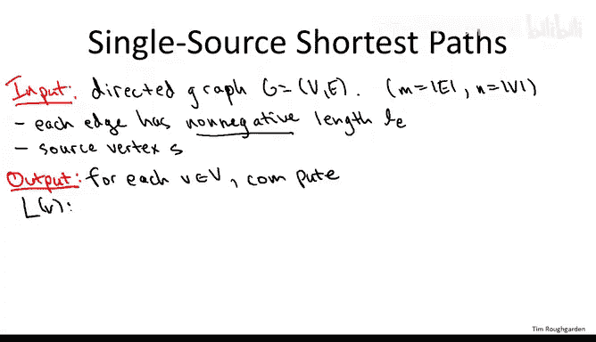
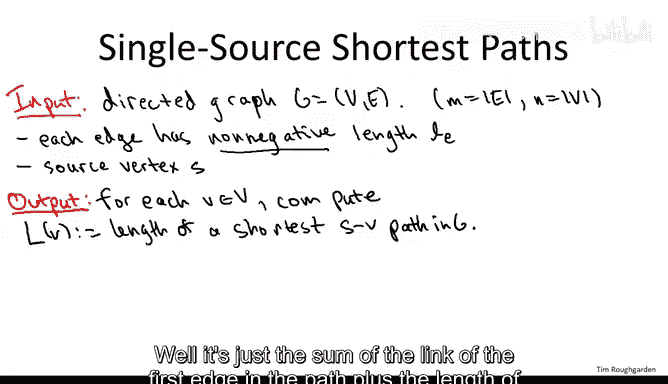
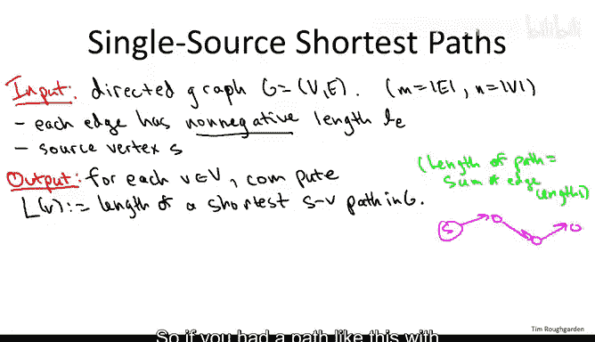
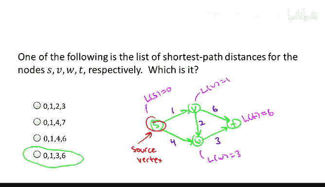
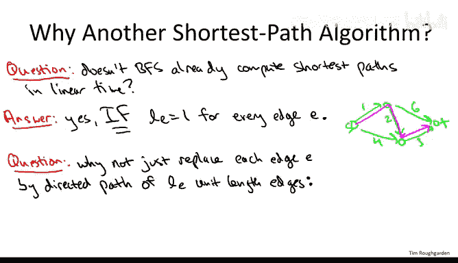
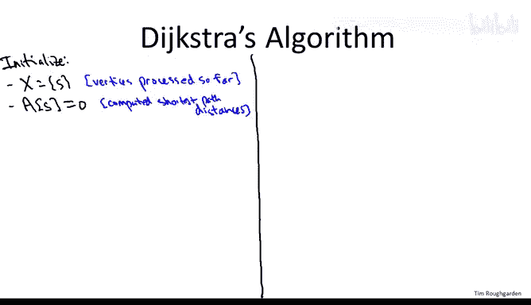
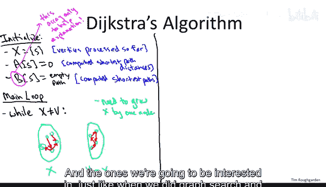
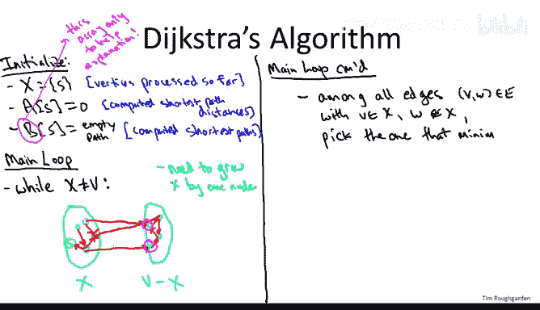

# 算法：10：Dijkstra最短路径算法







## 概述
在本节课中，我们将要学习计算机科学中的一个经典算法——Dijkstra最短路径算法。该算法用于解决**单源最短路径**问题，即在给定一个有向图（或无向图）、每条边具有非负长度以及一个源点的情况下，计算从源点到图中所有其他顶点的最短路径长度。

## 问题定义
我们有一个包含 **N** 个顶点和 **M** 条边的图。每条边 **E** 都有一个非负的长度 **L(E)**。我们还有一个指定的起始顶点，称为**源点 S**。我们的目标是计算从源点 **S** 到图中每一个其他顶点 **V** 的**最短路径距离**。

一条路径的长度是其包含的所有边的长度之和。例如，一条包含三条边（长度分别为1、2、3）的路径，其总长度为 **1 + 2 + 3 = 6**。最短路径距离是所有从 **S** 到 **V** 的路径中长度最小的那个。

为了简化讨论，我们假设从源点 **S** 到图中所有其他顶点都存在路径。同时，一个至关重要的假设是：**图中所有边的长度都是非负的**。如果存在负长度的边，Dijkstra算法将无法保证正确性。

## 为何需要新算法？
你可能会想到，我们之前学过的**广度优先搜索（BFS）** 也能计算最短路径。确实如此，但BFS仅在**所有边长度均为1**的特殊情况下有效。在边长度各不相同的一般情况下（例如在道路导航应用中，不同道路的里程或通行时间不同），BFS无法给出正确的最短路径。



一种想法是将一条长度为 **L** 的边替换为由 **L** 条长度为1的边组成的路径，从而将问题转化为BFS可解的问题。然而，当边长度可能非常大时（例如1000），这种转换会极大地增加图的规模，导致算法效率低下。因此，我们需要一个能直接在原图上高效运行的算法，这正是Dijkstra算法要解决的问题。

## Dijkstra算法核心思想
Dijkstra算法可以看作是BFS在边权非负情况下的推广。其核心思想是**贪心**地逐步确定从源点到其他顶点的最短距离。



算法维护两个集合：
*   **集合 X**：已经确定了最终最短路径距离的顶点集合。
*   **数组 A**：存储从源点 **S** 到每个顶点 **V** 的当前最短路径距离估计值。
*   **数组 B**（辅助理解）：存储从源点 **S** 到每个顶点 **V** 的当前最短路径本身（实际实现中通常不需要）。

算法从源点 **S** 开始，初始化 `A[S] = 0`，`B[S]` 为空路径，并将 **S** 加入 **X**。然后，算法重复以下步骤，直到 **X** 包含所有顶点：
1.  观察所有从 **X** 内部指向 **X** 外部的边（即“跨越边界”的边）。
2.  对于每一条这样的边 **(V, W)**（其中 **V** 在 **X** 中，**W** 不在 **X** 中），计算一个得分：`A[V] + L(V, W)`。这表示从 **S** 到 **V** 的已知最短距离，加上从 **V** 直接到 **W** 的边的长度。
3.  在所有跨越边界的边中，选出得分最小的那条边，记为 **(V*, W*)**。
4.  将顶点 **W*** 加入集合 **X**。
5.  将 `A[W*]` 的值设置为这个最小得分，即 `A[V*] + L(V*, W*)`。
6.  将 `B[W*]` 设置为路径 `B[V*]` 后接边 **(V*, W*)**。

直观上，我们每次都选择“看起来”离源点最近的那个尚未处理的顶点（**W***），并确认当前到达它的路径就是最短路径。

## 算法伪代码与示例
以下是算法的高层伪代码描述：

```
初始化:
    X = {S}
    A[S] = 0
    B[S] = 空路径
    For 所有其他顶点 v:
        A[v] = 无穷大
        B[v] = 未定义



While (X 不等于所有顶点集合 V):
    找到边 (v*, w*)，其中 v* 在 X 中，w* 不在 X 中，且使得 A[v*] + L(v*, w*) 最小
    将 w* 加入 X
    A[w*] = A[v*] + L(v*, w*)
    B[w*] = B[v*] + 边 (v*, w*)
```

让我们通过一个简单例子来理解算法过程。考虑下图，源点为 **S**，边上的数字表示长度。

```
    S --1--> V
    |        |
    4        2
    |        |
    v        v
    W --3--> T
```



算法执行步骤如下：
1.  初始：`X = {S}`, `A[S]=0`。
2.  迭代1：跨越边为 (S, V) 得分 0+1=1， (S, W) 得分 0+4=4。最小得分边为 (S, V)。将 **V** 加入 **X**，`A[V]=1`, `B[V] = S->V`。
3.  迭代2：`X = {S, V}`。跨越边有 (S, W) 得分4， (V, W) 得分 1+2=3， (V, T) 得分 1+2=3（假设有边V->T）。最小得分边为 (V, W)（得分3）。将 **W** 加入 **X**，`A[W]=3`, `B[W] = S->V->W`。
4.  迭代3：`X = {S, V, W}`。跨越边有 (W, T) 得分 3+3=6， (V, T) 得分 1+2=3。最小得分边为 (V, T)（得分3）。将 **T** 加入 **X**，`A[T]=3`, `B[T] = S->V->T`。
5.  结束。最终得到最短路径距离：`A[S]=0`, `A[V]=1`, `A[W]=3`, `A[T]=3`。



## 关键假设：非负边权
Dijkstra算法的正确性严重依赖于**边长度非负**的假设。如果图中存在负长度的边，该算法可能得出错误结果。

考虑一个反例：图中有三个顶点 **S, A, B**。边为：`S->A` 长度 1，`S->B` 长度 2，`A->B` 长度 -2。从 **S** 到 **B** 的最短路径是 `S->A->B`，长度为 1 + (-2) = -1。但Dijkstra算法会先处理 **A**（因为 `A[S->A]=1` 小于 `A[S->B]=2`），将 **A** 加入 **X** 并设置 `A[A]=1`。然后，在处理从 **X** 出发的边时，它会通过 `A->B` 更新 `A[B]` 为 `1 + (-2) = -1`。然而，此时 **B** 可能已经被错误的距离（2）处理过并加入了 **X**，算法不会再去修正它。或者，在另一种实现中，它可能得出错误的最短路径。总之，负权边会破坏算法的贪心选择策略。

对于包含负权边的图，需要使用其他算法，如 **Bellman-Ford 算法**。

## 总结
本节课我们一起学习了Dijkstra最短路径算法。我们首先定义了单源最短路径问题，并解释了为何在边权各异的情况下需要超越广度优先搜索的新方法。接着，我们详细阐述了Dijkstra算法的贪心核心思想：维护一个已确定最短距离的顶点集合 **X**，并反复选择从 **X** 出发、`当前最短距离 + 边权` 最小的边所指向的顶点加入 **X**，同时更新其距离。我们通过伪代码和示例演示了算法的执行过程。最后，我们强调了**边权非负**这一关键假设对于算法正确性的必要性，并简要提及了存在负权边时的替代算法。

在接下来的课程中，我们将深入探讨Dijkstra算法的正确性证明，并研究如何利用高效的数据结构（如堆）来实现它，从而达到近乎线性的运行时间。