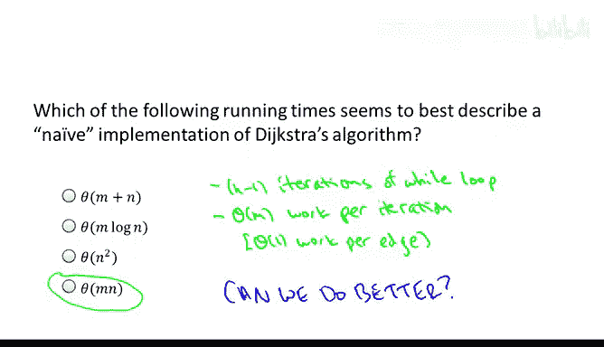
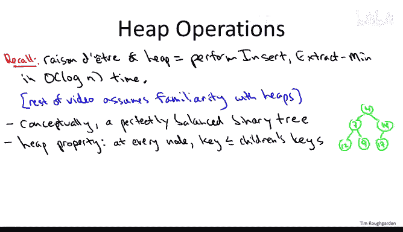
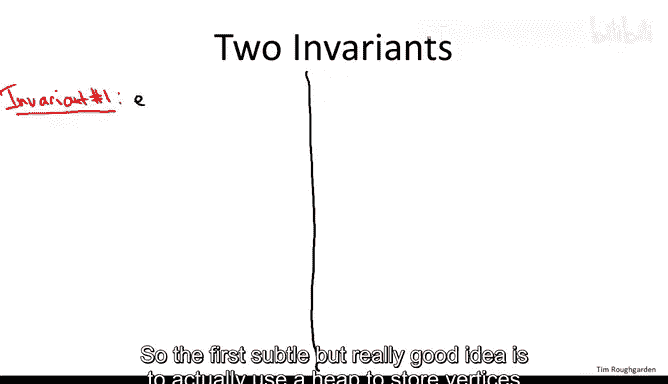
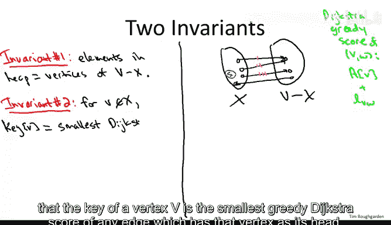
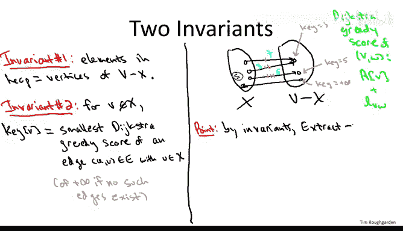
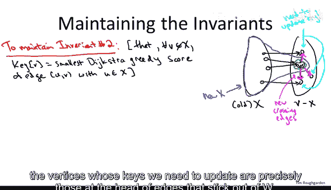
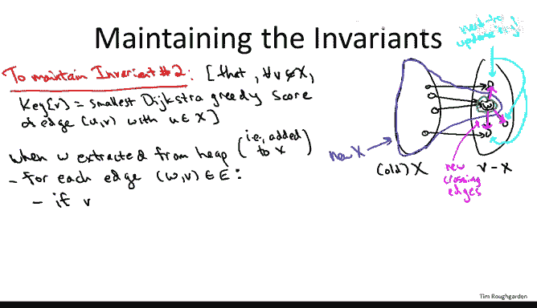
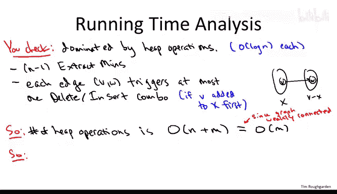

# 斯坦福大学《算法（分治／排序／搜索／随机算法、图搜索／最短路径／数据结构、贪心算法／最小生成树／动态规划、最短路径／NP）｜Algorithms》中英字幕 - P57：13_02_05_Dijkstra算法实现与时间复杂度.zh_en - GPT中英字幕课程资源 - BV1Rx4y1U7sZ

In this video， we'll discuss how we actually implement Dysster's shortest path algorithm and in particular using the he data structure will give a blazingly fast implementation almost linear time。

Let me just briefly remind you the problem we're solving it's the single source shortest path problem so we're given a directed graph and a source vertex S we're assuming that there's a path from S to every other vertex V if that's not true we can detect it with an easy preprocessing step。

 so our task then is just to find the shortest path amongst all of them from the source vertex S to each possible destination V Moreover every edge of the graph has a non-negative edge length which we're denoting LB。

So recall that Dxter's algorithm is driven by a single while loop so we're going to add one additional vertex to an evolving set capital X as the algorithm proceeds so x is the vertices that have been processed so far we may maintain the invariant for every process vertex we've computed what we think the shortest path distance is to that vertex so initially x is just the source vertex S of course the shortest path distance from S to itself is zero and then the cleverness in Dxter's algorithm is in how we figure out which vertex to add to the set capital X each iteration so the first thing we do is we focus only on edges that cross the frontier edges that have their tail and capital X and their head outside of capital X Now of course there may be many such edges edges that cross this frontier and we use Dxter's greedy criterion to select one of them so for each crossing edge each edge with a tail and x and head outside x we compute the Dxtra greedy score that is defined as the previously computed shortest path distance to the tail of the arc plus the length of the R。

So we compute that for each crossing edge and then the minimum edge we're calling it v star W star that determines how we proceed so we add the head of that arcw star to the set capital X and then we compute the shortest path distance to W star to be the previously computed shortest path distance to V star plus the length of this extra hop V star W star Now back when I explain this algorithm I did it using two arrays an array capital A and array capital B A is what computed the shortest path distances and remember that's what the problem asks us to compute and for clarity I also filled up this array capital B just to keep track of the shortest path themselves Now if you look at the code of this algorithm we don't actually need the array capital B for anything when we fill in the array capital A we don't actually refer to the B array and so now that we're going to talk about real implementations of diixtra I'm actually going to cross out all of the instructions that correspond to the B array because you would not as I told you earlier use this in a real implementation of ditra you would just fill in the shortest path distances themselves。

So in the next quiz， what I want you to think about is the running time of this algorithm if we implemented it more or less as is。

 according to the pseudocode on this slide without any special data structures。

And in the answers to the quiz， we're going to be using the usual notation where M denotes the number of edges in the graph and n denotes the number of vertices of the graph。

So the correct answer to this quiz is the fourth one that the straightforward implementation of Dxters algorithm would give you a running time proportional to the product of the number of edges and the number of vertices。

 And the way to see that is to just look at the main while loop and look at how many times it executes。

 and then how much work we do per iteration of the while loop。

 If we implemented it in a straightforward way。 So there's gonna be n -1 iterations of the while loop。

And the reason is is that the algorithm terminates once every single vertex has been added to capital x。

 there n vertices initially there's one vertex and x so after n minus1 iterations we'll have sucked up all of the vertices now what's the work done in each while loop well basically we do naively a linear your scan through all of the edges so we go through the edges we check if it's an eligible edge that is if its tail is an x and its head is outside of x we can keep track of that just by having an auxiliary boolean variable for each vertex remembering whether it's an x or not。

 and then amongst all of the eligible edges， those crossing the frontier we just by exhaustive search remember which edge has the smallest Dyxster score score Now we can compute the Dyster score in constant time for each of the edges。

So that's a reasonable algorithm we might be able to get away with graphs that have say hundreds or thousands of vertices using the straightforward implementation。

 but of course we'd like to do better， we'd like the algorithm to scale up to much larger graphs。

 even graphs with potentially say a million vertices。So the answer is yes。

 we can do better not by changing the algorithm， but rather changing how we organize the data as the algorithm proceeds。

 so this will be the first time in the course where we use a data structure to get an algorithmic speedup。

 so we're going to see a really lovely interplay between on the one hand algorithm design and the other hand data structure design in this implementation of Dyter's algorithm。

So you might well ask what's the clue that indicates that a data structure might be useful in speeding up Dytra's shortest path algorithm and the way you'd figure this out is you'd say well where is all this work coming from。

 why are we doing a linear amount of work in the edges for a linear number in the vertices iterations Well at each iteration of this while loop what we're doing is we're just doing an exhaustive search to compute a minimum。

 we look at every edge we look at those that cross the frontier and we compute the one with the minimum dixtra score so we can ask ourselves oh we're doing minimum computations over and over and over again is there some data structure which whose's ra on detra whose reason for being is in fact to perform fast minimum computations and in fact there is such a data structure。

 it's the heap data structure。So in the following description of a fast implementation of algorithm。

 I'm going to assume you're familiar with this heAP data structure， for example。

 that you watch the review video elsewhere on the course site that explains them。

So let me just remind you with a lightening quick review of what we learned in that video。

 so heaps are generally logically thought of as a complete binary tree。

 even though they're usually implemented as laid out in an array。

And the key property that you get to leverage， but that you also have to maintain in a heap is the he property that at every node。

 the key at that node has to be at least as small as that of both of the children。

This property ensures that the smallest key of them all has to be at the root of this tree。

To implement extract men， you just pluck off the root， that's what you return。

 that's the minimum elements， and then you swap up the bottommost rightmost leaf， the last element。

 make that the new roots， and then you bubble that down as necessary to restore the heat property。

When you do insertion， you just make the new elements， the new last leaf， bottommost， rightmost leaf。

 and then you swap up as needed to restore the heat property。When we use heaps and Dus algorithm。

 we're also going to need the ability to delete an element from the middle of the heap。

 but again you can do that just by swapping things and doubling up or down as needed。

 I'll leave it as an exercise for you to think through carefully how to delete elements from the middle of a heap。

Because you maintain a heap as an essentially perfectly balanced binary tree。

 the height of the tree is roughly the log base2 of n where n is the number of elements in the heap。

And because for every operation you implement it just by doing a constant amount of work at each level of the tree。

 all of these operations run in O of a log n time where n is the number of items that are being stored in the heap。

As far as the intuitive connection between the heap data structure and Dyxter's algorithm in the main wild loop of Dyter's algorithm are responsible for finding a minimum every single iteration。

 what are heaps good for， they're good for finding minimums in logarithmic time。

 that sounds a lot better than the linear time we're spending in the naive implementation of Dketer's algorithm。

So let's now see how to use Heaps to speed up Dextra's shortest path algorithm。

Now because every iteration of the wild loop is responsible for picking an edge you might expect that we're going to store edges in the heap。

 so the first subtle but really good idea is to actually use a heap to store vertices rather than edges going back to the pseudocode for Dyters algorithm。

 remember that the only reason we focused on an edge was so that we could then deduce which vertex namely the head of that edge to add to our set capital X so we're just going to cut to the chase we're just going to keep vertices not yet in X and then when we extract in from the heap it'll tell us which is the next vertex to add into the set capital X。

So the picture we're going to want to have in mind is Dyke just shortest path algorithm at some intermediate iteration。

 so there'll be a bunch of vertices in the set capital X。

 the source vertex plus a bunch of other stuff that we've sucked into the set so far。

 and then there'll be all the vertices we haven't processed yet a big group v minus x then there's going to be edges crossing this cut in both directions from x to v minus x and vice versa。

Now before I explain the second invariant， let's just recall what the straightforward implementation of Dter's algorithm needs to do。

 what it would do is search through all the edges and it would look for any eligible edges。

 those with tail and X and head and V minus x， so in this picture there would be three such edges。

I've drawn the example so that two of the edges， the top two edges， both share a common head vertex。

 whereas the third edge has its own head vertex。The straightforward implementation of Dyster's algorithm would compute Dyster's greedy score for each of these three edges。

And remember， by definition， that's the previously computed shortest path distance to the tail of the Arc V plus the length of the Arc VW。

So the straightforward implementation just computes this。

 in this case it was computed for three edges， and whichever the three edges one had the smallest score。

 the head of that edge would be the next vertex that gets added to x。

So let me specify the second invariant， and then I'll tell you how to think about it。

So because we're storing vertices rather than edges in the heap。

 we're going to have to be fairly clever with the way we define the key of a vertex that's in this heap。

So we're going to maintain the property that the key of a vertex V is the smallest greedy diytra score of any edge which has that vertex as its head。

So let me show you what I mean in terms of our example where we have three crossing edges。

 suppose for these three edges in the upper right， they happen to have diyks street greedy scores of seven。

 three， and five。Let's look at what the key should be for each of these three vertices I've drawn in v minus x Now for the top of those vertex。

 this is pretty interesting。 there are two different edges whose tail is an x and have this vertex as their head So what should the key of this vertex be what should be the smallest Dyxstra greedity score of any of the edges whose tail lies in the lefthand side that terminate at this vertex。

 so there's two candidate edges， one has Dyxstra greed score 3。

 one has Dxtra greed score 7 so the key value should be 3， the smaller of those two。

Now the second vertex， there's only a single edge that has tail and x and that terminates at this vertex。

 so the key for this vertex should just be the score of that unique edge。

 so in this case it's going to be five。And then this poor third vertex。

 there's actually no edges at all that started x and terminated at this vertex。

 there's only one arc going the wrong direction， so for any edge。

 sorry for any vertex outside of x that doesn't have any eligible edges terminating at it。

 we think of the key as being plus infinity。So the way I recommend thinking about these heap keys is that we've taken what used to be a one round tournament winner takes all and we've turned it into a two round knockout tournament so in our straightforward implementation of Dyxs algorithm we did a single linear search to all of the edges and we just computed the greedy Dchestra score for each and we picked the best So in this example we would have discovered these three edges in some order their scores are 35 and7 and would have remembered the edge of score3 as being the best that would have been our winner of this winner take all tournament Now when we use the heap it we're factoring it into two rounds so first each vertex in v minus x runs a local tournament to elect a local winner so each of these vertices in v minus X says well let me look at all of the edges for whom I'm the head and also the tail of that edge is in X and amongst all of those edges that start X and terminate me I'm going to remember the best of those so that's the winners of the local tournament of the first round。

And now the heap is only going to remember this set of first round winners right there's no point in remembering the existence of edges who aren't even the smallest score that terminate at a given vertex because you only care about the smallest score overall。

Now when you extract min from the heap， that's in effect executing the second and final round of this knockout tournament。

 so each of the vertices of v minus x has proposed their local winner and then the heap in an extract min just chooses the best of all of those local winners。

 so that's the final proposed vertex that comes out of the heap。

So the point is that if we can successfully maintain these two invaris。

 then when we extract in from this heap， we'll get exactly the correct vertex。

 a W star that we're supposed to add to the set capital X next。

 that is the heap will just hand to us on a silver platter。

 exactly the same choice of vertex that our previous exhaustive search through the edges would have computed the exhaustive search was just computing the minimum in a brute force way and a single winner take all tournament。

 the heap implemented in this way chooses exactly the same winner it just does it in this two round process。

Now in Dyster's algorithm we weren't supposed to nearly just find the next vertex W star to add to X。

 we also had to compute its shortest path distance。

 but remember we computed the shortest path distance as simply the Dyxtra greedy score and here the Dyster greedy score is just going to be the key for this heat that's immediate from invariant number two。

So we're using the fact here that our keys are by definition just the smallest greedy scores of edges that stick into that vertex W star so I'll be again exactly replicating the computation that we would have done in the straightforward implementation just in a much slicker way but we're adding exactly the same vertices in exactly the same order and we're computing exactly the same shortest path distances in this he implementation provided of course that we do successfully maintain these two invariance throughout the course of the algorithm。

 so that is now what I owe we have to pay the piper。

 we've shown that if we can have a data structure with these properties。

 then we can simulate the straightforward implementation。

 now I have to show you how we maintain these invariance without doing too much work。

So maintaining invariant number one will really take care of itself。

 really sort of by definition the vertices which remain in the heap are those that we haven't processed yet and those are the ones that are outside of capital X so really the trick is how do we maintain invariant number two。

Now， before I explain this， let me point out that this is a tricky problem。

 okay there is something subtle going on。So as usual I want you to think about this shortest path algorithm it's some intermediate iteration so take a snapshot。

 a bunch of vertices have already been added to X， a bunch of vertices are still hanging out in the heap that haven't been added to X。

 there's some frontier that's it is crossing possibly in both directions and suppose at the end of a current iteration。

 we identify the vertex W which we're going to extract from the heap and conceptually add to the set X Now the reason things get complicated is when we move a vertex from outside X to inside X the frontier between X and V minus x changes。

So in this picture， the old blackX becomes this new blue X。

And what's really interesting about the frontier changing is that then the edges which cross the frontier change。

 Now， there might be there are some edges which used to cross the frontier and now don't。

 those are the ones that are coming into W。 Those we're not so concerned with。

 those don't really play any role。 What makes things tricky is that there are edges which used to not be crossing the frontier。

But now they are crossing the frontier， And those are precisely the edges sticking out of W。

 So in this picture， there are three such edges， which I will highlight here in pink。

To see why it's tricky when new edges all of a sudden are crossing the frontier。

 let's remember what invariant number two says。It says that for every vertex。

 which is still in the heap， which is not yet in X。

 the key for that vertex better be the smallest diykestri greedy score of any edge which comes from capital X and sticks into this vertex V。

 Now， in moving one vertex into X， namely this vertex W。

 Now there can be new edges sticking in vertices， which are still in the heap。 As a result。

 the appropriate key value for vertices in the heap might be smaller。 Now。

 the W has been moved into X。 and the candidates for the vertices in the heap whose keys might have dropped are precisely those vertices on the other end of edges sticking out of W。

So summarizing the fact that we've added a new vertex to capital X and extracting something from the heap。

 it's potentially increased the number of crossing edges across the frontier because the frontier has changed。

 and therefore for vertices that remain in the heap。

 the smallest greedy score of an edge that sticks into them from the set X might have dropped。

 so we need to update those keys to maintain invariant number two。Now that's the hard part。

 here's what we have going for us we've damaged the keys perhaps by changing the frontier。

 but the damage is local， we can understand exactly whose keys might have dropped。

 so as suggested by the picture， the vertices whose keys we need to update are precisely those at the head of edges that stick out of W so for each outgoing edge from W the vertex we just extracted from the heap we need to go to the other end of the edge and check if that vertex needs its key to be decreased。

So here's the pseudocode to do this。So when we extract a vertex W from the heap。

 that is when we conceptually add a new vertex W to the set X， thereby changing their frontier。

 we say， well， you know， we know the only vertices that might have to have their key change。

 They're the ones on the other side of these outgoing arcs from W。

 So we just have a simple iteration over the outgoing edges。 W V from the vertex V。 Now。

 I haven't shown you any edges in the picture like this。

 but there might well be some edges where the head of the arc V is also in the set X has also already been processed。

 but anything in x is not in the heap。 Remember， the heap is only the stuff outside of X。

 So we can care less about stuff outside of the heap， We're not maintaining their keys。

 So we do an extra check。If the head of this edge is， in fact， still in the heat。

 that is if it's not an X。So in the picture， for example。

 this would be true for all three of the vertices that are on the other end of Arcs pointing out of W。

And for each of these vertices V， we update its key。

 and the way we're going to update its key is we're just going to rip this vertex out of the heap。

 we're going to recompute its key in constant time， and then we're going to reinsert it into the he。

 and since all heap operations take logarithmic time， this key update will be logarithmic time。

As an additional optimization， I want to point out that if one of these vertices v's key does change it can only change in one way。

 So remember what is the key， the key is the smallest greedy Dxtra score of all of the edges that start next and stick into this vertex So that's the local tournament or the first round tournament happening at this vertex V Now the only thing which has changed before and after we added this vertex W to X is that now one new edge is sticking into this vertex V all of the old edges sticking into it from x are still sticking into it and now there's one extra candidate in its local tournament namely this edge Wv So either Wv is the local winner。

 either it has the smallest Dtra greedy score of them all that terminated this vertex or it doesn't in which case the previous winner is still the new winner So that is the new key value can only be one of two things either it's the old key value that's the case where this extra entrant。

 the edge from W to v is irrelevantle or if it's changed it has to have changed to degree。

The extra score of this edge Wv and the formula for that is the shortest path distance。

That we just computed for W， where W has been processed at this point。

 plus the length of the direct arc from WV。And again， conceptually。

 this formula is just the greedy Dyxtra score for the ArcWV。

 the new entrance in V's local first round tournament。

So now having updated V's key appropriately so that invariant number two is restored and once again the key of every vertex does reflect the smallest Dxter greedity score of any edge sticking into it from the set X。

We can safely reinserts this node back into the heap。With its new key value。

And these three lines together are just a key update in logarithmic time for one of these vertices that's at the other end of an arc sticking out of the vertex W。

So let's tally up the running time in this new implementation one thing I want you to check and this will definitely help you understand this refined implementation of Dxter's algorithm is that essentially all the work done is through the HeEAP API that is all of the running time that we have to account for is in heAP operations we don't really do nontrivia work outside of HeAP operations。

And again， recall that the running time of any heap operation is logarithmic in the number of elements in the heap。

 our he is storing vertices， it's never going to have more than n things in it。

 so the running time of every heap operation is big O of log n。

So what are the he operations that we do well we extract min and we do it once per iteration of the while loop。

 so there's n minus1 iterations of the while loop just like before。

 but now instead of doing an exhaustive search through the edges。

 we just do a simple extract min from the he and it gives us on a silver platter。

 the vertex that we should add to X next。So what do we do beside extract mins。

 well we have to do this work paying the piper， we have to maintain invariant number two and every time we extract them in that then triggers some subsequent key updates remember each of these key updates is a deletion of an element from the heat followed by an insertion。

So how many deletions and insertions do we do Well at first this might seem a little bit scary because we do a roughly linear number of extract mins and a vertex might have as many as n minus1 outgoing arcs so it seems like a vertex could trigger as many as n minus1 key updates。

 which is theta of n heap operations and if we sum that up over the n iterations of the wild loop that would give us n squared heap operations so and indeed in dense graphs that can be the case it is true that a single vertex might trigger a linear and n number of heap operations。

But that's the wrong way to think about it rather than have this vertex centric perspective on who's responsible for heat operations。

 let's have an edge centric view。 So for each edge of the graph。

 let's think about when can this be responsible for some heat operations in particular decrease in key and the resulting insertion and deletion Well if you have an edge and it points from the vertex V to the vertex W it's actually only one situation in which this edge is going to be responsible for a decrease in key and that's in the case where the tail of the edge V gets sucked into the set X before the head W of this edge gets sucked into the set X if that happens if V gets sucked into x and W is still outside of x。

 then indeed we're going have to decrease the key of W just like we did in the examples。

 but that's all that's going to happen V can only get sucked into X at once it never going to lead it。

 So it's only responsible for this single decrease in key of its head W and that's one insertion and one deletion and in fact。

 if the end points of this。you get sucked into x in the opposite order， if the tail of excuse me。

 if the head of this edge W gets sucked into x first， that doesn't even trigger a key decrease for V。

 and V will never have its key decreased because of this particular arc from V to W。

So the upshot is that each edge VW of the graph triggers at most one insert delete combo。

So what does this mean and this means that the number of heat operations。Is big O of n。

 that's for the extract mins plus big O of M。 That's for the insert delete combos triggered by edges during the decreased keys。

 Now， just I'm going to write this in a simplified way， this is just o of M。 the number of edges。

 and this is because of our assumption that there's a path from S to every other vertex。

 If you think about it， that means the graph is at least weakly connected。 if you picked it up。

 it would stay together in one piece。 So that means that at least contains a tree。

 at least in the undirected sense， which means contains at least n minus1 edges。

 So we're in the case of weakly connected graphs where n dominates n。

 M is always at least as big as n， at least up to a plus1。

So what that means is the running time of Drouss algorithm with this heat implementation is just a log factor larger remember of a heat operation takes time logarithmic。

 so we do a linear in M number of operations， each takes time logarithmic in N。

So the running time is M log。With， I should say， quite good constants， so this is a really。

 really impressively fast algorithm for computing such a useful problem as shortest paths。

So we got a little bit spoiled in our discussion of graph search and connectivity where it seemed like any problem we cared about we could solve in linear time o of M plus n so here we're picking up this extra logarmic factor。

 but I mean come on this is still awesome a running time of M log n is unbelievably faster than a running time of M times n which is what we had in the straightforward implementation so this deft use of the he data structure has given us a truly blazingly fast algorithm for extremely wellmotivated problem computing shortest paths。

