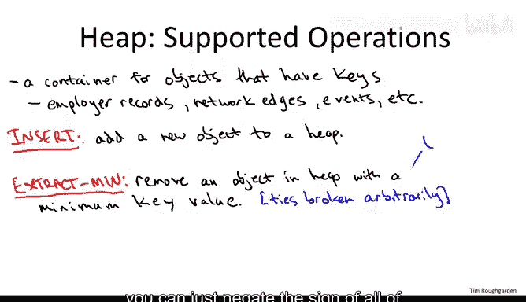
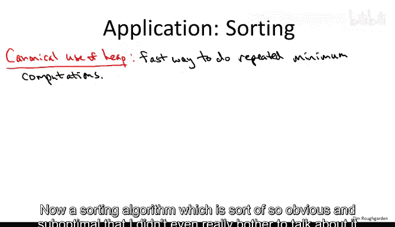
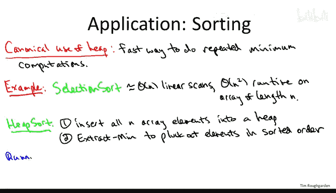
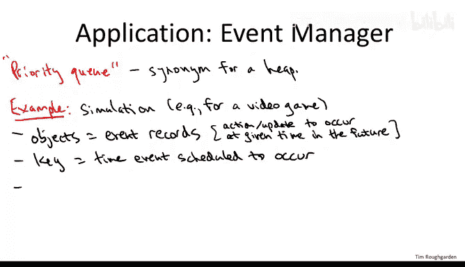
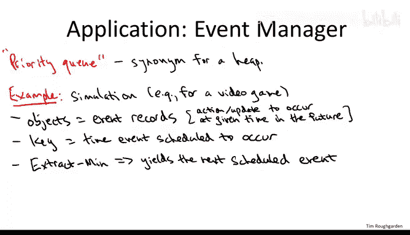
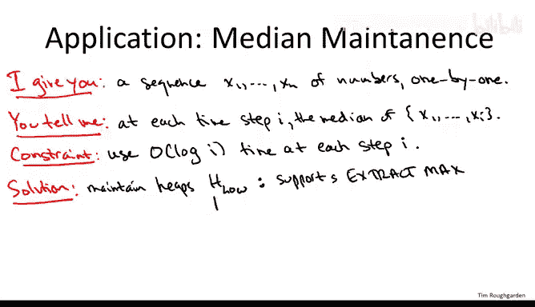
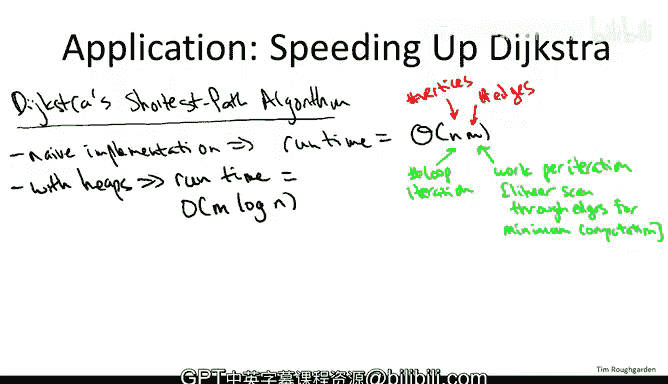

# 斯坦福大学《算法（分治／排序／搜索／随机算法、图搜索／最短路径／数据结构、贪心算法／最小生成树／动态规划、最短路径／NP）｜Algorithms》中英字幕 - P59：15_03_03_堆的操作与应用.zh_en - GPT中英字幕课程资源 - BV1Rx4y1U7sZ

So in this video we'll start talking about the heEAP data structure。

 so in this video I want to be very clear on what are the operations supported by a heEAP。

 what running time guarantees you can expect from canonical implementations。

 and I want you to get a feel for what kinds of problems they are useful for in a separate video we'll take a peek under the hood and talk a little bit about how heaps actually get implemented。

 but for now let's just focus on how to use them as a client。

So the number one thing you should remember about a given data structure is what operations it supports and what is the running time you can expect from those operations。

 so basically a heap supports two operations there's some bells and whistles you can throw on。

 but the two things you got to know is insertion and extract mint。

All so the first thing I have to say about a heap is that it's a container for a bunch of objects and each of these objects should have a key。

 like a number so that for any given objects you can compare their keys and say one key is bigger than the other key。

So for example， maybe the objects are employee records and the key is Social Security numbers。

Maybe the objects are the edges of a network and the keys are something like the length or the weight of an edge。

Maybe each object indicates an event and the key is the time at which that event is meant to occur。

Now the number one thing you should remember about a given data structure is first of all。

 what are the operations that it supports and second of all。

 what is the running time you can expect from those operations for a heap essentially there's two basic operations。

 insert and extract the objects that has the minimum key value。

So in our discussion of heaps we're going to allow ties。

 they're pretty much equally easy with or without ties。

 so when you extract min from a heap that may have duplicate key values。

 then there's no specification about which one you get。

 you just get one of the objects that has a tide for the minimum key value。

Now of course there's no special reason that I chose to extract the minimum rather than the maximum。

 either you can have a second notion of a heap which is a max heap。

 which always returns the object of a maximum key value or if all you have at your disposal is one of these extract min type heaps you can just negate the sign of all of the key values before you insert them and then extract min will actually extract the max key value so just to be clear I'm not proposing here a data structure that supports simultaneously an extract min operation and an extract max operation if you wanted both of those operations it' would be data structures that would give it to you probably a binary search tree is the first thing you' want to consider so I'm just saying you can have a heap of one of two flavors。

 either the heap supports extract min and not extract max or the heap will support extract max and not extract min。

So I mentioned that you should remember not just the supported operations of a data structure。

 but what is the running time of those operations now for the heat。

 the way it's canonically implemented， the running time you should expect is logarithmic in the number of items in the heat and it's log base two with quite good constants。

So when you think about heaps， you should absolutely remember these two operations Oply。

 there's a couple of things about heaps that might be worth remembering。

Some additional operations that they can support。So the first is an operation called HePAphi。

 like a lot of the other stuff about heaps it has a few of their names as well。

 but I'm going to call it hePAphi one standard name。

And the point of heap ofify is to initialize a heap in linear time Now if you have n things and you want to put them all on the heap。

 obviously you could just invoke insert once per each object， if you have n objects。

 it seems like that would take n times log n time log n for each of the n inserts。

 but there's a slick way to do them in a batch which takes only linear time。

 so that's the heap ofify operation。And another operation which can be implemented。

 although there are some subtleties， is you can delete not just the minimum。

 but you can delete an arbitrary element from the middle of a heap again in logarithmic time。

 I mentioned this here primarily because we're going to use this operation when we use heaps to speed up Dyxtra's algorithm。

So that's the gist of a heap， you maintain objects that have keys。

 you can insert in logarithmic time and you can find the one with the minimum key in logarithmic time。

 so let's turn to applications， I'll give you several。

 but before I dive in any one application let me just say what's the general principle what should trigger you to think that maybe you want to use a he data structure in some task。

So the most common reason to use a heap is if you notice that your program is doing repeated minimum computations。

 especially via exhaustive search。And most of the applications that we go through will have this flavor。

 there'll be a naive program which does a bunch of repeated minimums using just brute force search and we'll see that a very simple application of a heap will allow us to speed it up tremendously。

 so let's start by returning to the mother of all computational problems， sorting an unsorted array。

Now a sorting algorithm which is sort of so obvious and suboptimal that I didn't even really bother to talk about it at any other point in the course is selection sort。

What you do in selection sort， you do is scan through the unsorted array。

 you find the minimum element， you put that in the first position。

 you scan through the other n-1 elements， you find the minimum among them。

 you put that in the second position， you scan through the remaining n minus2 unsorted elements you find the minimum you put in the third position and so on。

 So evidently this sorting algorithm does a linear number of linear scans through this array。

 so this is definitely a quadratic time algorithm， that's why I didn't bother to tell you about it earlier。

So this certainly fits the bill as being a bunch of repeated minimum computations or for each computation。

 we're doing exhaustive search， so this we should just a light bulb should go off and say aha。

 can we do better using a heAP data structure and we can and the sorting algorithm that we get is called HeapSo。

And given a heat data structure， the sorting algorithm is totally trivial。

 we just insert all of the elements from the array into the heap。

 then we extract the minimum one by one from the first extraction。

 we get the minimum of all n elements， the second extraction gives us the minimum of the remaining n minus-1 elements and so on。

 so when we extract min1 by one we can just populate a sorted array from left to right boom we're done。

What is the running time of Heap sort？Well， we insert each element once and we extract each element once so that's two n he operations and what I promised you is that you can count on heaps being implemented so that every operation takes logarithmic time。

 so we have a linear number of logarithmic time operations for a running time of N log n。

So let's take a step back and appreciate what just happened。

 We took the least imaginative sorting algorithm possible selection sort。

 which is evidently  quadratic time。 We recognized the pattern of repeated minimum computations。

 we swapped in the he data structure and boom， we get an n log n sorting algorithm which is just two trivial lines and remember N log N is a pretty good running time for a sorting algorithm This is exactly the running time we had from merge sort。

 this was exactly the average running time we got from randomized Quick sort。 Moreover。

 heap sort is a comparisonbased sorting algorithm， we don't use any data about the key elements we just use it as a totally ordered set and as some of you may have seen in an optional video there does not exist a comparisonbased sorting algorithm with running time better than N log N So for the question can we do better the answer is no if we use a comparisonbased sorting algorithm like heap sort。

So that's pretty amazing。 All we do was swap in a heap at the running time drops from the really quite unsatisfactory quadratic to the optimal n log in Moreover。

 heapster its a pretty practical sorting algorithm。 You run this， It's gonna to go really fast。

 Is it as good as Quick sort maybe not quite， but it's close， It's getting into the same ballpark。

So let's look at another application， which frankly in some sense is almost trivial。

 but this is also a canonical way in which heaps are used。And in this application。

 it will be natural to call a heap by a synonymous name， a priority queue。

So what I want you to think about for this example is that you've been tasks with writing software that performs a simulation of the physical world。

 so you might pretend， for example， that you're helping write a video game which is for basketball。

Now， why would a heatap come up in a simulation context。

 well the objects in this application are going to be events records。So an event might be。

 for example， that the ball will reach the hoop at a particular time and that would be because a player shot it a couple seconds ago when if for example。

 the ball hits the rim that could trigger another event to be scheduled for the near future。

 which is that a couple players are going to vie for the rebound。

That event in turn could trigger the scheduling of another event。

 which is one of these players commiting over the back foul on the other one and knocks them to the ground。

 that in turn could trigger another event which is the player that got knocked on the ground gets up and argues the foul call and so on。

So when you have event records like this， there's a very natural key， which is just the timetamp。

 the time at which this event in the future is scheduled to occur。

Now clearly a problem which has to get solved over and over and over again in this kind of simulation is you have to figure out what's the next event that's going to occur。

 you have to know what other events to schedule， you have to know how to update the screen and so on So that's a minimum computation so a very silly thing you could do is just maintain an unordered list of all of the events that have ever been scheduled and do a linear past through them and compute the minimum but you're going to be computing minimums over and over and over again so again that light bulb should go on and you could say maybe a heap is just what I need for this problem and indeed it is So if you're storing these event records in a heap with the key being the timestamps then when you extract min and the heap hands for you on a silver platter using only logarithmic time exactly which event is going to occur next。

So let's move on to a less obvious application of heaps。

 which is a problem I'm going to call median maintenance。

The way that this is going to work is you and I are going to play a little game。

 so on my side what I'm going to do is I'm going to pass you index cards one at a time when there's a number written on each index card。

Your responsibility is to tell me at each time step the median of the numbers that I've passed you so far so after I've given you the first 11 numbers。

 you should tell me as quickly as possible the sixth smallest after I've given you 13 numbers you should tell me the seventh smallest and so on Moreoverover we know how to compute the median in linear time but the last thing I want is for you to be doing a linear time computation every single time step right I only give you one new number do you really have to do linear time is to recompute the median if I just gave you one new number。

So to make sure that you don't run a linear time selection algorithm every time I give you one new number。

 I'm going to put a budget on the amount of time that you can use at each time step to tell me immediate and it's going to be logarithmic in the number of numbers that' passed you so far。

 so I encourage you to pause the video at this point and spend some time thinking about how you would solve this problem。

All right， so hopefully you've thought about this problem a little bit， so let me give you a hint。

What if you use two heaps， do you see a good way to solve this problem then？All right。

 so let me show you a solution to this problem that makes use of two heaps。

So the first he we'll call H low。This he supports extract max。

 remember we discussed that a heap you could pick whether it supports extract men or extract max。

 you don't get both， but you can get either one， it doesn't matter。

And then we'll have another keep H high， which supports extract min。And the key idea。

Is to maintain the invariant that the smallest half of the numbers that you've seen so far are all in the low heatap and the largest half of the numbers that you've seen so far are all in the high heat。

So， for example， after you've seen the first 10 elements。

 the smallest five of them should reside in H low and the biggest five of them should reside in H high after you've seen 20 elements。

 then the bottom 10， the smallest 10 should should reside in H low and the largest 10 should reside in H high。

 if you've seen an odd number， either one can be bigger， it doesn't matter。

 So if you have 21 either the smallest 10 and the one and the biggest 11 and the other or vice versa。

 it's not not important。

Now， given this key idea of splitting the elements in half， according to the two heaps。

 you need two realizations， which I'll leave for you to check。So first of all。

 you have to prove you can actually maintain this invariant with only O of log I work and step I second of all。

 you have to realize this invariant allows you to solve the desired problem。

So let me just quickly talk through both of these points and then you can think about it in more detail on your own time。

 So let's start with the first one。 How can we maintain this invariant using only log I work at time step I this is a little tricky So let's suppose we've already processed the first 20 numbers and the smallest 10 of them we've all worked hard to put only in H low and the biggest 10 of them we've worked hard to put only in H high now here's a preliminary observation What's true so what do we know about the maximum element in H low well these are the 10th smallest overall and the maximum then is the biggest of the 10 smallest so that would be the 10th order statistic So the 10th smallest overall Now what about in the high heap。

 what is its minimum value or those are the biggest 10 values So the minimum of the 10 biggest values would be the 11th order statistic okay so the maximum of H low is the 10th order statistic。

 the minimum of H high is the 11th order statistic they're right next to each other these are in fact the two medians。

Right now so when this new element comes in， the 21st element comes in。

 we need to know which heap to insert it into and well just if it's smaller than the 10th order statistic。

 then it's still going to be in the bottom then it's in the bottom half of the elements and needs to go in the low heap if it's bigger than the 11th order statistic if it's bigger than the minimum value of the high heat then that's where it belongs in the high heatap if it's wedged in between the 10th and 11th order statistics。

 it doesn't matter we can put it in either one， this is the new median anyways。

Now we're not done yet with this first point because there's a problem with potential imbalance so imagine that the 21st element comes up and it's less than the maximum of the low heap so we stick it in the low heap and now that has a population of 11 and now imagine the 22nd number comes up and that again is less then the maximum element in the low heap so again we have to insert it in the low heap now we have 12 elements in the low heap but we only have 10 in the right heap so we don't have a 5050 split of the numbers but we can easily rebalance we just extract the max from the low heap and we insert it into the high heap and boom now they both have 11 and the low heap has the smallest 11 and the high heap has the biggest 11 so that's how you maintain the invariant that you have this 5050 split in terms of the small and the high and between the two heaps you check where it lies with respect to the max of the low heap and the min of the high heap you put in the appropriate place and whenever you need to do some rebalancing。

 you do some rebalancing and this uses only a constant。of he operations when a new number shows up。

 so that's log I work。So now given this discussion， it's easy to see the second point。

 given that this invariant is true at each time step， how do we compute the median。

 well it's going to be either the maximum of the low heat and or the minimum of the high heat。

 depending on whether eye is even or odd， if it's even both of those are medians， if eye is odd。

 and then it's just whichever heat has one more element than the other one。

So the final application we'll talk about in detail in a different video。

 a video concerned with the running time of Dster's shortest path algorithm。

 but I do want to mention it here as well just to reiterate the point of how careful use of data structures can speed up algorithms。

 especially when you're doing things like minimum computations in an inner loop。

So D your Str' path algorithm， hopefully many of you have watched that video at this point。

 but basically what it does is it has a central while loop and so it operates once per vertex of the graph。

 and at least naively it seems like what each iteration of the while loop does is an exhaustive search through the edges of the graph computing a minimum。

So if we think about the work performed in this naiveval implementation it's exactly in the wheelhouse of a heap right so what we do in each of these luit iterations is do an exhaustive search computing a minimum you see repeated minimum computations a light box should go off and you should think a maybe a heap can help and heat can help indexer's algorithm the details are a bit subtle and they're discussed in the separate video that the upshot is we get a tremendous improvement in the running time so recalling that M denotes the number of edges。

And N denotes the number of vertices of a graph。With the careful deployment of heaps in Dchester's algorithm。

 the runtime drops from this really rather large polynomial。

 the product of the number of vertices and the number of edges。

Down to something which is almost linear time。Namely O of M， log n。

Where M is the number of edges and n is the number of vertices。

 so the linear time here would be of M linear in the number of edges。

 we're picking up an extra log factor， but still this is basically as good as sortic。

 so this is a fantastically fast shortest path algorithm certainly way。

 way better than what you get if you don't use heaps and just do repeated exhaustive searches for the minimum。

So that wraps up our discussion of what I think you really want to know about heEapPS。

 namely what are the key operations that it supports。

 what is the running time you can expect from those operations。

 what are the types of problems that the data structure will yield speedups for and a suite of applications for those of you that want to take it to the next level and see a little bit about the guts of the implementation。

 there is a separate optional video that talks a bit about that。

