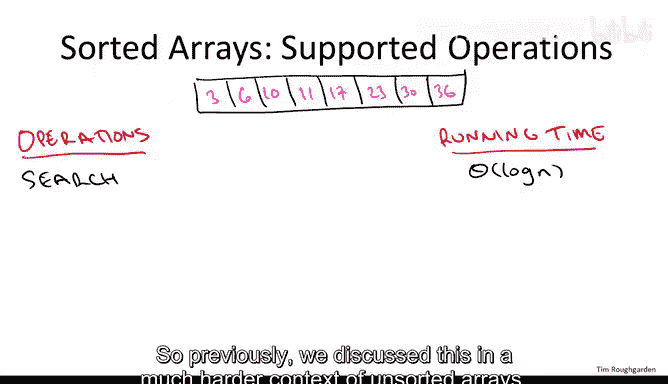
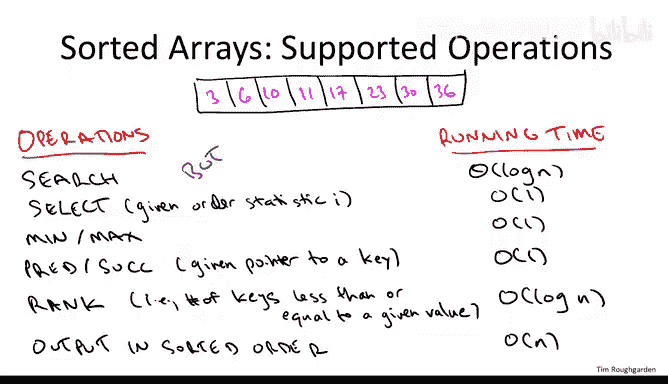
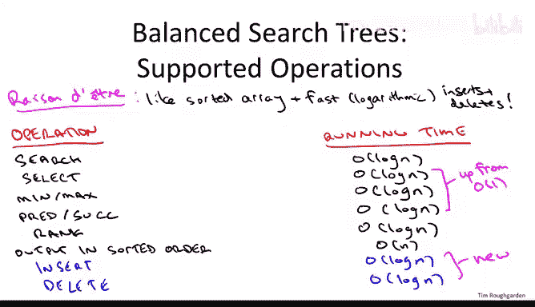

# 算法与数据结构：17：平衡搜索树操作与应用 🧮

在本节课中，我们将要学习一种非常重要的数据结构——平衡二叉搜索树。我们将从用户的角度出发，了解它能提供哪些操作，然后深入其内部实现，理解这些操作为何具有特定的时间复杂度。

## 概述

平衡二叉搜索树可以被视为一个“动态的”有序数组。它不仅能支持在有序数组上可以进行的几乎所有操作，还能高效地处理数据的插入和删除，从而适应动态变化的数据集。

## 有序数组支持的操作

为了理解平衡二叉搜索树的价值，我们先回顾一下，当数据存储在一个有序数组中时，我们可以轻松完成哪些操作。

以下是几个关键操作：



1.  **搜索**：使用二分查找算法，可以在对数时间内完成搜索。其核心思想是每次比较后，将搜索范围缩小一半。
    ```python
    # 伪代码示例：二分查找
    def binary_search(arr, target):
        low, high = 0, len(arr) - 1
        while low <= high:
            mid = (low + high) // 2
            if arr[mid] == target:
                return mid
            elif arr[mid] < target:
                low = mid + 1
            else:
                high = mid - 1
        return -1  # 未找到
    ```

2.  **选择**：给定一个顺序统计量 `i`（例如寻找第 `i` 小的元素），在有序数组中，这可以在常数时间内完成，只需返回数组第 `i` 个位置的元素。寻找最小值和最大值是选择问题的特例。

3.  **前驱与后继**：给定一个元素，寻找其前一个（更小）或后一个（更大）的元素。在有序数组中，这只需向前或向后移动一个索引，是常数时间操作。

4.  **排名**：查询有多少个键值小于或等于给定的键。这可以通过搜索该键并查看其终止位置来实现，时间复杂度为 `O(log n)`。

5.  **顺序输出**：按从小到大的顺序输出所有元素。只需从左到右扫描数组即可，时间复杂度为 `O(n)`。

## 从静态到动态：平衡二叉搜索树的优势

上一节我们介绍了有序数组支持的各种高效操作。然而，有序数组在处理动态数据时存在瓶颈。



主要问题在于，为了在有序数组中插入或删除一个元素并保持有序性，通常需要移动大量元素，导致线性时间复杂度 `O(n)`。这在频繁更新的场景下是不可接受的。

平衡二叉搜索树的设计目标，正是要在支持上述所有丰富操作的同时，还能高效地处理插入和删除。

## 平衡二叉搜索树的操作与性能

平衡二叉搜索树在动态环境中提供了与有序数组相媲美的功能集，并加入了高效的更新操作。

以下是它支持的操作及其时间复杂度（`n` 为树中元素数量）：

*   **搜索**：`O(log n)`。与有序数组的二分查找效率相同。
*   **选择**：`O(log n)`。相比有序数组的常数时间略有牺牲，但仍然很快。
*   **最小值/最大值**：`O(log n)`。通常通过跟踪树的最左或最右节点来实现。
*   **前驱/后继**：`O(log n)`。相比数组的常数时间有所增加。
*   **排名**：`O(log n)`。与有序数组效率相同。
*   **顺序输出**：`O(n)`。通过中序遍历实现，效率与数组相同。
*   **插入**：`O(log n)`。这是相比静态数组的关键优势。
*   **删除**：`O(log n)`。同样是处理动态数据的关键优势。

核心公式可以概括为：**平衡二叉搜索树 ≈ 有序数组的功能 + `O(log n)` 时间的插入与删除**。

## 与其他数据结构的比较

平衡二叉搜索树功能强大，但并非所有场景下的最优解。选择数据结构时，需根据具体需求权衡。

以下是几种数据结构的简要对比：

*   **有序数组**：如果数据集是静态的，不需要插入和删除，那么有序数组是实现所有查询操作的最快选择。
*   **堆**：如果核心需求仅是快速插入、删除以及获取最小（或最大）值（例如实现优先队列），那么堆是更简单、常数因子更优的选择。堆不能同时高效获取最小和最大值，也不支持基于键值的复杂查询。
*   **哈希表**：如果只需要快速的插入、查找和删除，而不关心元素之间的顺序关系（如最小值、排名、顺序遍历等），那么哈希表能提供平均情况下的常数时间操作，是更高效的选择。



因此，当你需要一个**功能全面**（支持基于顺序的各种查询）且**动态**（支持高效更新）的数据结构时，平衡二叉搜索树往往是理想的选择。

## 总结

本节课中我们一起学习了平衡二叉搜索树的核心价值与应用场景。我们了解到，它通过巧妙的树形结构和平衡机制，在动态数据集中实现了近乎有序数组的全部查询功能，同时保证了插入和删除操作的高效性。虽然在某些特定操作上不如更专门的数据结构（如堆或哈希表）快，但其功能的全面性使其成为处理需要维护顺序信息的动态数据集时的强大工具。在接下来的课程中，我们将深入探讨其实现原理。