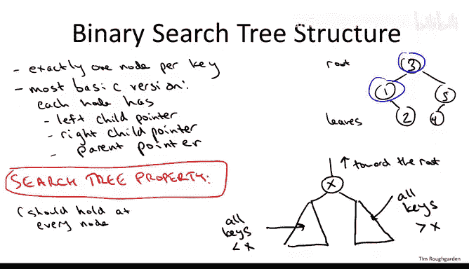
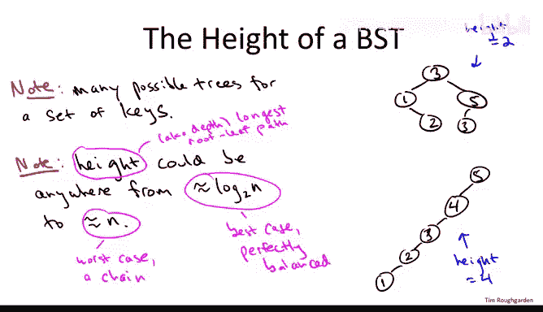
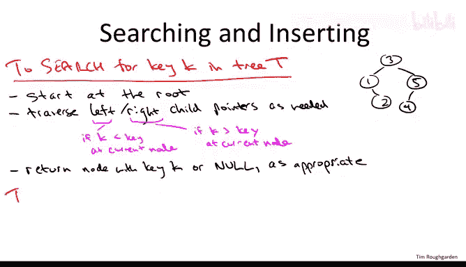

# 算法：18：二叉搜索树基础 - 第一部分 🌲

在本节课中，我们将要学习二叉搜索树的基础知识。我们将了解其核心概念、基本结构以及如何实现搜索和插入操作。请注意，本节课不涉及树的平衡性，那将是后续课程的内容。

---

## 二叉搜索树的动机 🎯

上一节我们介绍了数据结构的基本概念，本节中我们来看看为什么需要二叉搜索树。本质上，平衡的二叉搜索树是**有序数组的动态版本**。

它几乎能完成有序数组的所有操作，虽然时间可能稍长，但依然非常快。更重要的是，它是动态的，支持插入和删除操作。在有序数组中，每次插入或删除都可能需要线性时间，这在大多数应用中代价过高。相比之下，在（平衡的）搜索树中，你可以在对数时间内完成插入、删除和搜索，这与有序数组的二分查找效率相当。此外，你还可以解决选择问题（如查找最小/最大值），虽然不像有序数组那样是常数时间，但对数时间仍然很好。你还可以线性时间（每个元素常数时间）按序输出所有键值。

---

## 二叉搜索树的结构 🏗️

现在我们已经了解了二叉搜索树的优势，接下来看看它是如何组织的。本节内容对平衡和非平衡的搜索树都适用。

二叉搜索树的核心要素如下：
*   树中的每个**节点**对应一个存储的**键**。通常，节点还包含一个指向更多关联数据的指针。
*   节点之间通过**指针**连接。为简化起见，我们假设每个节点有三个指针：一个指向**左子节点**，一个指向**右子节点**，一个指向**父节点**。这些指针可以为空（`null`）。

以下是二叉搜索树最根本的属性，我们称之为**搜索树属性**：

> 对于树中的任意节点，设其键值为 **x**，则其**左子树**中所有节点的键值都**小于 x**，其**右子树**中所有节点的键值都**大于 x**。

此属性在树的**每个节点**都必须成立。上述定义假设键值互异。若允许重复键值，只需约定如何处理相等情况，例如规定左子树键值**小于或等于**当前节点键值，右子树键值**严格大于**当前节点键值。

搜索树属性确保了搜索的简易性。例如，如果你在根节点为17的树中搜索23，由于23 > 17，根据属性，23只可能存在于右子树中，因此你可以立即忽略整个左子树。这非常类似于二分查找的思想。

需要注意的是，搜索树属性与堆属性不同。堆属性（如最小堆要求父节点小于子节点）是为了快速提取最小元素，而搜索树属性是为了高效搜索。

---

## 搜索树的高度变化 📊

理解二叉搜索树的一个重要点是，对于同一组键值，可以存在许多不同的、都满足搜索树属性的树结构，它们的高度可能差异很大。

**树的高度**（或称深度）是指从根节点到最远叶节点所经过的边数（或跳数）。

*   **最佳情况**：树是完美平衡的，高度约为 **O(log n)**。
*   **最坏情况**：树退化成一条链（例如所有节点只有左子节点或只有右子节点），高度为 **O(n)**。

高度的差异直接影响操作效率，这也是后续课程中需要实现平衡机制（如AVL树、红黑树）的原因。

---

## 基本操作实现 ⚙️

了解了二叉搜索树的基本结构后，我们现在可以讨论如何实现其支持的各种操作。以下将给出高级描述，足以指导你自己编写代码。

### 搜索操作

搜索操作直接利用了搜索树属性，过程非常直观。

1.  从**根节点**开始。
2.  比较当前节点键值 **x** 与目标键值 **k**：
    *   如果 **k == x**，搜索成功，返回该节点。
    *   如果 **k < x**，根据属性，目标只可能在**左子树**中。沿左子指针递归搜索左子树。
    *   如果 **k > x**，根据属性，目标只可能在**右子树**中。沿右子指针递归搜索右子树。
3.  搜索在两种情况下终止：
    *   找到目标节点（成功）。
    *   遇到**空指针**（`null`），表示目标不在树中（失败）。

### 插入操作

插入操作建立在搜索的基础上。我们先考虑键值互异的情况。

1.  首先，**搜索**待插入的键值 **k**。由于无重复，此次搜索必定失败，并终止于一个空指针。
2.  在此次失败搜索终止的**空指针**位置，创建新节点存储 **k**，并将该空指针（来自其父节点）指向新节点。

如果允许重复键值，只需对插入逻辑稍作调整。例如，当搜索过程中遇到键值等于 **k** 的节点时，可以约定继续在其左子树（或右子树）中搜索，直到遇到空指针，再将新节点插入该位置。

一个值得思考的练习是：按照此过程插入新节点后，树是否仍然保持搜索树属性？答案是肯定的。

---

## 总结 📝

本节课中我们一起学习了二叉搜索树的基础知识。我们了解了其作为动态有序数组替代品的动机，掌握了其核心的**搜索树属性**，认识了树结构的高度可变性，并初步探讨了**搜索**和**插入**两个基本操作的高层实现逻辑。这些是理解更复杂平衡树结构的重要基石。在接下来的课程中，我们将深入探讨删除、遍历等其他操作，以及如何保持树的平衡。