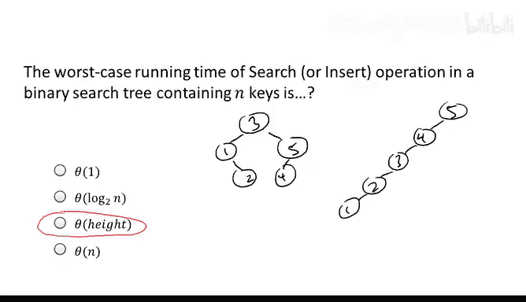
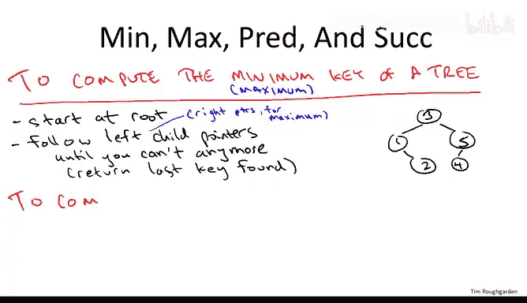
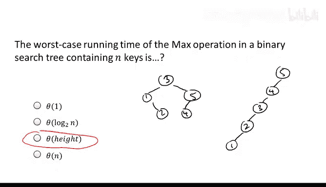
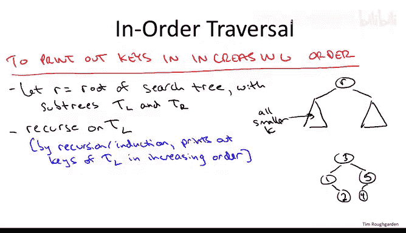
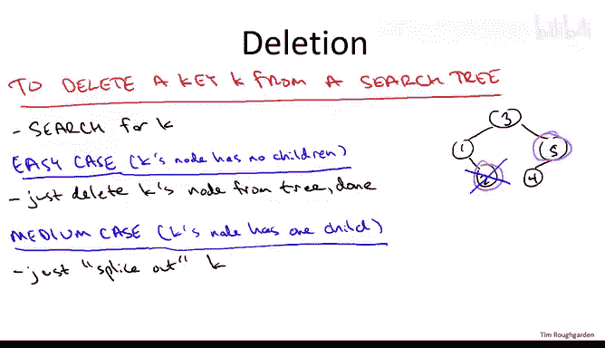
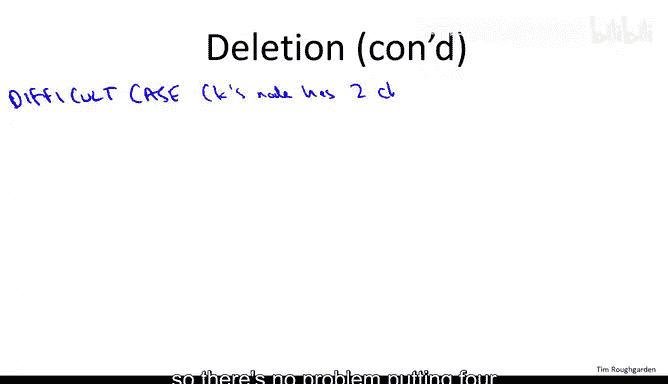
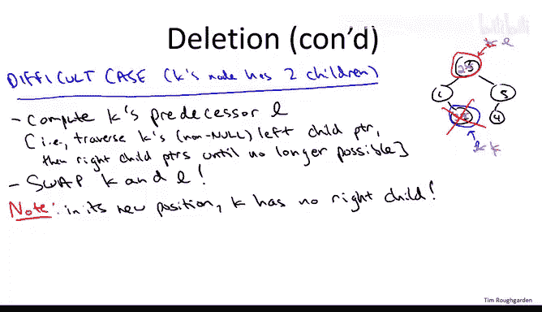
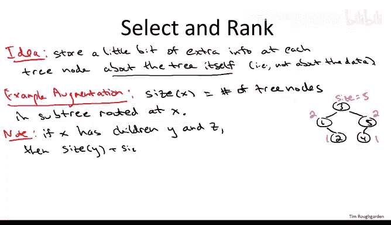
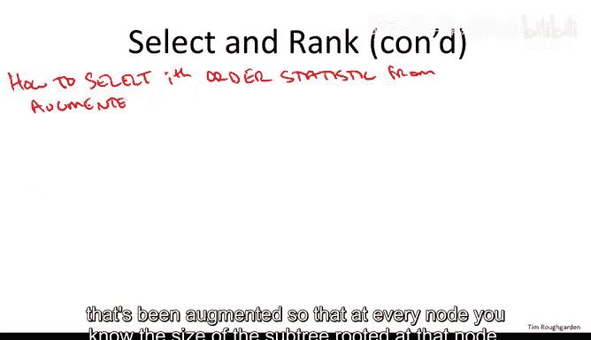
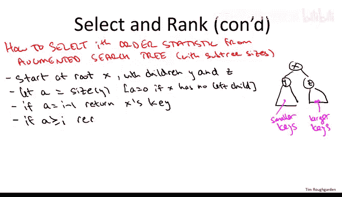

# 算法：19_03_03：二叉搜索树基础 - 第二部分 🧮

在本节课中，我们将继续学习二叉搜索树，深入探讨其核心操作，包括查找、插入、删除、遍历以及如何高效地计算顺序统计量（如第k小元素）。我们将分析这些操作的运行时间，并理解树的高度如何成为影响性能的关键因素。

## 搜索与插入的运行时间分析 ⏱️

上一节我们介绍了二叉搜索树的搜索和插入操作。本节中我们来看看这些操作在最坏情况下的运行时间取决于什么。

以下是一个包含n个不同键的搜索树的四个参数，哪一个决定了搜索或插入操作的最坏情况时间？

1.  树中节点的总数 `n`
2.  树中叶子节点的数量
3.  树的高度 `h`
4.  树中内部节点的数量

正确答案是第三个：**树的高度 `h`** 决定了搜索或插入操作的最坏情况时间。这意味着仅仅知道键的数量 `n` 不足以推断最坏情况的搜索时间，还必须了解树的结构。

为了理解这一点，让我们回顾之前用过的两个例子。一个例子是平衡良好的树，另一个例子虽然包含完全相同的五个键，但极度不平衡，本质上像一个链表。



在任何搜索树中，执行搜索或插入操作的最坏情况时间，与从根节点出发，沿着左或右子节点指针，直到遇到空指针所需跟随的最大指针数量成正比。当然，在成功的搜索中，你会在遇到空指针之前终止，但在最坏情况下（或插入操作中），你会一直走到空指针。


*   在左边的平衡树中，你最多跟随三个这样的指针。例如，搜索 `2.5` 时，你会跟随一个左指针，然后一个右指针，再一个右指针，然后遇到空指针，总共跟随了三个指针。
*   在右边的不平衡树中，你可能需要跟随多达五个指针。例如，搜索键 `0` 时，你会连续遍历五个左指针，最后才遇到末尾的空指针。

因此，运行时间不是常数。在最坏情况下，你必须到达树的底部。如果你有一个像左边那样平衡良好的二叉搜索树，运行时间将与键的数量 `n` 的对数成正比。如果你有一个像右边那样糟糕的搜索树，运行时间将与键的数量 `n` 成正比。一般来说，搜索或插入时间将与树的高度 `h`（即从根节点到叶子节点所需的最大跳数）成正比。

## 更多支持的操作：最小值、最大值、前驱与后继 🔍

现在让我们继续探讨搜索树支持、但堆和哈希表等动态数据结构不支持的一些操作。

首先是最小值和最大值操作。相比之下，在堆中，你可以轻松找到最小值或最大值，但不能同时轻松找到两者。而在搜索树中，可以非常容易地找到最小值或最大值。

### 查找最小值



一种思考方式是：在搜索树中搜索负无穷大。你从根节点开始，持续跟随左子节点指针，直到用完为止（即遇到空指针）。你访问的最后一个键必然是树中的最小键。

原因如下：假设从根节点开始。如果根节点不是最小值，那么最小值必然在左子树中。于是你跟随左子节点指针，然后重复这个论证。如果你还没有找到最小值，那么相对于当前位置，它必然在左子树中。你只需迭代，直到无法再向左移动为止。

例如，在我们的示例搜索树中，如果我们持续跟随左子节点指针，会从 `3` 开始，走到 `1`，然后尝试从 `1` 向左走，遇到空指针，于是返回 `1`，而 `1` 确实是这棵树中的最小键。

### 查找最大值

既然我们已经介绍了如何计算最小值，那么如何计算最大值也就不难猜到了。当然，要计算最大值，我们只需对称地跟随右子节点指针，这保证能找到树中的最大键。这就像搜索键值正无穷大一样。

### 查找前驱

前驱操作是指：给定树中的一个键（元素），找到比它小的下一个最大元素。例如，`3` 的前驱是 `2`，`2` 的前驱是 `1`，`5` 的前驱是 `4`，`4` 的前驱是 `3`。

计算前驱有两种情况：一种非常简单，另一种稍显复杂。

**简单情况**：当键为 `K` 的节点拥有非空的左子树时。在这种情况下，你只需要找到该节点左子树中的最大元素。这就是 `K` 的前驱。

我们可以通过检查示例中拥有左子树的节点来验证这一点。实际上，只有两个节点拥有非空左子树：`3` 和 `5`。`3` 的左子树中的最大键是 `2`，这确实是 `3` 的前驱。`5` 的左子树只包含元素 `4`，该子树中的最大值也是 `4`，这确实是整个搜索树中 `5` 的前驱。

**较复杂情况**：当键为 `K` 的节点根本没有左子树时。此时，左子指针为空，无法提供帮助。右子指针对于计算前驱也毫无用处，因为根据搜索树的定义，右子树只包含大于 `K` 的键。因此，要找到前驱，我们必须跟随父指针，可能不止一个。

为了说明如何跟随父指针，让我们看看右边示例搜索树中的几个例子。

*   从节点 `2` 开始。我们跟随它的父指针到达 `1`，而 `1` 正是 `2` 在这棵树中的前驱。所以计算 `2` 的前驱似乎只需要跟随一次父指针。
*   从节点 `4` 开始。我们跟随它的父指针到达 `5`，但 `5` 不是 `4` 的前驱，而是后继。我们再跟随一次父指针，到达 `3`。所以，从 `4` 开始，我们需要跟随两次父指针。

关键在于，你只需持续跟随父指针，直到到达一个键值小于你起始键值的节点。此时你可以停止，该节点保证就是前驱。

另一种理解终止条件的方式是：当你第一次“左转”时停止。即，当你从一个节点移动到其父节点，并且该节点是其父节点的右子节点时。在从 `2` 开始的例子中，我们第一次移动就是左转（`2` 是 `1` 的右子节点），我们一步就找到了前驱。在从 `4` 开始的例子中，第一步是右转（`4` 是 `5` 的左子节点），但下一步我们左转，就到达了一个小于起始点 `4` 的节点。

这两种关于终止条件的描述本质上是相同的。鼓励你仔细思考为什么它们是完全相同的停止条件。

其他细节：
*   如果你从没有前驱的唯一节点（即最小值节点）开始，你将永远不会触发这个终止条件。例如，从搜索树中的节点 `1` 开始，不仅左子树为空（意味着你应该开始遍历父指针），而且当你遍历父指针时，你只会向右移动，永远不会左转。这就是你检测到自己处于搜索树最小值的方式。
*   如果你想计算一个键的后继而不是前驱，显然只需在整个描述中交换“左”和“右”即可。

以上是关于搜索树中各种排序操作（最小值、最大值、前驱和后继）的高层次解释。

### 运行时间分析

现在，让我问你一个与讨论搜索和插入时相同的问题：这些操作在最坏情况下需要多长时间？

答案与之前相同：**与树的高度 `h` 成正比**。解释也完全相同。

为了理解对高度的依赖关系，让我们专注于问题中提到的最大值操作。其他三个操作的最坏情况运行时间与高度成正比，原因完全相同。

最大值操作是做什么？从根节点开始，持续跟随右子节点指针，直到用完为止（遇到空指针）。因此，运行时间不会比最长路径（从根节点到某个叶子节点的特定路径）更长。另一方面，从根节点到最大键的路径很可能就是树中最长的路径，它可能决定了搜索树的高度。

例如，在我们不平衡的例子中，对于最小值操作来说，这是一棵糟糕的树。如果你在这棵树中寻找最小值，你将不得不遍历从 `5` 一直到 `1` 的每一个指针。当然，对于最大值操作也存在类似的不利情况，例如 `1` 是根节点，而 `5` 作为叶子节点位于最底部。

## 中序遍历：按序输出所有键 📋



搜索树可以做的另一件事是模仿排序数组的功能：在线性时间内，以每个元素常数时间的代价，按顺序打印出所有键。显然，在排序数组中，这很简单：只需使用一个从数组开头到结尾的 `for` 循环，逐个打印键。

在搜索树中，有一个非常优雅的递归实现可以完成完全相同的事情，这被称为二叉搜索树的**中序遍历**。

和往常一样，你从起点开始，即搜索树的根节点。用一点符号表示：让我们把以 `R` 的左子节点为根的搜索树称为 `T_L`，把以 `R` 的右子节点为根的搜索树称为 `T_R`。

在我们的运行示例中，根节点是 `3`，`T_L` 对应仅包含元素 `1` 和 `2` 的搜索树，`T_R` 对应仅包含元素 `5` 和 `4` 的子树。



记住，我们希望按键值递增的顺序打印键。特别是，我们想打印的第一个键是所有键中最小的。所以我们绝对不想先打印根节点的键。例如，在我们的搜索树示例中，根节点的键是 `3`，我们不想先打印它，我们想先打印 `1`。

那么最小值在哪里？根据搜索树性质，它必然在左子树 `T_L` 中。因此，我们只需递归处理 `T_L`。

通过递归（或者你更喜欢归纳法）的魔力，递归处理 `T_L` 将完成按从小到大的顺序打印 `T_L` 中所有键的任务。

这非常酷，因为 `T_L` 恰好包含所有小于根节点键的键。记住，这是搜索树的性质：所有小于根节点键的键都在左子树中，所有大于根节点键的键都在右子树中。

在我们的具体例子中，第一个递归调用将打印出键 `1` 和 `2`。现在，如果你想一想，这正是打印根节点键的完美时机。我们希望按递增顺序打印所有键。我们已经处理了所有小于根节点键的键，而递归处理右侧将处理所有大于它的键。因此，在两个递归调用之间（这就是它被称为“中序”遍历的原因），我们打印根节点 `R` 的键。

显然，这在我们的具体例子中有效：第一个递归调用打印出 `1` 和 `2`，此时是打印 `3` 的完美时机，然后递归调用将打印出 `4` 和 `5`。更一般地说，对右子树的递归调用将再次通过递归或归纳的魔力，按递增顺序打印出所有大于根节点键的键。

这个伪代码的正确性，即这种所谓的中序遍历确实按递增顺序打印键，可以通过一个相当直接的归纳证明来验证。这与我们在课程早期讨论的分治算法正确性的归纳证明精神非常相似。

### 中序遍历的运行时间

该过程的运行时间是线性的，即 `O(n)`，其中 `n` 是搜索树中键的数量。原因在于，对树中的每个节点恰好有一次递归调用，并且在每次递归调用中只做常数工作。

更详细地说，中序遍历按递增顺序打印键，特别是它恰好打印每个键一次。每个递归调用恰好打印一个键值。因此，恰好有 `n` 次递归调用，而每次递归调用只做一件事（打印），所以是 `n` 次递归调用，每次常数时间，总体运行时间为 `O(n)`。

## 删除操作 🗑️

在大多数数据结构中，删除是最困难的操作，搜索树也不例外。让我们深入探讨删除操作的工作原理。



删除操作有三种不同的情况。首要任务是定位包含键 `K` 的节点，即我们想要删除的节点。例如，假设我们试图从示例搜索树中删除键 `2`。首先需要找出它在哪里。

搜索树中的一个节点可能拥有的子节点数量有三种可能性：它可能没有子节点（0个子节点），可能有一个子节点，也可能有两个子节点。相应地，删除操作的伪代码也将有三种情况。

### 情况一：删除的节点没有子节点（0个子节点）

这是最简单的情况，例如从搜索树中删除键 `2`。在这种情况下，我们可以毫无保留地直接从搜索树中删除该节点。不会出任何问题，因为没有子节点依赖于该节点。



### 情况二：删除的节点有一个子节点

这种情况也不算太糟，例如从搜索树中删除 `5`。你需要做的就是将被删除的节点“剪接”出来，这会在树中留下一个空洞，然后将被删除节点的唯一子节点提升到被删除节点之前的位置。

例如，在我们的五节点搜索树中，如果我们想删除 `5`，我们会把它从树中取出，留下一个空洞，然后我们用它的唯一子节点 `4` 替换原来 `5` 的位置。如果你仔细想想，这工作得很好，因为它保留了搜索树性质。搜索树性质规定，例如右子树中的所有内容都必须大于该节点的键。现在我们把 `4` 作为 `3` 的新右子节点，但 `4` 及其可能拥有的任何子节点原本就是 `3` 的右子树的一部分，所以所有这些内容都必须大于 `3`。因此，将 `4` 及其所有后代作为 `3` 的右子节点没有问题，搜索树性质实际上得到了保留。

### 情况三：删除的节点有两个子节点

这是最困难的情况。在我们的运行示例中，只有当我们想删除根节点，即从树中删除键 `3` 时，才会发生这种情况。问题在于，如果你试图将这个节点从树中撕掉，会留下一个空洞，而且不清楚将任何一个子节点提升到这个位置是否可行。你可以盯着我们的示例搜索树，试着理解如果你试图把 `1` 提升为根节点，或者试图把 `5` 提升为根节点会发生什么问题——问题就会出现。

这与我们在堆中遇到相同问题时的处理方式形成了有趣的对比。因为堆的性质在某些意义上可能不那么严格，当我们想要删除一个有两个子节点的元素时（假设我们想执行提取最小操作），我们只需提升两个子节点中较小的那个。在这里，我们需要更努力一些。实际上，我们将使用一个非常巧妙的技巧，将有两个子节点的情况简化为之前已经解决的0个或1个子节点的情况。

以下是识别我们将对其应用0子节点或1子节点操作的节点的非常巧妙的方法：我们将从键 `K` 开始，计算 `K` 的**前驱**。记住，前驱是树中比 `K` 小的下一个最大键。例如，键 `3` 的前驱是 `2`，这是树中下一个最小的键。

一般来说，让我们称这个前驱为 `L`。这看起来可能有点复杂：我们正在实现一个树操作（删除），却突然调用了另一个树操作（前驱）。在某种程度上你是对的，删除是一个非平凡的操作。但它并不像你想的那么糟糕，原因如下：当我们计算这个前驱时，我们实际上处于前驱操作的**简单情况**中。

回想一下如何计算前驱？这取决于你是否拥有非空的左子树。如果你没有非空左子树，那么你需要向上跟随父指针，直到找到一个键小于你起始键的节点。但如果你有左子树，那就简单了：你只需找到该节点左子树中的最大元素，那必然就是前驱。而找到最大值很容易：你只需持续跟随右子节点指针，直到无法再跟随为止。

这里很酷的一点是，因为我们只在被删除节点拥有两个子节点（因此必然有非空左子树）的情况下才进行此前驱计算，所以当我们说“计算 `K` 的前驱 `L`”时，你所要做的就是跟随 `K` 的左子节点（因为有两个子节点，所以左子节点非空），然后持续跟随右子节点指针，直到无法再跟随为止，那就是前驱 `L`。

现在，实现搜索树删除操作的相当精彩的部分来了：**交换这两个键 `K` 和 `L`**。

例如，在我们的示例搜索树中，我们将在根节点位置放一个 `2`，在原来 `2` 的叶子节点位置放一个 `3`。第一次看到这个操作，你可能会觉得有点疯狂，甚至像是在作弊——我们似乎完全无视了搜索树的规则。实际上，检查一下我们的示例搜索树发生了什么：我们交换了 `3` 和 `2`，但这**不再是一棵搜索树**了！我们有一个 `3` 在 `2` 的左子树中，而 `3` 大于 `2`，这是不允许的，违反了搜索树性质。

我们怎么能这样做呢？我们可以这样做，因为我们**无论如何都要删除 `3`**，所以在一天结束时，我们最终会得到一棵搜索树。我们可能暂时破坏了搜索树性质，但我们已经把 `K` 交换到了一个非常容易摆脱的位置。

我们是如何计算 `K` 的前驱 `L` 的？最终，这是一个寻找最大值的计算，涉及持续跟随右子节点指针直到卡住。`L` 就是我们卡住的地方。“卡住”是什么意思？这意味着 `L` 的右子指针为空。它没有两个子节点，特别是它没有右子节点。

一旦我们将 `K` 交换到 `L` 的旧位置，`K` 现在就没有右子节点了。它可能有也可能没有左子节点。在右边的例子中，它在新的位置也没有左子节点。但一般来说，它可能有一个左子节点，但它肯定没有右子节点，因为那是一个寻找最大值计算卡住的位置。

如果我们想删除一个只有0个或1个子节点的节点，嗯，我们知道该怎么做——我们在上一张幻灯片中已经介绍过。要么直接删除它（这就是我们在运行示例中所做的），要么在 `K` 的新节点确实有一个左子节点的情况下，执行剪接操作：即撕掉包含 `K` 的节点，该节点的唯一子节点将占据该节点之前的位置。

现在，有一个练习（我在这里不做，但强烈鼓励你在私下里仔细思考）是证明这个删除操作保留了搜索树性质。粗略地说，当你进行交换时，你可能会违反搜索树性质（正如我们在例子中看到的），但所有违规都涉及你即将删除的节点。所以一旦你删除了那个节点，就没有其他违反搜索树性质的地方了，因此，你就得到了一棵搜索树。



### 删除操作的运行时间

这次不难猜出运行时间，因为它基本上就是一次前驱计算加上指针重连。就像前驱和搜索操作一样，它**由树的高度 `h` 决定**。

## 选择与排名操作：通过扩充数据结构实现 📊

让我简要介绍一下之前提到的最后两个操作：`select`（选择）和 `rank`（排名）。记住，`select` 就是选择问题：我给你一个顺序统计量，比如 `17`，我希望你返回树中第17小的键。`rank` 是：我给你一个键值，我想知道树中有多少个键小于或等于该值。

为了高效地实现这些操作，我们实际上需要一个小的新想法：**用每个节点的附加信息来扩充二叉搜索树**。所以现在，一个搜索树将不仅包含一个键，还包含关于树本身的信息。

这个想法通常被称为**扩充你的数据结构**。对于搜索树来说，最经典的扩充可能是在每个节点不仅记录键值，还记录以该节点为根的子树中的节点数量。

让我们称这个为 `size(x)`，它是以 `x` 为根的子树中的树节点数量。

为了确保你明白我的意思，让我告诉你示例搜索树中五个节点的 `size` 字段应该是什么。再次记住，我们考虑的是以给定节点为根的子树中有多少个节点，或者等价地说，从该节点跟随子指针可以到达多少个不同的树节点。

*   从根节点开始，当然可以到达所有人。每个人都在以根节点为根的树中，所以那里的 `size` 是 `5`。
*   相比之下，如果你从节点 `1` 开始，你可以到达 `1`，或者你可以跟随右子指针到达 `2`。所以在节点 `1`，`size` 是 `2`。
*   在键值为 `5` 的节点，出于同样的原因，`size` 是 `2`。
*   在两个叶子节点，以叶子节点为根的子树就是叶子本身，所以那里的 `size` 是 `1`。



一旦你知道一个节点的两个子树的 `size`，就有一个简单的方法来计算该节点的 `size`。如果搜索树中的一个给定节点 `x` 有子节点 `y` 和 `z`，那么以 `x` 为根的子树中有多少个节点？嗯，有那些在以 `y` 为根的左子树中的节点，有那些在以 `z` 为根的右子树中的节点，然后还有 `x` 本身。

```
size(x) = size(y) + size(z) + 1
```

一般来说，每当你扩充一个数据结构时（当我们讨论红黑树时会再次谈到），你必须付出代价。你维护的额外数据可能有助于加速某些操作，但每当你有修改树的操作（特别是插入和删除）时，你必须注意保持这些额外数据的有效性，即维护它们。

对于这些子树大小，在插入和删除操作下维护它们相当直接，不会过多影响插入和删除的运行时间，但这确实是你应该离线思考的问题。

例如，当你执行插入操作时，记住它是如何工作的：你本质上进行一次搜索，沿着左和右子指针向下直到树底，遇到空指针，然后在那里插入新节点。现在你需要做的是，沿着那条路径回溯，对所有新插入节点的祖先，将它们的子树大小增加 `1`。




### 实现选择操作

让我们通过展示如何在已扩充的搜索树中实现选择过程（给定一个顺序统计量）来结束本视频。在每个节点，你都知道以该节点为根的子树的大小。

和往常一样，你从起点开始，在搜索树中就是根节点。假设根节点有子节点 `y` 和 `z`。`y` 或 `z` 可能为空，这没问题，我们只需将空节点的 `size` 视为 `0`。

搜索树性质表明：所有小于存储在 `x` 处的键的键，恰好都在 `x` 的左子树中；树中所有大于 `x` 处键的键，恰好都在 `x` 的右子树中。

假设我们被要求找到搜索树中的第 `i` 个顺序统计量，即树中存储的第 `i` 小的键。它会在哪里？我们应该在哪里查找？嗯，这将取决于树的结构，实际上它将取决于子树的大小。这正是我们跟踪它们的原因，以便能够快速做出关于如何导航树的决定。

举一个简单的例子：假设 `x` 的左子树包含，比如说，`25` 个键。记住，`y` 本地知道其子树的确切数量。所以从 `x` 出发，我们可以在常数时间内知道 `y` 子树中有多少个键，假设是 `25`。根据搜索树的定义性质，这些是树中任何地方最小的 `25` 个键。`x` 比它们都大，`x` 的右子树中的所有内容也都比它们大。所以最小的 `25` 个顺序统计量都在以 `y` 为根的子树中。显然，我们应该在那里递归。显然，答案就在那里。因此，我们可以递归处理以 `y` 为根的子树，然后我们在这个新的、更小的搜索树中再次寻找第 `i` 个顺序统计量。

另一方面，假设当我们从 `x` 开始时，我们询问 `y`：你的子树中有多少个节点？也许 `y` 本地存储的数字是 `12`。所以 `x` 的左子树中只有 `12` 个东西。好吧，`x` 本身比它们都大，所以 `x` 将是第 `13` 大的顺序统计量。它是树中第 `13` 大的元素。其他所有东西都在右子树中。所以特别是，第 `i` 个顺序统计量将在右子树中。因此，我们将在右子树中递归。现在，我们在寻找什么？我们不再寻找第 `i` 个顺序统计量了。最小的 `12` 个东西都在 `x` 的子树中，`x` 本身是第 `13` 小的。所以我们在寻找剩余元素中第 `(i - 12 - 1)` 小的。这种递归非常类似于我们在课程早期讨论的分治选择算法。

为了填充更多细节，让 `a` 表示 `y` 处的子树大小。如果 `x` 没有左子节点，我们将 `a` 定义为 `0`。

超级幸运的情况是，当左子树中恰好有 `i - 1` 个节点时，这意味着这里的根节点 `x` 本身就是第 `i` 个顺序统计量。记住，它比左子树中的所有东西都大，比右子树中的所有东西都小。

但在一般情况下，我们要么在左子树递归，要么在右子树递归。
*   当左子树的数量足够大，保证它包含了第 `i` 个顺序统计量时，我们在左子树递归。这恰好发生在它的 `size` 至少为 `i` 时，因为左子树拥有搜索树中任何地方最小的键。
*   在最后一种情况下，当左子树太小，不仅不包含第 `i` 个顺序统计量，而且 `x` 也太小，不是第 `i` 个顺序统计量时，我们在右子树递归，知道我们已经丢弃了原始树中任何地方最小的 `a + 1` 个键值。

这个过程的正确性与我们早期讨论的选择算法的归纳正确性几乎完全相同。实际上，搜索树的根节点充当了一个枢轴元素，左子树中的所有内容都小于根节点，右子树中的所有内容都大于根节点中的元素，这就是递归正确的原因。



至于运行时间，我希望从伪代码中可以明显看出，每次递归我们做常数时间的工作。我们能递归多少次？当我们不断向下移动树时，我们能向下移动的最大次数与树的高度成正比。所以这**再次与树的高度 `h` 成正比**。

以上就是 `select` 操作。有一种类似的方法可以编写 `rank` 操作（记住，这是给你一个键值，你想计算存储的键中小于或等于该目标值的数量）。同样，你使用这些扩充的搜索树，同样你可以得到与高度成正比的运行时间。我鼓励你离线思考如何实现 `rank` 的细节。

---

**总结** 🎯

在本节课中，我们一起深入学习了二叉搜索树的各种核心操作及其性能分析。我们了解到，几乎所有基本操作（搜索、插入、删除、查找前驱/后继、选择/排名）的运行时间在最坏情况下都**与树的高度 `h` 成正比**。因此，保持树的平衡（即高度接近 `log n`）对于确保高效操作至关重要。我们还学习了如何通过中序遍历按序输出所有键，以及如何通过扩充子树大小信息来高效支持选择与排名操作。这些知识为我们后续学习更高级的平衡搜索树（如AVL树、红黑树）奠定了坚实的基础。