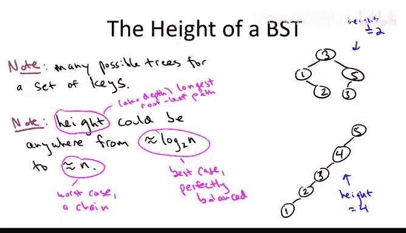
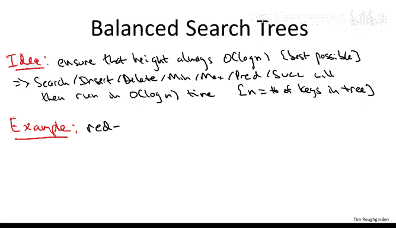
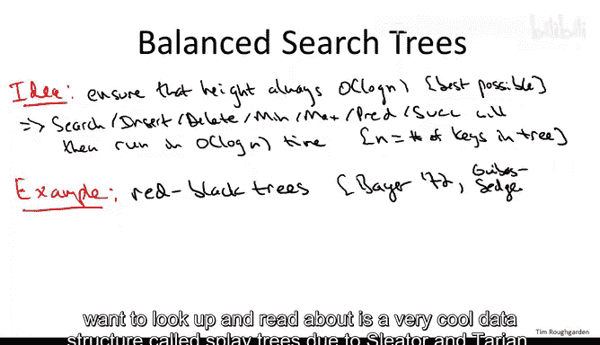
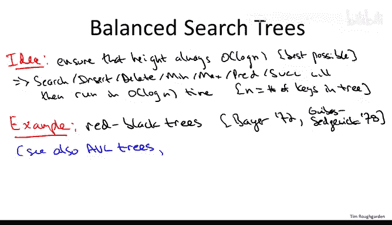
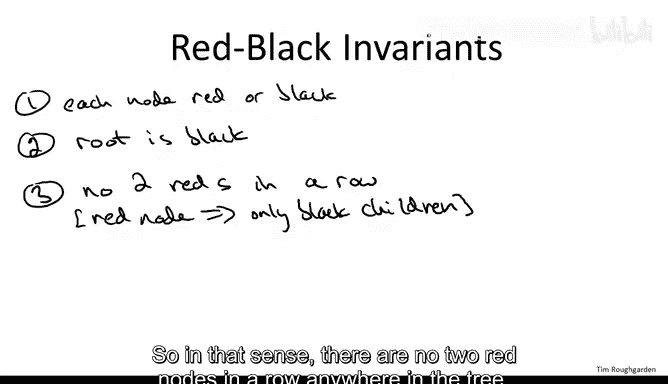
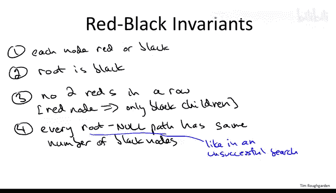
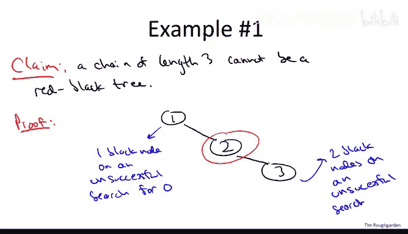
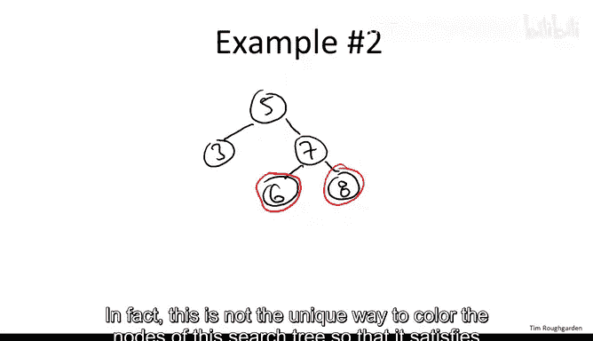
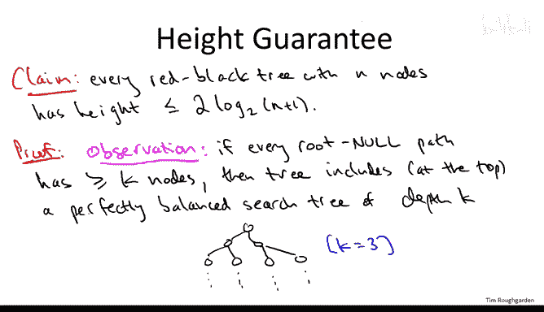
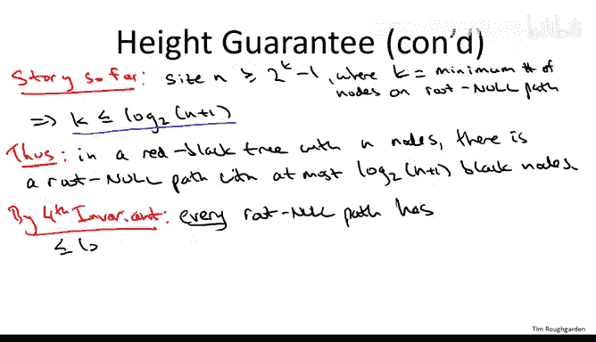

# 斯坦福大学《算法（分治／排序／搜索／随机算法、图搜索／最短路径／数据结构、贪心算法／最小生成树／动态规划、最短路径／NP）｜Algorithms》中英字幕 - P64：20_03_04_红黑树.zh_en - GPT中英字幕课程资源 - BV1Rx4y1U7sZ

So in this video we'll graduate beyond the domain of just vanilla binary search trees like we've been talking about before。

 and we'll start talking about balanced binary search trees。

 these are the search trees you really want to use when you want to have real-time guarantees on your operation time because they' search trees which are guaranteed to stay balanced。

 which means the height is guaranteed to stay logarithmic。

 which means all of the operation search trees support that we know and love will also be logarithmic in the number of Ps that they're storing。

So let's just quickly recap what is the basic search tree property It should be the case that at every single node of your search tree if you go to the left you only see keys that are smaller than where you started and if you go to the right you only see keys that are bigger than where you started and a really important observation which is that given a set of keys there are gonna be lots and lots of different legitimate valid binary search trees with those keys so we've been having these running examples with the keys 12。

345 on the one hand you can have a nice and balanced search tree that has height only two with a keys one through5 on the other hand you can also have these crazy chains basically devolved to linked lists where the height for n elements could be as high as n minus1 so in general you can have an exponential difference in the height it could be as small in the best case as logarithmic as big in the worst case as linear so this obviously motivates search trees that have the additional property that you never have to worry about their height。

 you know they're going to be well balanced， you know they're going to have height logarithmic you're never worried about。

And I'm having this really lousy linear height。Remember why it's so important to have a small height。

 it's because the running time of all of the operations of search trees depends on the height。

 you want to do search， you want to do insertion， you want to find predecessors， whatever。

 the height is going to be what governs the running time of all of those properties。

So the high level idea behind balance search trees is really exactly what you'd think。

Which is that you know because the height can't be any better than logarithmic in the number of things you're storing。

 that's because the trees are binary， so the number of nodes can only double each level so you need a logarithmic number of levels to accommodate everything that you're storing。

 but it's got to be logarithmic， let's make sure it stays logarithmic all the time。

 even as we do insertions and deletions。If we can do that。

 then we get a very rich collection of supported operations all running in logarithmic time。As usual。

 N denotes the number of keys being stored in the tree。There are many， many。

 many different balanced search trees， they're not super。

 most of them are not super different from each other。

I'm going to talk about one of the more popular ones， which are called red black trees。

So these were invented back in the 70s。These were not the first balanced binary search tree data structure that on belongs to AVL trees。

 which again are not very different from red black trees。Though the invaris are slightly different。

 another thing you might want to look up and read about。

There's a very cool data structure called Splay trees due to slater andtn。

 these unlike red black trees and AVL trees， which only are modified on insertions and deletions。

 which if you think about it is sort of what you'd expect。

 S trees modify themselves even when you're doing lookups even when you're doing searches。

 so they're sometimes called self-adjusting trees for that reason。

And they're super simple， but they still have kind of amazing guarantees。

And then finally going beyond just the binary tree paradigm。

 many of you might want to look up examples of B trees are also B plus trees。

 these are very relevant for implementing databases here what the idea is in a given node you're going to have not just one key but many keys and from a node you have multiple branches that you can take depending on where you're searching for falls with respect to the multiple keys that are at that node the motivation in a database context for going beyond the binary paradigm is to have a better matchup with the memory hierarchy so that's also very important although a little bit outside of the scope here that said what we discuss about red black trees。

 much of the intuition will translate to all of these other balance tree data structures if you ever find yourself in a position where you need to learn more about them。

So red black trees are just the same as binary search trees except they also always maintain a number of additional invaris and so what I'm going to focus on in this video is first of all what the invaris are and then how the invariances guarantee that the height will be logarithmic。

Time permitting at some point there'll be optional videos， more about the guts。

 more about the implementations of red black trees。

 namely how do you maintain these invariance under insertions and deletions。

 that's quite a bit more complicated so that's appropriate for optional material。

But understanding what the invaris are and what role they play in controlling the height is very accessible。

 and it's something I think every programmer should know。

So there I'm going to write down four invaris and really the byte comes from the second two okay from the third and the fourth invaris。

 the first two invaris you know are just really cosmetic， so the first one。

 we're going to store one bit of information additionally at each node beyond just the key and we're going to call this bit as indicating whether it's a red or a black node。

You might be wondering why redbl， Well， I asked my colleague Leo Gilbbs about that a few years ago and he told me that when he and Professor Sedgwick were writing up this article。

 the journals just had access to a certain kind of new printing technology that allowed very limited color in the printed copies of the journals and so they were eager to use it and so they named their data structure redbl so they could have these nice red and black pictures and the journal article。

 unfortunately there was then some snafu and at the end of the day that technology wasn't actually available so it wasn't actually printed the way they were envisioning it。

 but the name has stuck， so that's the rather idiosyncratic reason why these data structures got the name that they did redbl trees。

So secondly， we're going to maintain the invariant that the root of the search tree is always black。

 can never be red。Okay， so with the superficial pair of invariance out of the way。

 let's go to the two main ones， so first of all， we're never going to allow two reds in a row。

By which I mean， if you have a red node。In the search tree， then its children must be black。

If you think about it for a second， you realize this also implies that if a node is red and it has a appearance。

 then that parent has to be a black node。So in that sense， there are no two red nodes in a row。

Anywhere in the tree。And the final invariant， which is also rather severe。

Is that every path you might take from root to a null pointer。

Passes through exactly the same number of black nodes。

So to be clear on what I mean by a rootinal path， what you should think about is an unsuccessful search。

Right so what happens in an unsuccessful search you start at the root。

 depending on whether you need to get smaller or bigger， you go left or right respectively。

 you keep going left right as appropriate until eventually you hit a null pointer。

 so I want you to think about that process that when you start at the root and then eventually fall off into the tree in doing so you traverse some number of nodes。

Some of those nodes will be black， some of those nodes will be red。

 and I want you to keep track of the number of black nodes。

And the constraints that a red black tree by definition must satisfy is that no matter what path you take through the tree starting from the root。

 term an an nu pointer， the number of black nodes traversed has to be exactly the same。

 cannot depend on the path， has to be exactly the same on every single rootutinal path。

Let's move on to some examples， so here's a claim。And this is meant to kind of we your appetite for the idea that red black trees must be pretty balanced。

 They have to have height， basically logarithmic。 So remember what's the most unbalanced search tree。

 Well， that's these chains。 So the claim is even a chain with three nodes cannot be a red black tree。

So what's the proof well consider such a search tree。So maybe。With the key values one， two。

 and three。So the question that we're asking is， is there a way to color these three nodes。

 red and black so that all four of the invaris are satisfied？So we need to color each red or black。

 remember invariant two says the root the one has to be black。

 so we have four possibilities for how to color two and three。

 but really because of the third invariant we only have three possibilities we can't color two and three both red because then need to have two reds in a row so we need to make two red。

 three black， two black， three red or both two and three black。

And all of the cases are the same just to give one example。

 suppose that we colored the node two red and one in three are black。

 the claim is invariant4 is then broken and invariant4 is going to be broken no matter how we try and color two and three red and black。

 what is invariant four says it says really on any unsuccessful search you pass through the same number of black nodes。

And so one unsuccessful search would be you search for zero。And if you search for zero。

 you go to the root， you immediately go left and hit a nu pointer。

 so you see exactly one black node namely one。On the other hand， suppose you searched for four。

 then you'd start at the root， you'd go right， you go to two， you'd go right， you go to three。

 you'd go right again and only then when you hit a null pointer and on that unsuccessful search you'd encounter two black nodes。

 both the one and the three so that's a violation of the fourth invariance。

 therefore this would not be a red black tree， I'll leave it for you to check that no matter how you try to color two and three red or black。

 you're going to break one of the invaris， if they're both red you break the third invariant if that most one is red you break the fourth invariant。

So that's a non example of a red black tree， so let's look at an example of a red black tree one to have other。

A search tree where you actually can color the node red or black so that all four invariants are maintained。

So one search tree which is very easy to make red black is a perfectly balanced one so for example let's consider this three node search tree has the keys 3。

5 and7 and let's suppose the five is the root so it has one child on each side three and a seven so can this be we a red black tree so remember what that question really means it's asking can we color these three nodes some combination of red and black so that all four of the invaris are satisfied？

If you think about it a little bit， you realize yeah。

 you can definitely color these nodes red or black to make insatisfiable4 variance， in particular。

 suppose we color all three of the nodes black。We've been satisfied in variant number one。

 we've colored all the nodes。 we've satisfied in variant number two， in particular the root is black。

 we've satisfied in variant number three。 there's no reds at all。

 So there's certainly no two reds in a row。 And if you think about it。

 we satisfy in variant four because this tree is perfectly balanced no matter what you unsuccessfully search for。

 you're going to encounter two black nodes。 If you search for say one。

 you're going to encounter3 and5。 If you search for say6， you're going to encounter5 and7。

 So all root and old paths have exactly two black nodes in variant number four is also satisfy。

So that's great。 But of course， the whole point of having a binary search tree data structure is you want to be dynamic。

 you want to accommodate insertions and deletions Every time you have an insertion or deletion into a red black tree。

 you get a new node， let's say in an insertion， you get a new node。

 you have to color it something and now all of a sudden you got to worry about breaking one of these foreign variants。

So let me just show you some easy cases where you can accommodate insertions without too much work。

Time permitting will include some optional videos with the notion of rotations which do more fundamental restructuring of search trees so that they can maintain the foreign variance and stay nearly perfectly balanced so if we have this red black tree where everything's black and we insert say six that's going to get inserted down here now if we try to color it black it's no longer going to be a red black tree and that's because if we do an unsuccessful search now for say 5。

5， we're going to encounter three black nodes where if we do an unsuccessful search for one we only encounter two black nodes so that's not going to work。

But the way we can fix it is instead of coloring the six black， we color it red。

And now this six is basically invisible to invariant number four。

 it doesn't show up in any rootutinal paths， so because you had two black nodes on all rootutinal paths before before the six was there。

 that's still true now that you have this red6， so all four variants are satisfied once you insert the six and color it red。

If we then insert say an eight， we can pull exactly the same trick。

We can color the eight red again it doesn't participate in invariant4 at all so we haven't broken it Moreover we still don't have two reds in a row so we haven't broken invariant number three either so this is yet another red black tree In fact this is not the unique way to color the nodes of this search tree so that it satisfies all four of the invariance if we instead recolor six and eight black but at the same time recolor the node 7 red we're also golden。

Clearly the first three invariants were all satisfied， but also in pushing the red upward。

 consolidating the red at six and8 and putting it at seven instead。

 we haven't changed the number of black nodes on any given path。

 any path that previously went through six， went through seven， anything that went through eight。

 went through seven， so there's exactly the same number of red and black nodes on each such path as it was before。

 so all paths still have equal number of black nodes and invariant4 remains satisfied。As I said。

 I've shown you here only very simple examples where you don't have to do much work on an insertion to retain the red black properties in general。

 if you keep inserting more and more stuff and certainly if you do deletions。

 you have to work much harder to maintain those four invariance time permitting will cover just a taste of it in some optional videos。

So what's the point of these seemingly arbitrary foreign variants of a red black tree。

 well the whole point is that if you satisfy these foreign variants in your search tree。

 then your height is going to be small and because your height' is going to be small。

 all your operations are going to be fast so let me give you a proof that if a search tree satisfies the foreign variance。

 then it has super small height， in fact， no more than double the absolute minimum it could conceivably have at most two times log based2 event。

So the formal claim is that every red black tree with n nodes。Has height O of log n。

More precisely at most two times log base2 of n plus one。

So here's the proof and what's cool about this proof is it's very obvious the role played by these invaris three and four essentially。

What the invariance guarantee is that a red black tree has to look like a perfectly balanced tree with at most sort of factor to inflation。

 so let's see exactly what I mean。So let's begin with an observation and this has nothing to do with red black trees。

 forget about the colors for a moment and just think about the structure of binary trees and let's suppose we have a lower bound on how long rootinole paths are in a tree so for some parameter K and go ahead and think of K as like 10 if you want。

 suppose we have a tree where if you start from the root and no matter how it is you navigate left in right child pointers until you terminate it a null pointer。

 no matter how you do it， you have no choice but to see at least k nodes along the way。

If that hypothesis is satisfied， then if you think about it。

 the top of this tree has to be totally filled in， so the top of this tree has to include a perfectly balanced search tree binary tree of depth k minus1。

So let me draw a picture here of the case of k equals 3。

So if no matter how you go from the root to a no pointer。

 you have to see at least three nodes along the way。

 then it means the top three levels of this tree have to be full， so you have to have the root。

 it has to have both of its children and it has to have all four of its grandchildren。

The proof of this observation is by contradiction， if in fact， you were missing some nodes。

In any of these top K levels， well that would give you a way of hitting a null pointer seeing less than K nodes。

So what's the point is， the point is this gives us a lower bound on the population of a search tree as a function of the length of its rootutinal paths。

So the size n of the tree。Must include at least the number of nodes in a perfectly balanced tree of depth k minus1。

 which is2 raised to the K and minus1。 So for example，1 k equals3， it's two raiseds to the three。

 two cubed， minus1 or7。

So that's just a basic fact about trees， nothing about red black trees。

 So let's now combine that with a red black tree invari to see why red black trees have to have small height。

 So again， to recap where we got to on the previous slide， the size n。

 the number of nodes in a tree is at least two to decay minus1。

Rque is the fewest number of nodes you will ever see on a rootutinal path。

So let's rewrite this a little bit and let's actually say let's instead of having a lower bound on n in terms of K。

 let's have an upper bound on K in terms of n。So the length of every rootutinal path。

 the minimum length of every rootutinal path is bounded above by log base2 of quantity n plus1。

 this is just adding one to both sides and taking the logarithm base two。So what， What is this bias。

 Well， now let's start thinking about red black trees。 So no red black tree with N nodes。

What does it say， this says that the number of nodes， forget about red or black。

 just the number of nodes on some。Routinal path has to be at most log based2 of n plus one in the best case。

 all of those are black， maybe some of them are red， but in the maximum case， all of them are black。

So we can write in a red black tree with end nodes， there is a rootutinal path with at most。

Log base two of N plus1 black node。This is an even weaker statement that what we just proved。

 we proved that some path must have it most log based two of n plus one total nodes。

 so certainly that path has the most log based2 of n plus one black nodes now let's apply the two knockout punches of our two invariance。

All right， so fundamentally what is the fourth invariant telling us。

 it's telling us that if we look at a path in a red black tree， we go from the root。

 we think about say an unsuccessful search， we go down to a no pointer。

 it says if we think of the red nodes as invisible， if we don't count them in our tally。

 then we're only going to see log basically a logarithmic number of nodes。

 but when we care about the height of the red black tree， of course we care about all of the nodes。

 the red nodes and the black nodes。

So so far we know if we only count black nodes then we're good。

 we only have log based2 n plus one nodes that we need to count so here's where the third invariant comes in。

 it says well actually black nodes are a majority of the nodes in the tree in a strong sense there are no two reds in a row on any path so if we know the number of black nodes is small then because you can't have two reds in a row。

 the number of total nodes on the path is in most twice as large in the worst case you have a black root。

 then red then black then red then black then red than black etc。

 and the worst case the number of red nodes is equal to the number of black nodes which doubles the length of a path once you start counting the red nodes as well。

And this is exactly what it means for a tree to have a logarithmic depth。

 so this in fact proves the claim if a search tree satisfies the invariance one through four in particular if there's no two reds in a row and all root will pass have an equal number of black nodes。

 then knowing nothing else about this search tree it's got to be almost balanced。

 it's perfectly balanced up to a factor of two and again the point then is that operations in a search tree in the search tree are going to run in logarithmic time because the height is what governs the running time of those operations。

Now in some sense， I've only told you the easy part。

 which is if it just so happens that your search tree satisfies these foreign variants。

 then you're good， the height is guaranteed to be small so the operations are guaranteed to be fast clearly that's exactly what you want from this data structure but for the poor soul who has to actually implement this data structure the hard work is maintaining these invaris even as the data structure changes remember the point here is to be dynamic to accommodate insertions and deletions insertions and deletions can disrupt these foreign variants and then one has to actually change the code to make sure they're satisfied again so that the tree stays balanced。

 has low height even under arbitrary sequences of insertions and deletions so we're not going to cover that in this video it can be done without significantly slowing down any of the operations it's pretty tricky take some nice ideas there's a couple well-known algorithms textbooks that cover those details or if you look at open source implementations or balanced search trees you can look at code that does that implementations but because it can be done in a practical way。

And because red Blacktes support such a rich array of operations。

 that's why you will find them used in a number of practical applications。

 that's why balance search trees should be part of your programmer toolbox。

