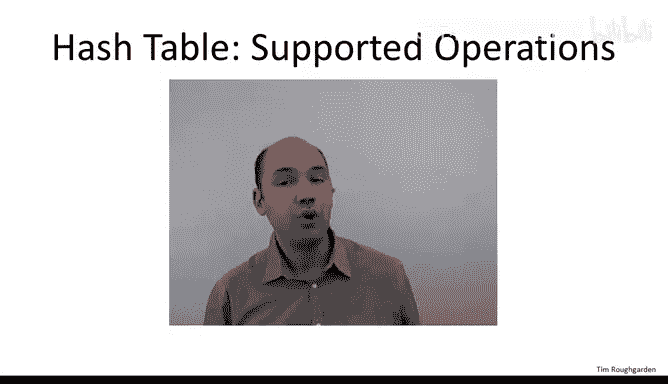
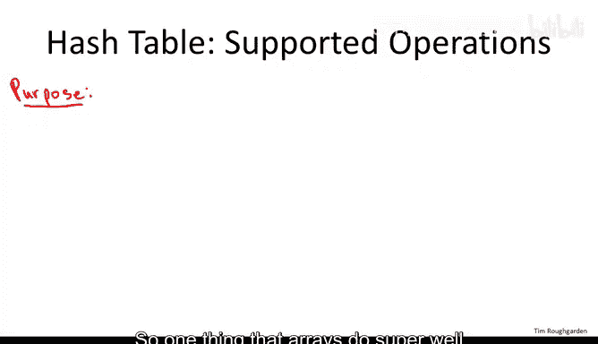
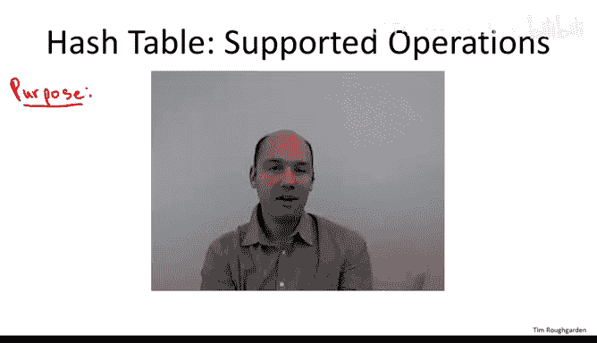
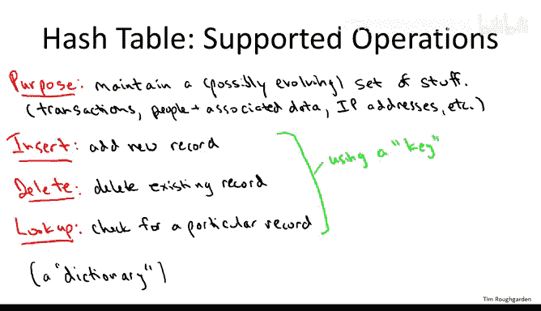
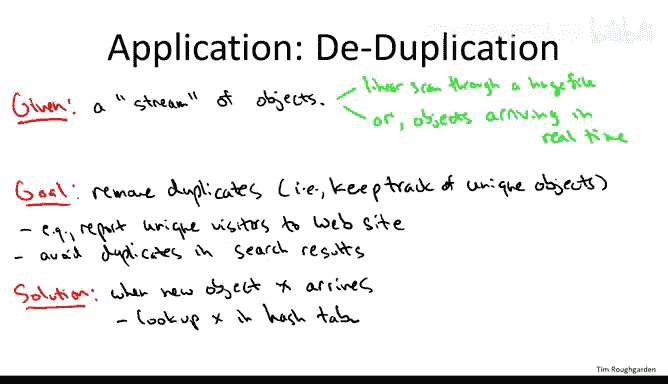
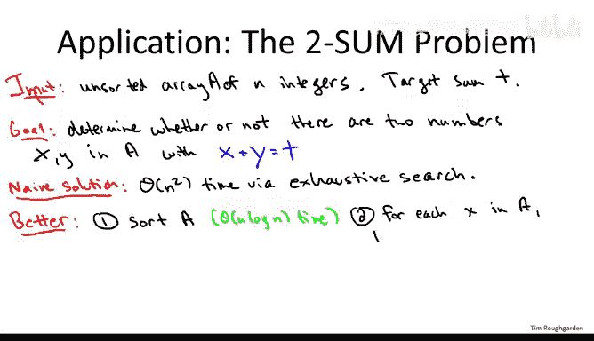
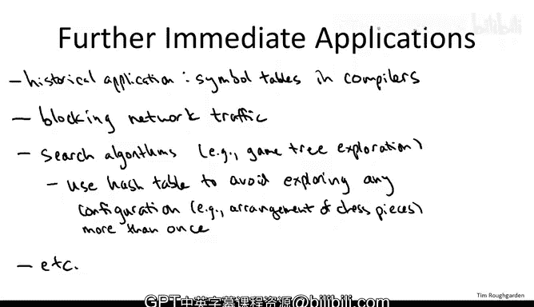

# 斯坦福大学《算法（分治／排序／搜索／随机算法、图搜索／最短路径／数据结构、贪心算法／最小生成树／动态规划、最短路径／NP）｜Algorithms》中英字幕 - P67：23_04_02_哈希表操作与应用.zh_en - GPT中英字幕课程资源 - BV1Rx4y1U7sZ

In this video， we'll begin our discussion of hash tables。

 we'll focus first on the supported operations and on some of the canonical applications。

So hash tables are insanely useful if you want to be a serious program or computer scientist。

 you really have no choice but to learn about hash tables I'm sure many of you have used them in your own programs in the past in fact now on the one hand what's funny is they don't actually do that many different things in terms of the number of supported operations。

 but what they do do they do really， really well。

So what is a hash table Well conceptually ignoring all of the aspects of the implementation。

 you might want to think of a hash table as an array。

 so one thing that arrays do super well is support immediate random access。

 So if you're wondering what's a position number 17 of some array boom with a couple of machine instructions you can find out want to change the contents at position number 23 in some array done in constant time。

So let's think about an application in which you want to remember your friend's phone numbers so if you're lucky your friend's parents were all unusually unimaginative people and all of your friends' names are integers。

 let's say between 1 and 10，000 so if this is the case then you can just maintain an array of length 10000 and to store the phone number of say your best friend 173 you can just use position number 173 of this modest sized array so this array-based solution were great even if your friends change over time you gain some here you lose some there as long as all of your friends' names happen to be integers between  one and 10。

000。Now， of course， your friends have more interesting names。 Alice， Bob， Carol。

 whatever and last names as well。 So in principle， you could have an array with one position in the array for every conceivable name you might encounter with at least 30 letters say。

 But of course， this array would be way too big。 It would be something like 26 raised to the 30th power and you could never implement it。

 So what you'd really want is you'd want an array of reasonable size， say you know ballpark。

 the number of friends that you'd ever have。 So say in the thousands or something where its positions are indexed not by the number is not integers between  one and 10000。

 but rather buy your friends's names and what you'd like to do is you'd like to have random access to this array based on your friend's name。

 So you just look up the quote unquote Alice position of this array and boom。

 there would be Alice's phone number in constant time。

 And this on a conceptual level is basically what a hash table can do for you。

So there's a lot of magic happening under the hood of a hash table。

 and that's something we'll discuss to some extent in other videos。

 So you have to have this mapping between the keys that you care about like your friend's names and numerical positions of some array that's done by what's called a hash function。

 but properly implemented， this is the kind of functionality that hash tables give you。

 It's like an array with its positions indexed by the keys that you're storing。

So you can think of the purpose of a hash table as to maintain a possibly evolving set of stuff。

Where of course the set of things that you're maintaining will vary with the application。

 it could be any number of things， so if you're running an e-commerce website。

 maybe you're keeping track of transactions， you know again， maybe you're keeping track of people。

 like for example， your friends and various data about them。

So maybe you're keeping track of IP addresses， for example。

 if you want to know who are the unique visitors to your website。And so on。

So a little bit more formally， you know， the basic operations。

 you need to be able to insert stuff into a hash table。In many but not all applications。

 you need to be able to delete stuff as well and typically the most important operation is lookup and for all of these three operations you do it in a keybased way whereas as usual a key should just be a unique identifier or for record that you're concerned with so for example for employees you might be using Social Security numbers for transactions you might have a transaction ID number and then IP addresses could act as their own key and so sometimes all you're doing is keeping track of the keys themselves so for example an IP addresses。

 maybe you just want to remember a list of IP addresses you don't actually have any associated data but in many applications along with the key is a bunch of other stuff so along with the employee's social Security number。

 you're going to remember a bunch of other data about that employee but when you do the insert when you do the delete when you do the lookup you do it based on this key and then for example on lookup you feed the key into the hash table and the hash table will spit back out all of the data associated with that key。

Sometimes here people refer to data structures that support these operations as a dictionary。

 so the main thing that a hash table is meant to support is lookup in the spirit of a dictionary。

 I find that terminology a little misleading actually。

 know most dictionaries that you'll find are in alphabetical order so they'll support something like binary search and I want to emphasize something a hash table does not do is maintain an ordering on the elements that it supports。

So if you're storing stuff and you do want to have order based operations。

 you want to find the minimum or the maximum or something like that。

 a hash table is probably not the right data structure， you want something more。

 you want to look at a heap or you want to look at a search tree。

But for applications in which all you have to do is basically look stuff up。

 you you got to know what's there and what's not。 Then there should be a light bulb that goes off in your head and you should say let me consider a hash table。

 that's probably the perfect data structure for this application Now looking at this menu of supported operations。

 you may be left kind of unimpressed so a hash table in some sense it doesn't do that many different things。

 But again， what it does， it does really， really well。

 So to first order what hash tables give you is the following amazing guarantee all of these operations run in constant time。

 And again， this is in the spirit of thinking of a hash table as just like an array where its positions are conveniently indexed by your keys。

 So just like an array supports random access in constant time you can see if there's anything in the array position and what it is similarly a hash table will let you look up based on the key in constant time。

So what is the fine print where is basically two caveats。

 so the first thing is that hash tables are easy to implement badly and if you implement them badly you will not get this guarantee so this guarantee is for properly implemented hash tables Now of course if you're just using a hash table from a well-known library。

 it's probably a pretty good assumption that it's properly implemented you'd hope。

But in the event that you're forced to come up with your own hash table and your own hash function。

 and unlike many of the other data structures we'll talk about。

 some of you probably will have to do that at some point in your career。

 then you'll get this guarantee only if you implement it well。

 and we'll talk about exactly what that means in other videos。

So the second caveat is that unlike most of the problems that we've solved in this course。

 hash tables don't enjoy worst case guarantees， you cannot say for a given hash table that for every possible data set you're going to get constant time what's true is that for non pathological data you will get constant time operations in a properly implemented hash table。

So we'll talk about both of these issues a bit more in other videos。

 but for now just high order bits are hash tables constant time performance subject to a couple of caveats so now I've covered the operations that hash tables support and the recommended way to think about them let's turn our attention to some applications All of these applications are going to be in some sense kind of trivial uses of hash tables but they're also all really practical these come up all the time so the first application we'll discuss which again is a canonical one is removing duplicates from a bunch of stuff also known as the deduupplication problem。

So in the deduupplication problem， the input is essentially a stream of objects where when I say a stream I have kind of you know two different things in mind as a canonical examples。

 so first of all you can imagine you have a huge file so you have a log of everything that happened on some website that you're running or all of the transactions that were made in a store on someday and you do a pass through this huge file so you're just in the middle of some outer for loop going line by line through this massive file。

The other example of a stream that I have in mind is where you're getting new data over time。

 So here you might imagine that you're running software to be deployed on an Internet router and data packets are coming through this router at its constant extremely fast rate。

 And so you might be looking at， say the I addresses in the sender in data packet。

 which is going through your router。 So that'd be another example of a stream of objects。

And now what do you got to do， what you got to do is you got to ignore the duplicates。

 so remember just the distinct objects that you see in this stream。

And I hope you find it easy to imagine why you might want to do this task in various applications。

 so for example， if you're running a website， you might want to keep track of the distinct visitors that you ever saw in a given day or a given week if you're doing something like a web crawlwl。

 you might want to identify duplicate documents and only remember them once。

 so for example it'll be annoying if in search results。

 both the top link and the second link both led to identical pages at different URLs case so search engines obviously want to avoid that so you want to detect duplicate web pages and only report unique ones。

And the solution using a hash table is laughably simple。

So every time a new object arrives in the stream， you look it up， if it's there。

 then it's a duplicate and you ignore it， if it's not there。

 then this is a new object and you remember it， QED， that's it。

And so then after the stream completes， so for example， after you finish reading some huge file。

 if you just want to report all of the unique objects。

 hash tables generally support a linear scan through them and you can just report all of the distinct objects when this stream finishes。

So let's move on to a second application， slightly less trivial maybe， but still quite easy。

 and this is the subject of programming project number five。

So this is a problem called the Tson problem。And you're given as input and array of n numbers these integers are in no particular order。

 you're also given a target sum， which I'll call T。

And what you want to know is are there two integers from amongst these n you are given that sum to T？

Now the most obvious and naive way to solve this problem is just to go over all end shoes two pairs of integers in the input and check each one separately。

 so that's clearly a quadratic time algorithm。But now of course we need to ask can we do better and yes we can and first of all let's see what you do if you couldn't use any data structures so if you were clever but you didn't use any data structures like a hash table。

 here would be a reasonable improvement over the naive one。

So the first step of the better solution is to sort a up front。For example。

 using merge sort or Heap sort， something that runs an N log N time。

So you may be asking about the motivation for sorting。 Well， again。

 you know one thing is just you know whenever you're trying to do better than n squared。

 you might think of sorting your data somehow helps right you can sort of do it almost for free and n log n time。

 Now， why would sorting the array upfront help us。 Well then the clever insight is that for each entry of the array A。

 say the first entry， now we know what we're looking for to achieve this given target right if the target if we're trying to get to that sum to 100 and the first entry in this sorted array is 43 then we know we're looking for 57 somewhere else in this now sorted array。

 and we know that searching a sorted array is pretty easy right that's just binary search that just takes logarithmic time。

 So for each of the n array entries， we can look for a complementary entry。

 namely for each x we can look for t minus x using binary search and so each binary search takes log n time So the sorting upfront speeds up this entire batch of n searches and so that's why it's a win。

So in the second step because we do a linear number of binary searches， again， this is just n。

 the number of searches times log n， the time per search。

 so this is just another theta of n log n factor。All right， so that's pretty cool。

 I don't think you could come up with this N log n solution without having some basic facility with algorithms。

 This is already a really nice improvement over the9 N squared， but we can do even better。

 It is no reason we're stuck with an n log n lower bound for the T sum problem。😊，Obviously。

 because the array is unsorted， we have to look at all the integers。

 so we're not going to do better than linear time， but we can do linear time via a hash table。

So a good question you might ask at this point is what's the clue about this problem about this task that suggests that we want to use a hash table Well so hash tables are going to dramatically speed up any application where the bulk of the work is just repeated lookups And if we examine this n log n solution once we have this idea of doing a search for t minus x for each value of x we realize actually you know the only thing we needed this sorted array for was to support lookups that's all binary search here is doing is just looking stuff up So we sayha all of the work here in step two is from repeated lookups we're paying an exorbitance relatively logaric amount of time per lookup whereas hash tables can do them in constant time So repeated lookups ding ding ding let's use a hash table and indeed that's what gives us linear time in this problem。

So from the amazing guarantee of hash tables， we get the following amazing solution for the Tson problem。

 although again， this is subject to the same fine print about you better use a properly implemented hash table and you better not have pathological data。

So rather than sorting， you just insert everything in the array into a hash table。

 and so insert is constant time， so this is going to be linear time rather than the end log in we were paying before。

And once all this stuff is in the hash table， we just do the same thing as in the N log N solution for each X in the array。

 we look for its matching element t minus x in the hash table using the constant time lookup operation exported by the hash table。

And of course， if for some x， you do find the matching element t minus x。

 then you can just report x and t minus x that proves that there is indeed a pair of integers of target some T if for every single element of the input array A you fail to find this matching element t minus x in the hash table。

 then for sure there is no pair of integers in the input that sums to T so this solves the problem correctly。

 moreover。Constant time insertion。 So that means this first step is going to be O of N time。

And constant time lookup， so that means the second step is also going to be linear time。

At least subjects to the caveats that we discussed on the previous slide。

So it's kind of amazing how many different applications in computer science boil down in their essence to repeated lookup operations。

 therefore having a super fastst lookup operation like that supported by a hash table permits these applications to scale to fantastic sizes。

 it's really amazing and it drives a lot of modern technology so let me just mention a couple examples but again if you look around or do some research on the web。

 you'll quickly find many more。So originally what prompted researchers to think hard about data structures that support superfast lookups was back when people were first building compilers。

 so this is a long time ago， this is in the 50s or so。

 and these repeated lookups to figure out what has and has not been defined before was emerging as a bottleneck in compilers back in the early days of programming languages and that was one of the early applications of hash tables was to support superfast lookups to speed up compile time to keep track of the function and variable names and things like that。

Hash table technology is also super useful for software on routers in the internet。 So for example。

 you might want to block network traffic from certain sources。

 so for example maybe you suspect that a certain IP address has been taken over by spammers and so any traffic coming from that IP address you just want to ignore and you don't want to even let it get to the endhost to the computer on someone's desktop or to someone's mobile advice but rather inside the internet you want to just drop packets that are coming from certain certain sends So what is that problem boil down to while you might have a blacklist of IP addresses that you're refusing traffic from and then the task faced by the router is really a lookup problem So a data packet comes in its some insanely fast data rate and what you want to do immediately is look up is this in the blacklist or not and if it is in the blacklist then you drop the packet if it's not than you let it go through。

So a very different application is for speeding up search algorithms。

And when I say a search algorithm， what I'm thinking about here is something like a chess playing program。

 so something that does gamet tree exploration。So we've already talked a fair amount about graph search in this class。

 but in our discussion of breath first and depth first search。

 we were thinking about graphs that you could basically write down。

 you could store them in the main memory of your machine or in the worst case on some big cluster so maybe graphs about the size of the web graph or possibly smaller but in a context of something like a chess playing program the graph that you're interested in is way way way bigger than the web graph So what's the graph we care about for a chess playing program well the nodes of the graph are going to correspond to all possible configurations of chess pieces on a chessboard so every chessboard that you might ever encounter in a game of chs so that's a massive massive number of configurations you're never gonna be able to write down all of these vertices the edges in this graph are going to take you from one configuration to another and they're going to correspond to legal move so if you can move a bishop from one place to another place and you get from one configuration to another configuration there's an edge in the graph corresponding to that move。

Now you can't write down this graph， so you can't implement breadth first or depth first search exactly as we discussed before。

 but you'd still like to do graph exploration right so you'd like to have your computer program reason about the at least short term ramifications of your possible next move so thatll correspond to searching through this graph。

Now， how are you going to remember in graph search a really important property was you don't want to do redundant work。

 you don't want to reexplloore things you've already explored。

 that would be silly and might be the infinite loops and so on。

 And if you can't write down the graph even just remembering where you've been is suddenly a nontrivial problem but what is remembering where you've been fundamentally fundamentally that's a lookup operation So that is exactly what hash tables are for so to be a little more concrete you know one way you'd use a hash table in say a chess playing program is youd take the initial configuration you would sort of imagine trying all possible moves from this configuration and then you'd try youd sort of have all moves by your opponent and you'd have all your moves in response and you would always remember as you were doing this reasoning every chessboard configuration you'd ever looked at before and you'd stick it in a hash table and before you go exploring some configuration youd look it up in your hash table to see if you've already exploreed in the past and if you have you don't bother you've already seen it。

All right， so chess playing programs operate by exploring systematically as many configurations as they have time for。

 you know obviously in a budget of three minutes or whatever。

 you don't want to waste any work exploring any giving configuration more than once。

 how do you remember where you've been well everything you've explored you stick in a hash table before you explored configuration you look it up in a hash table and see you've already done。

So these of course are just scratching the surface I just wanted to highlight a couple fairly different looking applications you know to convince you that hash tables come up all the time and the reason they come up all the time is because the need for fast lookups comes up all the time it's kind of amazing how much technology is being driven just by you know repeated fast lookups so as homework I encourage you to just sort of think about your own life or think about technology out there in the world and come up with some you guesses about where probably hash tables are making something out there running blazingly fast I think it won't take you more than a few minutes to come up with some good examples。

