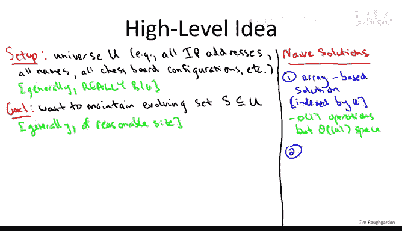
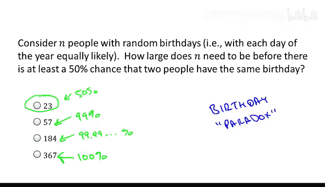
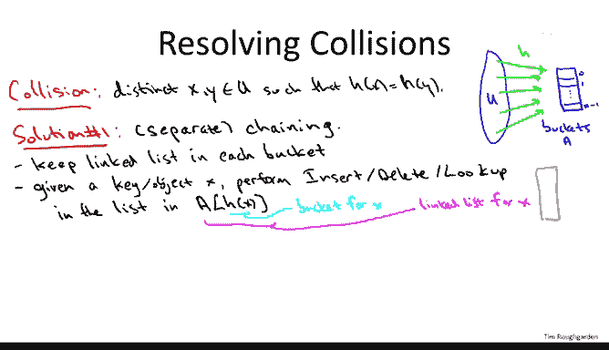

# 斯坦福大学《算法》课程：P68：哈希表实现细节 - 第一部分 🧮

在本节课中，我们将深入探讨哈希表的工作原理，特别是哈希函数的设计理念以及如何处理哈希表中不可避免的“碰撞”问题。我们将学习两种主流的碰撞解决方法，并理解哈希函数的核心作用。

---

## 哈希表概述

哈希表的核心目标是支持快速的查找操作。无论是记录网站交易、管理员工信息、追踪IP地址，还是存储国际象棋的棋盘配置，哈希表都能高效地支持插入、查找和删除操作。理想情况下，这些操作都能在常数时间内完成，但这依赖于哈希表的正确实现以及数据本身不具有“病态”特性。

## 哈希表的基本结构

上一节我们介绍了哈希表的目标，本节中我们来看看其基本实现结构。哈希表旨在结合数组的快速访问和链表的空间效率。

### 两种朴素方案的对比

以下是两种基础的、但各有缺陷的数据结构方案：



*   **基于数组的方案**：为所有可能存储的元素（即“全域”U）预留一个巨大的数组。优点是能在常数时间内进行插入、删除和查找。缺点是所需空间与全域大小成正比，这在许多应用中是不可行的。
*   **基于链表的方案**：仅存储实际存在的元素集合S。优点是空间仅与集合S的大小成正比。缺点是为了查找一个元素，通常需要遍历大部分链表，时间复杂度与链表长度成正比。

哈希表的目标是融合两者的优点：获得数组的常数时间操作和链表的线性空间消耗。

### 哈希表的折中方案

为了实现这一目标，哈希表使用一个数组，但其大小`n`仅与待存储的集合S的大小大致相当（例如，`n`约为S大小的两倍）。这个数组的每个位置被称为一个“桶”。

一个合理的疑问是：集合S是动态变化的，如何确定一个固定大小的数组？为了聚焦核心概念，本视频假设集合S的大小波动不大。在实际实现中，可以通过动态调整数组大小（例如，当元素过多时扩容并重新插入所有元素）来处理这个问题，这属于实现中的“锦上添花”部分。

## 哈希函数与碰撞

现在，我们有了一个空间合理的数组。接下来需要一个机制，将全域U中的任意元素（如IP地址、姓名）映射到这个数组的特定位置（桶索引）。负责这个映射的函数就是**哈希函数**。

**公式**：`h(x) -> {0, 1, ..., n-1}`

其中，`x`是来自全域U的键（如“Alice”），`h(x)`是哈希函数计算出的桶索引。例如，`h("Alice") = 17`意味着应将Alice的信息存储在数组的第17个桶中。

然而，一个根本性的问题随之而来：**碰撞**。当两个不同的键`x`和`y`被哈希函数映射到同一个桶时（即`h(x) = h(y)`），就发生了碰撞。

### 生日悖论与碰撞的必然性

碰撞为何不可避免？这可以用“生日悖论”来理解。生日悖论指出，在一个仅有23人的房间里，有两人生日相同的概率就超过了50%。更一般地说，当样本数量达到可能结果总数的平方根级别时，碰撞就极有可能发生。

应用到哈希表中，假设我们有`n`个桶，哈希函数将键均匀地随机映射到这些桶。那么，仅需大约`√n`个键插入哈希表，就极有可能发生碰撞。例如，对于一个有10,000个桶的哈希表，仅插入约100个元素就可能发生碰撞，而此时表的填充率仅为1%。因此，**碰撞是哈希的固有现象，必须设计方法来处理它**。

## 碰撞解决方法

既然碰撞无法避免，我们需要策略来解决它。以下是两种在实践中非常普遍的方法。

### 方法一：链地址法

链地址法（又称分离链接法）是一种直观且易于分析的解决方案。

其核心思想是：每个桶不再只存储一个元素，而是存储一个链表。所有被哈希到同一个桶的元素都放在这个链表中。

**操作流程**：
1.  **插入**：计算键的哈希值找到对应桶，然后将新元素插入该桶的链表头部（或尾部）。
2.  **查找/删除**：计算哈希值找到对应桶，然后在该桶的链表中执行标准的链表查找或删除操作。



**代码示意**：
```python
# 假设 buckets 是一个链表数组
bucket_index = hash_function(key) % len(buckets)
linked_list = buckets[bucket_index]
# 在 linked_list 中执行插入、查找或删除操作
```

**示例**：
假设哈希表有4个桶。经过一些插入后，状态可能如下：
*   桶0：`[Alice]`
*   桶1：`[]` (空链表)
*   桶2：`[Bob -> Daniel]` (Bob和Daniel发生碰撞，被链在一起)
*   桶3：`[Carol]`

### 方法二：开放定址法

开放定址法采用不同的思路：每个桶严格只存储一个元素。当发生碰撞时，它会按照一个预定的“探测序列”在哈希表中寻找下一个可用的空桶。

**核心概念**：哈希函数不再返回单个桶索引，而是生成一个探测序列 `[h1(x), h2(x), h3(x), ...]`，依次尝试这些位置，直到找到空桶为止。



以下是两种常见的探测策略：

*   **线性探测**：如果目标桶`h(x)`已被占用，则依次尝试`h(x)+1`, `h(x)+2`, ... 直到找到空桶。
*   **双重哈希**：使用两个哈希函数`h1(x)`和`h2(x)`。首先尝试`h1(x)`。如果被占用，则后续尝试的位置是 `(h1(x) + i * h2(x)) mod n`，其中`i=1,2,3,...`。

**操作流程**：
1.  **插入**：按照探测序列依次检查每个桶。如果桶为空，则插入元素；如果桶已被占用且键相同（对于更新操作），则处理更新；如果键不同，则继续探测。
2.  **查找**：按照相同的探测序列查找，直到找到该键或遇到空桶（说明键不存在）。
3.  **删除**：删除操作较为复杂，不能简单地将桶置空，否则会中断后续元素的查找路径。通常采用“惰性删除”标记。

### 两种方法的选择

两种方法各有优劣，没有绝对的胜者。选择时可以参考以下经验法则：

*   **空间考量**：如果内存空间非常紧张，开放定址法可能更优，因为它没有存储指针的额外开销。
*   **删除操作**：如果删除是频繁或关键的操作，链地址法更简单直接。开放定址法的删除实现起来更复杂。
*   **性能测试**：对于关键代码，最佳实践是同时实现两种方法并进行性能测试，因为其表现可能与内存层次结构等底层细节有关。

## 哈希函数的设计

到目前为止，我们讨论了哈希表的结构和碰撞处理，但尚未涉及一个核心问题：**哈希函数本身应该如何设计？** 这是一个研究深入且兼具艺术与科学的问题。

一个理想的哈希函数应具备以下特点：
1.  **确定性**：相同的输入总是产生相同的输出。
2.  **高效性**：计算速度要快。
3.  **均匀性**：能将键均匀地分布到所有桶中，最小化碰撞。

哈希函数的设计是下一部分将要深入探讨的主题。

---

本节课中我们一起学习了哈希表实现的核心细节。我们首先回顾了哈希表结合数组与链表优点的基本结构，然后重点探讨了碰撞的必然性（由生日悖论揭示），并详细介绍了处理碰撞的两种主要方法：**链地址法**和**开放定址法**。最后，我们指出了哈希函数设计的重要性，为后续内容做好了铺垫。理解这些基础概念是掌握高效哈希表实现的关键。