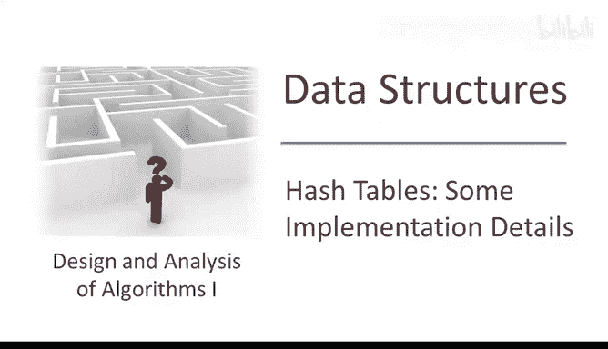
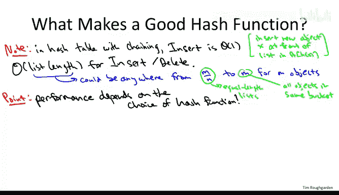
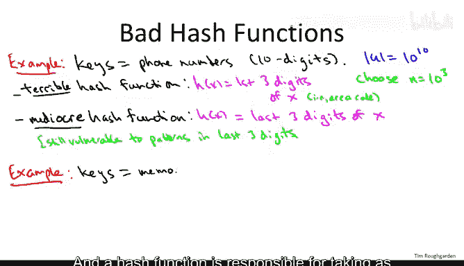
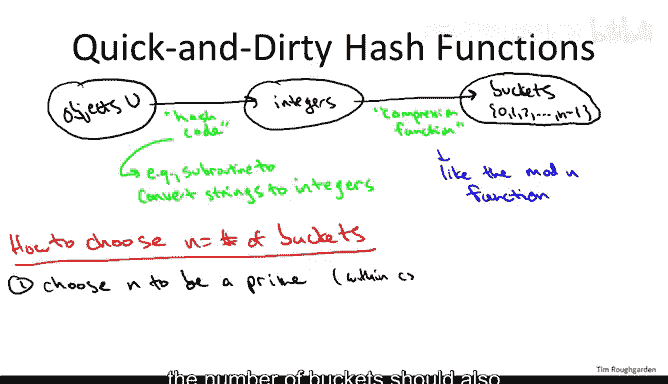

# 算法：哈希表实现细节（第二部分）🔍



在本节课中，我们将深入探讨哈希函数的设计原则及其对哈希表性能的影响。我们将从哈希函数的基本要求出发，分析常见的设计误区，并介绍一些实用的设计方法。


---

## 哈希函数的重要性



上一节我们介绍了哈希表的基本实现方式（链地址法和开放地址法）。本节中我们来看看哈希函数如何影响哈希表的性能。

在链地址法中，插入操作是常数时间的，但查找和删除操作的性能取决于链表的长度。如果哈希函数能将数据均匀分布到各个桶中，每个链表的长度将大致相等，从而保证操作的效率。反之，如果哈希函数将所有数据映射到同一个桶中，链表长度将变得很长，导致操作退化为线性时间。

类似地，在开放地址法中，操作的性能由探测序列的长度决定。好的哈希函数能均匀分布数据，减少探测次数；而差的哈希函数可能导致探测序列过长，降低性能。

因此，哈希函数的设计对哈希表的性能至关重要。

---

## 理想哈希函数的特性

基于上述分析，我们可以总结出理想哈希函数应具备的两个特性：

1. **均匀分布数据**：哈希函数应尽可能将数据均匀分布到各个桶中，避免出现某些桶过满而其他桶为空的情况。
2. **高效计算**：哈希函数的计算应快速且占用常数时间，因为每次操作（插入、查找、删除）都需要调用哈希函数。

完全随机函数是均匀分布的理想模型，但无法在实际中使用，因为它需要存储所有随机选择，导致计算和存储开销过大。因此，我们需要在均匀分布和高效计算之间找到平衡。

---



## 常见哈希函数设计误区

以下是设计哈希函数时容易犯的错误：

- **使用关键字段的部分信息**：例如，使用电话号码的前三位作为哈希值。如果大部分电话号码属于同一地区（如区号415），这些数据将全部映射到同一个桶中，导致性能下降。
- **忽略数据的分布特性**：例如，使用内存地址的低位作为哈希值。如果内存地址都是偶数，且哈希表的大小也是偶数，那么所有奇数桶将永远为空，浪费空间并降低性能。

这些例子表明，设计哈希函数时需要仔细考虑数据的特性和分布，避免简单的映射导致性能问题。

---


## 设计哈希函数的实用方法

设计哈希函数通常分为两个步骤：

1. **生成哈希码**：将非数值类型的键（如字符串）转换为整数。例如，对于字符串，可以遍历每个字符，将字符的ASCII码累加并乘以一个常数，生成一个整数。
2. **压缩函数**：将生成的整数映射到哈希表的桶中。最简单的方法是使用取模运算：`h(x) = x mod n`，其中`n`是桶的数量。

为了确保均匀分布，桶的数量`n`应选择为质数，避免与数据共享公因子。此外，`n`不应接近2的幂或10的幂，以减少数据模式对分布的影响。

以下是一个简单的字符串哈希函数示例：

```python
def hash_function(key, n):
    hash_code = 0
    for char in key:
        hash_code = (hash_code * 31 + ord(char)) % n
    return hash_code
```



这种方法虽然简单，但在大多数情况下能提供可接受的性能。对于关键应用，建议进一步研究更先进的哈希函数设计方法。

---

## 总结

本节课中我们一起学习了哈希函数的设计原则及其对哈希表性能的影响。我们强调了均匀分布数据和高效计算的重要性，并分析了常见的设计误区。最后，我们介绍了一种实用的哈希函数设计方法，包括生成哈希码和压缩函数两个步骤。记住，设计哈希函数时需要仔细考虑数据特性，避免简单的映射导致性能问题。对于关键应用，建议深入研究更先进的设计方法。