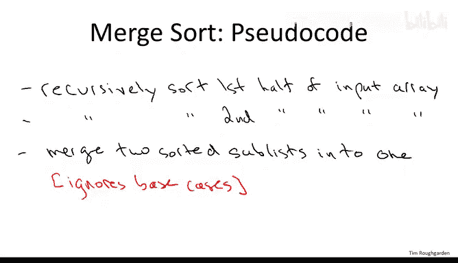
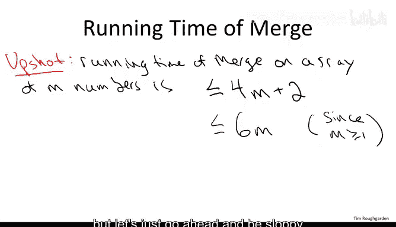
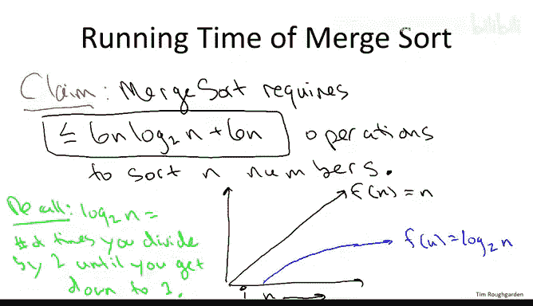

# 算法课程：06：归并排序伪代码与运行时间分析 🧠

在本节课中，我们将学习归并排序算法的具体伪代码实现，并对其运行时间进行深入分析。我们将从伪代码的讲解开始，逐步过渡到对算法效率的量化评估。

## 归并排序伪代码



上一节我们介绍了归并排序的基本思想，本节中我们来看看其具体的伪代码实现。首先，我们给出一个高层次的算法框架，暂时忽略合并子程序的具体实现细节。

以下是归并排序的顶层伪代码：


```pseudocode
MergeSort(A):
    if length(A) <= 1:
        return A
    else:
        left = MergeSort(A[0...mid])
        right = MergeSort(A[mid...end])
        return Merge(left, right)
```

这段伪代码体现了分治策略的核心：递归地将数组分成两半，分别排序，然后合并结果。需要说明的是，为了专注于核心概念，我们在此忽略了一些实现细节，例如处理奇数长度数组的边界情况，以及递归调用时如何传递子数组的具体编程语言细节。

## 合并子程序伪代码

归并排序中相对复杂的部分是合并步骤。递归调用完成后，我们得到两个已排序的子数组，需要将它们合并成一个完整的有序数组。

以下是合并步骤的详细伪代码：

```pseudocode
Merge(A, B):
    // A和B是两个已排序的输入数组
    // C是输出数组
    i = 0, j = 0, k = 0
    while k < length(A) + length(B):
        if i < length(A) and (j >= length(B) or A[i] <= B[j]):
            C[k] = A[i]
            i = i + 1
        else:
            C[k] = B[j]
            j = j + 1
        k = k + 1
    return C
```

合并算法的核心思想是：同时遍历两个已排序的子数组，每次比较两个数组当前指针所指的元素，将较小的元素复制到输出数组中，并移动相应的指针。这个过程持续进行，直到所有元素都被处理完毕。

## 合并子程序的运行时间分析

在了解了归并排序的伪代码后，我们自然要问：它比插入排序等简单算法好在哪里？本节我们将分析归并排序的运行时间。

我们首先分析合并子程序的运行时间，这是一个更简单的起点。根据上面的伪代码，我们可以逐条计算其执行的操作数量。

以下是合并子程序运行时间的粗略计算：

1.  初始化操作（`i=0, j=0`）：计为2次操作。
2.  `while`循环：执行 `m` 次（`m` 为两个子数组的总长度）。
    *   每次迭代包含一次比较、一次赋值和一次指针递增，计为3-4次操作。

综合来看，合并一个总长度为 `m` 的数组，运行时间最多为 `4m + 2` 次操作。为了后续分析的简便，我们可以使用一个更宽松但正确的上界：**最多 `6m` 次操作**。

## 归并排序的整体运行时间分析

分析归并排序的整体运行时间更具挑战性，因为它涉及递归调用。这里存在两种力量的博弈：一方面，递归导致子问题数量呈指数级增长；另一方面，每个子问题的规模在不断减半。



我们将证明以下关于归并排序运行时间上界的重要结论：


**归并排序对 `n` 个元素的数组进行排序，最多需要 `6n * log₂n + 6n` 次操作。**

这个结论表明，归并排序的运行时间与 `n log n` 成正比，而不是像插入排序那样与 `n²` 成正比。为了理解这个改进的意义，我们需要认识对数函数 `log n` 的增长速度远慢于线性函数 `n`，因此 `n log n` 比 `n²` 要小得多，尤其是在 `n` 很大时。

例如：
*   当 `n=32` 时，`log₂32 = 5`。
*   当 `n=1024` 时，`log₂1024 = 10`。

随着 `n` 的增大，`log n` 的增长极其缓慢，这使得归并排序在处理大规模数据时具有显著的速度优势。

---



本节课中我们一起学习了归并排序的伪代码实现，并对其运行时间进行了初步分析。我们了解到，归并排序通过分治策略，将排序问题分解为更小的子问题，并通过高效的合并步骤组合结果，最终实现了 `O(n log n)` 的时间复杂度，这比许多简单排序算法的 `O(n²)` 要高效得多。在接下来的课程中，我们将进一步深入证明这个运行时间上界。