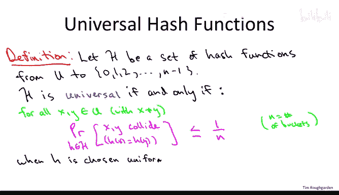
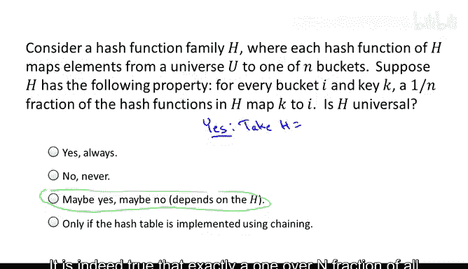
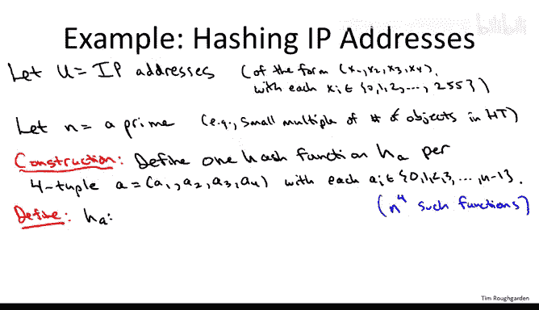
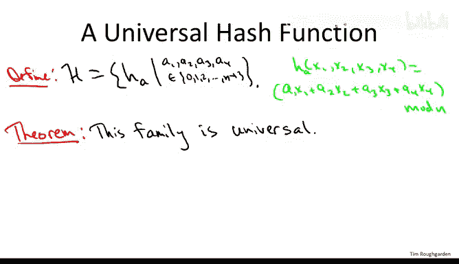
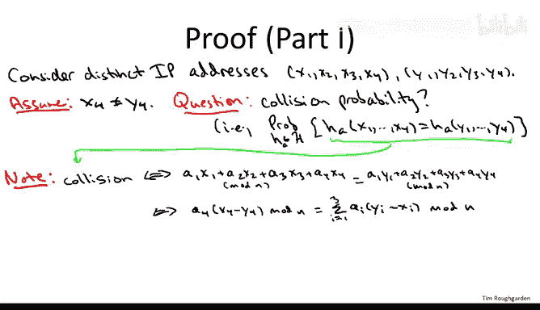
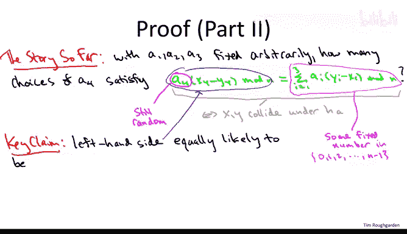

# 斯坦福大学《算法（分治／排序／搜索／随机算法、图搜索／最短路径／数据结构、贪心算法／最小生成树／动态规划、最短路径／NP）｜Algorithms》中英字幕 - P71：27_04_02_全域哈希定义与示例-进阶选学.zh_en - GPT中英字幕课程资源 - BV1Rx4y1U7sZ

So now that we understand why we can't have a single hash function which always does well on every single data。

 that is every hash function is subject to pathological datas。

 we'll discuss the randomized solution of how you can have a family of hash functions。

 and if you make a realtime decision about which hash function to use。

 you're guaranteed to do well on average， no matter what the data is。

So let me remind you of the three prong plan that I have for this part of the material。

 So in this video， we'll be covering the first two。So part one。

 which we'll accomplish on the next slide will be to propose a mathematical definition of a good random hash function so formally we're going to define a universal family of hash functions Now what makes this definition useful well two things and so part two will show that there are examples of simple and easy to compute hash functions that meet this definition that are universal in the sense described on the next slide so that's important and in the third part which willll do in the next video will be the mathematical analysis of the performance of hashing specifically with chaining when you use universal hashing and we'll show that if you pick a random function from a universal family then the expected performance of all of the operations are constant assuming of course that the number of buckets is comparable to the number of objects in the hash table which we saw earlier is a necessary condition for good performance。

So let's go ahead and get started， let's say what we mean by a good random hash function。

So for this definition， we'll assume that the universe is fixed， so maybe it's IP addresses。

 maybe it's our friend's names。Maybe it's configurations of a chessboard， whatever。

 but there's some fixed universe U， and we'll also assume we've decided on the number of buckets and。

Then we call the set H universal。If and only if it meets the following condition。In English。

 the condition says that for each pair of distinct elements。

 the probability that they collide should be no larger than with the gold standard of perfectly uniform random hashing。

 so for all distinct keys from the universe， call them X and Y。What we want is that the probability。

If we choose a random hash function， little H from the set script H。

The probability that x and y collide， and again， just to be clear what that means is that x and y hash to exactly the same bucket under this hash function little H。

This should be no more than one over。And don't forget， n is the number of buckets。And again。

 to interpret this you know one over n， where does this come from So we said earlier that an impractical。

 but in some sense， gold standard hash function would be to just independently for each key assign it bucket uniformly at random with different keys being assigned independently remember the reason this is not a practical hash functions because you'd have to remember where everybody went and that would basically require maintaining a list which would devolve to the list solution。

 So you don't want that。 you want hash functions where you have to store almost nothing where you can evaluate them in constant time。

 but if we throw out those requirements of small space in small time。

 then random functions should spread stuff out pretty evenly right I mean that's what they're doing。

 you're throwing darts completely at random at these end buckets So what would be the collision probability of two given keys。

 say of Aliceison of Bob if you're doing everything independently and uniformly at random Well you know first Alice shows up and it goes to some totally random bucket say bucket number 17 Now Bob shows up So what's the probability that it collides with Alice well these end buckets。

That Bob could go to each is equally likely and there's a collision between Alice and Bob if and only if Bob goes to bucket 17 since each bucket's equally likely that's an only one andN probability so really what this condition is saying is that for each pair of elements the collision probability should be as small as good as with the holy grail of perfectly random hashing。

So this is a pretty subtle definition， perhaps the most subtle one that we see in this entire course。

 so to help you just get some facility with this and to force you to think about it a little bit deeply。

 the next quiz， which is probably harder than a typical in-class quiz。

 asks you to compare this definition of universal hashing with another definition and asks you to figure out to what extent they're the same definition。

So the correct answer to this quiz question is the third one that there are hash function families H that satisfy the condition on this slide that are not universal。

 on the other hand there are hash function families capital H。

 which satisfy this property and are universal。So I'm going to give you an example of each。

 I'd encourage you to think carefully about why this is an example in a non example offline。

So an easy example to show that sometimes the answer is yes。

 you have universal hash function familiesami H， which also sat this property in the slide。

 would be to just take capital H to be the set of all functions from mapping the universe to the number of buckets。

So that's an awful lot of functions。 That's a huge set， but it's a set nonetheless。

 and by symmetry of having all of the functions， it both satisfies the property on this slide。

 it is indeed true that exactly a one over in fractionraction of all functions map arbitrary key K to an arbitrary bucket I and by the same reasoning by the same symmetry properties。

 this is universal。 So really， if you think about it choosing a function at random from capital H is now just choosing a completely random function。

 So that's exactly what we've been calling perfect random hashing。

 And as we discussed in the last slide that would indeed have a collision probability of exactly one over n for each pair of distinct keys。

 So this shows sometimes you can have both this property and the universal an example where you have the property in this slide。

 but you're not universal。

Would be to take H to be a quite small family， a family of exactly n functions。

 each of which is a constant function， so there's going to be one function which always maps everything the bucket  zero。

 that's a totally stupid hash function there's going to be another hash function which always maps everything to bucket number one that's a different but also totally stupid hash function and so on and then the end function will be the constant function that always maps everything the bucket n minus one。

And if you think about it， this very silly set H does indeed satisfy this very reasonable looking property on this slide。

 fix any key， fix any bucket， you know say bucket number 31 what's the probability that you pick a hash function that maps this key to bucket number 31 Well independent of what the key is it's going to be the probability that you pick the constant hash function whose output is always 31 since there's n different constant functions there's a one andN probability so that's an example showing that in some sense this is not as useful a property as the property of universal hashing so this is really not what you want or this is not strong enough universal hashing。

 that's what you want for strong guarantees。So now that we' spent some time trying to assimilate probably the subtlest definition we've seen so far in this class。

 let me let you in on a little secret about the role of definitions in mathematics so on the one hand I think mathematical definitions often get short shrift especially in you know the popular discussion of mathematical research that said you know it's easy to come up with one reason why that's true which is that。

Any smo can come up and write down a mathematical definition。 Nobody's stopping you。

 So what you really need to do is you need to prove that a mathematical definition is useful。

 So how do you indicate usefulness of a definition where you got to do two things。 First of all。

 you have to show that the definition is satisfied by objects of interest。 For us right now。

 objects of interest are hash functions we might imagine implementing so they should be easy to store easy to evaluate so they better be such hash functions meaning that complicated universal hash function definition。

 The second thing is is。Something good better happen if you meet the definition and in the context of hashing what good thing do we want to have happen。

 we want to have good performance So those are the two things that I owe you in these lectures。

 First of all， a construction of practical hash functions that meet that definition that's what we'll start on right now。

 Second of all， why meeting that definition is a sufficient condition for good hash table performance that'll be the next video。

So in this example， I'm going to focus on IP addresses。

 although the hash function construction is general， as I hope will be reasonably clear。

And as many of you know， an IP address is a 32 bit integer consisting of four different8 bit parts。

 so let's just go ahead and think of an IP address as a  four tuupple the way you often see it。

And since each of the four parts is eight bits， it's going to be a number between zero and 255。

And the hash function we're going to construct。 It's really not going be so different than the quick and dirty hash functions we talked about last video。

 although in this case， we'll be able to prove that the hash function family is， in fact， universal。

 And we're again going to use the same compression function。

 We're going to take the modulus with respect to a prime number of buckets。

 The only difference is we're going to multiply these X's by a random set of coefficients。

 We're going to take a random linear combination of X1 x2， X3 and X4。

 So' going to be a little more precise。 So we're going to choose a number of buckets in。

And as we've said over and over， the number of buckets should be chosen so that it's in the same ballpark of the number of objects you're storing。

 so you know let's say that n should be roughly double the number of objects that you're storing as an initial rule of thumb。

So for example， maybe we only want to maintain something in the ballpark of 500 IP addresses and we could choose end to be a prime like 997。

So here's the construction。Remember we want to produce not just one hash function。

 but the definition is about a universal family of hash functions。

 so we need a whole set of hash functions that we're ultimately going to choose one member from at random so how do we construct a whole bunch of hash functions in a simple way。

 here's how we do it。So we define one hash function。Which I'm going to note by H suba。

 a here is a four tuple。The component of which I'm going to call A1， A2， A3， and A4。

And all of the components of A are integers between0 and n minus1。

 so they're exactly in correspondence with the indices of the buckets。So if we have 997 buckets。

 then each of these AIs is an integer between zero and 996。

So it's clear that this defines you know a whole bunch of functions。

 so in fact for each of the four coefficients， that's four independent choices。

 you have n options Okay so each of the integers between zero and minus one for each of the four coefficients。

So that's fine， I've given a name to end the fourth different functions。

 but what is any given function， how do you actually evaluate one of these functions？

OkaySo remember what a hash function is supposed to do。

 remember how it type checks it takes as input something from the universe in this case an IP address and outputs a bucket number。

And the way we evaluate the hash function H subA， and you' got to remember A here is a  four tuupple。

And remember， an IP address is also a 4 tuupple， okay so each component of the IP addresses is between 0 and 255。

 each component of a is between0 and n minus1， so for example， between 0 and 996。

What we do is we just take the dot product or the inner product of the vector A and the vector X。

 and then we take the modulus with respect to the number of buckets。

 so that is we take A1 times x1 plus A2 times x2 plus A3 times x3 plus A4 times x4。Now， of course。

 remember the x's lie between 0 and 255， the AIs lie between 0 and n minus1， so say 0 and 996。

 you know so you do these four multiplications add up might get a pretty big number。

 you might well overshoots the number of buckets n so to get back in the range of what the buckets are actually indexed at the end。

 we take the modulus the number of buckets。 so in the end we do output a number between0 and n minus1 as desired。

So that's a set of a whole bunch of hash functions into the fourth hash functions and each one meets the criteria of being a good hash function from an implementation perspective right so remember we don't want to have to store much to evaluate a function and for a given hash function in this family all we got to remember are the coefficients A1。

 a2， a3 and A4 so just got to remember these four numbers and then to evaluate a hash function on an IP address we clearly do a constant amount of work we just do these four multiplications。

 the three additions and then taking the modulus by the number of buckets in so it's constant time to evaluate constant space to store。

And what's cool is using just these very simple hash functions。

 which are constant time to evaluate and constant space to store。

 this is already enough to meet the definition of a universal family of hash functions。

So this fulfills the first promise that I owed you after subjecting you to that definition of universal hashing。

 remember the first promise was that there are simple there are useful examples that meet the definition and then of course I tell you why meaning this definition is useful。

 why does it lead to good performance。But I want to conclude this video of actually proving this theem to you。

 arguing that this is， in fact， a universal family of hash functions。

so this will be a mostly complete proof and certainly we'll have all of the conceptual ingredients of why the proof works there'll be one spot where I'm a little hand wavy because we need a little number theory and I don't want to have a big detour into number theory and if you think about it you shouldn't be surprised that basic number theory plays at least some role as I said we should choose the number of buckets to be prime so that means at some point in the proof you should expect us to use the assumption that n is prime and pretty much always you're going to use that assumption to involve at least elementary number theory but I'll be clear about where I'm being hand wavy。

So what do we have to prove， let's just quickly review the definition of a universal hash function so we have our set H that we know exactly what it is。

 What does it mean that it's universal， it means for each pair of distinct keys So in our context it for each pair of IP addresses the probability that a random hash function from our family' script H causes a collision maps these two IP addresses to the same bucket should be no worse than with perfectly random hashing so no worse than one over n where n is the number of buckets。

 say like 997 So the definition we need to meet as a condition for every pair of distinct keys So let's just start by fixing two distinct keys。

So I'm going to assume for this proof that these two I addresses differ in their fourth component。

 That is I'm going to assume that x 4 is different than y4。 So I hope it's intuitively clear that。

 you know， it shouldn't matter you know which， which set of 8 bits I'm looking at。

 So they're different I addresses， They differ somewhere。

 If I really wanted I could have four cases that were totally identical depending on whether they differ in the first 8 Bs。

 the next 8 Bs， the next 8 Bs or the last 8 Bs。 I'm gonna show you one case because the other three are the same。

 So let's just think of the last 8 bits as being different。

AndNow remember where the definition asked us to prove。

 it asked us to prove that the probability that these two IP addresses are going to collide is at most one over n。

 so we need an upper bound on the collision probability with respect to a random hash function from our set of end of the fourth hash functions。

So I want to be clear on the quantifiers， we're thinking about two fixed IP addresses。

 so for example， the IP address for the New York Times website and the IP address for the CNN website。

We're asking for these two fixed IP addresses what fraction of our hash functions cause them to collide right we'll have some hash functions which map the New York Times and CNN IP addresses to the same bucket and we have other hash functions which do not map those two IP addresses to the same bucket and we're trying to say that the overwhelming majority sends them to different buckets。

 only a one over in fractionction at most sends them to the same bucket。

So we're asking about the probability for the choice of a random hash function from our set H。

That the function maps the two IP addresses to the same place。So the next step is just algebra。

 I'm just going to take this equation which indicates when the two IP addresses collide under a hash function。

 I'm going to expand the definition of our hash function。 remember it's just this inner product。

 modo， the number of buckets in， and I'm going to rewrite this condition in a more convenient way。

All right， so after the algebra and the dust has settled。

 we're left with this equation being equivalent to the two IP addresses colliding， so again。

 we're interested in the fraction of choices of A1 A2。

 A3 and A4 such that this condition holds sometimes it'll hold for some choices of the AIs。

 sometimes it won't hold for other choices andwining to show that almost never holds so it fails for all but a one over and fraction of the choices of the AIs。

So next we're going to do something a little sneaky。

 This trick is sometimes called the principle of deferred decisions。

 and the idea is when you have a bunch of random coin flips。

 it's sometimes convenient to flip some but not all of them。

 So sometimes fixing parts of the randomness clarifies the role that the remaining randomness is going to play That's what's going to happen here。

 So let's go ahead and flip the coins which tell us the random choice of a1 a2 and a3 So again remember in the definition of a universal hash function。

 you analyze collision probability under a random choice of a hash function。

 what does it mean to choose a random hash function for us it means a random choice of a1 and a2 and a3 and a4 So we're making four random choices and what I'm saying is let's condition on the outcomes of the first3。

 supposeupp we knew that a1 turns up 173 a2 shows up 122 and a3 shows up 723 but we don't know what a4 is a4 is still equally likely to be any of012 all the way up to N。

one。So remember that what we want to prove is that at most a1 over n fraction of the choices of a1 A2 A3 and A4 cause this underlyingd equation to be true。

 cause a collision， so what we're going to show is that for each fixed choice of a1。

 A2 and A3 at most a1 over n fraction of the choices of a4 cause this equation to hold and if we can show that for every single choice of a1 A2 and A3 no matter how those random coin flips come out。

 at most a one over n fraction of the remaining outcomes， satisfy the equation then we're done。

 it means that most a1 over n fraction of the overall outcomes can cause the equation to be true。

So if you haven't seen the principle of deferred decisions before。

 you might want to think about this a little bit offline。

 but it's easily justified by just say two lines of algebra。Okay。

 so we're done with a setup and we're ready for the meat of the argument。

So what we've done is we've identified an equation， which is now in green。

 which occurs if and only if we have a collision between the two IP addresses。

 and the question we need to ask is for our fixed choices of A1， A2 and A3。

 how frequently will the choice of A4 cause this equation to be satisfied， cause a collision？

Now here's why we did this trick of the principle of deferred decisions by fixing A1， A2 and A3。

 the right hand side of this equation is now just some fixed number between 0 and n minus1。

 so maybe this is 773。The X eyes's were fixed up front， the Y's were fixed up front， we fixed A1。

 A2 and A3 at the beginning at the end of the last slide。

 and those are the only ones involved in the right hand side。

 so this is 773 and over on the left hand side X4 is fixed， Y4 is fixed， but A4 is still random。

This is an integer equally likely to be any value between 0 and n minus1。Now here's the key claim。

 which is that the left hand side of this green equation is equally likely to be any number between0 and n minus1。

And I'll tell you the reasons why this key claim is true。

 although this is the point where we need a little bit of number theory。

 so I'll be kind of hand wavy about it。 So there's three things we have going for us。

 the first is that x4 and y4 are different。 remember our assumption at the beginning of the proof was that the IP addresses differ somewhere so why not just assume that they differ in the last8 bits of the proof again this is not important if you really wanted to be pedantic you could have three other cases depending on the other possible bits in which the IP addresses might differ but anyway so because x4 and y4 are different what that means is that x4 and minus y4 is not zero。

And in fact， now that I write this， it's jogging my memory of something that I should have told you earlier and forgot。

 which is that the number of buckets n should be at least as large as the maximum coefficient value。

 So for example， we definitely want the number of buckets n and this equation to be bigger than x4 and bigger than y4 And the reason is otherwise you could have x4 and y4 being different from each other。

 but the difference still ends up being 0 mod n So for example。

 suppose n was4 and x4 was 6 and y4 was 10。 then x4 minus-10 would be-4 and that's actually0 modular4。

 So that's definitely not what you want， you want to make sure that if x4 and y4 different than their difference is non-ze modo n。

 And the way you ensure that is you just make sure n is bigger than each。

 So you should choose the number of buckets bigger than the maximum value of a coefficient。

 So in our IP address example， remember the coefficients don't get bigger than 255。

 and I was suggesting a number of buckets equal to say 997。 Now in general。

 this is never a big deal in practice。 if you only wanted to use say 100。

So you didn't want to use 1000 you wanted 100 Well then you could just use smaller coefficients right you could just break up the IP address instead of into eight bit chunks。

 you could break it into six bit chunks or four bit chunks and that would keep the coefficient size smaller than the number of buckets。

 Okay， so really you choose the buckets first and then you choose how many bits to chunk your data into and that's how you make sure this is satisfied So back to the three things we have going for us and trying to prove this key claim So x4 and y4 a different So their difference is nonzero module N。

So second of all， n is prime that was part of the definition， part of the construction。

And then third， A4， this final coefficient is equally likely to take on any value between0 and n minus1。

So just as a plausibility argument， let me give you a proof by example， again。

 I don't want to detour into elementary number theory， although it's beautiful stuff。

 so I encourage those of you who are interested to go learn some and figure out exactly how you prove it。

 you really only need the barest elementary number theory to give a formal proof of this。

But just to show you that this was true in some simple examples。

 so let's think about a very small prime， let's just say there's seven buckets。

And let's suppose that the difference between x4 and y4 is2。Okay。

 so having chosen the parameters I've set n equal 7 I've set the difference equal to 2。

 what I want to do is I want to step through the seven possible choices of a4 and look at what we get in this blue circle quantity in the left hand side of the green equation。

 So we want to say the left hand side equally likely to be any of the7 numbers between 0 and 6。

 So that means that as we try our seven different choices for a4。

 we better get the seven different possible numbers as output。 So， for example。

 if we at a4 equal to0， then the blue circle quantity is certainly it' self0。 if we set it equal to1。

 then it's one times 2。 So we get two for2， we get two times 2， which is 4 for3。

 we get three times 2， which is6 Now， when we said a4 equal to 4， we get four times 2。

 which is8 modulo 7 is15 times 2 7 is 3，6 times 2 7 is 5。 So as we cycle through a 40 through 6。

 we get the value is 0，2，4，6，1，3，5。 So indeed we。through the seven possible outcomes one by one。

 So if a4 is chosen uniformly at random， then indeed this blue circled quantity will also be uniform at random。

So just to give another quick example， we can also keep n equals 7 and think about the difference of x4 and y4 again。

 we have no idea what it is then that it's nonze So you know maybe instead of three maybe maybe instead of two it's3。

 So now again， let's step through the seven choices of a4 and see what we get So now we're going to get0 then3 then6 then2 then5 and then1 and then4 So again stepping through the seven choices of a4 we get all of the seven different possibilities of this lefthand side and it's not an accident of these choices of parameters as long as n is prime x4 and y4 are different and y4 ranges overall all possibilities So will the value on the left hand side So by choosing a4 uniform the a randomum indeed the left hand side is equally likely to be any of its possible values012 up to n minus1 And so what does that mean well basically that means we're done with our proof because remember the right hand side that's circled in pink is fixed we fixed a1 a2 and a3。

 the x。And why has it been fixed all along so this is just some number like 773 and so we know that there's exactly one choice of a4 that will cause the left hand side to also be equal to 773 now a4 has in different possible values and it's equally likely to take one on so there's only a one andN chance that we're going to get the unlucky choice of a4 that causes the left hand side to be equal to 773 and of course there's nothing special about 773 doesn't matter how the right hand side comes out。

 we have an only one andN chance of being unlucky and having a collision and that is exactly the condition we are trying to prove and that establishes the universality of this function H of end of the fourth very simple。

 very easy to evaluate hash functions。