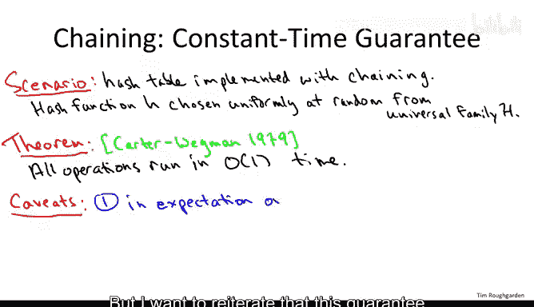
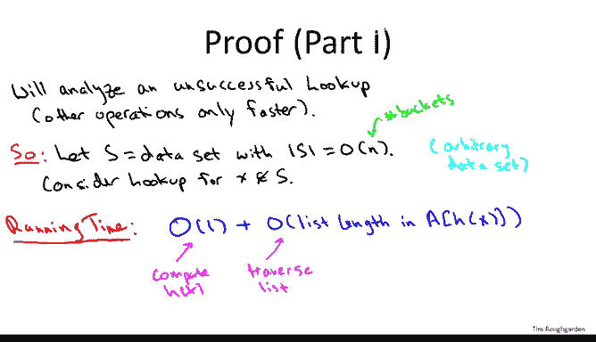
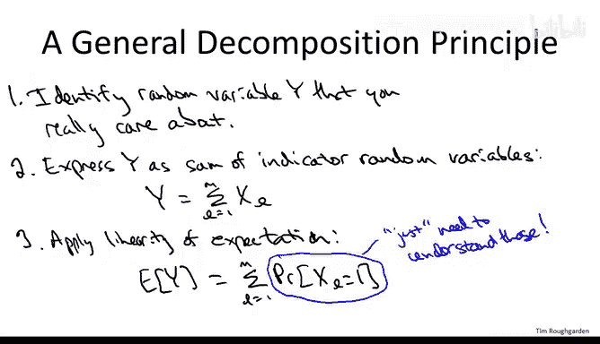
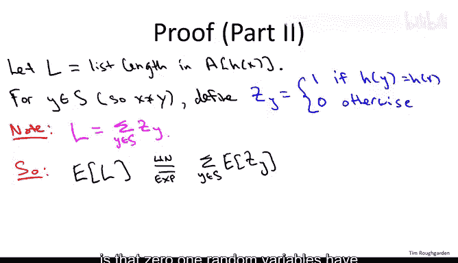
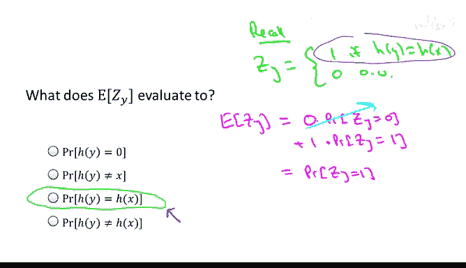
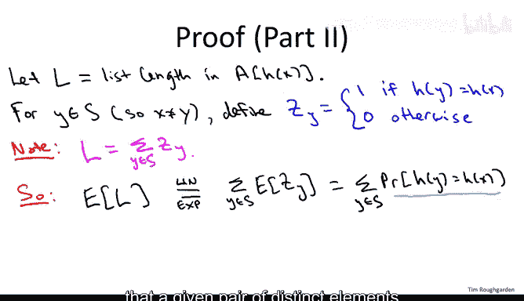
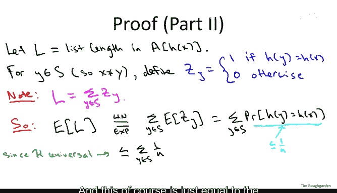

# 哈希表性能分析：28_04_03：全域哈希链式分析-进阶选学 🧮

在本节课中，我们将要学习如何形式化地分析哈希表的性能。我们将证明，如果从全域哈希函数族中随机选择一个哈希函数，并配合链地址法，那么哈希表的所有操作都能获得**期望的常数时间复杂度**。

---

## 哈希表性能保证概述

我们之前观察到，任何固定的哈希函数都可能遭遇最坏情况的数据集。作为解决方案，我们引入了**全域哈希函数族**的概念，它允许我们在运行时随机选择一个哈希函数。上一节我们看到了一个简单且高效的全域哈希函数族示例。

本节的目标是严格证明：如果你从一个全域哈希函数族（如上节所述）中均匀随机地选取一个哈希函数，那么哈希表的所有操作都能保证**期望的常数时间**性能。

---

## 全域哈希函数族定义回顾

在开始证明之前，让我们回顾一下全域哈希函数族的定义。这个定义是我们证明性能保证的基础。

我们讨论的是一个哈希函数集合 `H`。这个集合代表了所有你可能在运行时决定使用的哈希函数。宇宙 `U`（例如所有IP地址）和桶的数量 `n`（例如10000）是固定的。

一个函数族 `H` 被称为**全域的**，当且仅当对于宇宙 `U` 中任意两个不同的元素 `x` 和 `y`，以下条件成立：

**公式：**
`Pr_{h ∈ H}[h(x) = h(y)] ≤ 1/n`

这意味着，对于任意一对不同的IP地址，随机从族 `H` 中选择一个哈希函数 `h`，它们发生碰撞（被映射到同一个桶）的概率不超过 `1/n`。如果 `n = 10000`，那么这个概率最多是万分之一。

---

## 定理：卡特-韦格曼定理

我们现在要阐述并证明的定理，其思想源于卡特和韦格曼1979年的论文。它为哈希表的性能分析提供了一个清晰、模块化的框架。

**定理保证：**
对于使用链地址法（每个桶一个链表）实现的哈希表，如果我们从全域哈希函数族 `H` 中均匀随机地选择一个哈希函数 `h`，那么所有操作（插入、删除、查找）的**期望运行时间都是常数**。

**前提条件（注意事项）：**
1.  **期望值：** 保证是针对哈希函数 `h` 的随机选择取**期望值**。
2.  **任意数据集：** 此保证对**任意**存储在哈希表中的数据集 `S` 都成立。这类似于随机化快速排序的保证：无论输入是什么，期望运行时间都是 `O(n log n)`。
3.  **控制负载因子：** 要获得常数时间性能，必须确保哈希表的负载因子 `α` 是一个常数。
    **公式：**
    `α = |S| / n`
    其中 `|S|` 是表中对象的数量，`n` 是桶的数量。
4.  **哈希函数评估速度：** 评估哈希函数 `h` 本身必须在常数时间内完成。上节介绍的简单线性组合哈希函数满足此条件。

---

## 证明思路：聚焦于不成功查找

哈希表支持多种操作，但分析**不成功查找**的运行时间就足够了。在链地址法中，操作步骤是：先哈希到对应桶，再遍历该桶的链表。

不成功查找是最坏情况，因为它需要遍历完整个链表才能确认元素不存在。因此，我们分析不成功查找的时间。

**运行时间构成：**
1.  计算哈希值 `h(x)`：假设为常数时间 `O(1)`。
2.  遍历目标桶中的链表：时间与该链表的长度成正比。

因此，关键在于分析目标桶的链表长度。我们将其定义为一个随机变量 `L`。

**公式：**
`查找时间 = O(1) + O(L)`

由于 `L` 依赖于随机选择的哈希函数 `h`，所以 `L` 本身是一个随机变量。我们的目标是计算其期望值 `E[L]`。如果 `E[L] = O(1)`，那么期望查找时间就是 `O(1)`。

---

## 分解原理的应用

为了计算 `E[L]`，我们将使用一个强大的通用技巧：将复杂随机变量分解为简单的指示器随机变量之和，然后利用期望的线性性质。

以下是三个步骤：
1.  **识别目标变量：** 我们关心的是链表长度 `L`。
2.  **分解为指示器变量：** 将 `L` 表示为多个 0/1 随机变量的和。
3.  **应用线性期望：** `E[L]` 等于这些指示器变量期望值的和。

接下来，让我们应用这个原理。

---

## 将链表长度分解为指示器变量

设数据集为 `S`（哈希表中存储的对象）。我们正在查找一个不在 `S` 中的对象 `x`。

对于数据集 `S` 中的每一个对象 `y`，我们定义一个指示器随机变量 `Z_y`：

**公式：**
`Z_y = 1`，如果 `h(y) = h(x)`（即 `y` 与 `x` 碰撞）
`Z_y = 0`，其他情况

`Z_y` 指示了特定的 `y` 是否不幸地与我们要查找的 `x` 被映射到了同一个桶。

现在，观察链表长度 `L`。`L` 恰好等于所有与 `x` 碰撞的 `y` 的数量。因此，我们可以写出：

**公式：**
`L = Σ_{y ∈ S} Z_y`

这个等式恒成立，无论选择了哪个哈希函数 `h`。

---

## 计算期望链表长度

现在我们计算 `E[L]`。

**公式推导：**
`E[L] = E[ Σ_{y ∈ S} Z_y ]` （根据分解）
`= Σ_{y ∈ S} E[ Z_y ]` （根据期望的线性性质）

对于一个 0/1 指示器随机变量 `Z_y`，其期望值恰好等于 `Z_y = 1` 的概率。

**公式：**
`E[ Z_y ] = Pr( Z_y = 1 ) = Pr( h(y) = h(x) )`

这个概率就是对象 `y` 与查找键 `x` 发生碰撞的概率。

---

## 应用全域哈希性质

根据全域哈希函数族的定义，对于任意两个不同的元素 `x` 和 `y`，碰撞概率有上界：

**公式：**
`Pr( h(y) = h(x) ) ≤ 1/n`

其中 `n` 是桶的数量。

将此上界代入我们的期望计算中：

**公式推导：**
`E[L] = Σ_{y ∈ S} E[ Z_y ]`
`≤ Σ_{y ∈ S} (1/n)`
`= |S| / n`
`= α` （负载因子）

我们之前假设负载因子 `α` 是一个常数（即 `|S| = O(n)`）。因此，我们得到：

**公式：**
`E[L] ≤ α = O(1)`

---

## 完成证明

我们已经证明了，在随机选择的全域哈希函数下，不成功查找时期望遍历的链表长度 `E[L]` 是一个常数。

由于：
1.  计算哈希函数需要常数时间。
2.  期望的链表遍历时间是常数。

因此，**不成功查找的期望总时间是常数** `O(1)`。这个结论自然延伸到插入、删除和成功查找操作（它们的运行时间不会比不成功查找更差）。

至此，卡特-韦格曼定理得证。

---

## 总结 🎯

本节课中，我们一起学习了如何严格分析哈希表的性能。我们证明了：

*   通过使用**链地址法**和从**全域哈希函数族**中随机选择的哈希函数，可以保证哈希表操作具有**期望的常数时间复杂度**。
*   证明的关键步骤是：
    1.  将性能分析归结为计算目标桶的**期望链表长度** `E[L]`。
    2.  利用**指示器随机变量**和**期望的线性性质**，将 `E[L]` 的计算转化为求和问题。
    3.  应用**全域哈希**的定义，将碰撞概率上界为 `1/n`。
    4.  最终得出 `E[L] ≤ α`，在负载因子 `α` 为常数的条件下，`E[L] = O(1)`。

这个定理完美地实现了我们最初的目标：一种对任意输入数据都有效的、具有期望常数时间性能的哈希表方案。