# 斯坦福大学《算法（分治／排序／搜索／随机算法、图搜索／最短路径／数据结构、贪心算法／最小生成树／动态规划、最短路径／NP）｜Algorithms》中英字幕 - P73：29_04_04_开放寻址哈希表性能-进阶选学.zh_en - GPT中英字幕课程资源 - BV1Rx4y1U7sZ

In the last video， we discussed the performance of hash tables that are implemented using chaining using one linked list per bucket。

 In fact， we proved mathematically that if you use a hash function chosen uniformly at random from a universal family。

 And if you keep the buckets， number of buckets comparable to the size of your dataset。 Then in fact。

 your guaranteed constant time expected performance。

 But recall that chaining is not the only implementation of hash tables， there's a second paradigm。

 which is also very important called open addressing。

 this is where you're only allowed to store one object in each slot and you keep searching for an empty slot when you need to insert a new object into your hash table。

Now， it turns out it's much harder to mathematically analyze hash tables implemented using openAdding。

 but I do want to say a few words about it to give you the gist of what kind of performance you might hope to expect from those sorts of hash tables。

So recall how open addressing works， we're only permitted to store one object in each slot。

 so this is unlike the case with chaining where we can have an arbitrarily long list in a given bucket of the hash table。

With the most one object per slot， obviously open addressing only makes sense when the load factor alpha is less than one。

 when the number of objects you're storing in your table is less than the number of slots available。

 because of this requirement that we have at most one object per slot。

 we need to demand more of our hash function。 So our hash function might ask us to put a given object say with some IP address into say bucket number 17。

 but bucket number 17 might already be full， might already be populated。 So in that case。

 we go back to our hash function and ask it where to put where to look for an at slot next。

 So maybe it tells us to next look in bucket 41 and 41 is full it tells us to look in bucket number 7 and so on。

Two specific strategies for producing a probe sequence that we mentioned earlier were double hashing and linear probing。

 Do hashing is where you use two different hash functions。

 H1 and H2 H1 tells you which slot and which to search first。

 and then every time you find a full slot， you add an increment which is specified by the second hash function H2 Linear probing is even simpler。

 you just have one hash function that tells you where to look first。

 and then you just add one to the slot until you find an empty slot。As I mentioned at the beginning。

 it is quite nontrial to mathematically analyze the performance of hash tables using these various open addressing strategies。

It's not impossible there is some quite beautiful and quite informative theoretical work that does tell us how hash tables perform。

 but that's well outside the scope of this course。So instead what I want to do is I want to give you a quick and dirty calculation that suggests。

 at least in an idealized world， what kind of performance we should expect from a hasht with open addressing if it's well implemented as a function of the load factor alpha。

Precisely， I'm going to introduce a heuristic assumption。

 it's certainly not true but we'll do it just for a quick and dirty calculation that we're using a hash function in which each of the nfactorial possible probe sequences is equally likely。

Now no hash function you're ever going to use is actually going to satisfy this assumption and if you think about it for a little bit。

 you'll realize that if you use double hashing or linear probing。

 you're certainly not going to be satisfying that assumption。

 so this will still give us a kind of bestcase scenario against which you can compare the performance of your own hash table implementations so if you implement implement a hash table and you're seeing performance as good as what's suggested by this idealized heuristic analysis then you home free。

 you know your hash table is performing great。

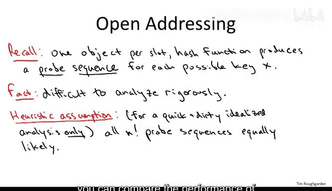

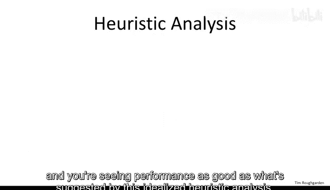

So what is the line in the sand that gets drawn under this heuristic assumption。

 what is this idealized hash function performance as a function of the load alpha， well here it is。

What I'm gonna argue next is that under this heuristic assumption the expected amount of time to insert a new object into the hash table is going to be essentially one over one minus alpha where alpha is the load remember the load is the number of objects in the hash table divided by the number of available slots So if the hash table is half full then alpha is going to be 0。

5 if it's 75% full then alpha is going to be three quarters So what this means is that in this idealized scenario。

 if you keep the load pretty under control so say if the load is 50% then the insertion time is going to be great if alpha is 0。

5， then one over one minus alpha is equal to two so you expect just two probes before to successfully insert a new object and of course if you're thinking about lookup that's going to be at least as good as insert so if you're lucky a lookup might terminate early if you find what you're looking for in the worst case you go all the way until an empty slot and an unsuccessful search and that's going to be the same as insertion So if alpha is small bounded away from one。

're getting constant time performance on the other hand。

 as the hash table gets full as alpha gets close to one， this operation time is blowing up。

 it's actually going to infinity as alpha gets close to one。

 So even if you have a 90% full hash table with open addressing you're going to start seeing 10 probes so you really want to keep hash tables with open addressing you want to keep the load under control。

 Certainly no more than probably 0。7 maybe even less than that to refresh your memory with chaining hash tables perfectly well defined even with load factors bigger than one what we derived is that under universal hashing under a weaker assumption we had an operation time of one plus alpha for a load of alpha So with chaining。

 you just got to keep alpha to be most some reasonably small constant with open addressing。

 you really got to keep it well bounded away below one。

So next let's understand why this observation is true。

 why under the assumption that every probe sequence is equally likely。

 do we expect a1 over1 minus alpha running time for hash tables with open addressing？

So the reason is pretty simple and we can derive it by analogy with a simple coin fliplipping experiment。

 so to motivate the experiment， think just about the very first probe that we do okay so we get some new objects。

 some new IP address that we want to insert into our hash table let's say our hash table is currently 70% full say there's 100 slots。

 70 are already taken by objects Well when we look at this first probe by assumption it's equally likely to be any of the 100 slots。

 70 of which are full， 30 of which are empty so with probability 1 minus alpha or in this case 30%。

 our first probe will luckily find an empty slot and will be done we'll just insert the new object into that slot。

If we get unlucky with probability 70% we find a slot that's already occupied and then we have to try again。

 so we try a new slot drawn a random and we again check is it full or is it not full and again with 30% probability essentially it's going to be empty and we can stop and if it's already full then we try yet again so doing random probes looking for an empty slot is tantamount to flipping a coin with probability of heads 1 minus alpha or in this example 30% and the number of probes you need until you successfully insert is just the number of times you flip this bias coin until you see a heads。

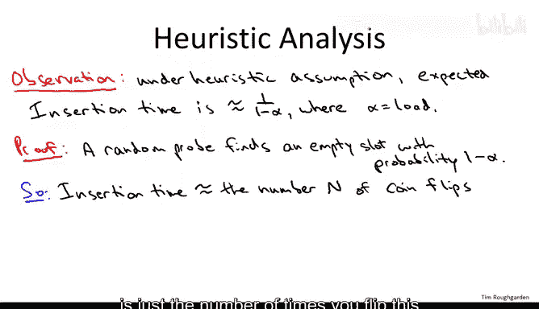

In fact， this biased coin flipping experiment slightly overestimates the expected time for insertion under the heuristic assumption and that's because in the insertion time we're never going to try the same slot twice we're going to try all n buckets in some order with each of the n factorial orderings equally likely So back to our example where we have a hash table with 100 slot 70 of which are full the first probe indeed we have a 30 and 100 chance of getting an empty slot。

 If that one fails， then we're not going to try the same slot again so there's only 99 residual possibilities again 30 of which are empty the one we checked last time was full So actually have a 30 over 99% chance of getting empty slot in the second try 30 over 98 on the third try if the second one fails and so on but a valid upper bound is just to assume a 30% success probability with every single probe and that's precisely what this coin flipping experiment will get us So the next quiz will ask you to actually computes the expected。

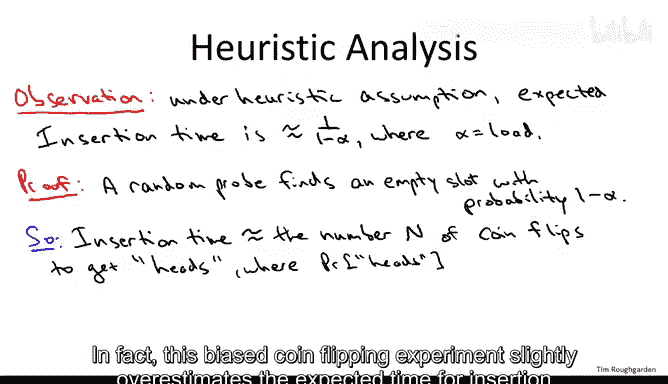

Vue of capital n， the number of coin flips needed to get heads when you have a probability of heads of one minus alpha as a hint we actually analyze this exact same coin flipping experiment when alpha equals a half back when we discussed the expected running time of randomized linear time selection。

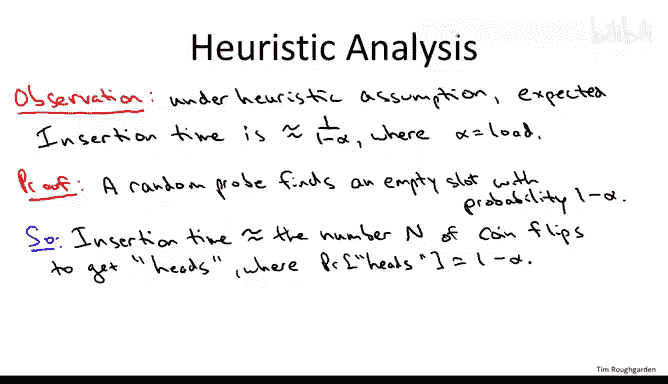

AlrightSo the correct answer is the first one， one over one minus alpha。

 So to see why let's return to our derivation， where we reduced analyzing the expected insertion time to this random variable。

 the expected number of coin clips until we see a heads so I'm going to solve this exactly the same way that we did it back when we analyzed the randomized selection algorithm and it's quite a sneaky way but very effective。

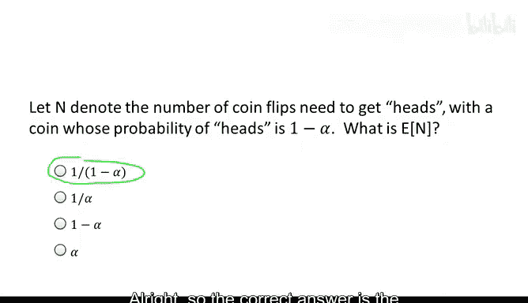

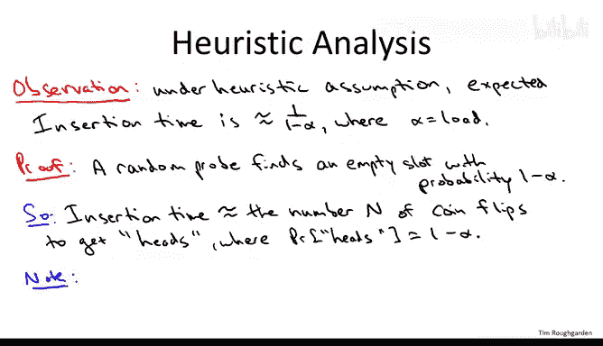

What we're going to do is we're going to express the expected value of capital N in terms of itself and then solve。

So how do we do that， well on the left hand side， let's write the expected number of coin flips。

 the expected value of capital N。And then let's just notice that there's two different cases。

 either the first coin flip is a heads or it's not。 So in any case。

 you're certainly going to have one coin flip。So let's separate that out and count it separately。

With probability alpha， the first coin flip is going to be tails and then then you start all over again and because it's a meist process。

 the expected number of further coin flips one requires。

 given that the first coin fliplip was tails is just the same as the expected number of coin flips in the first place。

So now it's a simple matter to solve this one linear equation for the expected value of n。

 and we find that it is indeed1 over one minus alpha as claimed。

Summarizing under our idealized heuristic assumption that every single probe sequence is equally likely。

 the expected insertion time is upper bounded by the expected number of coin flips。

 which by this argument is the most1 over1 minus alpha so as long as your load alpha is well bounded below one。

 your're good， at least in this idealized analysis， your hash table will work extremely quickly。Now。

 I hope you're regarding this idealized analysis with a bit of skepticism from a false hypothesis。

 you can literally derive anything you want。 and we started with this assumption。

 which is not satisfied by hash functions you're actually going to use in practice。

 this heuristic assumption that all probe sequences are equally likely。

 So should you expect this one over one minus alpha bound to hold in practice or not。

 Well that depends to some extent， it depends on what open addressing strategy you're using。

 it depends on how good a hash function you're using。

 It depends on whether the data is pathological or not。 So just to give course rules of thumb。

 if you're using double hashing and you have nonpathological data。

 I would go ahead and look for this one over one minus alpha bound in practice。

 So implement your hash table， check its performance as a function of a load factor alpha and shoot for the one over one minus alpha curve。

 that's really what you'd like to see。 with linear probing on the other hand。

 you should not expect to see this performance guarantee of one over one minus alpha even in a totally idealized scenario。

 Remember linear probing is the strategy where。Initial probe the hash function tells you where to look first and then you just scan linearly through the hash table until you find what you're looking for。

 an empty slot， the object you're looking up or whatever so with linear probing even in a bestcase scenario it's going to be subject to clumping you're going to have contiguous groups of slots which are all full and that's because of linear probing strategy I encourage you to do some experiments with implementations to see this for yourself so because of clumping with linear probing even in the idealized scenario you're not going to see one over one minus alpha however you're going to see something worse but still in idealized situations quite reasonable so that's the last thing I want to tell you about in this video。

Now， needless to say with linear probing， the heuristic assumption is badly false。

 the heuristic assumption is pretty much always false no matter what hashing strategy you're using。

 but with linear programming， it's quote unquote really false so to see that the heuristic assumption so that all in factorial probe sequences are equally likely so your next probe is going to be uniform at random amongst everything you haven't probed so far。

 but with linear probing it's totally the opposite once you know the first slot that you're looking into say bucket 17 slot 17 is going to be the first slot you know the rest of the sequence because it's just a linear scan through the table So it's kind of diametrically opposite from each successive probe being independent from the previous ones except for not exploring things twice。

So to state a conjectured or idealized performance guarantee for hash tables with linear probing。

 we're going to replace the blatantly false heuristic assumption by a still false but more reasonable heuristic assumption so what do we know we know that the initial probe with linear probing determines the rest of the sequence so let's at least assume that these initial probes are uniform at random and independent for different keys。

 Of course once you know the initial probebing know everything else。

 but let's assume independence and uniformity amongst the initial probes。

 Now this is a strong assumption this is way stronger than assuming you have a universal family of hash functions。

 this assumption is not satisfied in practice， but that performance guarantees we can derive under this assumption are typically satisfied in practice by well implemented hash tables that use linear probing so the assumption is still useful for deriving the correct idealized performance of this type of hash table。

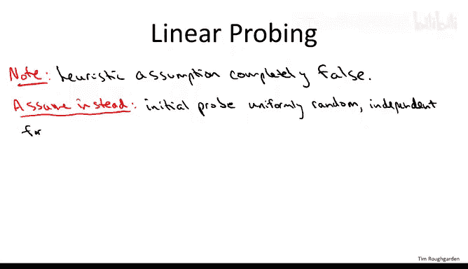

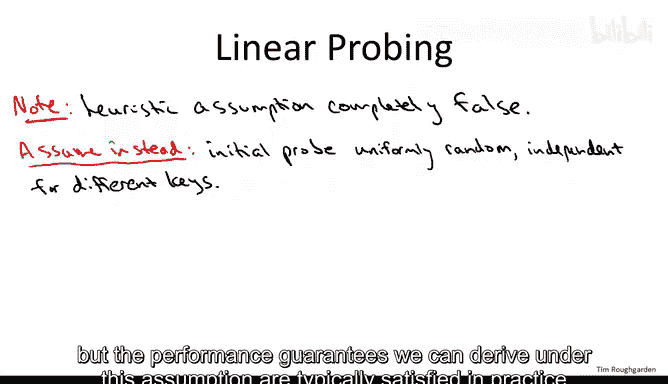

So what is that performance， well， this is a utterly classic result from exactly 50 years ago from 1962。

And this is a result by my colleague， the Living legend Don Kanuth。

 author of Art of Comp programminging。And what Kauth proved was that under this。

Weaker heuristic assumption suitable for linear probing。

The expected time to insert an object into a hash table with load factor alpha when you're using linear probing is worse than  one over1 minus alpha。

 but it is still a function of the load alpha only and not a function of the number of objects in the hash table。

 So that is with linear probing， you will not get as good a performance guarantee。

 but it is still the case that if you keep the load factor bounded away from one。

 If you make sure the hash table doesn't get too full。

 you will enjoy constant time operations on average。So for example， if with linear probing。

 your hash table is 50% full， then you're going to get an expected insertion time of roughly four probes note however。

 this quantity does approach does blow up pretty rapidly as the hash table grows full if it's 90% full this is already going be something like100 probes on average so you really don't want to let hash tables get too full when you're using linear probing you might well wonder if it's ever worth implementing linear probing。

 given that it has the worst performance curve1 over one minus alpha squared。

 then the performance curve you'd hope from something like double hashing one over one minus alpha and it's a tricky cost benefit analysis between linear probing and more complicated but better performing strategies that really depends on the application there are reasons that you do want to use linear probing sometimes it is actually quite common in practice for example it often interacts very well with memory hierarchies So again as with all of this hashing discussion the cost and benefits are very subtle tradeoffs between the different approaches if you have mission critical code that's using a hash。

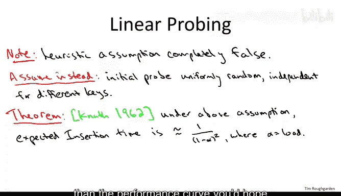

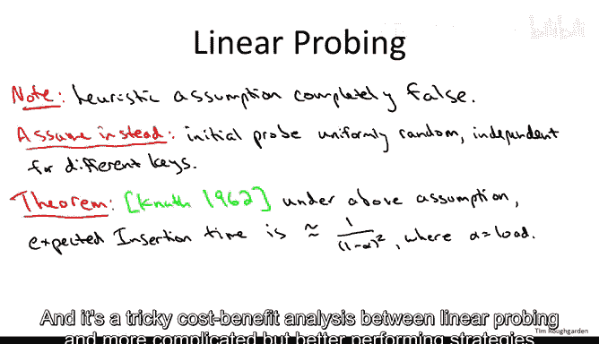

And you want to really optimize it， try a bunch of prototypes and just test。

 figure out which one is the best for your particular application。

So let me conclude the video with a quote from Kauth himself where he talks about the rapture of proving this 1 over 1 minus alpha squared theorem and how it was life changing。

 he says I first formulated the following derivation， meaning the proof of that last theorem in 1962。

 ever since that day the analysis of algorithmms has in fact been one of the major themes in my life。

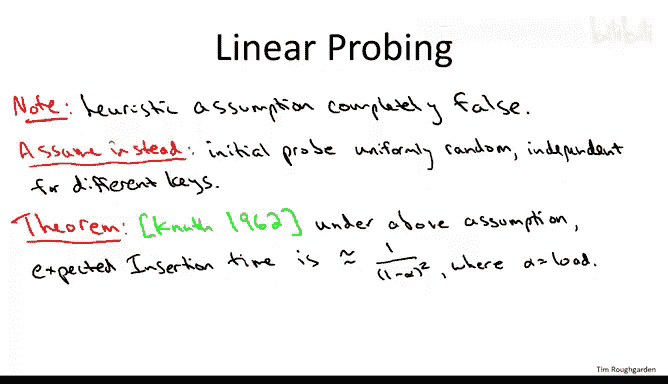