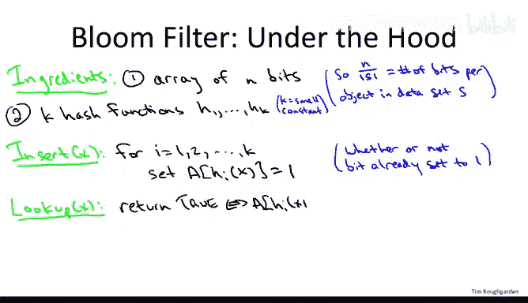

# 斯坦福大学《算法（分治／排序／搜索／随机算法、图搜索／最短路径／数据结构、贪心算法／最小生成树／动态规划、最短路径／NP）｜Algorithms》中英字幕 - P74：30_04_01_布隆过滤器基础.zh_en - GPT中英字幕课程资源 - BV1Rx4y1U7sZ

So in this video we're going to discuss Bloom filters。

 which is a data structure developed appropriately enough by Burton Bloom back in 1970 Bloom filters are a variant on hash tables you'll recognize a lot of the ideas from our hash table discussion the win that you get in bloomlo filters is they're more space efficient than run of the mill hash tables on the other hand they do allow for errors there is a non-zero false positive probability when you do lookups but that's still a win for some application so it's a very cool idea of very cool data structure you do see it use quite a bit in practice so let's start talking about them。

So we'll go through the usual topics that we do whenever we discuss a new data structure。

 So first I want to tell you what operations they support and what kind of performance you can expect from those operations So in other words。

 what is the API corresponding to the data structure Secondly I'm going talk a little bit about what it's good for so what are some potential applications then we'll take a peek under the hood I'll tell you some of the implementation details with an emphasis on explaining why you get the kinds of performance tradeoffs that you do with B filters So to first order the razon detra of a B filter is exactly the same as a hash table It supports superfa inserts superfast lookup so you can put stuff in there and you can remember what you put in earlier。

Now， of course， what you should be wondering is while we already know a data structure that supports super fastst in certain lookups a hash table。

 why am I bothering to tell you about yet another data structure with exactly those same operations So let me tell you about the pros and cons of B filters relative to run of the mill hash tables as we've already discussed。

The big win is that bloom filters are more space efficient than hash tables。

 no matter whether they're implemented with chaining or with open addressing。

 you can store much less space per object， in fact， as we'll see。

 less space than that of an object itself using a bloom filter as far as the cons。 Well。

 first of all， this is really for applications where you just want to remember what kind of values you've seen。

 you're not trying to store pointers to the objects themselves。

 you're just trying to remember values。 So the first drawback of a bloom filter is that because we want to be so space efficient。

 We don't even want to remember the objects itself， just whether or not we've seen it before。

 we're not going to be able to store the objects or even pointers to the objects in a bloom filter。

 we're just going remember what we've seen and what we haven't。

So some of you might know the terminology hash set for this kind of variant of a hash table as opposed to a full blownown hash table or a hash mapap。

 The second con is at least in the vanilla implementation of bloom filters that I'm going to describe here。

 deletions are not allowed。 You can only insert， you can't delete the situation with deletions is very much similar to hash tables implemented with open addressing It's not that you can't have a bloom filter that accommodates deletions you can there are very evidence of it。

 but it requires significantly more work and we're not going to discuss it here。 So to first order。

 at least for vanilla bloom filters， you want to think of them as suitable for applications where deletions are not a first order operation。

Now the third con， and this is a drawback we have not seen previously in any data structures。

 is bloom filters can actually make mistakes。Now， what kind of mistake could this kind of data structure possibly make All you're really doing is looking something up Well。

 one mistake would be a false negative。 and that means you've inserted something previously。

 then you look it up and the hash table or the bloom filter says it's not there。

 So bloom filters will not have false negatives of this form you insert something you look it up later。

 it's definitely going confirm that you've inserted it in the past but bloom filters will have false positives。

 that means that despite the fact you've never inserted。

 say a given IP address into the bloom filter， if you look it up later。

 it will say that you have So that will sometimes be in some sense phantom objects in bloom filters objects。

 which it thinks have been inserted even though they haven't been So given that I'm now showing you two data structures with essentially the same functionality hash tables and bloom filters。

 at least if we ignore the deletion issue you might well wonder which one is more appropriate。

 which one is more useful And because there are these tradeoffs between the two。

 the answer as you'd expect is。Deds on the application so if it's an application where space is really at a premium。

 you might want to turn to bloom filters， especially if a small chance of a false positive is not a deal breaker if you have some kind of application where false positives are absolutely out of the question。

 of course you should not use a bloom filter and you want to think about a hash table。

So what are some situations where people actually do use bloom filters where you either really care about space and or you don't really care about this false positive probability？

But one of the earliest applications of bloom filters， this is now a long time ago。

 this is something like 40 years ago。Was to spell checkers。

 so how would you implement a spell checker using a bloom filter while first you have this insert phase where you basically just go through the entire dictionary word by word and you insert every valid word into the bloom filter。

Then afterwards， when you're presented with a new document that somebody's written。

 you're going to go through the document word by word And for each word。

 you say is this in the bloom filter。 That is is this one of the legitimate words from the dictionary。

 which was previously inserted。 If the bloom filter says yes。

 this word is in the dictionary is we've seen it before then you treat it as a correctly spelled word and if it's not in the bloom filter。

 then you treat it as an incorrectly spelled word Now the false positive probability means this isn't a perfect spell checker。

 I means sometimes you're going look up a misspelled word and the bloom filter won't catch it it will actually say yes。

 with small probability will say this is a legitimate word。 So you know that's not ideal。

 but you know the English language is pretty big and space was definitely at a premium 40 plus years ago。

 So it was a win for that application at that time to use bloom filters to implement a spell checker。

Another application， which remains relevant today。Is to keep track of a list of forbidden passwords now why would you have forbidden passwords。

 well maybe you want to keep track of passwords which are too weak or too easy to guess or too common。

You may yourself have used a piece of software or a website at some point where it asked you for a password and if you typed in something which is too simple or too easy。

 it rejected it and asked you to type in another one So one way to implement this list of forbidden passwords is just with a B filter and the idea is similar to the spell checker you first insert into the B filter。

 all of the passwords that you don't want anybody to use for whatever reason then when a client comes and tries to type in a new password you look it up in the bloom filter and if you get a positive lookup then you tell the user nope that's no good you can't use that password choose another one。

And this is an application where you really don't care about the errors。

 You really don't care about the fact that there's a false positive rate。

 Let's assume that the error rate is something like 1% or 0。1%。

 So what would that mean in this context， that would just mean that once in a while。

 one in 100 clients or one in 100 clients actually types in a perfectly strong password that gets rejected by the bloom filter and they have to type in a second one。

 but big deal。 And if spaces at a premium， this is definitely a win to use the super lightweight data structure to keep track of these blocked passwords。

 these days， certainly one of the killer applications of bloom filters is in software deployed on network routers。

 So the machinery out in the Internet， which is responsible for transmitting packets from one place to another。

So one of the reasons why Blo filters have found fertile application in network routers Well first of all you do have a budget on space typically in network routers is's a lot of things they got to do and you don't want to waste that much of it on just some random of data structure to do one specific task so you do have a budget on space and also you need super super fast data structures right because packets are coming in at this torrential rate which you can't even imagine and you want to process these packets in real time sending them off to the next hop Blo filters are the workhorse behind a lot of different tasks that is done at a network router you could imagine wanting to keep track of blocked IP addresses you can imagine keeping track of the contents of some cache so you don't do spurious lookups you can imagine maintaining statistics to check for denial of service attacks and so on and so forth。

So summarizing as an expert programmer， what is it you should remember about B filters what purpose does this tool serve in your toolbox Well as far as the operation supported it's the same as a hash table。

 the point is to have super fast inserts super fast lookups but bloom filters are a more lightweight version of a hash table so they're more space efficient but they do have this drawback of having this small error probability so those are the key features you should remember when deciding whether or not you're working on application that could make good use of this data structure。

So having discussed what are the operations and what these data structures are good for。

 let's take it to the next level， let's peer under the hood and see how they're actually implemented because this is really a quite simple。

 quite cool idea。So like hash tables， bloom filters have essentially two ingredients。

 first of all there is an array and second of all there' is a hash function。

 or in fact several hash functions。So we're going to have a random access of an array。

 except instead of having end buckets or end slots as we've been calling them。

 each entry in this array is just going to be a single bit。

 each entry in this array can only take on two values zero or one。

And the way to think about the space occupied by a B filter is in terms of the number of bits per object that has been inserted into the B filter。

 so if you've inserted a data set capital S， then the total number of bits is n。

 the number of objects that have been inserted as the cardinality of S。

 so n over the cardality of S is the number of bits in this data structure。

That you're using per entry in the data set。Now you can tune a bloom filter so this ratio is any number of different quantities。

 but for now， I encourage you to think of this ratio as being8。

 That is for each object stored in the bloom filter you're using only 8 bits of memory that will help you appreciate just how amazing these data structures are because maybe our data set is something like IP addresses which are 32 B。

 So what I'm saying here if this is8 I'm saying we're not definitely not actually storing the IP address。

 So we have this 32 bit object we're inserting and we're only using 8 Bs of memory to somehow remember whether it's there or whether it's not And again。

 certainly 8 Bs per object is way less than keeping a pointer to some associated memory somewhere。

 So this is a really impressive minimal use of space to keep track of what we've seen in what we havet。

And secondly， we need mappings of given an object to say given an IP address。

 what are the relevant bits for seeing if we've seen this IP address before or not？

So in a bloom filter， it's important to have not one hash function， but several hash functions。

 So K is going to denote the number of hash functions in a bloom filter。

 we should think of K as some small constant somewhere you know3，4，5， something like that。

 So obviously it's a little bit more complicated to use multiple hash functions as opposed to just one hash function。

But it's really not that big a deal so recall from our discussion of say universal hashing。

 we identified entire families of hash functions which work well on average。

 so instead of choosing just one hash function at random from a universal family。

 you can make K independent dependent random choices from a universal family In fact in practice it seems to typically be enough to just use two different hash functions and then generate k different linear combinations of those two hash functions。

 but for the purposes of this video， let's just assume that we've done enough work to come up with K different good hash functions and that's what we're going to be using in our bloom filter。

So the code for both insert and delete is very elegant， so let's start by insertion。

 so suppose we have some new IP address and we want to stick it into this bloom filter。

 what do we do Well we just evaluate each of our K hash functions on this new object。

 each of those tells us an index into our array of bits and we just set those K bits equal to one。

And when we do this insert， we don't even bother to look at what the previous values of these bits were。

 so zero or one， we don't care， we just blithefully go in and set these Kbits equal to one。

 whatever they were before。So what about looking up how are we going to implement that well all we have to do is check for the footprint that was inevitably left by a prior insertion so if we're looking up an IP address and we know was inserted at some time in the past what happened when we evaluated the K hash functions we went to the appropriate positions in the array and we set all of those bits to one so now we just check that that indeed happen that is when we get a new IP address we're looking it up we evaluated the hash function。

 all K of them we look at the corresponding K positions and we verify that indeed those K bits have been set to one。

So what I hope is clear fairly quickly from inspecting this very elegant code is that we will not ever have false negatives yet we might have false positives。

 so let's discuss those one at a time。So remember， a false negative would mean that the bloom filter says something isn't there when in fact it is。

 that is we insert something and then we look it up later and the bloom filter rejects us Well that's not going to happen because when we insert something。

 we set the relevant K bits to one notice when a bit is one。

 it remains one forevermore bits are never reset back to zero so if anything was ever inserted and we subsequently look it up。

 definitely we will confirm that all of those bits are1 so we're never going to be rejected by something we inserted before。

On the other hand， it is totally possible that we will have a false positive。

 It's totally possible that there'll be a phantom object we'll do a lookup and the bloom filter will return yes when we never inserted that object。

 supposeuppose for example， the K equals 3， so we're using three different hash functions。

 consider some IP address fixed IP address， Maybe that the three hash functions tells us the relevant bits are 1723 and 36。

Maybe we never inserted this IP address， but we inserted IP address number two and in its insertion。

 the 17th bit got set to one。 we inserted some other IP address。

 IP address number3 and the 23rd bit got set to one and then we inserted IP address number4 and the 36th bit got set to three so three different IP addresses were responsible for setting these three different bits but whatever it's not like we're remembering that and then once we look up this IP address we really care about what do we do we just inspect bit 17 it's one In bit23 it's one we inspect bit 36 it's also one for all we know this thing really was inserted and B filter is going to say yes it's in the table So that's how we have false positives all of the bits that are indicating whether or not a given object or in the B filter were previously set by insertions from other objects。

So there are two points that I hope are clear at this stage of the discussion first of all that this boom filter idea does suggest the possibility of a superspace efficientff variant of a hash table right so we've been talking about setting the number of bits to be roughly say eight times the number of objects that you're storing so you're only using eight bits per object and for most objects that's going to be radically smaller than just a simple array storing the objects themselves again if they' IP addresses we're only have 25% much space as if we actually stored those IP addresses just in array with no extra bells and whistles。

The second point is that we're inevitably going to have some errors in a bloom filter。

 We will have false positives where we look something up。 It says it's there when in fact it's not。

 So those two points， I hope are clear。 what's actually not clear is the bottom line。

 I this actually a useful idea for this to be useful。

 it better be the case that the error probability can be quite small。

 even while the space per object is quite small。 If we can't get those two things small simultaneously。

 this is a bad idea， and we should just always use a hash table instead。

 So to evaluate the quality of this idea。 we're going to have to do a little bit of mathematical analysis。

 that's what I'm going to show you on the next couple slides。

