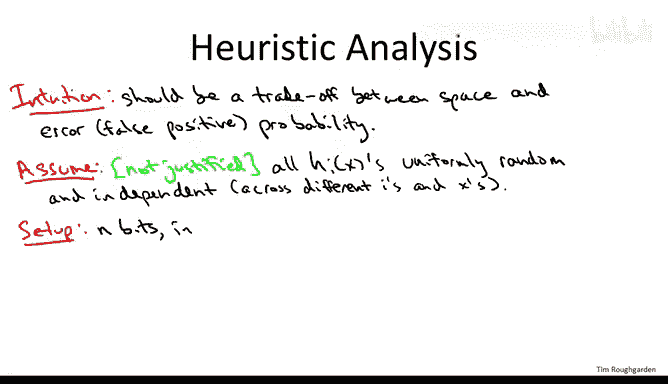
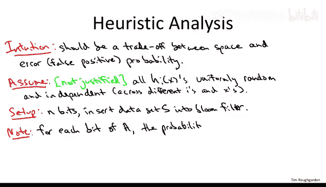
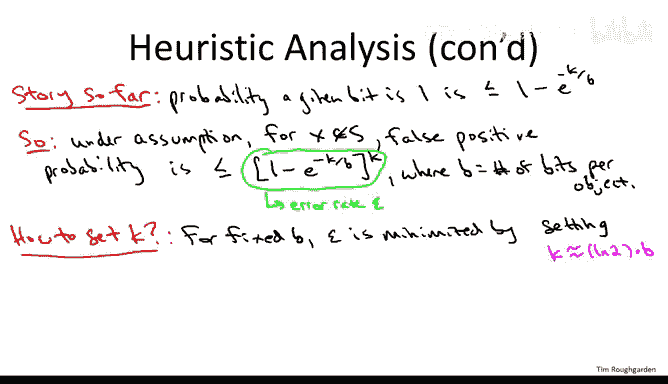

# 算法：31：布隆过滤器启发式分析

## 概述

在本节课中，我们将要学习布隆过滤器的启发式分析。我们将通过数学推导，精确地理解布隆过滤器在空间消耗与错误率之间的权衡关系，并找出一个能同时实现较小空间占用和可控错误概率的“最佳平衡点”。

---

## 空间与正确性的权衡

上一节我们介绍了布隆过滤器的基本工作原理。本节中我们来看看其核心的性能权衡。

直观上，布隆过滤器需要在两种资源之间进行权衡：一种是空间消耗（即使用的比特数），另一种是正确性（即错误率）。我们希望使用的空间越多，犯的错误就越少。反之，如果过度压缩表格，让更多不同的对象共享比特位，那么错误率就会上升。

我们接下来分析的目标，就是在定量层面上精确地理解这种权衡曲线。一旦理解了这条曲线，我们就能问：是否存在一个“最佳平衡点”，能让我们得到一个既节省空间，错误概率又可管理的有用数据结构？

---

## 启发式分析假设

为了进行数学分析，我们将采用一个启发式假设。这个假设非常强，在实际应用中使用的哈希函数通常无法满足它，但它能帮助我们推导出布隆过滤器的性能保证。在实际实现中，你应该验证你的实现是否达到了理想分析所预测的性能。如果使用良好的哈希函数和非病态数据，许多实证研究表明，性能将与启发式分析的预测相当。

以下是该假设的具体内容：
*   我们假设所有的哈希行为都是完全随机的。
*   对于每个哈希函数 `H` 和每个可能的对象 `x`，哈希函数为该对象给出的数组位置（槽位）首先服从均匀随机分布。
*   并且，该输出独立于所有其他哈希函数在所有其他对象上的所有输出。

---

## 分析比特位被置为1的概率

我们的设置如下：我们有 `n` 个比特位和一个数据集 `S`，我们已经将 `S` 插入到布隆过滤器中。我们的最终目标是理解错误率，即假阳性概率——一个我们从未插入到布隆过滤器中的对象，看起来却像被插入过的概率。

但作为初步步骤，我们想了解在插入数据集 `S` 后，数组中比特位被置为1的情况。具体来说，让我们关注数组中的一个特定位置（根据对称性，具体是哪个位置无关紧要），并问：在插入整个数据集 `S` 后，数组中某个给定比特位被设置为1的概率是多少？

以下是计算这个概率的步骤：

1.  首先考虑该比特位保持为0的概率。它初始为0，并且只能从0变为1。
2.  要让它保持为0，它必须“躲过”在整个数据集插入过程中抛向布隆过滤器的所有“飞镖”。
3.  每个被插入的对象都会导致 `k` 个“飞镖”（由 `k` 个哈希函数决定）被均匀随机且独立地“抛向”数组。任何被飞镖击中的位置都会被置为1。
4.  一个给定的飞镖击中这个特定比特位的概率是 `1/n`，因此它“错过”这个比特位的概率是 `1 - 1/n`。
5.  总共有 `k * |S|` 个飞镖（`|S|` 是数据集 `S` 的大小，即插入的对象数量）。
6.  该比特位躲过所有飞镖的概率是 `(1 - 1/n)^(k * |S|)`。
7.  因此，该比特位被置为1的概率就是 `1` 减去它保持为0的概率。

**公式**：给定比特位为1的概率 `p` 为：
`p = 1 - (1 - 1/n)^(k * |S|)`

---

## 简化表达式并引入关键参数

上面的表达式有些复杂。我们可以使用一个简单的估算技巧来简化它。对于任何实数 `x`，有 `1 + x ≤ e^x`。这里我们取 `x = -1/n`，从而得到：
`(1 - 1/n)^(k * |S|) ≤ e^(- (k * |S|) / n)`

因此，概率 `p` 的上界为：
`p ≤ 1 - e^(- (k * |S|) / n)`

为了进一步简化，我们引入一个关键参数 `b`，它表示**每个对象使用的比特数**。定义 `b = n / |S|`。那么上面的表达式可以重写为：
`p ≤ 1 - e^(-k / b)`

这里我们已经能看到预期的权衡关系：如果每个对象使用的比特数 `b` 非常大（即空间充足），指数项趋近于0，`p` 趋近于0，意味着数组中1的密度很低。这应该会转化为较低的假阳性概率，我们将在下一步进行精确分析。

---

## 计算假阳性概率

上一节的结论并不是我们最终关心的量。我们关心的是假阳性概率，即一个从未被插入的对象 `x` 被误判为存在的概率。

对于一个不在数据集 `S` 中的给定对象 `x`，要使其查询结果为“存在”（即发生假阳性），必须满足一个条件：指示 `x` 成员资格的所有 `k` 个比特位都必须被设置为1。

我们已经计算了单个比特位被设置为1的概率（上界）。因此，假阳性概率 `ε` 就是这 `k` 个独立事件同时发生的概率：

**公式**：假阳性概率 `ε` 的上界为：
`ε ≤ (1 - e^(-k / b))^k`

这个公式正是我们想要的，它定量地描述了空间使用量（通过 `b` 体现）与错误概率 `ε` 之间的直观权衡。随着 `b` 增大（使用更多空间），`ε` 会减小。

---

## 优化哈希函数数量 `k`

到目前为止，我们一直将 `k` 视为一个小常数（如2、3、4、5）。现在有了这个定量公式，我们可以回答如何最优地设置 `k`。

对于固定的每个对象比特数 `b`，我们可以选择 `k` 来最小化错误率 `ε`。这是一个微积分优化问题。通过求解，可以得到最优的 `k` 值大约为：
`k ≈ (ln 2) * b ≈ 0.693 * b`

换句话说，布隆过滤器最优实现中使用的哈希函数数量，与每个对象使用的比特数 `b` 成线性比例关系，大约是 `b` 的0.693倍。当然，这通常不是整数，只需向上或向下取整即可。

---

## 空间与错误率的最终权衡关系

现在我们已经知道了如何为给定的空间量最优地设置 `k` 以最小化错误。将这个最优的 `k` 值代回假阳性概率公式，我们可以得到空间与错误率之间的直接权衡关系，并得到一个非常简洁的答案。

具体来说，在最优选择哈希函数数量 `k` 的情况下，错误率 `ε` 随每个对象使用的比特数 `b` 呈**指数级下降**：

**公式**：
`ε ≈ (1/2)^( (ln 2) * b ) ≈ (0.5)^(0.693 * b)`

这里的关键定性结论是：`ε` 随着 `b` 的增大而迅速下降。如果你将分配给每个对象的比特数翻倍，错误率就会平方，这对于已经很小的错误率来说，会使其变得非常非常小。

当然，这是一个包含两个变量的方程。如果你愿意，也可以解这个方程，将空间需求 `b` 表示为错误容忍度 `ε` 的函数：

**公式**：
`b ≈ 1.44 * log₂(1/ε)`

正如预期，当 `ε` 越来越小（你希望错误越来越少）时，空间需求 `b` 会增加。

---

## 布隆过滤器实用吗？

最后一个问题是：布隆过滤器是一个有用的数据结构吗？能否设置参数，从而获得真正有意义的空间-错误权衡？答案是完全肯定的。

让我们看一个例子。回到之前提到的每个对象使用8比特（`b = 8`）的情况。根据粉色公式，我们应该使用5或6个哈希函数，此时的错误概率大约为2%。对于我们讨论过的许多应用场景来说，这已经足够好了。如果你将比特数翻倍到每个对象16比特（`b = 16`），那么错误概率将变得非常小，大约在1/5000左右。

---

## 总结

本节课中，我们一起学习了布隆过滤器的启发式分析。通过分析，我们得出了其假阳性概率的定量公式 `ε ≤ (1 - e^(-k / b))^k`，并找到了最优哈希函数数量 `k ≈ 0.693 * b`。最终，我们得到了空间与错误率的核心权衡关系：`ε` 随 `b` 指数下降（`ε ≈ (0.5)^(0.693b)`），或等价地，所需空间 `b ≈ 1.44 * log₂(1/ε)`。

至少在理想化分析中（在实际实现中应进行验证，但经验表明，使用良好实现的布隆过滤器和非病态数据完全可以达到此类性能），即使为每个对象分配少得可笑的空间（远少于存储对象本身），布隆过滤器也能实现快速的插入和查询。虽然它确实存在假阳性，但其错误率是高度可控的。正是这一点，使得布隆过滤器在许多应用中成为赢家。