# 斯坦福大学《算法（分治／排序／搜索／随机算法、图搜索／最短路径／数据结构、贪心算法／最小生成树／动态规划、最短路径／NP）｜Algorithms》中英字幕 - P77：02_01_05_应用-序列比对.zh_en - GPT中英字幕课程资源 - BV1Rx4y1U7sZ

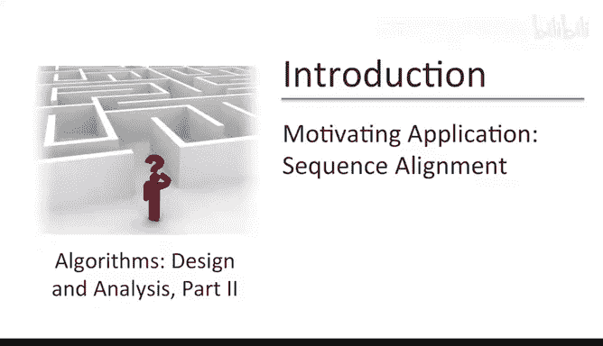

This video will cover a second problem to we your appetite for things to come。

 namely the problem of sequence alignment。So this is a fundamental problem in computational genomics if you take a class on the subject it's very likely to occupy the very first couple of lectures。

So in this problem， you're given two strings over an alphabet and no prizes for guessing which is the alphabet we're most likely to care about。

Typically， these strings represent portions of one or more genomes。

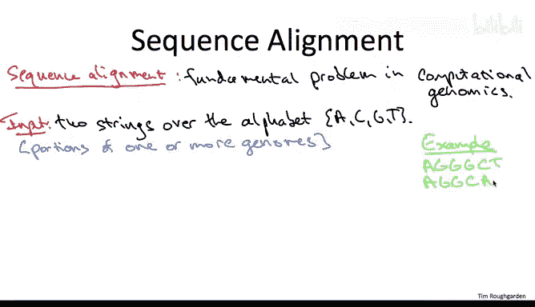

And just as a toy running example， you can imagine that the two strings were given are A， G G G， CTT。

 and A， G G，CA， know that the two input strings do not necessarily need to be of the same length。

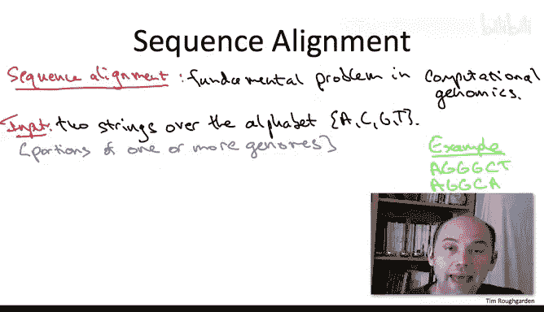

Informally speaking， the goal of the sequence alignment problem is to figure out how similar the two input strings are。

Obviously， I haven't told you what I mean by two strings being similar。

 that's something will develop over the next couple of slides。

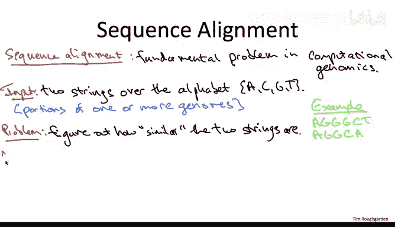

Why might you want to solve this problem， well there's actually a lot of reasons。

 let me just give you two of many examples。One would be to conjecture the function of regions of a genome that you don't understand。

 like say the human genome from similar regions that exist in genomes that you do understand。

 or at least understand better say the mouse genome。

 if you see a string that has a known function in the well understood genome and you see something similar in the poorly understood genome。

 you might conjecture， it has the same or a similar function。

A totally different reason you might want to compare the genomes of two different species is to figure out whether one evolved directly from the other and when。

A second totally different reason you might want to compare the genomes of two different species is to understand their evolutionary relationship。

 so for example， maybe you have three species A B and C and you're wondering whether B evolved from A and then C evolved from B or whether B and C evolved independently from a common ancestor A。

 and you might then take genome similarity as a measure of proximity in the evolutionary tree。

So having motivated the informal version of the problem， let's work toward making it more formal。

 in particular， I owe you a discussion of what I mean by two strings being similar。

So to develop intuition for this， let's revisit the two strings that we introduced on the previous slide。

 AG G GCT and AGGCA。Now， if we just sort of eyeball these two strings。

 I mean clearly they're not the same string， but we somehow feel like they're more similar than they are different。

 so where does that intuition come from？

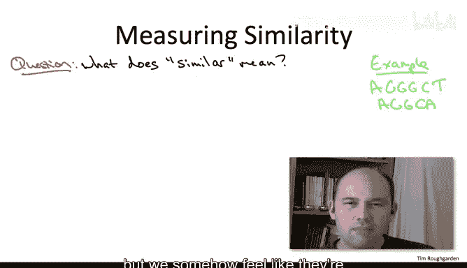

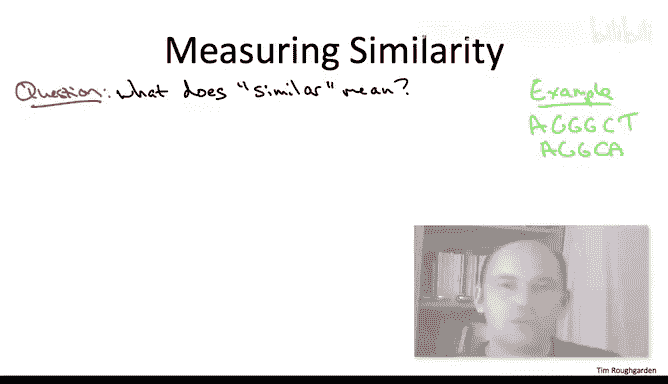

But one way to make it more precise is to notice that these two strings can be nicely aligned in the following sense。

 Let's write down the longer string， A G， G， G C， T。

 And I'm going to write the shorter string under it。 And I'll insert a gap。

 a space to make the two strings have the same length。

 I'm going to put the space where theres seems to be a quote unquote， missing G。And in what sense。

 is this a nice alignment。 Well， it's clearly not perfect。

 We don't get a character by character match of the two strings， but there's only two minor flaws。

 So on the one hand， we did have to insert a gap， and we do have to suffer one mismatch in the final column。

So this intuition motivates defining similarity between two strings with respect to their highest quality alignment。

 their nicest alignment。So we're getting closer to a formal problem statement。

 but it's still somewhat underdetermined specifically we need to make precise why we might compare why we might prefer one alignment over another For example。

 is it better to have three gaps and no mismatches or is it better to have one gap and one mismatch So for this video we're effectively going to punt on this question we're going to assume this problem's already been solved experimentally that it's known and provided as part of the input which is more costly gaps in various types of mismatches。

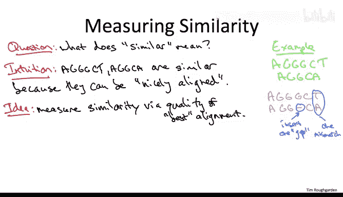

So here then is the formal problem statement。So in addition to the two strings over ACGT。

 we are provided as part of the input， a non negative number indicating the cost we incur in alignment for each gap that we insert。

Similarly， for each possible mismatch of two characters， like for example， mismatching an A&T。

 were given as part of the input， a corresponding penalty。Given this input。

 the responsibility of a sequence alignment algorithm is to output the alignment that minimizes the sum of the penalties。

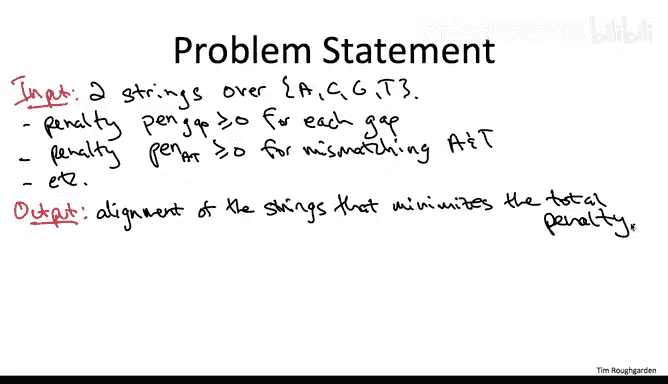

Another way to think of this output， to the minimum penalty alignment is we're trying to find an effect the minimum cost explanation for how one of these strings would have turned into the other so we can think of a gap as sort of undoing a deletion that occurred sometime in the past and we can think of a mispatch as representing a mutation。

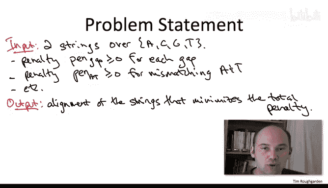

So this minimum possible total penalty that is the value of this optimal alignment is famous and fundamental enough to have its own name。

 namely the Neman Winch score。So this quantity is named after the two authors that proposed efficient algorithm for computing of the optimal alignment that appeared way back in 1970 in the Journal of Mocular Biology。

And now at last we have a formal definition of what it means for two strings to be similar。

 it means they have a small NW score， a score close to zero， so for example。

 if you have a database with a whole bunch of genome fragments。

 according to this you're going to define the most similar fragments to be those with the smallest NW score。

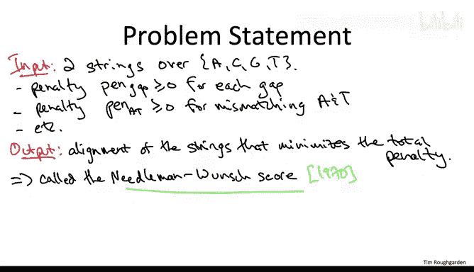

So to bring the discussion back squarely into the land of algorithms。

 let me point out that this definition of genome similarity is intrinsically algorithmic。

 This definition would be totally useless unless there existed an efficient algorithm that given two strings and these penalties computes the best alignment between those two strings。

 If you couldn't compute this score， you would never use it as a measure of similarity。

So this observation puts us under a lot of pressure to devise an efficient algorithm for finding the best alignment so how are we going to do that well we can always fall back to brute force search where we iterate over all of the conceivable alignments of the two strings。

 compute the total penalty of each of those alignments and remember the best one。Clearly。

 correctness is not going to be an issue for brute force search。 It's correct。

Essential by definition。 The issue is how long does it take。 So let's ask a simpler question。

 Let's just think about how many different alignments there are。

 How many possibilities do we have to try。 So if concrete let imagine I gave you two strings of length 500。

 which is a not unreasonable length。 Which of the following English phrases best describes the number of possibilities。

 the number of alignments given two strings with 500 characters each。

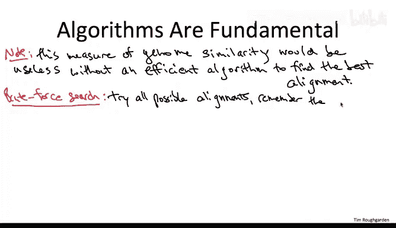

So I realize this is sort of a cheeky question， but I hope you could gather that what I was looking for was part D so you know so how big are each of these quantities anyways well in a typical version of this class you might have about 50。

000 students enrolled or so so that's somewhere between 10 to the four and 10 to the 5。

The number of people on earth is roughly 7 billion。

 so that's somewhere between 10 to the 9 and 10 to the 10。

The most common estimate I see for the number of atoms in the known universe is 10 to the 80。

And believe it or not， the number of possible alignments of two strings of length 500 is even bigger than that。

 So I'll leave it for you to convince yourself that the number of possibilities is at least two rays to the 500 the real numbers is actually noticeably bigger than that and because 10 is at most to the fourth we can lower bound this number by 10 ray of the 125 quite a bit bigger than the number of atoms in the universe and the point of course is just that it's utterly absurd to envision implementing brute force search even at the scale of a few hundred characters and forgetting about these sort of astronomical if you will comparisons even if you had string length much smaller say in the a dozen or two you never ever run brute force search which is not going to work and of course notice this is not the kind of problem。

 this comic explosion， this doesn't go away if you wait a little while for Moore's law to help you this is a fundamental limitation it says you are never going to compute alignments of the strings that you care about。

Les you have a fast， clever algorithm。I'm happy to report that you will indeed learn such a fast and clever algorithm later on in this course。

 even better， it's just going to be a straightforward instantiation of a much more general algorithm design paradigm that of dynamic programming。

