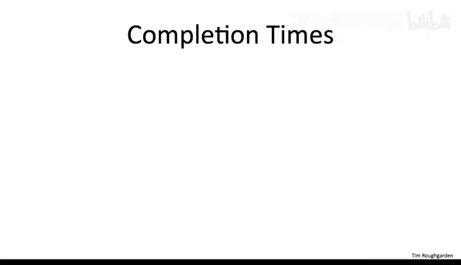
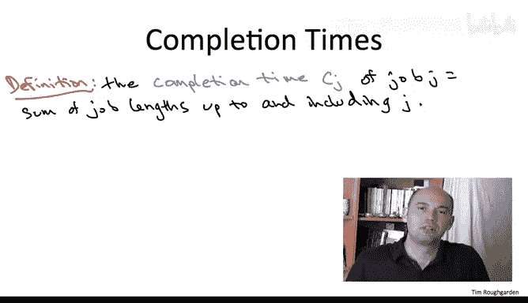
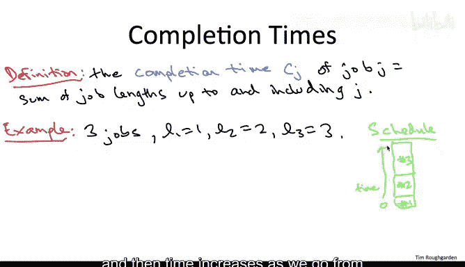
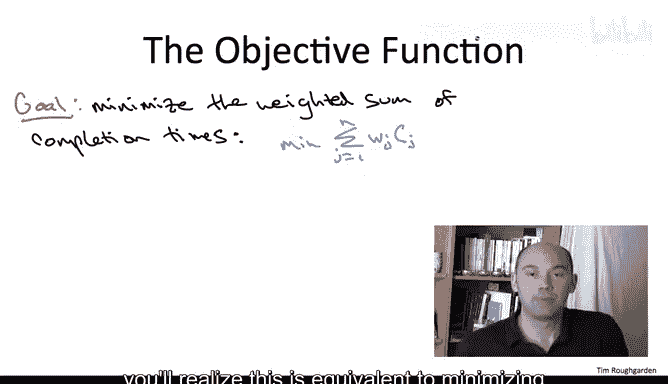
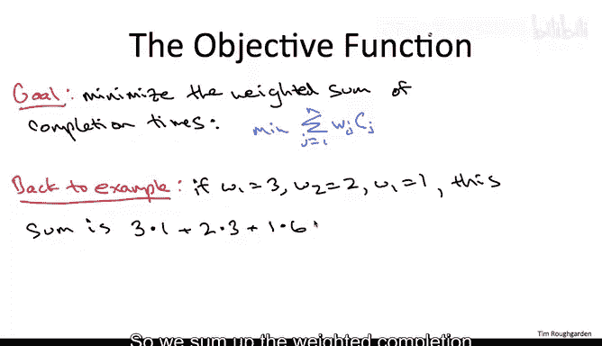
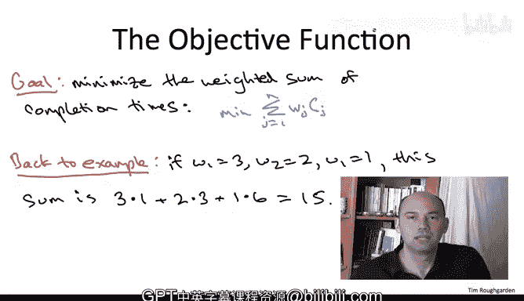

# 算法：05：贪心算法在调度问题中的应用

在本节课中，我们将学习如何将贪心算法应用于调度问题，即如何在共享资源上安排作业顺序，以优化特定目标。我们将从一个简单的单资源调度场景开始，定义问题的输入、输出以及需要优化的目标函数。

## 问题定义

上一节我们介绍了贪心算法的应用领域，本节中我们来看看一个具体的调度问题。我们假设只有一个共享资源，例如一个计算机处理器，需要处理多个作业。每个作业都有两个已知参数：权重（`W_j`）和长度（`L_j`）。权重表示作业的重要性，长度表示作业处理所需的时间。我们的目标是找到一个作业序列，以最小化加权完成时间之和。

### 完成时间的定义

为了理解优化目标，我们首先需要定义作业的完成时间。完成时间是指从开始处理到该作业完成所经过的总时间。

以下是完成时间的计算规则：
*   第一个被调度的作业，其完成时间等于其自身的长度：`C_1 = L_1`。
*   第二个被调度的作业，其完成时间等于第一个作业的长度加上自身的长度：`C_2 = L_1 + L_2`。
*   以此类推，第 `i` 个作业的完成时间等于所有排在其前面的作业长度之和，再加上其自身的长度：`C_i = sum(L_1 to L_{i-1}) + L_i`。

### 目标函数：最小化加权完成时间之和

在定义了完成时间后，我们可以明确问题的优化目标。我们并非简单地最小化所有作业的完成时间，而是希望最小化加权完成时间之和。其数学公式为：

**最小化：`sum_{j=1}^{n} (W_j * C_j)`**

其中，`W_j` 是作业 `j` 的权重，`C_j` 是作业 `j` 的完成时间。这个目标函数等价于最小化以输入权重为权重的平均完成时间。

### 示例说明

让我们通过一个例子来巩固理解。假设有三个作业，其长度和权重如下：

*   作业1：长度 `L_1 = 1`，权重 `W_1 = 3`
*   作业2：长度 `L_2 = 2`，权重 `W_2 = 2`
*   作业3：长度 `L_3 = 3`，权重 `W_3 = 1`

如果我们按照作业1、作业2、作业3的顺序调度，那么：
*   作业1的完成时间 `C_1 = 1`
*   作业2的完成时间 `C_2 = 1 + 2 = 3`
*   作业3的完成时间 `C_3 = 1 + 2 + 3 = 6`

加权完成时间之和为：`(3*1) + (2*3) + (1*6) = 3 + 6 + 6 = 15`。可以验证，对于这个具体的输入，该调度顺序确实是最优的。

## 总结

本节课中我们一起学习了调度问题的基本定义。我们明确了问题的输入是每个作业的权重和长度，输出是一个作业序列，而优化目标是**最小化加权完成时间之和**（`sum(W_j * C_j)`）。在接下来的课程中，我们将探讨如何设计贪心算法来高效地解决这个问题。