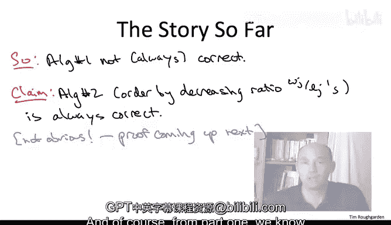

# 算法：06：贪心算法

在本节课中，我们将学习如何为最小化加权完成时间之和的调度问题设计一个贪心算法。我们将重点关注设计算法的过程，这个过程本身可以应用于解决其他问题。

## 概述

我们面临一个计算问题：给定 `n` 个作业，每个作业有各自的权重 `w_j` 和长度 `l_j`。我们需要在所有 `n!` 种可能的作业排序中，找到一种排序，使得所有作业的加权完成时间之和最小。作业 `j` 的完成时间 `C_j` 定义为它开始前所有作业的长度之和加上它自身的长度。我们的目标是找到最小化 `∑ w_j * C_j` 的排序。

贪心算法通过迭代地做出看似最优的局部决策来构建解，对于这种顺序决策问题，尝试贪心算法是合理的。

## 从特殊案例中寻找直觉

为了设计算法，我们首先考虑问题的两个特殊案例，在这些案例中，最优解是直观的。

**案例一：所有作业长度相同，但权重不同。**
在这种情况下，所有作业的完成时间序列是固定的（例如，1, 2, 3, ..., n）。为了最小化加权和，我们希望权重最大的作业获得最小的完成时间。因此，**应该优先安排权重更高的作业**。

**案例二：所有作业权重相同，但长度不同。**
在这种情况下，安排一个作业会迫使后续所有作业等待它完成。为了最小化对后续作业的负面影响，**应该优先安排长度最小的作业**。

## 推广到一般情况

上一节我们介绍了两种特殊情况下的直觉。本节中我们来看看当作业的权重和长度都不同时，如何将这两种直觉结合起来。

当两个作业中，一个权重更高但长度也更长时，我们的两条经验法则就产生了冲突。为了解决这个冲突，一个自然的想法是：能否将每个作业的长度 `l_j` 和权重 `w_j` 聚合成一个单一的“分数” `score(j)`？然后，我们只需按照分数从高到低的顺序安排作业即可。

这个聚合函数需要满足：权重越高，分数越高；长度越长，分数越低。

以下是两种最简单的满足条件的函数：
1.  **差值函数**：`score(j) = w_j - l_j`
2.  **比值函数**：`score(j) = w_j / l_j`

这样，我们就得到了两个候选的贪心算法：按差值排序和按比值排序。

## 排除错误的候选算法

上一节我们提出了两个候选的贪心算法。本节中，我们将通过一个反例来快速排除其中一个。

当你有多个候选算法时，一个高效的策略是构造一个输入，使得不同算法产生不同的输出，从而证明至少有一个算法是错误的。

考虑一个包含两个作业的简单实例：
*   作业1：长度 `l_1 = 5`，权重 `w_1 = 3`
*   作业2：长度 `l_2 = 2`，权重 `w_2 = 1`

让我们计算两种排序方式的结果：
*   **按差值排序**：`score(1) = 3-5 = -2`，`score(2) = 1-2 = -1`。因此先安排作业2，再安排作业1。
    *   完成时间：`C_2 = 2`，`C_1 = 2+5 = 7`
    *   加权完成时间之和：`(1*2) + (3*7) = 2 + 21 = 23`
*   **按比值排序**：`score(1) = 3/5 = 0.6`，`score(2) = 1/2 = 0.5`。因此先安排作业1，再安排作业2。
    *   完成时间：`C_1 = 5`，`C_2 = 5+2 = 7`
    *   加权完成时间之和：`(3*5) + (1*7) = 15 + 7 = 22`

在这个例子中，按比值排序得到了更优（更小）的目标函数值（22 < 23）。因此，**按差值排序的贪心算法并不总是正确的**，我们可以将其排除。

## 算法与复杂度分析

经过上一节的筛选，我们剩下按比值 `w_j / l_j` 排序的贪心算法作为主要候选。虽然反例证明了另一个算法错误，但这并不自动保证当前算法总是正确。其正确性需要严格的证明，这将是后续课程的重点。

不过，我们可以轻松分析这个候选算法的运行时间。该算法非常简单：
1.  为每个作业 `j` 计算比值 `w_j / l_j`。
2.  根据这个比值对作业进行降序排序。
3.  按照排序后的顺序执行作业。

因此，该算法本质上归结为一次排序操作。根据第一部分的知识，我们可以在 **O(n log n)** 时间内完成排序，这对于贪心算法来说是典型的高效表现。

## 总结

本节课中我们一起学习了为调度问题设计贪心算法的过程。我们从特殊案例（等长或等权）中获得直觉，提出了两种自然的聚合函数（差值和比值）来生成贪心规则。通过构造一个简单的反例，我们快速排除了按差值排序的算法。最终，我们得到了一个按权重与长度比值排序的候选贪心算法，其运行时间为 O(n log n)。在接下来的课程中，我们将深入探讨并证明这个算法的正确性。请记住，在设计算法时，对贪心算法保持健康的怀疑态度，直到看到完整的正确性证明，这是一个好习惯。