# 算法：07：正确性证明第一部分

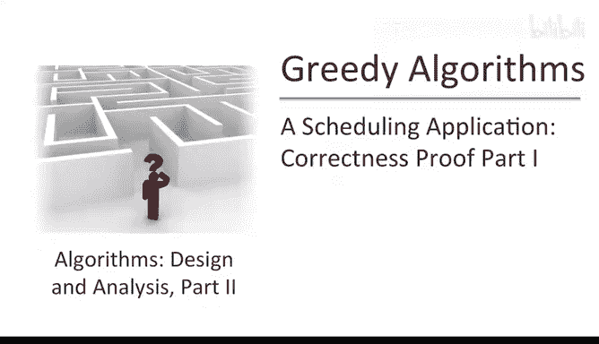

## 概述

在本节课中，我们将学习如何证明一个贪心算法的正确性。具体来说，我们将分析一个旨在最小化加权完成时间总和的作业调度算法。我们将使用一种称为“交换论证”的技术来证明该算法在所有输入下都能产生最优解。

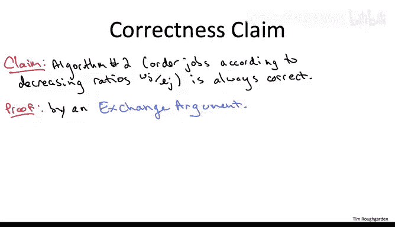

---

## 证明计划

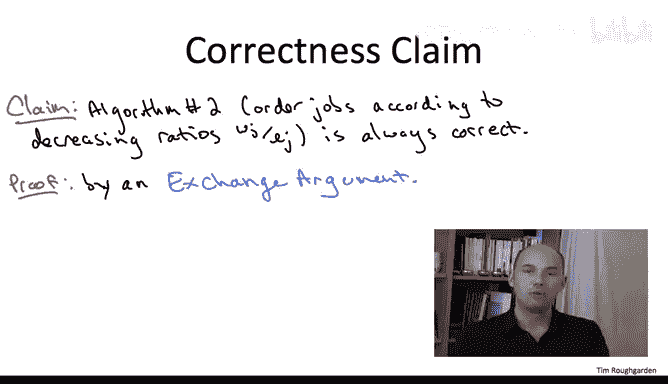

上一节我们介绍了贪心算法及其目标。本节中，我们来看看如何通过反证法来证明其正确性。

我们首先固定一个任意的作业实例，即一组具有权重和长度的作业。我们的目标是证明贪心算法总能为此实例生成最优调度。

为了简化初始证明，我们做出一个假设：所有作业的权重与长度之比（即比率）都是互不相同的。我们将在后续处理比率相等的情况。

此外，我们约定一种记法：将作业按比率从高到低重新编号，作业1的比率最高，作业2次之，依此类推，作业N的比率最低。在这种记法下，贪心调度方案非常简单，就是按编号顺序执行作业：1, 2, 3, ..., N。

现在，我们假设贪心算法不是最优的。这意味着存在另一个不同的最优调度方案，我们称之为 **Sigma star**。

---

## 关键观察

以下是证明的关键观察点：

由于最优调度方案 **Sigma star** 不同于贪心调度方案（即顺序1, 2, ..., N），它必然包含一对连续执行的作业，其中较早执行的作业的编号比较晚执行的作业的编号更大。

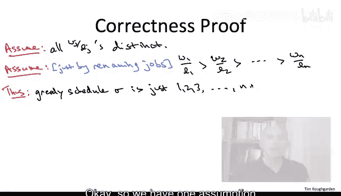

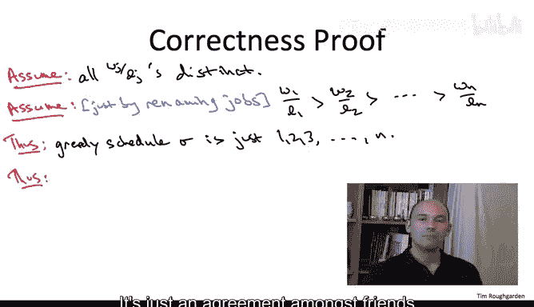

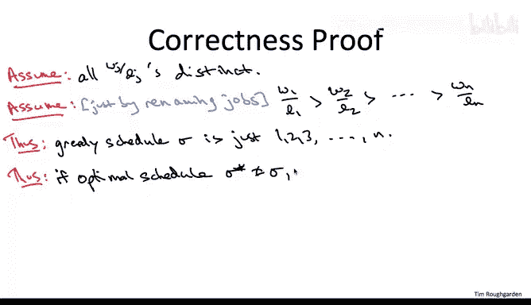

为什么这是真的？因为唯一一个能让作业编号在执行过程中始终保持递增顺序的调度方案，就是贪心调度方案（1, 2, ..., N）。任何其他方案都必然会在某个地方出现编号“下降”的情况，即一个编号较大的作业在一个编号较小的作业之前执行。

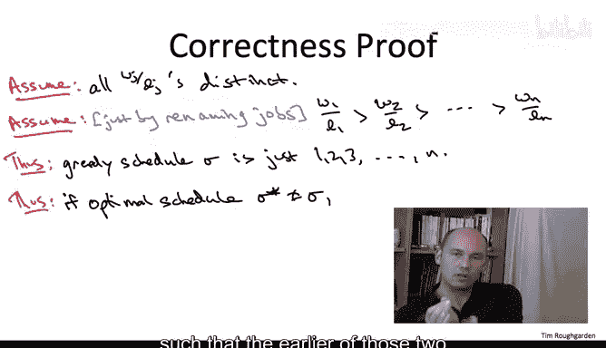

---

## 交换论证

根据我们的高层次证明计划，我们需要通过反证法推导出一个矛盾。具体做法是：构造一个比 **Sigma star** 更好的调度方案，从而与 **Sigma star** 的最优性假设相矛盾。

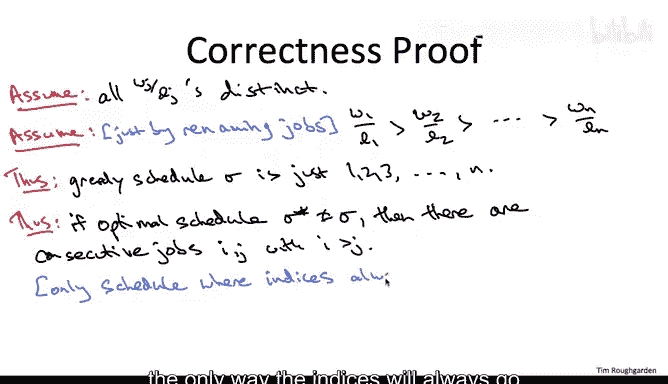

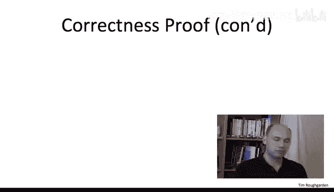

我们通过一个“交换”的思想实验来实现这一点。

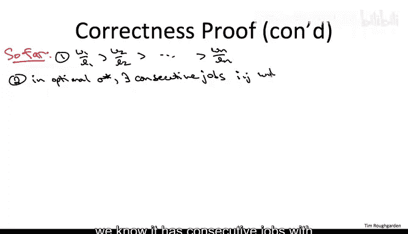

假设在 **Sigma star** 中，我们找到了这样一对连续作业 **I** 和 **J**，其中 **I** 在 **J** 之前执行，但 **I** 的编号大于 **J** 的编号。**Sigma star** 的局部顺序可以表示为：...（一些作业）... **I** **J** ...（后续作业）...

我们执行的交换操作是：仅交换 **I** 和 **J** 的执行顺序，而保持它们之前和之后的所有作业顺序不变。交换后的顺序变为：...（一些作业）... **J** **I** ...（后续作业）...

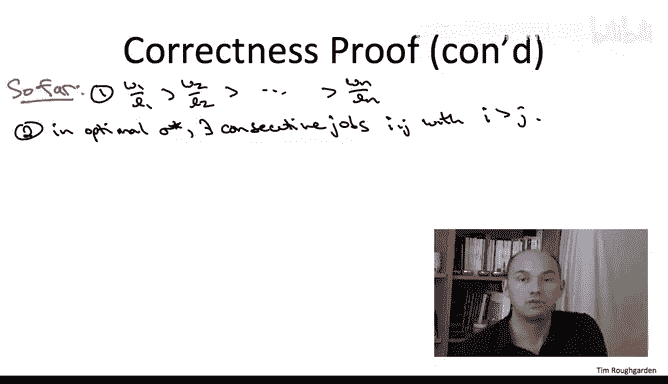

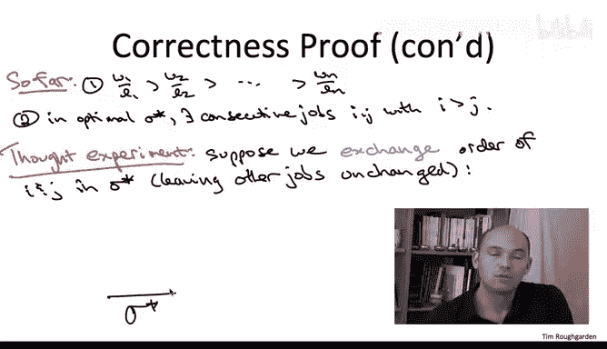

---

## 总结

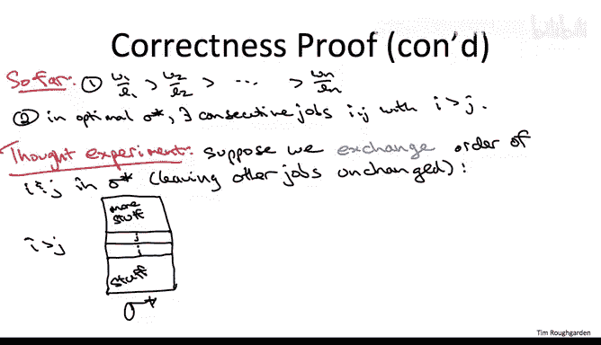

本节课中，我们一起学习了贪心算法正确性证明的初步框架。我们设定了证明场景，做出了简化假设，并指出了最优调度方案中必然存在一对可以交换的“逆序”作业。下一节，我们将深入分析这个交换操作对加权完成时间总和的具体影响，从而完成整个证明。