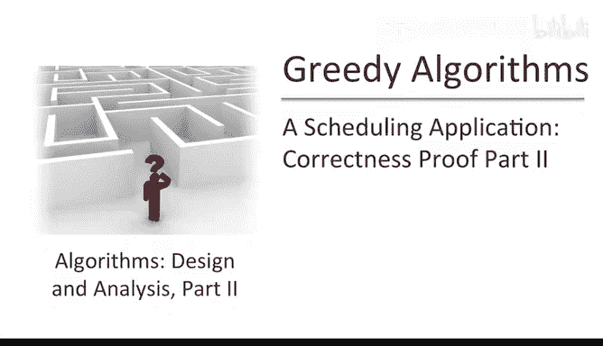
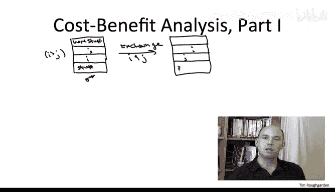
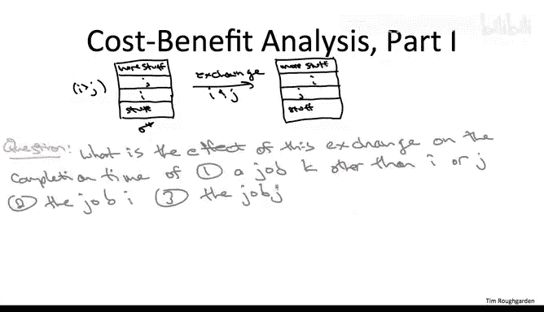
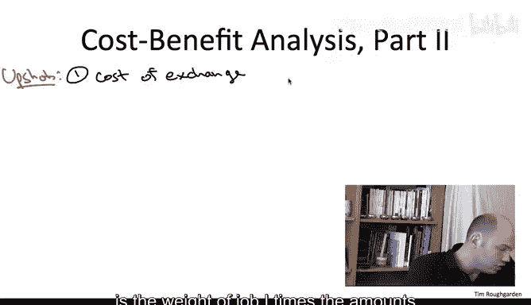
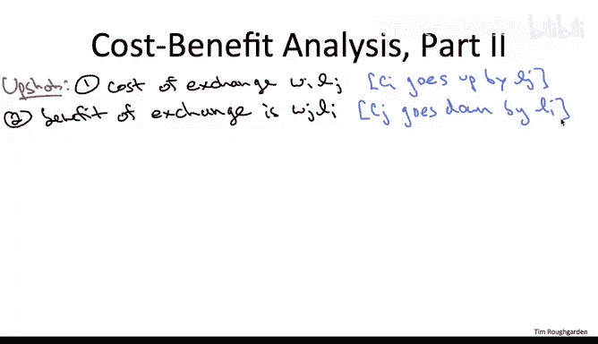
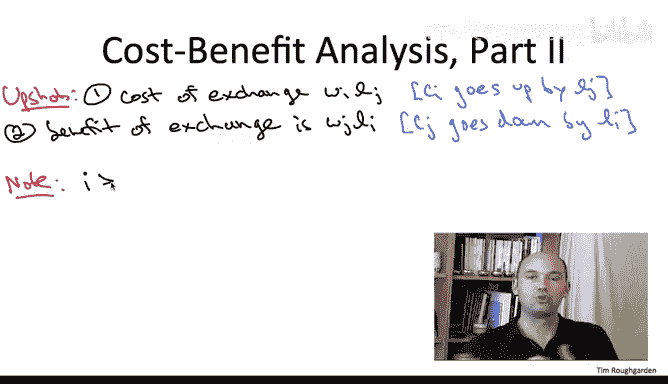
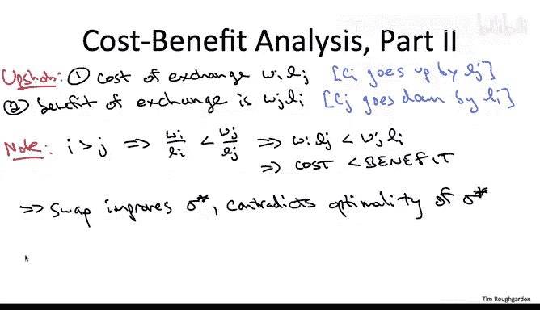

# 斯坦福大学《算法》课程：P83：08_01_04_正确性证明第二部分



在本节课中，我们将继续学习用于最小化加权完成时间总和的贪心算法的正确性证明。我们将深入理解上一节视频结尾提出的“交换作业”操作所带来的影响。





上一节我们介绍了证明的核心思路：通过反证法，假设存在一个与贪心算法结果不同的最优调度方案，那么其中必然存在一对相邻作业，其中较早的作业具有较高的索引（即较低的权重与长度比值）。本节中我们来看看交换这对作业后，会发生什么。

## 交换作业的影响分析

以下是交换作业 I 和 J 后，对所有作业完成时间的影响分析：

*   **作业 I 和 J 之外的作业**：它们的完成时间**不受影响**。因为无论 I 和 J 的顺序如何，排在它们之前或之后的作业集合没有变化，等待时间总和不变。
*   **作业 I**：它的完成时间**增加**。因为它现在需要等待作业 J 完成。具体来说，其完成时间的增加量等于作业 J 的长度 `L_J`。
*   **作业 J**：它的完成时间**减少**。因为它不再需要等待作业 I 完成。具体来说，其完成时间的减少量等于作业 I 的长度 `L_I`。

## 成本效益分析

基于以上分析，我们可以对这次交换进行成本效益核算。

*   **成本**：由作业 I 的完成时间增加导致。成本值为作业 I 的权重 `W_I` 乘以增加的时间 `L_J`，即 **`成本 = W_I * L_J`**。
*   **效益**：由作业 J 的完成时间减少带来。效益值为作业 J 的权重 `W_J` 乘以减少的时间 `L_I`，即 **`效益 = W_J * L_I`**。

## 利用贪心规则推导矛盾

现在，我们利用一个关键事实：在假设的最优调度 Sigma* 中，作业 I 的索引高于作业 J（即 `i > j`）。根据我们的索引规则（比值 `W/L` 降序排列），这意味着作业 I 的比值低于作业 J 的比值。

用公式表示这个关系：
```
W_I / L_I < W_J / L_J
```





为了更清晰地比较成本与效益，我们对不等式两边同时乘以 `L_I * L_J` 以消去分母：
```
W_I * L_J < W_J * L_I
```

观察这个不等式，它的左边正是我们计算出的**交换成本** `W_I * L_J`，而右边正是**交换效益** `W_J * L_I`。



这个不等式 `成本 < 效益` 意味着，如果我们对假设的最优调度 Sigma* 执行交换作业 I 和 J 的操作，得到的新调度的加权完成时间总和将**严格小于**原调度 Sigma* 的总和。

但这与我们的前提“Sigma* 是最优调度”相矛盾。一个最优解不可能通过简单的局部交换变得更好。

因此，我们的初始假设（存在一个与贪心算法结果不同的最优调度）是错误的。这证明了贪心算法产生的调度确实是全局最优的。



本节课中我们一起学习了贪心算法正确性证明的第二部分。我们分析了交换一对违反贪心规则的作业所带来的具体影响，并通过成本效益计算，利用比值不等式推导出了矛盾，从而完成了整个证明。这确认了按照 `W_i / L_i` 降序排列的贪心策略对于最小化加权完成时间总和问题是最优的。