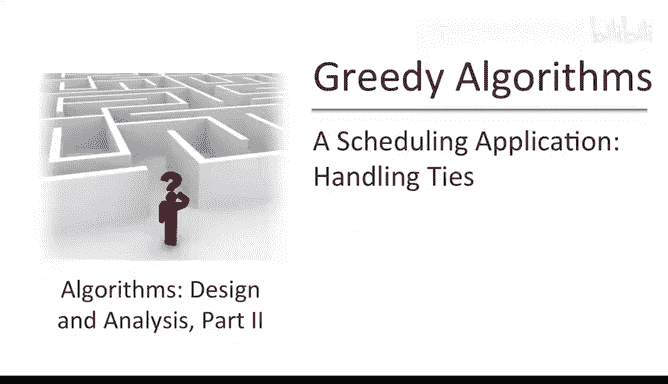
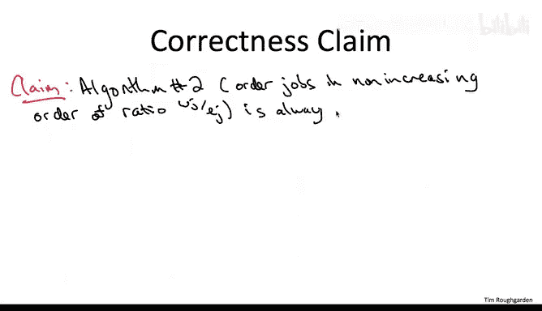
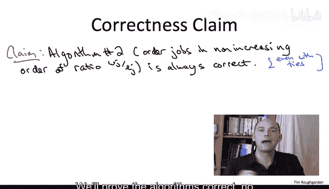
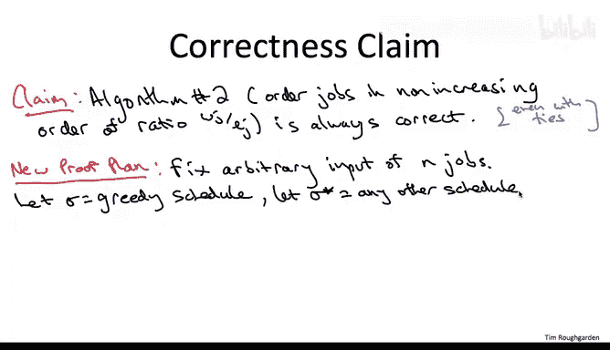
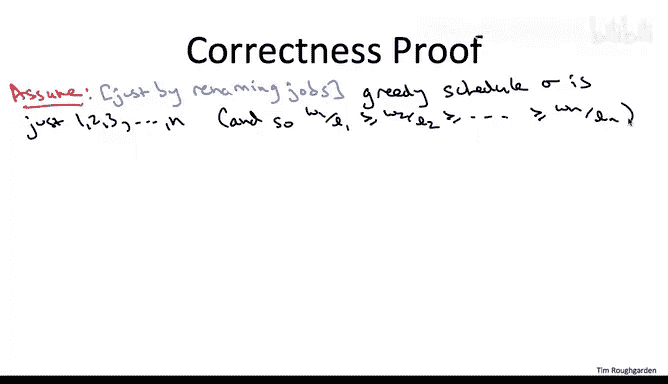
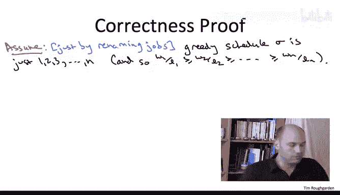
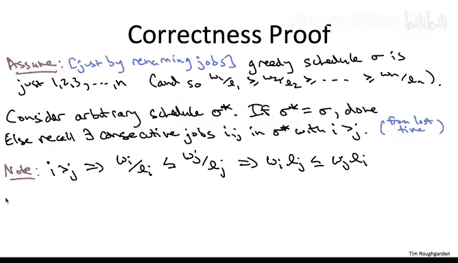
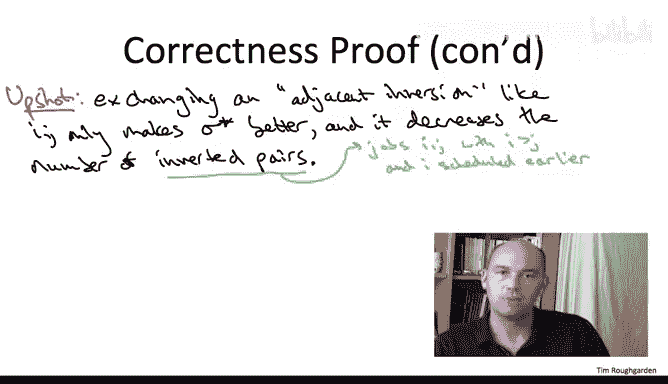
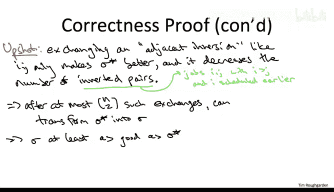

# 斯坦福大学《算法（分治／排序／搜索／随机算法、图搜索／最短路径／数据结构、贪心算法／最小生成树／动态规划、最短路径／NP）｜Algorithms》中英字幕 - P84：09_01_05_处理平局情况-进阶选学.zh_en - GPT中英字幕课程资源 - BV1Rx4y1U7sZ

So in this video， we're going to revisit our greedy algorithm for minimizing the weighted sum of completion times and now' to give a more robust。

 more general correctness proof that also accommodates ties amongst the ratios of the different jobs。

 The main reason I'm doing this is not because you know I think the result is so earthshattering in its own right。

 but rather to give you further examples of exchange arguments in action in particular outside of a proof by contradiction。

So let's be formal about our new more general correctness proof。

 So we're going talking about the greedy algorithm。

 which orders jobs by the ratio of weight to the length。 We're no longer assuming these are distinct。

 So we can't really say decreasing order。 We'll say nonincreas order and ties can be broken any way you want。

 will'll prove the algorithms commit correct， no matter how the ties are resolved。

So fortunately， we'll be able to reuse much of the work that we did for the previous correctness proof。

 but actually， our overall proof plan is going to change a little bit。

 We're no longer going to proceed by contradiction。

 So here's the high level here's the high level plan now。

 So as before we're going argue correctness on every separate instance。 So fix an arbitrary one。

 So the notation will be similar to last time。 So on this input。

 we'll let Sigma denote the output of our greedy algorithm。

 And then we'll let Sigma star denote an arbitrary other competitor。 Any other schedule of the jobs。

So now what we're going to do is we're going to show that Sigma。

 the output of our greedy algorithm is at least as good as Sigma star。

 since Sigma star was arbitrary， that means the greedy algorithms output is at least as good as every other schedule。

 and therefore Sigma has to be optimal。So let's now fill in the details we're going to make a similar notational assumption as last time and that we're going to assume that the greedy schedule is just one。

 two， three all the way up to n and again that's a content free assumption we can get away with it just by changing the names of the jobs。

 changing notation。

So recall the proof plan。 We have to take any other competing schedule Sigma star and show that it's no better than Sigma。

 so that Sigma is at least as good as it。 So fix any such schedule Sigma star。 Obviously。

 if sigma star is sigma， then they're the same， orre just as good as each other。

 So there's nothing to do。 Now， if Sigma star is not the same thing as sigma。

 It's not just the sequence 1，2，3 all the way up to N。

 We're going reuse a key observation from our previous proof。

 namely any schedule other than just one through N has to contain in it， a consecutive pair of jobs。

 I and J where J is executed immediately after I。 where I has the higher index。

 So now we argue similarly to last time。 What is it matter that's one job as a higher index than another。

 Well， that means it's further along in the ordering， which means its ratio can only be smaller。

 Remember， the ratios are nonincreasing， they can only go down in the ordering。

 So higher index means lower ratio。 But there may be ties。 So we can't claim a strict inequality。

 just a weak inequality。 And so again， by clearing denominators。

 this boils down through the weight of。

I times the length of job J is at most the weight of job J times the length of job I？

Now the next thing I want you to recall from our previous proof is that there are nice semantics for WYLJ and WJLI。

 namely as the cost and the benefit of exchanging jobs INJ in the Sch Sigma star。

So arguing as in the previous videos， we can argue we can claim that exchanging I and J。

From the schedule S star has a net benefit。That is a benefit minus cost。Of WJLI。

 that's because job J's completion time drops by LI minus WI LJ。

 that's because job I's completion time increases by LJ with this exchange。

 and so this is non negative。So in comparison with our previous proof and our previous proof what the assumption of no ties bought us。

 it bought us the stronger fact that we exchange I andJ。 In fact， Sigma star gets strictly better。

 we get a better schedule than what we started with here with ties that need not be true。

 If I and J have exactly the same ratio and we exchange them， then the cost equals the benefit。

 So the net change and the objective function is 0。 So we can only claim that by inverting I andJ。

 we don't make sigma star worse。 It can only get better。 it might stay the same。

 So let's see why that's good enough to nonetheless complete the proof。

So what the previous slide gives us， it gives us a method of changing a schedule。

 massaging a schedule so that it doesn't get any worse。 It can only get better。Specifically。

 if we take any schedule Sigma star， we take any adjacent inversion by which I just mean two consecutive jobs with a higher one having a higher index。

 We exchange the jobs in any adjacent inversion， we get a new schedule， which can only be better。

 Some of which to completion times might be the same that if it's different， it has to be smaller。

 So in our previous proof， we knew it was strictly better because we had no ties。

 And then our proof by contradiction said we were done。 So what are we going to do now。

What we're going to do is we're going to take this operation。

 which massages a schedule without making it worse。

 And we're just going repeat it over and over and over again。 because actually。

 this operation has a second property。 Not only can it not make a schedule worse。

 but it also decreases the number of inverted job pairs。 and here by an inversion， I mean。

 the same thing as when we counted inversions with a divide and conquer algorithm back in part1。

 I just mean the job pairs somewhere in a schedule where the higher and next one occurs earlier in the ordering。

 when we exchange adjacent inversion， we uninvert that inversion And because they're adjacent。

 we don't create any new inversions。 So the number of inverted job pairs drops by exactly one。

 each time we do one of these exchanges。 So what does that mean， So here's the proof in a nutshell。

 we take an arbitrary competitor， some schedule Sigma star。

 and we find either it's the same as the greedy schedule。 If it's not。

 there's an adjacent inversion in which case we exchange it。

 We get a schedule that's at least as good。 and fewer inversions。 Either this new schedule。Sigma。

 in which case we're done， or it's not。 And then we find an adjacent inversion， and we exchange it。

 It only gets better。 and we keep going。 Why can this not continue forever。 Well。

 the number of inversions can only be n choose 2 initially。

 that's if you start with the schedule n n-1 n-2 all the way1 if the jobs are initially backward。

 So we can only do this exchange n choose2 times before we necessarily terminate with the greedy schedule1 through n。

 at that point， what have we done， we've taken an arbitrary schedule Sigma star， we've massaged it。

 making it only better and better and better and better， terminating with our greedy schedule sigma。

 What does that say that says our greedy schedule sigma is at least as good as what we started with Sigma star。

 So our greedy schedule is at least as good as this arbitrary schedule Sigma star。 So it's optimal。

 It's better than everything。 So one final note before I write down the QE For those of you familiar with the bubble sort algorithm。

 and it's totally fine if you're not familiar with bubble sort。

 But if you are familiar with bubble sort， you will recognize that essentially what we're doing。

Here inside the proof， not in our algorithm， but inside our proof。

 we're applying bubble sort in effect to this arbitrary competing schedule Sigma star。

 and by uninverting the inversions， we transform it into the greedy schedule， making it only better。

 thereby justifying as optimal our greedy algorithm schedule sigma。

