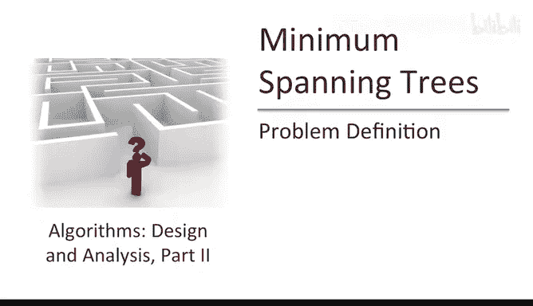
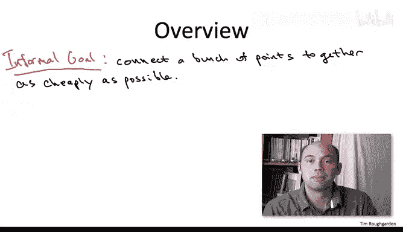
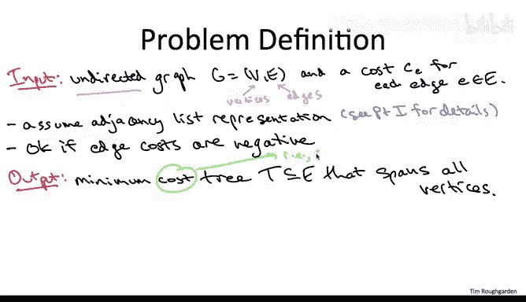
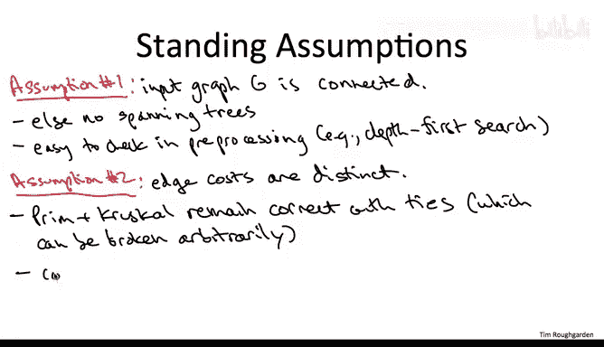

# 算法：10：最小生成树问题定义

在本节课中，我们将学习一个基础图论问题——最小生成树问题。我们将了解其形式化定义、应用场景，以及后续课程中将探讨的两种著名贪心算法。

---

## 问题定义

上一节我们介绍了最小生成树问题的背景。本节中，我们来看看其形式化定义。

最小生成树问题的输入是一个无向图 `G=(V, E)`，其中每条边 `e` 都有一个成本 `c(e)`。输出是一个总成本最小的生成树 `T`。

以下是生成树 `T` 必须满足的两个条件：
1.  **无环性**：`T` 中不能包含任何环。
2.  **连通性**：对于图 `G` 中的任意两个顶点，`T` 中都存在一条路径将它们连接起来。

生成树 `T` 的成本是其所有边成本的总和：`cost(T) = Σ_{e∈T} c(e)`。我们的目标是找到成本最小的生成树。

## 示例说明

为了更直观地理解，我们来看一个简单的例子。

考虑一个包含四个顶点（A, B, C, D）和五条边的图，边成本如下：
*   A-B: 1
*   A-D: 2
*   B-D: 3
*   B-C: 4
*   C-D: 5

以下是几个子图的例子：
*   **子图 {A-B, B-D, C-D}**：成本为 1+3+5=9。该子图无环且连通所有顶点，因此是一个生成树，但不是成本最小的。
*   **子图 {A-B, A-D, B-C}**：成本为 1+2+4=7。该子图同样无环且连通，是一个生成树，并且在这个例子中是唯一的最小生成树。
*   **子图 {A-B, A-D, B-D}**：成本为 1+2+3=6。虽然成本更低，但这个子图包含环（A-B-D-A），因此不是一个生成树。

## 简化假设

为了专注于核心算法思想，我们在后续讨论中将做出两个简化假设。

以下是这两个假设及其原因：
1.  **图是连通的**：输入图 `G` 本身是连通的。如果图不连通，则不存在生成树。这个条件可以通过广度优先搜索（BFS）或深度优先搜索（DFS）在线性时间内轻松验证。对于非连通图，算法可以稍作修改以计算每个连通分量的最小生成树（即最小生成森林）。
2.  **边成本互异**：图中所有边的成本都不相同。这个假设主要是为了简化正确性证明。我们即将学习的普里姆算法和克鲁斯卡尔算法，即使在有相同成本边的情况下也仍然是正确的。

---

## 算法概览

了解了问题定义后，我们来看看解决它的高效方法。

最小生成树问题之所以有趣，是因为存在多种正确的贪心算法。我们将在后续课程中重点学习其中两种最著名的算法：
1.  **普里姆算法**：该算法与迪杰斯特拉最短路径算法有诸多相似之处，核心思想是从一个顶点开始，逐步“生长”出一棵树。
2.  **克鲁斯卡尔算法**：该算法按照边成本从小到大的顺序考虑边，并使用并查集数据结构来避免形成环。

这两种算法都非常高效。通过使用合适的数据结构（如堆或并查集），它们的运行时间可以达到 **O(m log n)**，其中 `m` 是边数，`n` 是顶点数。这几乎是线性时间，仅比读取图输入所需的时间略多。

---

本节课中，我们一起学习了最小生成树问题的形式化定义、性质以及解决该问题的算法概览。从下一节课开始，我们将深入探讨普里姆算法的具体步骤、正确性证明及其高效实现。