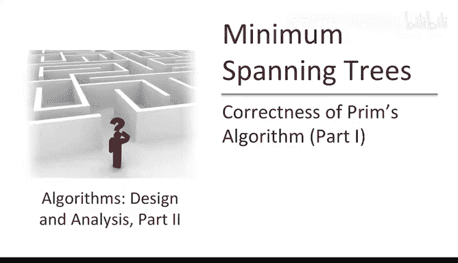
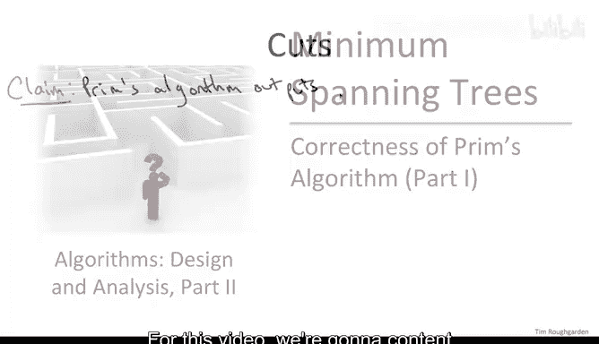
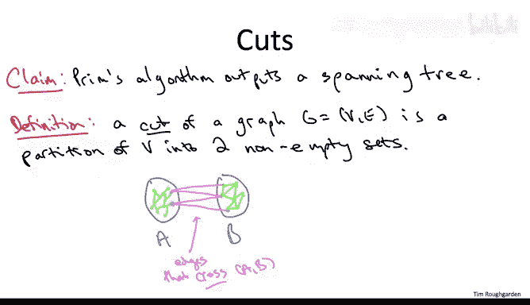
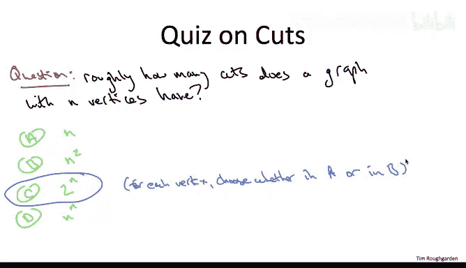
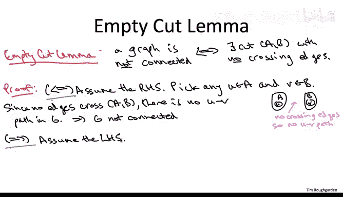
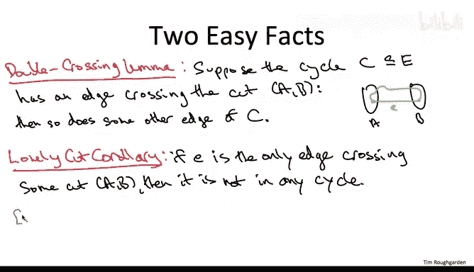
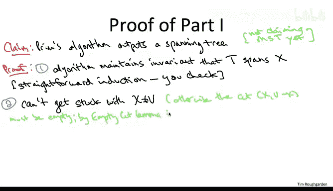

# 斯坦福大学《算法（分治／排序／搜索／随机算法、图搜索／最短路径／数据结构、贪心算法／最小生成树／动态规划、最短路径／NP）｜Algorithms》中英字幕 - P87：12_01_03_正确性证明一.zh_en - GPT中英字幕课程资源 - BV1Rx4y1U7sZ

Okay， so in this video， we're going to begin our discussion about why Prim's algorithm is correct。

 why it always for every connected graph outputs a minimum spanning tree of that graph。

For this video， we're going to content ourselves with a much more modest goal we're only going to prove for now that Prim's algorithm outputs a spanning tree。

 we're not going to make any claims yet about optimality。

Even just this fact is nontri and improving it will give us a good opportunity to get our hands dirty with some basic properties of graphs and specifically graph cuts。

Graduates of part one of this online class， of course are already familiar with graph cuts。

 we studied them at length via Cargo's randomized algorithm for computing at the minimum cut of a graph。

 so the concept is the same here， let me state it again to jog your memory。

So a cut of a graph is simply a partition of its vertex set into two groups。

 and each of those two groups should be non empty。So pictorially。

 we envision some of the vertices of G。 There's blob A being in one group。

 and the rest of the vertices， this Sc blob B being in a different group。 Now。

 what's up with the edges， How can they be distributed in this picture。 Well。

 the two endpoints of an edge， There's three cases， Either both of the endpoints can be in the set A。

 So there's various edges internal to a。Similarly， an edge might have both of its endpoints inside of B。

But we're going to be most interested in the third case。

 edges that have one point exactly in each of A and B。

 so these are edges that we say cross the cut A B。So hopefully the definition of a cut seems simple enough。

 but cuts and in particular their relationship to edges can be quite interesting and quite useful so as shown here in the picture。

 of course， for a given cut there can be many edges crossing it by the same token for a given edge of a graph in general there will be many cuts of the graph thats that edge crosses so to understand this a little bit better let's just review a simple property about cuts in the graph let me ask you how many there are。

Specifically， for a graph that has n vertices， roughly how many cuts does it have， roughly n。

 roughly n squared， roughly2 to the n or roughly n to the n Now none of these four answers is exactly right。

 but one of the four is a lot closer to the exact expression than the other three and I'm asking you which of them is it。

Alright， so the correct answer is the third one，2 to the n。

 A graph of n vertices has essentially two to the n cuts。 So there's an exponential number of cuts。

 There's a lot of them。 So why is this true， Well， in effect。

 you can imagine making a binary decision for each of the n vertices。

 they either go into a or they go into B。 So n binary decisions results in two to the n different outcomes。

 Now， why is this slightly incorrect。 Well， in fact， a cut has to have two non-empty sets。

 A is not allowed to be empty。 B is not allowed to be empty。

 So that rules out two of the possibilities。 So actually strictly speaking。

 it's two to the n minus1 different cuts of a graph。

So what we're going to do next is we're going to state and prove three easy facts about cuts in graphs。

 Once we have these three easy facts， we will be able to prove the claim at the beginning of this video。

 namely that pms algorithm always outputs a spanning tree。

 The first of these three properties about cuts I'm going to call the empty cut lima。

The point of the empty cutlemma is to give us a characterization that is a new way of saying when a graph is connected。

 so in particular， I'm going to phrase it in terms of a graph being not connected。

And the claim is that a graph is not connected if and only if we can find a cut of the graph that has no edges crossing it。

 to remember how we defined a graph being connected， that means for any two vertices in the graph。

 we can find a path in the graph from one vertex to the other。

 So what we're saying is that being not connected that is their existing a pair of vertices with no path between them is equivalent to there being a cut with no crossing edges。

 So let's go ahead and prove this real quick。So as an if and only if statement。

 really this proof we have to do in two parts， first we have to prove that assuming the first statement we can derive the second。

 then we have to show that assuming the second statement we can derive the first。

I think the easier direction is to assume the right hand side and then derive the left hand side。

 so let's start with that one。That is consider a graph G so that there's a cut A B with no edges of G crossing this cut。

The plan is to exhibit a pair of vertices that do not have a path between them， therefore。

 thereby certifying that the graph is not connected。

 so it's pretty easy to figure out which pair of vertices we should look at。

 Just take one vertex from each side of the cut， which has no crossing edges。

So why is it that there's no path from U to V in the graph G。

 well the path from U to v would surely have to cross the cut a comma B。

 but there's no edges available for crossing the cut。

 so therefore this path from U to V cannot exist。So that completeflats the first part of the proof。

 we assume the right hand side， we derive the left hand side， now we start all over again。

 but we assume the left hand side and we have to prove the right hand side。

So by virtue of by the assumption that the graph is not connected。

 there has to exist a pair of vertices U and V that have no path between them。

We are now responsible for exhibiting some cut A comma B， such that no edges of the graph G cross it。

 So where are we going to get these sets capital A and capital B from。Well， here's the trick。

 which is going to make the proof go really nicely。

 We define the set of vertices capital A to be those reachable from U in the graph G。

Another way to think about this is that capital A is simply use connected components in the sense that we discussed in part one of the course。

Now， because we want to cut and a cut as our partition， we better well put in the group capital B。

 all of the vertices that are not in A。If you like。

 this is all of the connected components other than the one that contains you。

Note that by definition， U is in capital A， certainly U reachable from itself and by assumption V and U are not reachable from each other。

 So V is going to be in capital B。 So neither these sets is not empty。

 This is indeed a bona fide cut of the graph G。 All the remains is to notice that there are no crossing edges across this cut。

And why is that true， Well， if there was an edge crossing。The cut A B with one end point and A。

 one end point in B。 Well， by definition， there are paths from U to everything else in A。

 So if there was any edge sticking out of a， that would give us a path to some vertex in B。 But B。

 by definition of vertices not reachable from capital A。 So that's a contradiction。 So， again。

 the point is that if there were edges crossing this cut。

 Then we can expand A and make it even bigger。 So therefore， there aren't any edges crossing the cut。

 the cut is empty。 That's what we needed to prove。 Asing the graph was disconnected。

 We have exhibited a cut。 A comma B with no crossing edges。

So that wraps up of the first of our three facts and in fact。

 the most difficult of our three facts about cuts in graphs and again。

 what is the empty cut let me say， it gives us a new way of talking about whether or not a graph is connected。

 so it's disconnected if and only if there's an empty cut it's connected if and only if there are no empty cuts so that's the key point from this slide Let's now knock off the other two facts we're going to need。

The first one I'm going to call the double crossing limit。In essence。

 what the double crossing lemma says is that if a cycle in a graph crosses a cut。

 then it has to cross it twice。 It cannot cross it only once。So victorly。

 we look at a cut of a graph。 So there's the two vertex groups A and B。 by hypothesis。

 there's some edge E with one endpoint in each side。 and by assumption E。

 this edge E participates in some cycle that we're calling capital C。

 And if you look at the picture you realize that the claim in this lemma is obvious that because the cycle has to loop back on itself。

 if it has an edge with one end point on either side。

 there has to be a path connecting the two dots connecting those two endpoints back to each other。

 and that path has to cross back over this cut A B。Indeed。

 the double crossing lema is a special case of a stronger statement， which is equally easy to see。

 which is that if you take any cut of a graph and you take any cycle。

 you know it starts and ends at the same point， then it has to cross this cut and even number of times。

 it might cross it zero times， but it's not going to cross it once， it could cross it twice。

 it could cross it four times if it crisscrosses back and forth。

 it could cross it six times and so on。 but if it crosses it strictly more than zero times then it has to cross it at least twice。

 That's the point of the double crossing lema。So we'll use this in its own right later on。

 but I'm also for the moment interested in an easy corollary of the double crossing limit。

I will call this the lonely cut corollary。 Let me tell you the point of the lonely cut corollary。

 in general， in these spanning tree algorithms to ensure that we output a spanning tree， we have to。

 in particular， make sure we don't create any cycles。

 The point of this corollary is it's a tool to argue that we don't create cycles。

So how can we be sure that an edge doesn't create cycles Well here's a way。 Suppose there's a cut。

 So we're looking at an edge E。 Sose we can identify a cut A comma B so that edge E is the only cut crossing it。

 It's the lonely edge crossing this cut。 Well then by the double crossinglemma。

 there's no way this thing is in any cycle if it were in a cycle and across the cut。

 that cycle would have to cross it again and this edge wouldn't be lonely， it would have company。

 So if you're lonely on a cut， it means you cannot be in a cycle。

So now we've got all of our ducks lined up in a row and we're ready to prove the first part of the correctness of Pri that is we're ready to argue that Prim's algorithm。

 given a connected graph outputs a spanning tree again for the moment we're making no claims about optimality that'll be in the next video。

So we're going to make this argument in three steps and for the first step you might want to go look again at the pseudocode of Pris algorithm just to remember what the notation was The first step we're just going to notice that the semantics of the algorithm are respected So the algorithm maintains two different sets throughout its evolution on the one hand it maintains a set capital X intended to be the vertices spans so far the other hand it maintains a set of edges capital T。

 the edges that have been picked so far and the intent was that the current edges capital t always spans the current vertex set capital X So the first thing is just to verify that that is in fact true。

This I'm not going to prove formally in my experience students find this kind of obvious and the intuition is correct if you want a rigorous proof I would go ahead and fill in the details yourself it's a straightforward induction with no nasty surprises。

Now， we're trying to argue the output of this algorithm is a spanning tree。

 So let's recall what that means。 What is it that we have to check。 So there's two properties。

 First of all， there can't be any cycles， there can't be any loops。 Second of all。

 it has to span all of the vertices。 has to be a path inside the tree edges from any vertex to any other vertex。

 So let's go ahead and prove both those things in reverse order。

 So the second step of the proof is going to be to argue that the algorithm outputs something which does span all of the vertices。

 So at the end of the day will have a path from any vertex to any other vertex using only the imagess in our chosen set capital T。

 Now， by part one of this proof。 All we need to prove is that the algorithm halts with capital X equal to capital V。

 Then we know that capital t spans everything in V。 So how could that not happen。

 How could Pris algorithm somehow halts with the spanned vertices capital X not being all of capital D。

 We'll go back and check out the pseudocode and look at the main while loop。 So every while loop。

 every iteration， we add one new vertex to capital X。What could go wrong。

 The only thing that could go wrong would be is if it's some iteration before we're spanning everything When we scan the frontier around capital X。

 there aren't any edges。 That's the only way we could fail to increase the vertices in capital X in a given iteration。

 But what would that mean， What would it mean if it's some iteration。

 we couldn't find edges with one end point in capital X and the other end point in V minus x。Well。

 then we would have exhibited an empty cut。 The cut X comma V minus x would have no crossing edges。

 and now we can use the empty cut lemma， which says if there is an empty cut。

 then the graph is disconnected。 But by assumption we're working with a connected input graph so that can't happen。

 so the algorithm never get stuck。 we always increase capital x by one vertex because the original graph was connected。

 that means it halts with something spanning all of the verbies。

For the final step， we need to argue that Prims algorithm never creates any cycles in the edges that it iss choosing capital T So why are there no cycles Well。

 what we're going to do is we're going to talk about each edge in turn that Pris algorithm adds and argue that whenever a new edge gets added。

 there's no way that edge creates any cycles in the set capital T。And to see why。

 take a snapshot of the algorithm at some given iteration。

 so there's some current set capital T and there's some set vertices capital X that the edges and T span。

V minus x or the vertices not yet spanned by T。 And， of course。

 we can think of x comma v minus x as a cut of the graph。 And at this moment in time。

 at this snapshot， the edges of capital T， they're all of one type。

 They all have both of their endpoints inside capital X。

 None of them have any endpoints inside V minus x。 So in particular。

 none of the edges chosen thus far cross the cut x comma V minus x。 That's by construction。

 They only span the vertices of x。Now， what type of edge is going to get added in this iteration。

 Well Pris algorithm searches only over edges that have one endpoint inside x and one endpoint outside。

 That is it searches only over edges that cross the cut X v minus x。

 So the edge that gets added in this iteration is going to be a trailblazer for this cut。

 none of the edges yet shows cross the cut。 but the edge shows in this iteration will definitely cross the cut。

 So at the moment edge E gets added to the tree capital T。

 it is going to be lonely across the cut V sorry x comma v minus x。

 So by the lonely cut corollary as the sole member crossing this cut and capital T。

 it cannot possibly participate in any cycles。 Remember if it participated in a cycle in capital T。

 that cycle would have to cross this cut somewhere else。

 but there aren't any other edges crossing this cut， This is the only one。

 So that's why when we add a new edge。 there's no way it can create any cycle。

 It's the sole member crossing this particular cut。

