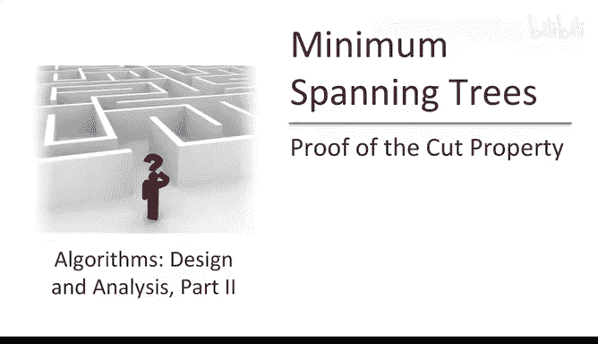
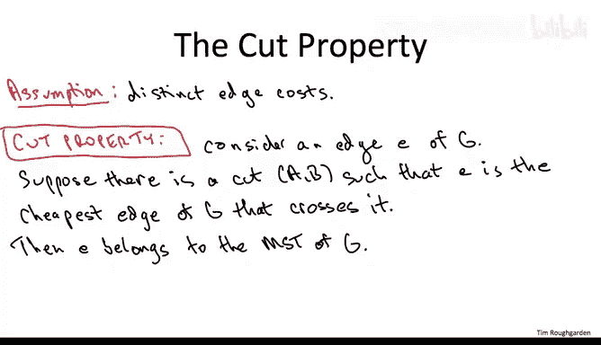
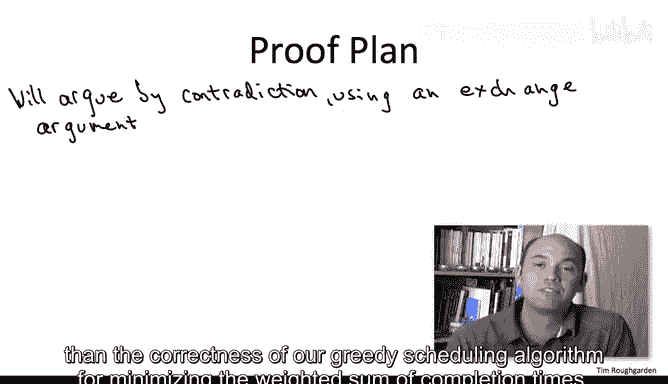
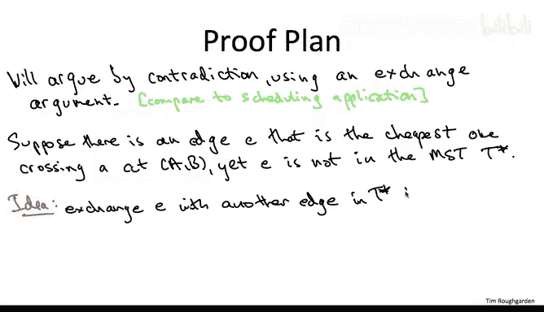
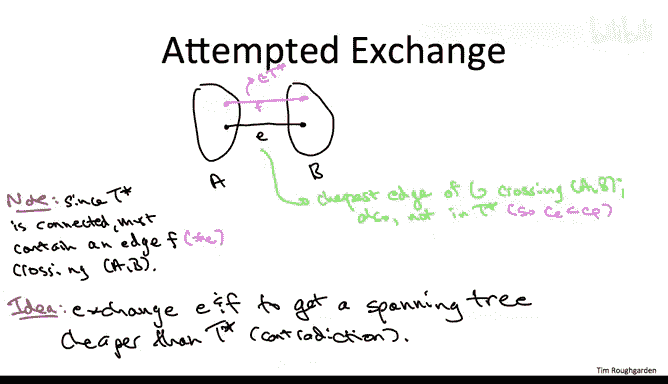
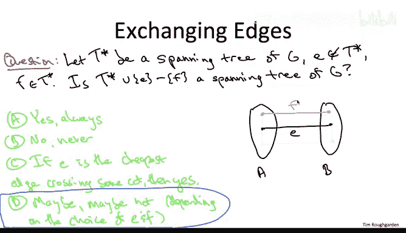
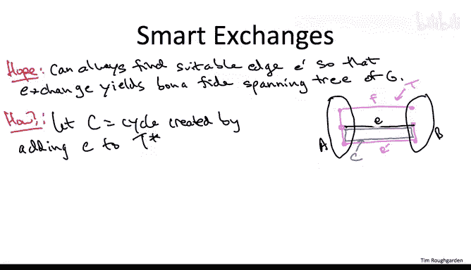

# 算法：14：割性质证明



在本节课中，我们将学习并证明一个关于最小生成树的关键性质——**割性质**。这个性质是普里姆算法等贪心算法正确性的核心保证。我们将通过一个严谨的证明，来理解为什么“跨越某个割的最便宜边”一定属于最小生成树。

---



上一节我们介绍了割性质的基本概念，本节中我们将通过反证法和交换论证来严格证明它。




## 证明思路


证明将采用反证法，其核心思路与证明加权完成时间调度算法正确性的思路类似。我们将从一个假设不包含特定边的最优解（最小生成树）出发，通过交换一条更贵的边与这条特定边，构造出一个成本更低的生成树，从而得出矛盾。



具体来说，如果割性质不成立，那么存在一个图、一个割以及一条跨越该割的最便宜边 `e`，但这条边 `e` 却不属于最小生成树 `T*`。我们的计划是将这条缺失的边 `e` 与 `T*` 中某条更贵的边进行交换，从而得到一个成本更低的生成树，引出矛盾。

## 第一次交换尝试

让我们从一个初步的交换论证开始。

假设我们有一个图的一个割 `(A, B)`，边 `e` 是跨越这个割的最便宜边。根据反证法假设，这条最便宜的边 `e` 不属于最小生成树 `T*`。



然而，`T*` 必须包含至少一条其他跨越该割 `(A, B)` 的边。原因在于，如果 `T*` 不包含任何跨越该割的边，那么 `A` 和 `B` 两部分将不连通，这与生成树的定义矛盾。因此，`T*` 包含另一条跨越该割的边，我们称之为 `f`。

由于 `e` 是最便宜的跨越边，而 `f` 是另一条跨越边，所以 `f` 的成本严格高于 `e`。此时，我们似乎可以执行交换：从 `T*` 中移除 `f`，加入 `e`，期望得到一个新的、成本更低的生成树，从而完成反证。

## 交换的复杂性

然而，图论中的交换比调度问题中的交换更为微妙。在调度中，交换两个任务总是得到另一个有效的调度。但在图中，从一个生成树中移除一条边并加入一条新边，不一定能得到另一个生成树。

以下是一个关键问题：当我们从生成树 `T*` 中移除一条边 `f` 并加入一条新边 `e` 时，我们是否总是得到一个新的生成树？答案是否定的。考虑下图示例：



```
    A侧        B侧
    (u)---e---(v)
     |         |
     f         |
     |         |
    (x)---e'--(y)
```

假设粉色边构成生成树 `T*`，它包含边 `f` 和 `e‘`，但不包含最便宜边 `e`。如果我们简单地用 `e` 交换 `f`，得到的新图可能包含环（例如 `u-x-y-v-u`），并且右上角的顶点可能变得不连通，因此它不是一个生成树。

这个例子告诉我们，不能随意交换任意一条跨越割的边。我们需要找到一条“合适”的边进行交换，以确保交换后得到的仍然是一个生成树。

## 找到正确的交换边

幸运的是，我们总能找到这样一条合适的边。以下是寻找方法：

1.  **构造环**：将缺失的最便宜边 `e` 加入最小生成树 `T*`。由于 `T*` 原本在 `e` 的两个端点 `u` 和 `v` 之间就存在一条路径，加入 `e` 后必然会形成一个环，我们称这个环为 `C`。
    ```
    T* + e => 产生环 C
    ```

2.  **应用双重跨越引理**：根据“双重跨越引理”，如果一个环跨越了一个割至少一次，那么它必须跨越这个割至少两次。在我们的设定中，环 `C` 通过边 `e` 已经跨越了割 `(A, B)` 一次，因此它必须包含另一条也跨越该割的边，我们称之为 `e‘`。

3.  **执行交换**：现在，我们用边 `e` 交换环 `C` 中的边 `e‘`（`e‘` 原本在 `T*` 中）。即，从 `T*` 中移除 `e‘`，加入 `e`，得到一个新图 `T‘`。
    ```
    T‘ = (T* \ {e‘}) ∪ {e}
    ```

**为什么 `T‘` 是一个生成树？**
*   **无环性**：加入 `e` 创造了环 `C`，而移除 `e‘`（它是环 `C` 的一部分）恰好破坏了这个环。
*   **连通性**：移除环上的一条边不会破坏图中任意两点间的连通性，因为环上的任意两点间仍有替代路径。

因此，`T‘` 是一个具有 `|V|-1` 条边、连通且无环的图，所以它是一个生成树。



## 完成证明

由于 `e` 是跨越割 `(A, B)` 的最便宜边，而 `e‘` 是另一条跨越该割的边，所以有：
```
cost(e) < cost(e‘)
```
因此，新生成树 `T‘` 的总成本为：
```
cost(T‘) = cost(T*) - cost(e‘) + cost(e) < cost(T*)
```
但这与 `T*` 是最小生成树（成本最低）的假设矛盾。

这个矛盾源于我们最初“割性质不成立”的假设。因此，该假设必须为假，从而证明了**割性质**：对于任意一个图，给定任意一个割，跨越该割的最便宜边一定属于该图的某个最小生成树。在边权互异的情况下，这条边属于**唯一**的最小生成树。

---

本节课中我们一起学习了割性质的完整证明。我们通过反证法，假设存在一条不属于最小生成树的最便宜跨越边，然后通过将其加入树中形成环，利用双重跨越引理找到环上另一条跨越同割的边，执行交换后得到了一个成本更低的生成树，从而引出矛盾，证明了原性质。这个性质是理解普里姆、克鲁斯卡尔等贪心最小生成树算法为何正确的基础。