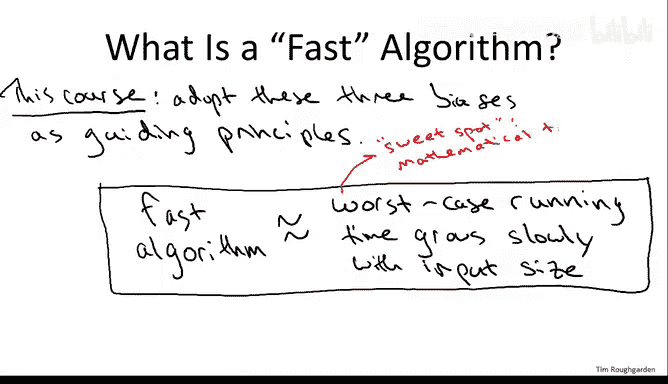

# 斯坦福大学《算法（分治／排序／搜索／随机算法、图搜索／最短路径／数据结构、贪心算法／最小生成树／动态规划、最短路径／NP）｜Algorithms》中英字幕 - P8：08_01_11_算法分析指导原则.zh_en - GPT中英字幕课程资源 - BV1Rx4y1U7sZ

Having completed our first analysis of an algorithm。

 namely an upper bound on the running time of the merge short algorithm。

 what I want to do next is take a step back and be explicit about three assumptions。

 three biases that we made when we did this analysis of merge short and interpreted the results。

 these three assumptions we will adopt as guiding principles for how to reason about algorithms and how to define a so-called fast algorithm for the rest of the course。

 So the first guiding principle is that we used what's often called worst case analysis。

 by worst case analysis， I simply mean that our upper bound of6 n log n plus 6 n applies to the number of lines of executed for every single input array of length N。

 We made absolutely no assumptions about the input where it comes from what it looks like beyond what the input linked N was But differently if hypothetically。

 we had some adversary whose sole purpose in life was to concoct some level and input designed to make our algorithm run as slow as possible。

 the worst to this adversary could do is upper bound。

By the same number6 n log n plus 6 n Now this sort of worst case guarantee popped out so naturally from our analysis of merge sort。

 you might well be wondering what else could you do Well two other methods of analysis which do have their place so that we won't really discuss them in this course are quote unquote average case analysis and also the use of a set of prespecified benchmarks。

By average case analysis， I mean you analyze the average running time of an algorithm under some assumption about the relative frequencies of different inputs。

 So for example in the sorting problem， one thing you could do， although it's not what we did here。

 you could assume that every possible input array is equally likely and then analyze the average running time of an algorithm by benchmarks I just mean that one agrees upfront about some sets。

 say 10 or 20 benchmark inputs which are thought to represent practical or typical inputs for the algorithm Now both average case analysis and benchmarks are useful in certain settings。

 but for them to make sense you really have to have domain knowledge about your problem you need to have some understanding of what inputs are more common than others what inputs better represent typical inputs than others By contrast in worst case analysis by definition you're making absolutely no assumptions about where the input comes from So as a result。

 worst case analysis is particularly appropriate for general purpose subroutines subroutines that you design。

Uh without having any knowledge of how they will be used or what kind of inputs they will be used on。

And happily， another bonus of doing worst case analysis， as we will in this course。

 iss usually mathematically much more tractable than trying to analyze the average performance of an algorithm under some distribution over inputs or to understand the detailed behavior of an algorithm on a particular set of benchmark inputs。

 This mathematical tractability was reflected in our merge sort analysis where we had no operatori goal of analyzing the worst case per se。

 but it's naturally what popped out of our reasoning about the algorithms running time。

 The second and third gutting principles are closely related。 The second one is that in this course。

 when we analyze algorithms， we won't worry unduly about small constant factors or lower order terms。

 We saw this philosophy at work very early on in our analysis of merge sort。

 when we discussed the number of lines of code that the merge subroutine requires。

 we first upper bounded it by 4 m plus2 for an array of length M。

 And then we said let's just think about it as6m instead。

 let's have a simpler sloppy upper bound and work with that。 So that was already。

Example of not worrying about small changes in the constant factors Now the question you should be wondering about is why do we do this and can we really get away with it so let me tell you about the justifications for this guiding principle so the first motivation is clear and we used it already in our merge short analysis which is it's simply way easier mathematically if we don't have to precisely pin down what the leading constant factors and low rot terms are。

The second justification is a little less obvious， but is extremely important。

 So I claim that given the level at which we're describing and analyzing algorithms in this course。

 it would be totally inappropriate to obsess unduly about exactly what the constant factors are。

 recall our discussion of the merge subroutine。 So we wrote that subroutine down in pseudocode。

 And we gave an analysis of4 m plus2 on the number of lines of code executed。

 given an input of linked M。 We also noted that it was somewhat ambiguous。

 exactly how many lines of code， we should count it as depending on how you count loop increments and so on。

 So even there， small constant factors could creep in given the underspecation of the pseudocode。

 depending on how that pseudocode gets translated into an actual programming language like C or Java。

 you'll see the number of lines of code deviate even further， not by a lot。

 but again by small constant factors when such a program is then compiled down into machine code。

 you'll see even greater variance， depending on the exact processor， the compiler。

 the compiler optimizations。Programming implementation and so on。 So to summarize。

 because we're going to describe algorithms at a level that transcends any particular programming language。

It would be inappropriate to specify precise constants。

 the precise constants were ultimately determined by more machine dependent aspects like who the programmer is。

 what the compiler is， what the processor is， and so on。And now the third justification is， frankly。

 we're just going to be able to get away with it。That is。

 one might be concerned that ignoring things like small constant factors leads us astray。

 that we wind up deriving results would suggest that an algorithm is fast when it's really slow in practice or vice versa。

 but for the problems that we discuss in this course will get extremely accurate predictive power even though we won't be keeping track of lower order terms and constant factors when the mathematical analysis we do suggest that an algorithm is fast。

 indeed it will be， when it suggests that it's not fast， indeed that will be the case。

 so we lose a little bit of granularity of information。

 but we don't lose and what we really care about， which is accurate guidance about what algorithms are going to be faster than others。

So the first two justifications I think are pretty self-evident this third justification is more of an assertion。

 but it's one we'll be backing up over and over again as we proceed through this course Now don't get me wrong。

 I'm not saying constant factors aren't important in practice obviously for crucial programs the constant factors are hugely important if you're running the sort of crucial loop you know your startup survival depends on by all means optimize the constant like crazy the point is just that understanding tiny constant factors in the analysis is an inappropriate level of granularity for the kind of algorithm analysis we're going to be doing in this course。

Okay， let's move on to the third and final guiding principle。

So the third principle is that we're going to use what's called asymptotic analysis。

 by which I mean we will focus on the case of large input sizes。

 the performance of an algorithm as the size n of the input grows large that is tenses to infinity Now this focus on large input sizes was already evident when we interpreted our bound on merge short So how did we describe the bound on merge short we said。

 oh well it needs a number of operations proportional a constant factor times in log n and we very cavalierly declared that this was better than any algorithm which has quadratic dependence of its running time on the number of operations？

So for example， we argued that merge sort is a better faster algorithm than something like insertion sort without actually discussing the constant factors at all mathematically。

We were saying the running time of merge sort， which we know we can represent as the function。

6 analog base2 of n。Plus X n is better than any function which has a quadratic dependence on n。

 even one with a small constant， like let's say， one half n squared。

 which might be roughly the running time of insertion sort。

And this is a mathematical statement that is true。 if and only if n is sufficiently large。

 Once n grows large， it's certainly true that the expression on the left is smaller than the expression on the right。

 But for small N， the expression on the right is actually going to be smaller because of the smaller leading term。

 So in saying that merge sort is superior to insertion sort。

 The bias is that we're focusing on problems with large N。 So the question you should have is。

 is that reasonable， Is that a justified assumption to focus on large input sizes。

 And the answer is certainly yes。So the reason we focus on large input sizes is because frankly those are the only problems which even which are at all interesting if all you need to do is sort 100 numbers。

 use whatever method you want and it's going to happen instantaneously on modern computers you don't need to know to say the divide and conquer paradigm if all you need to do is sort 100 numbers So one thing you might be wondering is if with computers getting faster all the time according to Moore's law。

 if really it doesn't even matter to think about algorithmic analysis if eventually all problem sizes will just be trivially solvable on superfast computers but in fact the opposite is true。

Moore's law with computers getting faster actually says that our computational ambitions will naturally grow。

 We naturally focus on ever larger problem sizes and the gulf between an n squared algorithm and an n log n algorithm will become ever wider。

 a different way to think about it is in terms of how much bigger a problem size you can solve as computers get faster。

 if you're using an algorithm with a running time which is proportional to the input size。

 then if computers get faster by a factor of four， then you can solve problems which are a factor of four larger。

 whereas if you're using an algorithm whose running time is proportional to the square of the input size。

 then the computers get faster by a factor of four。

 you can only solve double the problem size and we'll see even starer examples of this gulf between different algorithmic approaches as time goes on。

So to drive this point home， let me show you a couple of graphs。

So what we're looking at here is we're looking at a graph of two functions。So the solid function。

Is the upper bound that we proved on merge short。 So this is going to be6 and。Log base2 of n。

Plus 6 m。And the dotted line is。A estimate。A rather generous estimate about the running time of insertion sort。

 namely1 half times n squared， and we see here in the graph exactly the behavior we discussed earlier。

 which is that for small n。Down here。In fact， because one/ half n squared has a smaller leading constant。

 it's actually a smaller function， and this is true up to this crossing point of maybe 90 or so。

But then beyond n equal 90， the quadratic growth in the n squared term overwhelms the fact that it had a smaller constant and it starts being bigger than this other function6 n log n plus 6 n so in the regime below 90 it's predicting that insertion store will be better and in the regime above 90 it's predicting that merge sort will be faster now here's what's interesting。

 let's scale the x axis let's look well beyond this crossing point of 90。

 let's just increase it in order of magnitude up to a arrays of size 1500 and I want to emphasize these are still very small problem sizes。

 if all you need to do is sort a arrays of size 1500。

 you really don't need to know divide and conquer or anything else I'll talk about that's a pretty trivial problem on modern computers。

So what we're seeing is that even for very modest problem sizes here， array of size， say 1500。

 the quadratic dependence in the insertion sort bound is more than dwarfing the fact that it had a lower constant factor So in this large regime the gulf between the two algorithms is growing and of course if I increased at another 10 x or 100 x or 1000 x to get to genuinely interesting problem sizes。

 the gap between these two algorithms would be even bigger would be huge That said。

 I'm not saying you should be completely ignorant of constant factors when you implement algorithms。

 it's still good to have a general sense of what these constant factors are。 So for example。

 in highly tuned versions of merge sort， which youll find in many programming libraries In fact because of the difference in constant factors。

 the algorithm will actually switch from merge sort over to insertion sort once the problem size drops below some particular threshold say seven elements or something like that So for small problem sizes you use the algorithm with smaller constant factors and the insertion sort for larger problem sizes you use the algorithm。

With better rate of growth， namely merge sort。So to review our first guiding principle is that we're going to pursue worst case analysis we're going to look to bounds on the performance on the running time of an algorithm which make no domain assumptions。

 which make no assumptions about which input of a given length the algorithm is provided The second guiding principles we're not going to focus on constant factors or lower order terms that would be inappropriate。

 given the level of granularity at which we're describing algorithms。

 and third is we're going to focus on the rate of growth of algorithms for large problem sizes。

Putting these three principles together， we get a mathematical definition of a fast algorithm。

 namely we're going to pursue algorithms whose worst case running time grows slowly as a function of the input size。

So let me tell you how you should interpret what I just wrote down in this box So on the left hand side is clearly what we want we want algorithms which run quickly if we implement them and on the right hand side is a proposed mathematical surrogate of a fast algorithm the left hand side is not a mathematical definition the right hand side is as we become clear in the next set of lectures So we're identifying fast algorithms which those that have good asymptotic runtime running time which grows slowly with the input size Now what would we want from a mathematical definition we'd want a sweet spot on the one hand we want something we can actually reason about This is why we zoom out in squint and ignore things like constant factors and lower terms we can't keep track of everything otherwise we'd never be able to analyze stuff on the other hand we don't want to throw out the baby with the bathwater we want to retain predictive power and this turns out this definition turns out for the problems we're going to talk about in this course to be the sweet spot for reasoning about algorithms worst case analysis using the asymptotic running time will be。

Able to prove lots of theorems will establish a lot of performance guarantees for fundamental algorithms。

 but at the same time we'll have good predictive power。

 what the theory advocates will in fact be algorithms that are well known to be fast in practice。

So the final explanation I owe you is what do I mean by the running time grows slowly with respect to the input size Well the answer depends a little bit on the context。

 but for almost all of the problems we're going to discuss。

 the holy grail will be to have what's called a linear time algorithm。

 an algorithm whose number of instructions grows proportional to the input size。

 So we won't always be able to achieve linear time， but that's in some sense， the best case scenario。

 notice linear time is even better than what we achieved with our merge short algorithm for sorting merge short runs a little bit super linear。

 It's n times log n where n is the input size if possible we'd love to be linear times。

 It's not always going to be possible， but that is what we will aspire toward for most of the problems we'll discuss in this course。

Looking ahead， the next series of videos is going to have two goals。 first of all。

 on the analysis side， I'll describe formally what I mean by asymptotic running time。

 I'll introduce big O notation and its variance， explain its mathematical definitions and give a number of examples on the design side will'll get more experience applying the divide and conquer paradigm to further problems。

 See you then。

