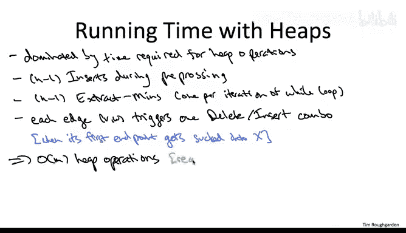

# 斯坦福大学《算法（分治／排序／搜索／随机算法、图搜索／最短路径／数据结构、贪心算法／最小生成树／动态规划、最短路径／NP）｜Algorithms》中英字幕 - P91：16_01_07_快速实现二.zh_en - GPT中英字幕课程资源 - BV1Rx4y1U7sZ

So the third and final issue to think through is we need to make sure that we pay the piper that we keep these invariants maintained。

 we know that if they're satisfied， then we have this great way of finding the best edge in each iteration。

 we just do an extractment。But how do we make sure that these invaris stay maintained throughout the algorithm？

So to get a feel for the issues that arise in maintaining the invariance specifically invariant number two and also just to make sure we're all on the same page with respect to this definition of the key value of the vertices in the heap。

 let's go through an example。 So in this example， I've drawn in the picture a graph that has six vertices in effect。

 we've already run three iteration of prints algorithm。

 So four of the six vertices are already in capital X。

 the remaining two vertices v and W are not yet in x， they're in v minus x。

 So for five of the edges I've given them costs labeled in blue for the other edges。

 it's not relevant for this question what their edge costs are so you don't have to worry about it。

 So the question is the following。 So given our semantics of how we define keys for vertices that are not in X。

 So in this case， the vertices V and W what are their current key values supposed to be。

 So those are the first two numbers I want you to tell me what's the current key value of V and W And then secondly。

 after we run one more iteration of。Pms algorithmThen what is the new key value of the vertex W supposed to be？

So the correct answer is the fourth one。 Let's see why。

 So first let's remember the semantics of keys， what's the key supposed to be it's supposed to be amongst all the edges that on the one hand are incident to the vertex and on the other hand are crossing the cuts。

 It's the cheapest cost of any of those edges So for the node V there's four incident edges with cost 12。

4 and 5 the one is not crossing the cut the2，4 and 5 are crossing the cut the cheapest of those is 2 So that's why v's current key value is 2 for the node v the node W it has two incident edges a1 and a 10 the one is not crossing the cut the 10 is it's the only candidate crossing the cut to its key value is 10。

So the third part of the question says what about when we execute one more iteration of Pris algorithm So what is Pris algorithm going to do where it's going to move the edge with the smallest key from the right hand side to the left hand side V has a key value of 2 W has a key value of 10。

 So V is going to be the one that gets moved from the right hand side to the left hand side。

 So once that happens， we now have a new set capital X with a fifth vertex V is now a member。

 So the new value of x is everything except for the vertex W。Now。

 the key point is that as we've changed the set capital X， the frontier has changed。

 The current cut has changed。 So， of course， it's a different set of edges that are crossing this new cut。

 Some have disappeared and some are newly crossing it。

 the ones that have disappeared are the two and the4 and the5。

 Anything between the vertex that got moved that was already spanning going to the lefthand side has now been sucked inside of capital X。

 On the other hand， the edge Vw， which was previously buried internal to v minus x with one of its end points being pulled to the lefthand side。

 it is now crossing the cut。 So why do we care while the point is W's key value has now changed。

 It used to have only one incident edge crossing the cut， the edge of cost 10。 Now with a new cut。

 it has two incident edges， both the one and the 10 are crossing the cut。

 The cheapest of those two edges， of course， the edge of cost 1 and that now determines its key value。

 It's dropped from 10 to1。So the takeaway from this quiz is that while on the one hand。

 having our heap set up to maintain these two invariants is great because a simple extract min allows us to implement the previous brute force search and Pris algorithm。

 on the other hand the extraction screws things up so it messes up the semantics of our key values。

 we may need to recompute keys for the vertices so in this next slide I'm going to show you the piece of pseudocode you' use to recompute keys in the light of an evolving frontier。

Fortunately， restoring invariant number two after an extract min is not so painful。

 the reason being is that the damages done by an extract min are local。More specifically。

 let's think about what are the edges that might be crossing the cut now that were not previously crossing the cut。

 Well， the only vertex whose membership in these sets has changed is V。

 So they have to be edges that are incident to V。 If the other endpoint was already in X。

 then we don't care。 This edge has just been sucked into X， we never have to worry about it。

 But if the other endpoint。 So if this edge incident to V。 If the other endpoint W is not an X。

 then with V being pulled over the left hand side。 Now this edge spans the frontier when previously it did not。

 So the edges we care about are incident to V with the other endpoint outside of X。

And so our plan is just the obvious one， which is for each dangerous vertex。

 each vertex incident to V where the other endpoint W is not an x。

 we just follow to the other endpoint W and we just recompute its key and we just do that for all of the relevant Ws。

So the recomputation necessary is not difficult， there's basically two cases。

 so this other endpoint W now it has one extra candidate edge crossing the cut。

 namely the one that's also incident on V， the vertex that just moved。

 so either this new edge VW is the cheapest local candidate for W or it's not and we just take the smaller of those two options。

So that completes the high levelve description of how you maintain invariance one and two throughout this heatbased implementation of Pris algorithm so each iteration you do an extract min following the extract min you run this pseudocode to restore invari number two and you're good to go for the next iteration So for those of you who want not just a conceptual understanding of this implementation but really want to get down to the nitty gritty want to dot all the eyes and across all the Ts。

 a subtle point you might want to think through is how it is you implement this deletion from a heap The issue is is deletion from a heap is generally from a given position and so here I'm only talking about deleting of vertex from a heap that doesn't quite type check really what you want to say is delete the vertex at position I from a heap So really pulling this off the natural way to do it is have some additional bookkeeping to remember which vertex is at which position in the heap so again for the detail oriented amongst you that's something to think through but this is the complete conceptual description of the algorithm let's now move on to the final running time analysis。

よし。So the first claim is that the nontrial work of this algorithm all takes place via he operations。

 that is it suffices to just count the number of he operations。

 each of which we know is done in logarithmic time。Okay。

 so let's count up all of the heap operations。 One thing we already talked about。

 but I'll mention it here again for completeness， is we do a bunch of inserts just to initialize the heap in a preprocessing step。

 So after we initialize， we move on to the main while loop。

 remember there's exactly n minus- one iterations of that while loop。 and in each one。

 we extract min exactly once。So these were the easy steps。

 What you should be concerned about are the he operations。

 the deletions and reinsertions that are triggered by needing to decrease the key of vertices that are not in x。

 Indeed in a single iteration of Pris algorithm and a single move of a vertex inside of capital X can necessitate a large number of he operations。

 So it's important to think to count these operations in the right way。

 namely in an edgecentric manner， and the claim is that a single edge of the graph is only going to trigger a single decreased key pair of operations。

 a single insertion deletion combo。We can even pinpoint the moment in time at which we're going to have this deletion and reinsertion。

 it's going to be when the first of the endpoints， so either V or W。

 the first iteration at which one of those gets sucked into the left hand side capital X。

 that's going to trigger the insert delete potentially for the other endpoint when the second endpoint gets sucked into the left hand side you don't care because the other endpoint has already been taken out of the heap。

 there's no need to maintain its key。So that means that the number of heat operations is most twice the number of vertices。

 plus at most twice the number of edges， we're again going to use this fact that the input graph is connected and therefore the number of edges is asymptotically at least the number of vertices。

 so we can say that the number of heat operations is at most。

 a constant factor times the number of edges m。

As we've discussed， every he operation runs in time logarithmic in the number of objects in the heap。

 so that's going to be log n in this case， so we get an overall running time of O of M times log n。

So this is now a quite impressive running time for the really quite non-trivial minimum cost spanning tree problem。

 Of course we'd love to do even better if we could shave off the login factor and be linearing the input。

 that would be even more awesome。 but we got to feel pretty good about this running time right This is only a login factor slower than what it takes to read the input。

 This is the same kind of running time we're getting for sorting。

 So this actually puts the minimum spanning tree problem into the class of four free primitives。

 If you have a graph and it fits in the main memory of your computer This algorithm is so fast。

 maybe you don't even know why you care about the minimum spanning shave a graph Why not do it。

 It's basically costless。 That's how fast this algorithm is。

