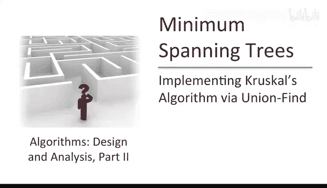
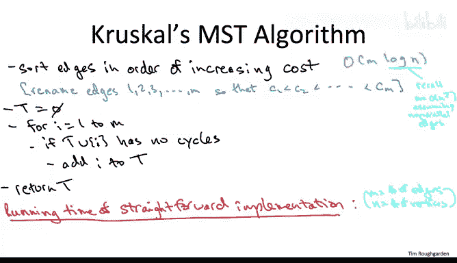
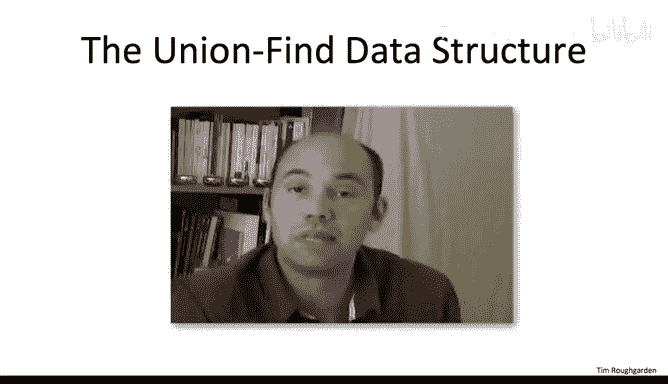
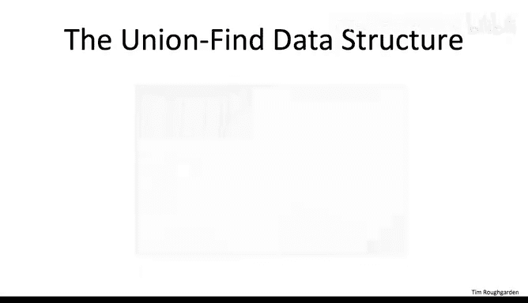
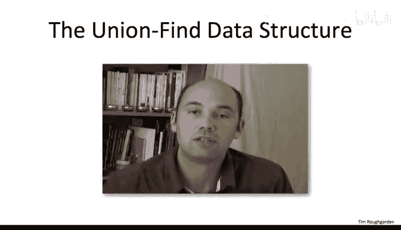
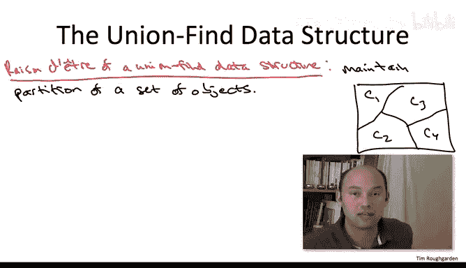
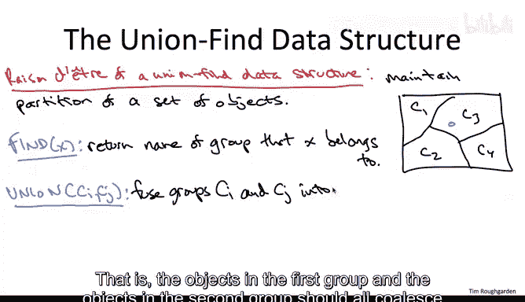

# 斯坦福大学《算法（分治／排序／搜索／随机算法、图搜索／最短路径／数据结构、贪心算法／最小生成树／动态规划、最短路径／NP）｜Algorithms》中英字幕 - P94：19_02_04_通过并查集实现Kruskal算法一.zh_en - GPT中英字幕课程资源 - BV1Rx4y1U7sZ

So now we understand why Cresco's algorithm is correct。

 Why that always computes a minimum cost spanning tree in this video will turn our attention to implementation issues。

 We'll begin with a straightforward implementation of Cressco's algorithm that'll give us a polynomial runtime bound。

 which is good， but we'd like to do better。 So then we'll show how deploying a suitable data structure。

 something you haven't seen before。 the union find data structure。

 allows us to speed up Crsco's algorithm to be competitive with Prims algorithm that is will' get a near linear running time bound of O of M login。

So let's just briefly review the very elegant pseudocode for Kesco's algorithm。

 So it's a greedy algorithm that considers the cheapest edges first all the way up to the most expensive。

 So we begin with a sorting preprocessing step to put the edges in sorted order for notational convenience。

 let's just rename the edges so that one is the cheapest edge and all the way up to M being the most expensive edge we then have our single linear scan in this for loop。

 and we just grab edges whenever we can so we maintain this evolving set capital T which at the end of the algorithm will be our spanning tree Now what forces us to exclude an edge from this set capital T。

 well if it creates a cycle with the edges we've already chosen obviously that's a no go。

 we can't have cycles in our final output。 But as long as we don't have a cycle from including an edge we go ahead and optimistically included。

 And as we've seen this is a correct algorithm that always outputs the minimum cost spanning tree。

 So what would be the running time of this algorithm。

 if we just straightly implement the pseudocode on this slot。Well。

 let's just consider the algorithm step by step and the first step we sort the edges。

 so that's going to take M log n time。Now don't forget， whenever we're speaking about graphs。

 we have the convention that M denotes the number of edges and N denotes the number of vertices。

So you might justifiably wonder why I wrote M log N for the running time of this sorting step instead of M log M since after all what it is resting are the edges and there's M of them。

 Well， what I'm using here is that in this context。

 we can switch log n and log M interchangeably with each other inside a big O notation Why is that true。

 Well recall when we first discuss graphs in part1， we notice that there can't be too many edges。

 so the number of edges M is at most quadratic and the number of vertices。

 It's the most big O of n squared。 So if M is at most n squared。

 then log M is at most two log n and the two is suppressed in the big O notation。

 So log M and log n are interchangeable in this context notice that for the minimum co span tree problem。

 you may as well assume that there's no parallel edges。

 you may as well assume that the graphs are simple if you have a bunch of parallel edges between a given pair of vertices。

 you can just throw out all but the cheapest one。 That's the only one you'll ever need。

So moving on to the main loop， pretty obvious how many iterations we have there。

 we have em iterations。So all we need to figure out is how much work do we have to do in each iteration。

 so what is it that each iteration needs to accomplish。

 it needs to check whether or not adding the current edge to the edges we've already chosen creates a cycle or not。

 So I claim that can be done in time linear in the number of vertices that is it can be done in big O of n time。

So how do we accomplish this Well， we need two quick observations first of all and this is something we've seen in arguments in previous videos checking whether or not this new edge is going create a cycle。

 say the edges has endpoints U and V checking for a cycle boils down to checking whether or not there's already a path between the endpoints U and V and the edges capital T that we've chosen so far if there is a UV path already adding this edge will close the loop and create a cycle if there currently is no UV path then adding this edge will not create a cycle So the second observation as well how do we check if there's a path from U to V and the edges we've already chosen well we know how to do that just using graph search so you can use breathth first search you can use depth first search it doesn't matter you just start at the vertex U and you see if you have a reach V or not if you reach it there's a path if you don't reach it there's not a path breathth first search depth first search whatever it takes time linear in the graph that you're searching and since we only need to search through the edges that are in capital T and there's gonna to be at most n minus one of them linear time in this context means o of N of the number of vertices because that。

Downs the number of edges that might be in capital T， the edges that we're searching for a path。

So adding up all of this work， what do we have， we have the sorting preprocessing step that takes time big O of M log n。

 then we have these M iterations of the for loop， each of which takes O of n times so that gives us an M times n factor。

 the latter term dominates so the overall running time is big O of M times。

So this coincidentally is the same running time we got from the straightforward implementation of Prims algorithm and I'll make the same comments here。

This is a reasonable running time。 It's polynomial on the input size。

 It's way better than checking all exponentially many spanning trees that the graph might have。

 but we certainly would like to do better。 We'd certainly love to have an implementation of Crusco's algorithm that gets just a near linear running time bound。

 And that's the plan。 How are we going to do it。 Well。

 really the work that we're doing here over and over again。

 which is kind of a bummer is these cycle checks。 And every single iteration we're spending time linear in the number of vertices to check for a cycle。

 And the question is。Can we speed that up and the union find data structure will actually。

 believe it or not， allow us to check for a cycle。Constantine。

So if we actually had a data structure that could implement constant time cycle checks。

 then we'd have to spend only constant time for each iteration of this wild loop so the loop overall would take only linear time in the number of edges O of M edges if we got that。

 then believe it or not the sorting preprocessing step would become the bottleneck in the running time of Cruessco's algorithm。

 our running time would drop from M times n down to Ne linear down to O of M login。

So let me now tell you a little bit about this magical data structure that's going to give us constant time cycle checks。

 I'm just going to give you the high level picture and how it connects to Cruesco's algorithm on this slide。

 We'll look at the details of the data structure in the next video。

I also want to warn you that I'm not going to discuss in this pair of videos the state of the art for Union find data structures I'm going to give you a fairly primitive version but that is nevertheless sufficient to give us our desired M logN running time of Kessco's algorithm。

 so if you're interested there is some optional material about different implementations of Union fine that use some super cool ideas like Union by rank and path compression that give you different and in some sense is better operation times。

 but the quick and dirty version of Union fine that I'm going to discuss here is sufficient for our present needs。

So the rayzone detra of a union fine data structure is to maintain a partition of a set of objects。

So in this picture， the overall rectangle is meant to denote a set of objects and then C1， C2。

 C3 and C4 are disjoint subsets that together form the union of the entire set。

 so that's what I mean by a partition of a group of objects。

We're not going to ask too much of this data structure。

 we're going to ask it to support two operations， no prizes to guess what those two operations are called。

So to find operation， we give it an object from this universe and we ask the data structure to return to us the name of the group to which that object belongs。

 so for example， if we handed it something in the middle of this rectangle and object。

 we'd expect it to return to us the name C3。The union operation by contrast takes as input the names of two groups and what we want the data structure to do is di fuse those two groups together。

 that is the objects in the first group and the objects in the second group should all coalesce and be now in one sole group。

So why might such a data structure be useful for speeding up Kesco's algorithm？To see the connection。

 think of Crrusscoll's algorithm as working conceptually in the following way。

 So initially when the algorithm starts and the set capital T is empty。

 each of the vertices is by its own， it's on its own isolated component。

 And then each time Crurusscoll adds a new edge to the set capital T。

 What that does is it takes two current connected components and fuses them into a single connected component。

So for example， toward the end of Cruscoll's algorithm。

 maybe it's included enough edges that now the tree capital T that is constructed so far has only four different connected components。

 and maybe it's about to add a new edge， U comma V where of course U and V should be in different connected components with respect to the edges chosen so far。

 so this new edge addition at this iteration of Cruessco is going to fuse the connected components of U and V into a single one so that corresponds to taking the union of the groups to which U and V respectively belong。

So to be a little more precise about it， so what are going to be the objects contained by the Union find data structure in Cruscoll's algorithm。

 well they're going to correspond to vertices， it's the vertices coalescing that we want to keep track of。

So what are going to be the groups in the partition that we maintain。

 they're just going to correspond the connected components with respect to the edges that Cruscoll's algorithm has already committed to。

And with these semantics， it's clear that every time Crusco adds a new edge to its set capital T。

 we have to invoke the Union operation to fuse two connect components into one。

