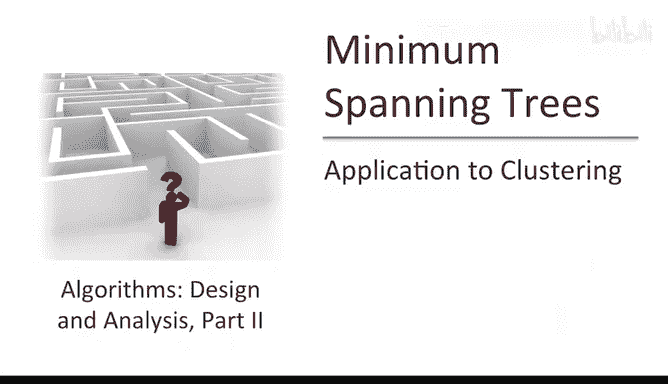
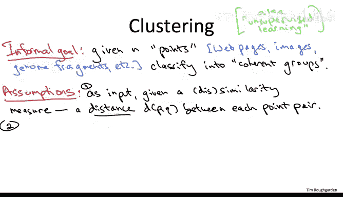
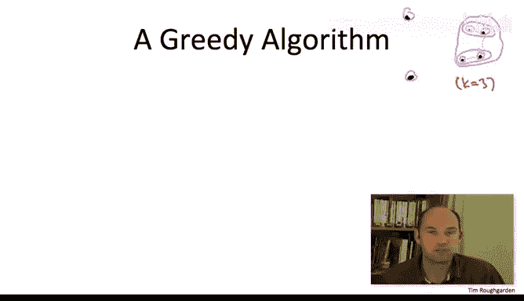
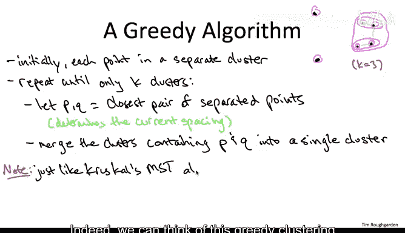

# 斯坦福大学《算法》课程：P97：聚类应用 🎯

在本节课中，我们将学习最小生成树问题的一个重要应用领域：**聚类问题**。我们将从一个非正式的目标描述开始，逐步形式化一个具体的优化目标，并最终推导出一个与最小生成树算法紧密相关的贪心算法来解决它。

---

## 聚类问题概述



上一节我们深入探讨了最小生成树问题及其算法。本节中，我们来看看它在**聚类**问题上的应用。


在聚类问题中，输入是一组**点**，我们可以将其视为嵌入在某个空间中的对象。实际上，这些点很少是真正几何意义上的点，它们通常代表我们关心的对象，例如网页、图像或数据库记录，只是被表示为空间中的点。

给定一组对象，我们希望将它们**聚类**成一些在某种意义上“连贯”的组。对于有机器学习背景的听众，这个问题通常被称为**无监督学习**，因为数据没有标签，我们是在未标注的数据中寻找模式。

---

## 定义相似性度量

以上描述比较模糊。为了更精确，我们假设输入的一部分是一个**相似性度量**。对于任意两个对象，我们有一个函数给出一个数字，表示它们之间的相似程度，或者更准确地说，是**不相似**程度。



为了保持几何比喻，我们将这个函数称为**距离函数**。一个很酷的地方是，我们不需要对这个距离函数施加太多假设。我们唯一要假设的是它具有**对称性**，即从点 P 到点 Q 的距离与从点 Q 到点 P 的距离相同。

**距离函数示例：**
*   **几何距离**：如果点确实在 R^M 空间中，可以使用欧几里得距离或其他范数（如 L1 或 L∞ 范数）。
*   **应用特定距离**：在许多应用领域存在广泛接受的相似性或距离度量。例如，对于基因序列，距离可以是两个基因组片段最佳比对所需的惩罚值。

---

## 形式化聚类目标

现在我们有了距离函数，那么“连贯的组”意味着什么？距离小（相似）的对象通常应该在**同一组**中，而距离大（不相似）的对象则应该主要在**不同组**中。

如何评估一个聚类的好坏？实际上，形式化这个问题的方法有很多。我们将采用一种**基于优化**的方法：我们提出一个关于聚类的目标函数，然后寻找优化该目标函数的聚类。

需要提醒的是，这不是唯一的方法，但优化是一种自然的方法。就像在调度应用中一样，人们研究的目标函数不止一种。一个非常流行的目标是 **K-means 目标函数**。在本讲座中，我们将采用一个特定的目标函数，它足够自然，并且能让我们研究与最小生成树算法相关的自然贪心算法。

---


## 定义目标函数：间距

在聚类问题中，一个常见问题是：要使用多少个簇？为了简化，在本视频中，我们假设输入的一部分 **K** 指明了应该使用的簇的数量。因此，我们假设你知道需要多少个簇。

我们将要研究的目标函数是根据**被分隔的点对**（即被分配到不同簇的点对）来定义的。只要有多于一个簇，就必然存在一些被分隔的点对。最令人担忧的被分隔点对是那些**最相似**、距离最小的点对。我们希望被分隔的点尽可能远离。因此，我们特别关注那些**彼此靠近却被分隔**的点对。

这就是我们的目标函数值，称为聚类的**间距**。它定义为**所有被分隔点对中，距离最近的那一对点之间的距离**。

我们希望所有被分隔的点对都尽可能远离，因此我们希望间距**越大越好**。

这自然引出了形式化的问题陈述：给定输入（距离度量，即每对点之间的距离）和期望的簇数量 K，在所有将点划分为 K 个簇的方法中，找到使**间距最大化**的聚类。

---

## 设计贪心算法

让我们设计一个旨在使间距尽可能大的贪心算法。为了便于讨论，我们使用一个包含六个黑点的示例点集。

这个贪心算法的好主意是：先不担心最终只能输出 K 个簇的约束。在算法过程中，我们实际上会处于**不可行**状态（即簇的数量多于 K 个），只有在算法结束时，我们才会减少到 K 个簇，得到最终可行的解。这让我们可以自由地将过程初始化为一个**退化解**：每个点都在自己的簇中。

在我们的示例中，初始时有六个粉色的孤立簇。一般来说，初始有 n 个簇，而我们需要减少到 K 个。

现在回想一下间距目标：遍历所有被分隔的点对（在退化解中就是所有点对），找出最令人担忧的被分隔点对，即彼此最接近的点对。间距就是这些最近被分隔点对之间的距离。

在贪心算法中，你希望尽可能增加目标函数。在这种情况下，做法非常明确。假设给你一个聚类，你想让间距变大。唯一的方法是：找到当前**距离最近的一对被分隔点**，并让它们**不再被分隔**，即把它们放入同一个簇中。从某种意义上说，为了增加目标函数，你必须查看定义当前目标的那对点（最近的一对被分隔点），并**融合**它们所在的簇。

在我们的例子中：
1.  初始间距由右上角最近的一对点定义。为了增大间距，我们融合它们所在的簇。簇数从 6 变为 5。
2.  重新评估新聚类的间距。现在最近的一对被分隔点似乎是右下角的那一对。我们融合它们所在的簇。簇数从 5 变为 4。
3.  再次评估。当前间距由图片最右侧的一对点定义。我们融合包含这两个点的两个簇（此时每个簇包含两个点），合并成一个包含四个点的簇。簇数从 4 变为 3。

假设我们正好需要 K=3 个簇，那么此时贪心算法将停止。

---

## 算法伪代码与关联

现在，让我们更一般地阐述这个贪心算法的伪代码。它正是基于以上讨论所期望的样子。

**伪代码：最大间距聚类贪心算法**
```
输入：点集，距离函数 d(., .)，期望簇数 K
初始化：每个点自成一个簇
当 当前簇的数量 > K 时：
    找到距离最近的两个点 p 和 q，且它们位于不同的簇中
    合并包含点 p 和点 q 的两个簇
输出：最终得到的 K 个簇
```

我希望你花点时间看看这段伪代码，并尝试将其与我们课程中学过的一个算法联系起来，特别是最近学过的一个算法。我希望它能让你强烈地想起一个我们已经学过的算法。

具体来说，我希望你看到这个贪心算法与 **Kruskal 算法**（用于计算最小成本生成树）之间有很强的相似性。



实际上，我们可以认为这个贪心聚类算法**完全等同于** Kruskal 的最小生成树算法，只不过它被**提前终止**了——当图中剩余的连通分量数量恰好为 K 时停止，即在添加最后 K-1 条边之前停止。

为了确保对应关系清晰：
*   聚类问题中的**对象**（点）对应图中的**顶点**。
*   聚类问题输入中的**距离**（每对点之间）对应最小生成树问题中的**边成本**。
*   由于我们为每一对点都定义了距离（边成本），我们可以认为聚类问题中的边集是**完全图**。



这种使用类似 MST 的标准一次融合一个分量的凝聚式聚类有一个名字，叫做**单连接聚类**。

单连接聚类是一个好方法。如果你处理聚类问题或无监督学习问题，它绝对应该是你工具箱中的一个工具。在下一个视频中，我们将通过证明它确实在所有可能的 K 聚类中最大化间距，来从特定角度证明其合理性。

但即使你不关心间距目标函数本身，你也应该熟悉单连接聚类，因为它还有许多其他优良特性。

---

## 本节总结

本节课中，我们一起学习了如何将最小生成树算法应用于聚类问题。我们从一个非正式的聚类目标出发，定义了**间距**这一具体的优化目标，并设计了一个旨在最大化间距的贪心算法。关键发现是，这个算法本质上就是 **Kruskal 最小生成树算法**的变体，被称为**单连接聚类**。这再次展示了核心算法思想在不同问题领域中的强大通用性。