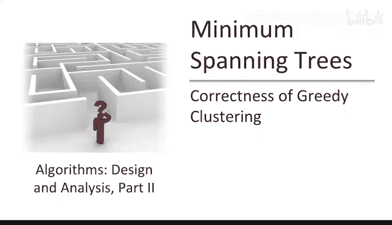
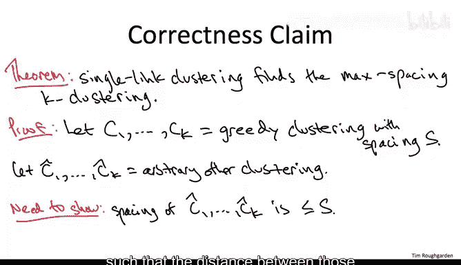
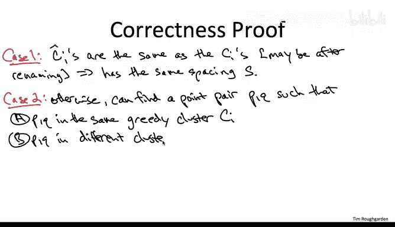
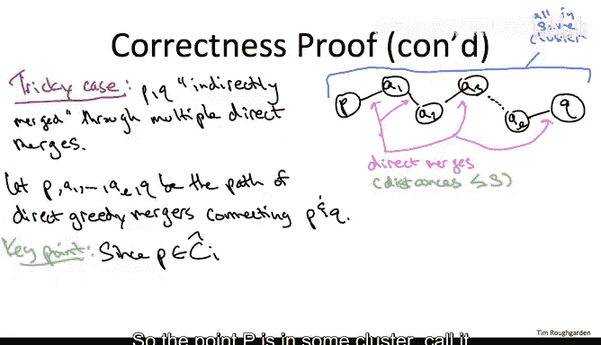

# 斯坦福大学《算法（分治／排序／搜索／随机算法、图搜索／最短路径／数据结构、贪心算法／最小生成树／动态规划、最短路径／NP）｜Algorithms》中英字幕 - P98：23_02_02_聚类算法正确性.zh_en - GPT中英字幕课程资源 - BV1Rx4y1U7sZ

This video will prove the correctness of our greedy algorithm for clustering will show that it maximizes the spacing over all possible K clusterings。

You might have hoped that we could deduce the correctness of this greedy algorithm for clustering immediately from our correctness proofs for various greedy minimum spanning tree algorithms。

 Unfortunately， that doesn't seem to be the case in the minimum cost spanningry problem we were focusing on minimizing some of the edge costs here。

 we're looking at a different objective maximizing the spacing。

 So we do need to do a proof from scratch。 That said。

 the arguments we'll use should look familiar to you not just from the sort of exchange type arguments when we prove the cut property。

 but also it might remind you even more going back further to our greedy algorithms for scheduling。

So let's now set up the notation for the proof as usual we're going to look at the output of our algorithm。

 it achieves some objective function value， some spacing。

 we're going to look at an arbitrary competitor， some other proposed scheduling and we're going to show that we're at least as good。

 our spacing is at least as large。So specifically， we'll denote the clusters in the output of our algorithm by C1 up to CK。

Our clustering has some spacing， some distance between the near closest pair of separated points。

 call it capital S。We're going to denote our competitor some alternative K clustering by C hat1 up to C hat K。

What is it that we're trying to show we want to show that this arbitrary other clustering has spacing no larger than ours if we can show that then because this clustering was arbitrary it means the greedy clustering has spacing as large as any other。

 so it's maximizing the spacing and that's what we want to prove。

But differently we want to exhibit a pair of points separated by this clustering C1 hat up to C HaK。

 such that the distance between those separated points is S or smaller。

So let me just quickly dispose of a trivial case。 If the sea hats are the same as the seas。

 possibly up to a renaming， then， of course， exactly the same pairs of points are separated in each of the clusterings。

 So the spacing is exactly the same。 So that's not a case we have to worry about。

The interesting case then is when the sea hats differ fundamentally from the seas when they're not merely a permutation of the clusters in the greedy clustering。

 and the maneuver we're going to do here is similar in spirit to what we did in our scheduling correctness proof way back in our scheduling correctness proof。

 we argued that any schedule that differs from the greedy run suffers from， in some sense。

 a local flaw。 We identified an adjacent pair of jobs that was in some sense。

 out of order with respect to the greedy ordering。The analog here is we're going to argue that for any clustering。

 which is not merely a permutation of the greedy clustering。

 there has to be a pair of points which is classified differently in the C hats relative to the C's By differently。

 I mean， they're clustered together in the greedy clustering。

 these points P and Q belong to the same cluster C sub I， yet in this alternative clustering。

 which is not just the permutation of the greedy clustering they're placed in different clusters。1。

 maybe P and C hat I and Q and some other C hat J。

So I want to now split the proof into an easy case and a tricky case to explain why the easy case is easy。

 let's observe a property that this greedy clustering algorithm has。 Now。

 the algorithm's philosophy is that the squeaky wheel should get the grease。

 That is the separated pair of points that are closest to each other。

 are the ones that should get merged。 So for this reason。

 because it's always the closest separated pair that gets merged。

 if you look at the sequence of point pairs that get merged together that determine the spacing in each subsequent iteration。

 the distances between these sort of worst separated points is only going up over time at the beginning of the algorithm。

 the closest pair of points in the entire points set are the ones that get directly merged。

 then those are out of the picture now that some furtheraway pair of points are separated and determines the spacing then they get merged once they've been coalesced。

 then there's still some furtheraway pair of points， which is now the smallest ones separated。

 they get merged and so on。 So if you look at the sequence of distances between the pairs of points that are directly merged。

The greedy algorithm that is only going up over time and this sequence culminates with the final spacing capital S of the greedy algorithm in some sense the spacing of the output of the greedy algorithm is the distance between the point pair that would get merged if we ran the greedy algorithm one more iteration。

 but unfortunately we're not allowed to do that okay so the point is for every pair of points directly merged by the greedy algorithm。

 there're always a distance at most capital S away from each other。The easy case then。

 is when this pair of points P Q， which on the one hand。

 lie on a common greedy cluster by their hand in different clusters of the sea hats。

 If they were at some point， not merely in the same cluster。

 but actually directly merged by the greedy algorithm。 If at some iteration。

 they determine the spacing and were picked by the greedy algorithm to have their clusters merged。

 Then we just argued that the distance between P And Q is no more than the spacing capital S of the greedy clustering。

 And since P And Q lie in different clusters of the C hats， it's separated by the sea hats。

 and therefore， they upper bound the spacing of the C hats。 Maybe there' some even closer。

 separated pair by the C hats。 But at the very least， P and Q are separated。

 So they upper bound the spacing of the sea hat clustering。

So remember that's what we wanted to prove， we wanted to show that this alternative spacing couldn't have better spacing than our greedy spacing。

 it had to be at most as big， it had to be at most capital S。

 So in this easy case when P and Q or directly merged by the greedy algorithm were done So the tricky case is when P and Q are only indirectly merged and you may be wondering at the moment what does that mean how do two people wind up in the same cluster if they weren't at some point directly merged so let's draw a picture and see how that can happen。

So the issue is that two points B& Q might wind up in a common greedy cluster not because the greedy algorithm ever explicitly considered that point pair。

 but rather because of a path or a cascade of direct mergers of other point pairs。Imagine。

 for example， that at some iteration of the greedy algorithm。

 the point P was considered explicitly along with the point a1 where here A1 is meant to be different than Q。

 So that's a direct merger and P and A1 wind up in the same cluster。 their clusters are merged。

 maybe the same thing happens with a point Q and some point A sub L， which is different than P。

 Similarlyly， maybe you know at some other time， some totally unrelated pair of points A2 and A3。

 are directly merged and then at some point A1 and A2 are considered by the greedy algorithm because they're the closest pair of separated points and they get merged and so on。

So the edges in this picture are meant to indicate direct mergers。

 pairs of points that are explicitly fused because they determine the spacing at some point of the greedy iteration。

 but at the end of the day， the greedy clustering is going to have the results of all of these mergings。

So in case you're feeling confused， let me just point out that we really saw this exact same thing going on。

 We were talking about minimum spanning trees in Kesco's algorithm。

 So at an intermediate point in crsco's algorithm after it's added some edges。

 but before it's constructed a spanning tree， as we discussed the intermediate state is a bunch of different kinetic components and there are vertices that have an edge chosen between them。

 they of course， are going to be in the same kinetic component。

 but they're in a kinetic component could have long paths in it。

 So you could have vertices that are in the same kinetic component and an intermediate state of crescle's algorithm。

 despite the fact that we haven't chosen edge directly between them。

 there's rather a path of chosen edges between them。 it's exactly the same thing going on here。

 Now what we have going for us is that if a pair of points as discussed was directly merged。

 we know they're close。 The distance between them is most the spacing capital S。

 We really don't know anything， frankly， about the distance between pairs of vertices that were not directly merged。

 They just sort of accidentally wound up in a common cluster。But this turns out to be good enough。

 this is actually sufficient to argue that this competitor clustering with the C hats has spacing no more than S。

 no better than ours， let's see why。So given that P&Q are in a common greedy cluster。

 it must be that there were a path of direct mergers that forced them to be in the same cluster。

 so let's let the intermediate points involved in that path denoted A1 up to AL。

So here's the part of the proof where we basically reduce the tricky case to the easy case so we've got this pairPos PQ now remember not only are they in a common greedy cluster but they're in differentffer clusters in our competitor in the C hats so the point P is in sum cluster called it C hat I and Q is in something else in particular it's not in C hat I。

Now， imagine you go on a hike。 You start at the point P and you hike along this path。

 You traverse these direct mergers toward Q。 Now， you're starting inside C hat I。

 and you end up outside。 So on some point on your hike， you will traverse the boundary。 You will。

 for the first time， escape from C hat I and wind up in some other cluster。 So that has to happen。

 And let's call AI and AI plus one， the consecutive pair of points at which you go from inside this cluster to outside this cluster。

And now we're back in the easy case。 Now we're dealing with a separated pair that were directly merged by the greedy algorithm。

 Remember that we set up this path to be a path of direct mergers。 in particular。

 AJ and AJ plus1 were direct mergers， therefore， their distances at most S。 And again。

 by virtue of being direct merges， the distance is at most the spacing of the greedy clustering。

 and yet as a separated point by the sea hats， it's also an upper bound on the spacing of the C hats。

 This means the spacing S of our greedy clustering is as good as the competitor Since the competitor was arbitrary were optimal。

 that completes the proof。