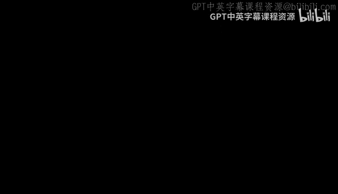
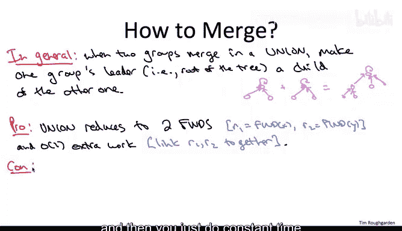

# 斯坦福大学《算法（分治／排序／搜索／随机算法、图搜索／最短路径／数据结构、贪心算法／最小生成树／动态规划、最短路径／NP）｜Algorithms》中英字幕 - P99：24_02_01_惰性合并-进阶选学.zh_en - GPT中英字幕课程资源 - BV1Rx4y1U7sZ

So welcome to this optional sequence of videos on state of the art implementations of the Union defined data structure Now as advanced and optional material。

 let me make a few comments before we get started。So the first comment is I'm going to assume that you're in a particularly motivated mood now no one's forcing you to take these algorithms courses。

 so I'm always assuming that you're a very motivated individual。

 but that's going to hold even more true than usual in these advanced videos and the way that plays out is while I'm going to hold myself to the same exacting standards of clarity that I usually do I'm going to ask a little bit more of view of the viewer I'm going to perhaps dot a few less eyes cross a few less Ts than I usually do and so you may find yourself periodically needing to pause and think through some of the details that I'm glossing over。

The second comment is I'm going to give sort of short shrift to applications of the Union find data structure。

 that's not because there aren't any， there are plenty of applications of this data structure。

 but for these videos we're really just going to immerse ourselves in the beauty and the depth of the ideas behind the design of the data structures and especially the analysis of their performance。

The final comment is to keep in mind that this is some seriously next level material。

 It is totally normal that the first time you see this stuff， you find it confusing。

 you find it difficult to understand， so confusion should not discourage you。

 It does not represent any intellectual failing on your part， rather keep in mind。

 it represents an opportunity to get even smarter。 so with those comments in mind。

 let's go ahead and proceed to a different approach to the union find data structure via lazy unions。

So let's have one slide with a quick review of what we already know about the Union find data structure recall we discussed this in the context of a fast implementation of Crscoll's minimum expandingning tree algorithm。

The razon detra of a union find data structure is to maintain a partition of a universe of objects so in the context of Crscoll's algorithm。

 the objects were the vertices and the groups we wanted to maintain were the connected components with respect to the edges we committed ourselves to so far。

Data structure should support two operations， no prizes for guessing the names of those two operations first is the fine operation this is given an object from the universe。

 return the name of that object's group。So for example。

 if x was in the middle of this square that I put on the right representing the universe capital X。

 we would return C3， the name of the group that contains x。

So in the context of Crusco's algorithm we used the find operation to check for cycles。

 how did we know whether adding a new edge would create a cycle with respect to the edges we've already chosen。

 what would be if and only if the endpoints of that edge were already in the same connected component that is if and only if the two find operations return the same answer。

In the union operation you're giving not one object， but two call them X and Y。

 and then the responsibility of operation is to merge the groups that contain X and Y so for example in the picture if y was in C4 x was as before in C3。

 then your job is to fuse the group C3 and C4 into a single group。

In the context of Crusco's algorithm， we needed this operation when we added a new edge。

 this fuseed together two of the existing connected components into one。

 so that was exactly the union operation。So we already went through one implementation of Union fine that was in order to get a blazingly fast implementation of Ksco's algorithms。

 so let's just review how that worked。With each group， we associated a linked structure。

 so each object had one pointer associated with it。

 and the invariant was in a given group there was some representative leader object and everybody in that group pointed to the leader of that group。

So for example， on the right I'm showing you a group with three objects， X， Y， and Z。

 and X would be the leader of this group， all three of the objects point directly to X。

 and that would just be the output of the find operation， the leader of the group。

 we use that as the group name。Now the part which is cool and obvious about this approach is our fine operations take constant time。

 all you do is return the leader of the given object。

Now the tricky part was analyzing the cost of union operations。

 so the problem here is that to maintain the invariant that every object of a group points to its leader。

 when you fuse two groups， you have to update a bunch of the object's leaders。

 you'd only have one leader for the one new group。The simple but totally crucial optimization that we discussed was when two groups merge。

 you update the leader pointers of all objects in the smaller group to point to the leader of the bigger group that is the new fused group inherits the leader from the bigger of its constituent parts if we do that optimization。

 it's still the case that a single union might take linear time of n time。

 but a sequence of n unions takes only big O of n log n time and that's because each object endures at most a logarithmic number of leader updates because every time its leader pointer gets updated。

 the population of the group that it inhabits doubles。So in this sequence of videos。

 we are going to discuss a different approach to implementing the Union find data structure。

And let's just go all in and try to get away with updating only a single pointer in each union。

All right， well how are we going to do that Well， I think if we look at a picture。

 it'll be clear what the approach is going to be。So let's look at a simple example。

 there's just six objects in the world， and currently they're in two groups， one， two。

 and three are in one group with leader one， four， five and six are in the second group with leader four。

So with our previous implementation of Union fine， the two groups have equal size。

 so we pick one arbitrarily to represent the new leader。

 let's say four is going to be the new leader， and now we update objects1， two。

 and three so that they point directly to their new leader4。And so the new idea is very simple。

 let's just sort of as a shorthand for rewiring all of one two and three to point to four。

 let's just you know rewire one's pointer to point to four。

 and then it's understood that two and three as descendants of one also now have the new leader four as well。

So as a result， we do again get a directed tree afterwards。

 but we don't get one with just depth of one。 we don't get as shallow bushy a tree。

 We get a deeper one that has two levels below the root。

So let me give you another way of thinking about this in terms of array representation and here I also want to make the point that while conceptually it's going to be very useful to think of these Unionfin data structure in terms of these directed trees。

 if you're actually implementing this data structure， this is not how you'd do it。

 you wouldn't bother with actual pointers between the different objects。

 you just have a simple array indexed by the nodes and in the entry corresponding to a node I。

 you would just store the name of Is parent。For instance。

 if we reframe this exact same example in array representation before we do the union what do we got。

 well objects one， two and three all have parent one， objects four。

 five and six all have parent four， so in the array we'd have a one in the first three entries and a four in the second three entries。

So in the old solution， we have to update the parent pointers of objects one， two and three。

 they're all going to point directly of four， so that gives us an array entirely of fours。

Whereas in the new solution， the only node whose parent pointing gets updated is that of object1。

 it gets updated from itself to4。And in particular， objects two and three still point to object1。

 not directly to object 4。So that's how union works in a simple example how does it work in general well in general you're given two objects each belongs to some group you can think of these two groups conceptually as directed trees if you follow all the parent pointers。

 all parent pointers lead to the root vertex and we identify those root vertices with the leaders of these two groups now when you have to merge the two trees together。

 how do you do it well you pick one of the groups and you look at its root。

 currently it points to itself you change its parent pointer to points to the other groups' leader that is you install one of the two roots as a new child of the other trees root。

So I hope the pros and cons of this alternative approach to the union find data structure are intuitively clear the when the pro comes in the union operation which is now very simple now you might be tempted to just say union takes constant time because all you do is update one pointer but it's actually not so simple because remember you're given two objects X and Y and in general you're not linking x and Y together they might be somewhere deep in a tree you're linking roots together so what is true is that the union operation reduces two two indications of find you have to find x's root R sub1。

 you have to find ys root R sub2 and then you just do constant time linking either R1 to r2 or vice versa。

Now the issue with this lazy union approach is that it's not at all obvious and in fact it's not going to be true that the operation takes constant time。

 remember previously when we actually did all this hard work of updating all of these leader pointers every time we had a union。

 it guaranteed that whenever there was a fine boom， we just look in the field。

 we return the leader pointer we done here parent pointers do not point directly to roots。

 rather you have to traverse in general， a sequence of parent pointers from a given object X to go all the way up to the root of the corresponding tree。

So because of these tradeoffs， these pros and cons。

 it's really not obvious at all whether this lazy union approach to the union find data structure is a good idea whether it's going to have any payoffs。

 so that's going to take some really quite subtle analysis。

 which is the main point of the lectures to come it's also going to take a couple of optimizations and the next video will start with the first one you might be wondering okay so when you do a union and you have to install one route under the other。

 how do you make that choice。 So the right answer is something called union by rank that's coming up next。

