# 算法分析：01：渐近分析核心概要 🎯

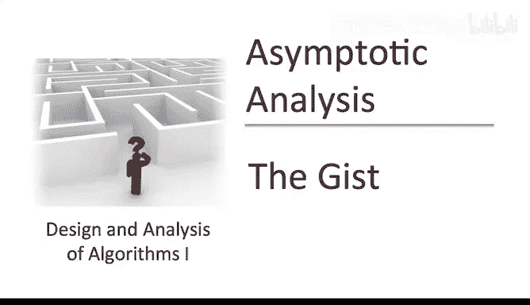

在本节课中，我们将要学习**渐近分析**。这是每一位严肃的程序员和计算机科学家用来讨论算法高级性能的通用语言，因此它是一个至关重要的主题。本视频旨在衔接课程介绍中已讨论的高级概念与我们将从下个视频开始建立的数学形式化体系。在进入数学形式化之前，我们需要确保这个主题有充分的动机，你对它要达成的目标有坚实的直觉，并且已经看过几个简单直观的例子。让我们开始吧。

## 动机与核心思想

渐近分析为讨论算法的设计与分析提供了基本词汇。虽然它是一个数学概念，但它绝非为了数学而数学。你经常会听到资深程序员说某段代码运行时间是 **O(n)**，而另一段是 **O(n²)**。理解这些陈述的含义非常重要。

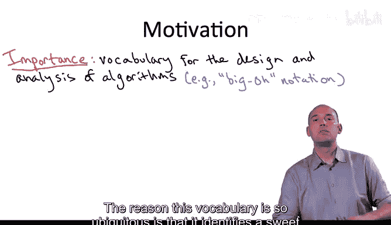

这种词汇之所以无处不在，是因为它找到了一个讨论算法高级性能的“最佳平衡点”。一方面，它足够**粗略**，可以忽略掉所有你希望忽略的细节，例如依赖于架构、编程语言、编译器选择等的细节。

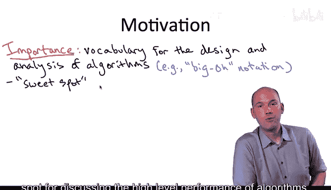

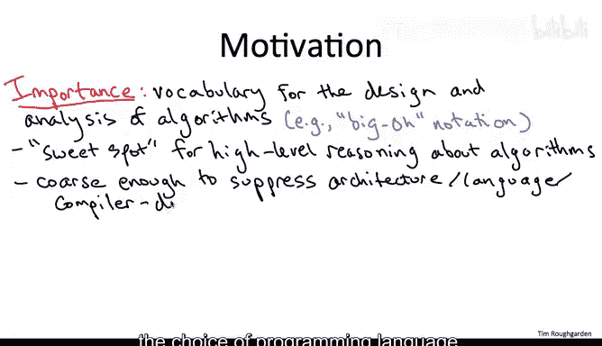

另一方面，它又足够**精确**，能够用于对不同高级算法方案进行预测性比较，尤其是在处理大规模输入时。正如我们之前讨论的，大规模输入在某种意义上才是真正有趣的，因为它们需要我们发挥算法的创造力。例如，渐近分析将使我们能够区分排序、整数乘法等问题的优劣方法。

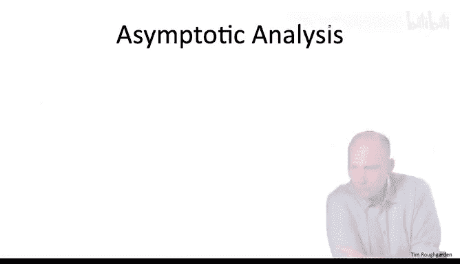

## 核心原则：忽略常数因子与低阶项

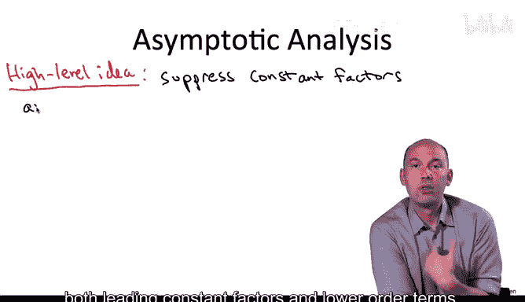

大多数资深程序员会告诉你，渐近分析的主要目的是**忽略常数因子和低阶项**。

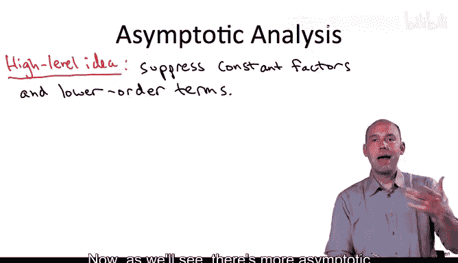

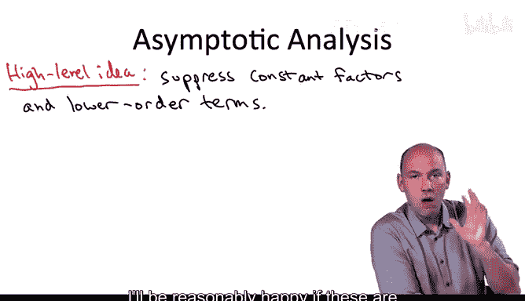

从长远来看，如果你只记得关于渐近分析的七个词，我希望你记住的就是这七个词。

我们如何证明采用这种形式化方法是合理的呢？低阶项，顾名思义，随着我们关注大规模输入（即算法创造力真正重要的场景）而变得越来越无关紧要。至于常数因子，它们高度依赖于运行环境、编译器、语言等具体细节。如果我们想忽略这些细节，那么采用一个不过分关注常数因子的形式化方法就是合理的。

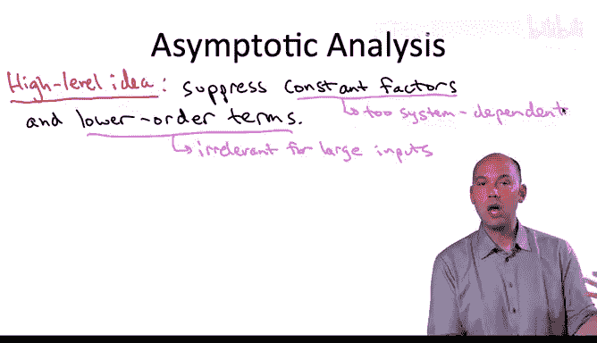

## 示例：归并排序

回想我们分析归并排序算法时，我们给出了其运行时间的一个上界：**6n log n + 6n**，其中 `n` 是输入数组的长度。这里的低阶项是 **6n**，它比 **n log n** 增长得慢。我们将其忽略。主导常数因子是 **6**，我们也将其忽略。经过这两步忽略，我们得到了一个更简单的表达式：**n log n**。

相应的术语是：归并排序的运行时间是 **O(n log n)**。换句话说，当你说一个算法的运行时间是 **O(f(n))** 时，你的意思是，在忽略低阶项和主导常数因子之后，你得到的是函数 **f(n)**。直观上，这就是大 O 符号的含义。

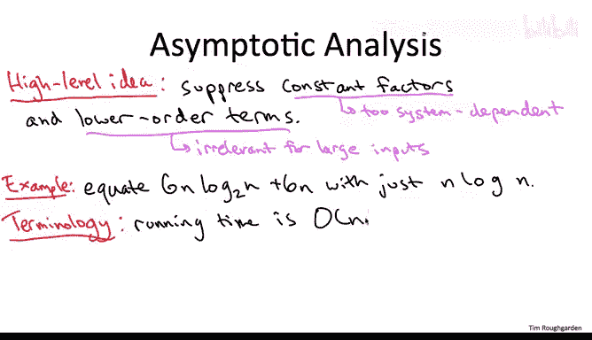

需要明确的是，我绝不是在断言常数因子在设计和分析算法时从不重要。我的意思是，当你思考高级算法方案，或者想比较解决一个问题的根本不同方法时，渐近分析通常是指导你哪种方法性能更好的正确工具，尤其是在处理相当大的输入时。当然，一旦你确定了一个特定的算法解决方案，你可能会努力改进其常数因子，甚至改进低阶项。如果你的初创公司的未来取决于你实现某几行代码的效率，那么请务必让它尽可能快。

## 四个简单示例

在本视频的剩余部分，我将通过四个非常简单的例子来阐述。如果你已经熟悉大 O 符号，可以直接跳到下个视频开始学习数学形式化。但如果你是第一次接触，我希望这些简单的例子能帮助你入门。

### 示例一：在数组中搜索整数 🔍

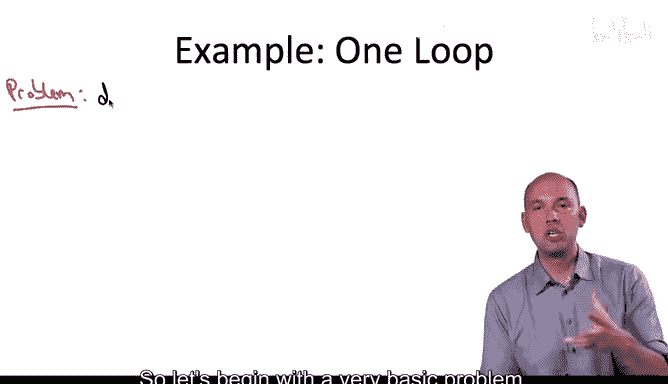

我们从一个非常基本的问题开始：在数组中搜索给定的整数。

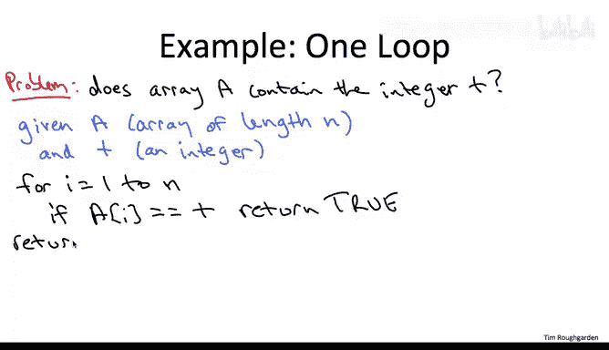

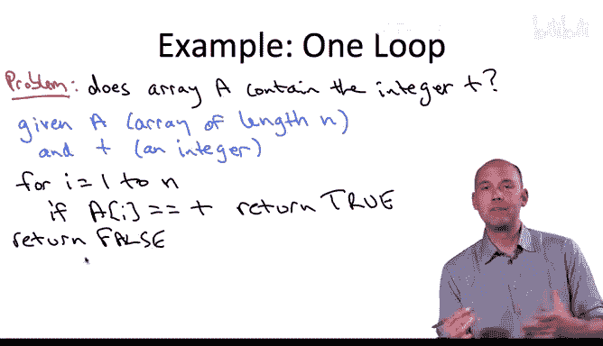

我们将分析解决这个问题的直接算法：对数组进行线性扫描，检查每个元素是否是目标整数 `t`。

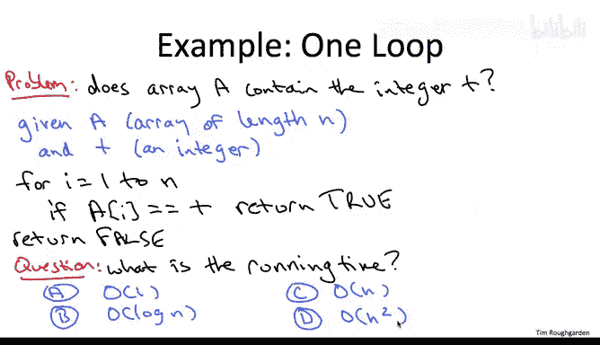

代码依次检查每个数组元素。如果找到目标 `t`，则返回 `true`；如果扫描完整个数组都没找到，则返回 `false`。

**问题**：根据数组长度 `n`，这个算法的运行时间（用大 O 表示法）是多少？

**答案**：**O(n)**，或者说该算法的运行时间相对于输入长度 `n` 是**线性**的。

**原因**：执行的代码行数取决于输入。在最坏情况下（即 `t` 不在数组中），代码会扫描整个数组 `A` 并返回 `false`。执行的操作次数是一个常数（初始设置等）加上对数组中每个元素执行的常数次操作。无论这个常数是 2、3 还是 4，它都会被大 O 符号方便地忽略。因此，总操作数与 `n` 成线性关系，所以大 O 表示法就是 **O(n)**。

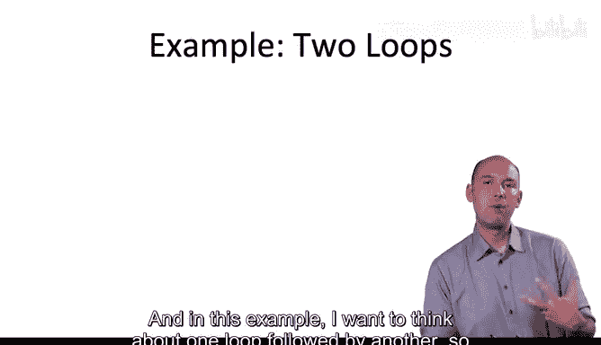

### 示例二：顺序双循环 ➡️➡️

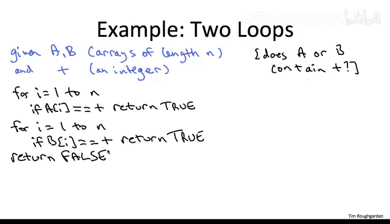

上一个示例中我们看到了一个循环。接下来三个示例，我们将看看处理两个循环的不同方式。在这个例子中，我们考虑一个循环后跟另一个循环，即**顺序执行**的两个循环。

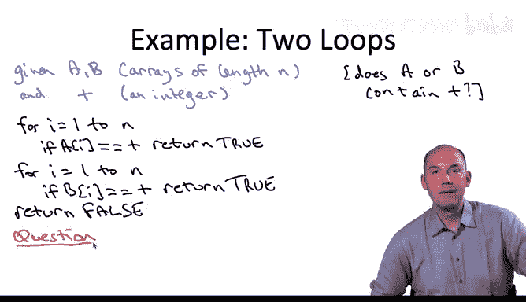

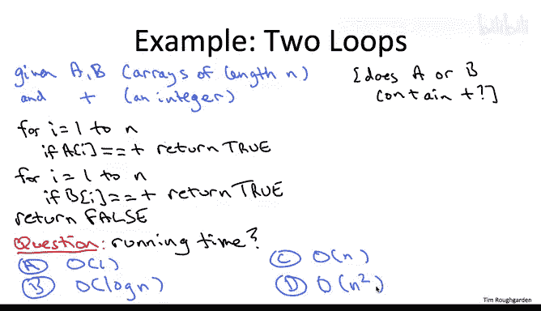

我们研究一个与上一个类似的问题：现在给定两个长度均为 `n` 的数组 `A` 和 `B`，我们想知道目标 `t` 是否存在于其中任何一个数组中。我们同样分析直接算法：先搜索 `A`，如果在 `A` 中没找到 `t`，再搜索 `B`。如果都没找到，则返回 `false`。

**问题**：这段新代码的运行时间（用大 O 表示法）是多少？

**答案**：**O(n)**。

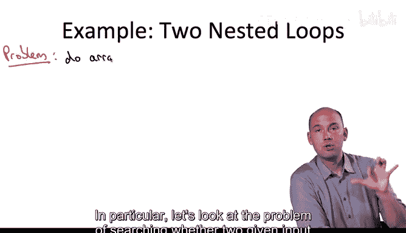

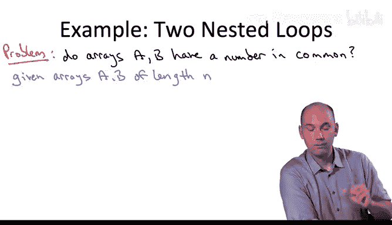

**原因**：实际计算的操作数当然不会和上次完全一样，它大约是上一段代码的两倍，因为我们需要搜索两个长度为 `n` 的数组。但无论这个倍数是多少，作为一个独立于输入长度 `n` 的常数，在我们使用大 O 表示法时都会被忽略。因此，和上一个算法一样，这也是一个线性时间算法，运行时间为 **O(n)**。

### 示例三：嵌套双循环（比较两个数组） 🔄

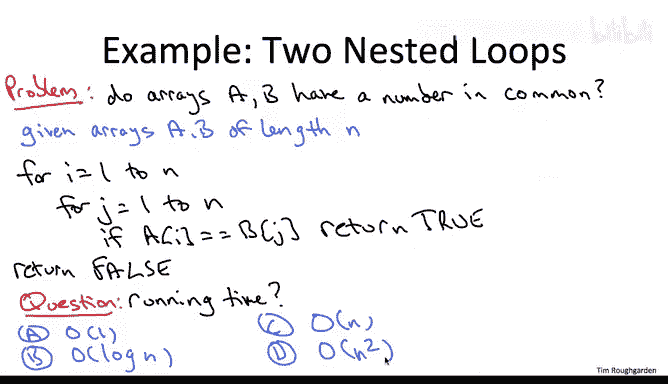

让我们看一个更有趣的双循环例子，这次循环不是顺序执行，而是**嵌套**的。具体来说，我们研究的问题是：判断两个给定的长度为 `n` 的输入数组是否包含一个相同的数字。

我们将分析解决这个问题的最直接算法：比较所有可能性。对于数组 `A` 的每个索引 `i` 和数组 `B` 的每个索引 `j`，我们检查 `A[i]` 是否等于 `B[j]`。如果相等，返回 `true`；如果穷尽所有可能性都没找到相等的元素，则返回 `false`。

**问题**：这段代码的运行时间（用大 O 表示法）是多少？

**答案**：**O(n²)**。我们也可以称之为**二次**时间算法，因为运行时间相对于输入长度 `n` 是二次的。对于这类算法，如果你将输入长度加倍，算法的运行时间将增加 4 倍，而不是像前两段代码那样增加 2 倍。

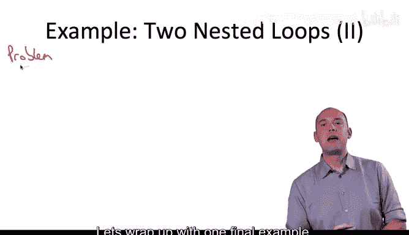

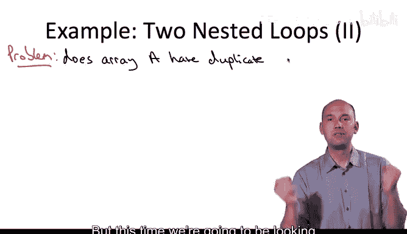

**原因**：同样，常数设置成本被忽略。对于数组 `A` 的每个固定索引 `i` 和数组 `B` 的每个固定索引 `j`，我们只执行常数次操作。关键区别在于，这个双重 `for` 循环总共有 **n²** 次迭代。在第一个例子中，单个 `for` 循环只有 `n` 次迭代。在第二个例子中，因为一个 `for` 循环在另一个开始前就结束了，所以总共只有 `2n` 次迭代。而在这里，外层 `for` 循环的每次迭代（共 `n` 次），内层 `for` 循环都要执行 `n` 次迭代，总共就是 `n * n`，即 **n²** 次迭代。

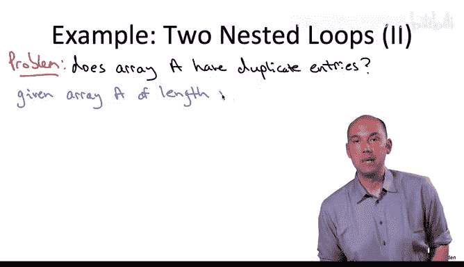

### 示例四：嵌套双循环（在单个数组中查找重复项） 🔍🔍

让我们以最后一个例子结束，它同样是嵌套 `for` 循环，但这次我们是在**单个数组 `A`** 中查找重复项，而不是比较两个不同的数组。

以下是用于解决此问题（检测输入数组 `A` 是否有重复项）的代码。与上一张幻灯片中比较两个数组的代码相比，只有两个小改动：
1.  将数组 `B` 的引用改为 `A`，即比较 `A[i]` 和 `A[j]`。
2.  内层 `for` 循环的索引 `j` 从 `i+1` 开始，而不是从 `1` 开始。如果从 `1` 开始，代码实际上会将 `A` 中每对不同的元素比较两次，这显然是多余的，你只需要比较一次就能知道它们是否相等。

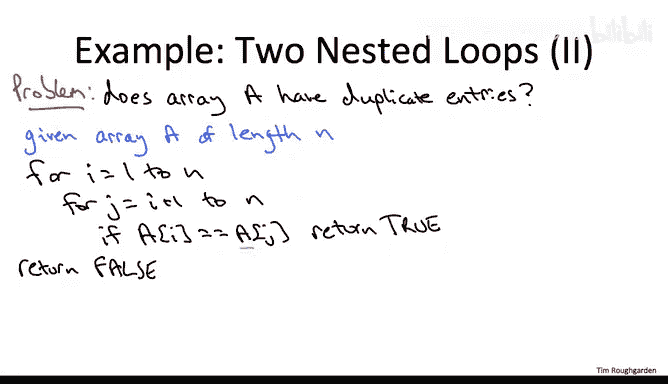

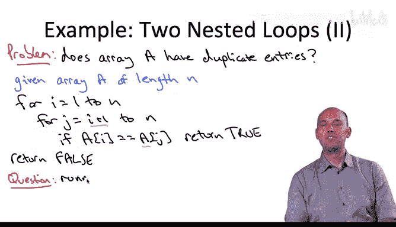

**问题**：这段代码的运行时间（用大 O 表示法）是多少？

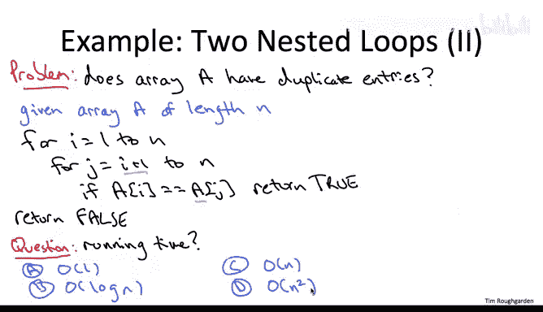

**答案**：**O(n²)**。这段代码的运行时间也是二次的。

**原因**：和所有例子一样，这段代码的运行时间与这个双重 `for` 循环的迭代次数成正比（每次迭代做常数工作，常数被大 O 忽略）。我们只需要计算这个双重 `for` 循环有多少次迭代。

我的观点是，大约有 **n² / 2** 次迭代。有两种理解方式：首先，这段代码与上一段代码的区别在于，我们不再重复计数，而是只计数一次，这节省了大约一半的迭代次数。当然，这个 1/2 的因子同样会被大 O 符号忽略，所以大 O 运行时间不变。另一种论证是：迭代次数对应于从 1 到 `n` 中选出两个不同索引 `i` 和 `j` 的所有可能组合数。简单的组合计数告诉我们，这样的选择有 **C(n, 2)** 种，即 **n(n-1)/2**。再次忽略低阶项和常数因子，我们仍然得到相对于输入数组 `A` 长度的二次依赖关系。

## 总结

本节课中，我们一起学习了**渐近分析**的核心概念。我们了解到，它是讨论算法性能的高级语言，核心在于**忽略常数因子和低阶项**，从而专注于算法在大规模输入下的增长趋势。我们通过四个简单的代码示例（线性扫描、顺序循环、嵌套循环比较两数组、嵌套循环查找单数组重复项）直观地感受了如何判断算法的运行时间是 **O(n)** 还是 **O(n²)**。现在，你应该对渐近分析的目标和大 O 符号的直观定义有了较强的认识。接下来，我们将进入更严谨的数学形式化定义，并分析更多有趣的算法。