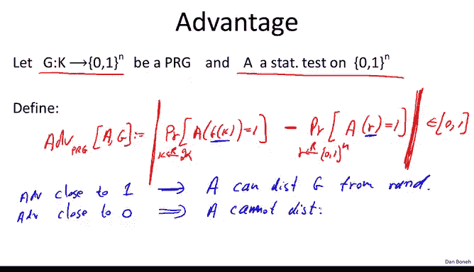
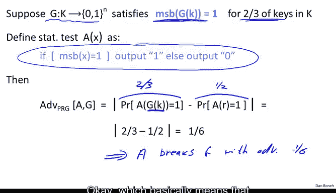
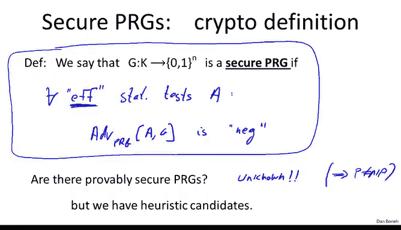

# 斯坦福大学《密码学｜Cryptography 1》中英字幕 - P10：10_01_01_PRG安全定义.zh_en - GPT中英字幕课程资源 - BV1Rf421o79E

In the next three segments， we will change gears a little bit and talk about the definition of a PRG。

 This definition is a really good way to think of a PRG。

 and we will see many applications for this definition。

So consider a PRG with keyspace K that outputs n bit strings Our goal is to define what does it mean for the output of the generator to be indistinguishable from random In other words we're going to define a distribution that basically is defined by choosing a random key in the keyspace remember that arrow with R above it means choosing uniformly from the set script K and then we output basically the output of the generator。

And what we'd like to say is that this distribution。

 this distribution of pseudoran strings is indistinguishable from a truly uniform distribution。

 in other words， if we just choose a truly uniform string in01 to the n and simply output this string。

 we'd like to say that these two distributions are indistinguishable from one another。Now。

 if you think about it， this sounds really surprising because if we draw a circle here of all possible strings in 0。

1 to the n， then the uniform distribution basically can output any of these strings with equal probability。

 That's the definition of the uniform distribution。However。

 a pseudoran distribution generated by this generator G because the seed space is so small the set of possible outputs is really。

 really small。 It's tiny inside of01 to the n and this is really all that the generator can output and yet what we're arguing is that an adversary who looks at the output of the generator in this tiny set can't distinguish it from the output of the uniform distribution over the entire set that's the property that we're actually shooting for So to understand how to define this concept of indistinguishability from random we need the concept of a statistical test so let me define what a statistical test on01 to the n is I'm going to define the statistical tests by the letter A and a statistical test is basically an algorithm that takes as input an n bit string and simply outputs 0 or 1 Now I'll tell you that 0 we're going to think of it as though the statistical test said the input you gave me is not random。

う。And one， we're going to think of it as saying that the input you gave me actually is random。 Okay。

 so all the statistical test does is it basically takes the input X that was given to it。

 the n bit string that was given to it and decides whether it looks random or it doesn't look random。

 Let's look at a couple of examples。So the first example basically will use the fact that for a random string。

 the number of zeros is roughly equal to the number of ones in that string。 In other words。

 the statistical test is going to say1 if and only if basically the number of zeros in the given string x minus the number of ones in the given string x is these two numbers are not too far apart。

 In other words， the difference between the number of zeros and the number of ones。

 let's just say is less than 10 times squared of n so if the difference is less than 10 times squared of n the statistical test will say。

 hey， the string x looks random if the difference happens to be much bigger than 10 times squared of n。

 that starts to look suspicious and then the statistical test will say hey。

 the string you gave me does not look random so this is our first example of the statistical test。

 let's look at another similar example we'll say here the statistical test will say1。

If and only if say the number of times that we have two consecutive zeros inside of x。

 Well let's think about this for a second。 This basically again counts in the string of n bits。

 It counts the number of times that we see the pattern 0，0， two consecutive zeros。Well。

 for a random string。We will expect to see 00 with probability  one fourth。

 and therefore in a random string， we expect about n over 40 zeros。 Yeah n over four blocks of00。

 And so what the statistical test will do is it will say， well。

 if the number of0 zeros is roughly n over4。 In other words。

 the difference between the number and n over4 is say less than10 squared of n then we will say that x looks random。

 And if the gap is much bigger than n over 4 will say， hey。

 this string doesn't really look random and then the statistical test will output 0。

 Okay so here are two examples of statistical tests that basically for random strings they will output one with very high probability。

 But for strings that you know don't look random， for example， think of the all zero string。

 for the all zero string， neither one of these tests will output a1。 And in fact。

 the all zero string does not look random。Let's look at one more example of the statistical test just to kind of show you that basically statistical tests can pretty much do whatever they want。

 So here's a third example， let's say that the statistical test outputs one if and only if say the biggest block so what we'll call this the maximum run of zero inside of the string X。

 this is basically the longest sequence of zeros inside of the string X。In a random string。

 you expect the longer sequence of zeros to be roughly of length log n。

 So we'll say if the longerest sequence of 0 happens to be less than 10 times log n。

Then this test will say that X was random。 But if all of a sudden we see a run of zeros that say is much bigger than 10 log n。

 then the statistical test will say the string is not random。 Okay。

 so this is another crazy thing that the statistical test will do。 By the way。

 you notice that if you give this test the all one string。So 1，1，1，1，1。

 this test will also output  one。 In other words， this test will think that the all one string is random。

 even though it's not。 yeah， even though the all one string is not particularly random。Okay。

 so statistical tests don't have to get things right。 They can do whatever they like， they can test。

 they can decide to output random or not， you know， zero or one， however they like。And similarly。

 there are many， many， many， many other statistical tests。

 There are literally hundreds of statistical tests that one can think of。

 and I can tell you that in the old days， basically the way you would define that something looks random is you would say。

 hey here's a battery of statistical tests and all of them said that this string looks random。

 therefore we say that this generator， that generated the string is a good generator。 In other words。

 this definition that uses a fixed set of statistical tests is actually not a good definition for security or more generally for crypto。

But before we talk about actually defining security。

 the next thing we talk about is how do we evaluate whether a statistical test is good or not？

So to do that， we define the concept of advantage。And so let me define the advantage so here we have a generator that outputs n bit strings and we have a statistical test on nbit strings。

 and we define the advantage of this generator allll denoted by advantage subpRG。

 the advantage of the statistical test A relative to the generator G。

 I'll define it as follows is basically the difference between two quantities。

The first quantity is basically we ask how likely is the statistical test to output one when we give it a pseudoran string so here K is chosen uniformly from the seed space and we ask how likely is the statistical test to output one when we give it a pseudoran output generated by the generator。

Versus now we ask， how likely is the statistical test to output one when we give it a truly random string。

 So here R is truly random in 01 to the n。 Okay， and yet。

 we look at the difference between these two quantities。 Now。

 you realize because these are differences of probabilities。

 this advantage is always going to lie in the interval 01。

So let's think a little bit about what this advantage actually means。 So first of all。

 if the advantage happens to be close to one Well， what does that mean。

 That means that somehow the statistical test A behaved differently when we gave it pseudo random inputs when we gave it the output of the generator from when we gave it truly random input right。

 it somehow behave differently。 In one case， it output one with a certain probability。

 and in the other case， it output one with a very different probability。

 Okay so somehow it was able to behave differently And what that really means is that this statistical test can basically distinguish。

The output of the generator from random。Okay， so in some sense。

 we'll say that the statistical test broke the generator G because it was able to distinguish the output from random。

 However， if the advantage is close to0， well， what does that mean。

 that means that basically the statistical test behaves pretty much the same on pseudoran input as it does on truly random inputs and basically there we would say that a could not distinguish the generator from random。

Okay， so this sum gives you a little bit of intuition about why this concept of advantage is important。

 it basically tells us whether a was able to break the generator。

 namely distinguish it from random or not able to break it。

So let's look first of all at a very silly example。

 S we have a statistical test A that simply ignores its inputs and always outputs zero。Okay。

 always output0。What do you think is the advantage of the statistical test relative to a generator G？

So I hope everybody said the advantage is0 and let me just explain why that's the case。 Well。

 if the statistical test always outputs 0， that means that when we give a pseudo random input。

 it will never output1， so the probability that outputs 1 is0。Similarly。

 when we give a truly random input， it still will never output one。

 and so the probability that it outputs 1 is 0。 and so 0 minus- 0 is 0。 So its advantage is 0。

 So basically in a statistical test that ignores its input is not able to distinguish truly random input from a pseudo random input。

 obviously。Okay， so now let's look at a more interesting example。

 So suppose we have a generator G that satisfies a funny property。

 It so happens that for two thirds of the keys。The first bit of the output of the generator happens to be one。

 Okay， so if I choose a random key with probability  two third。

 the generator will output one as its first bit。Okay。

 so that's the property of the generator that we're looking at。 Now。

 let's look at the following statistical test。 The statistical test basically says if the most significant bit of the string you gave me is one。

 I'm gonna say one， meaning， I think it's random。 If the most significant bit of the string you gave me is not one。

 but namely 0， I'm gonna say 0。Okay， so now my question to you is what is the advantage of the statistical tests on the generator G？

Okay， so remember I just wrote down the definition here again。

 and I'll let you think about this for a second。So let me explain。

 suppose we give the statistical test pseudoran input by definition of G。

 we know that with probability 23， the first bit in the input will start with a bit1。

But if it starts with a bit one， then the statistical test will output one， in other words。

 the probability that the statistical test outputs one is exactly two/ third。Now。

 let's look at the case of a random string。 if I give you a random string。

 how likely is it that the most significant bits of the random string is one。 Well。

 for a random string that happens exactly half the time。 And so in this case。

 the statistical test will output 1 worth probability 12。

 And so the overall advantage is 16 and16 is actually a non- negligible number。

 that's actually a fairly large number， which basically means that this a was able to distinguish the output will say that a breaks。

😊，The generator G with advantage。1，6。Okay， which basically means that this generator is no good。

 is broken。

Okay， so now that we understand what statistical tests are。

 we can go ahead and define what is a secure pseudo randomum generator。So basically。

 we say that as generator G is secure， if essentially no efficient。

Stistic test can distinguish its output from random。More precisely。

 what we'll say is that basically for all efficient。Statistical tests， A， statistical tests。A。

 it so happens that if I look at the advantage of the statistical test A relative to G。

 this advantage basically is negligible。Okay， so in other words。

 it's very close to zero and as a result， this statistical test was not able to distinguish the output from random。

 and that has to be true for all statistical tests。So this is a very。

 very pretty and elegant definition that says that a generator is secure not only if a particular battery of statistical tests says that the output looks random。

 but in fact， all efficient statistical tests will say the output looks random okay。

One thing I'd like to point out is that the restriction to efficient statistical tests is actually necessary if we ask that all statistical tests。

 regardless of whether they're efficient or not， not be able to distinguish the output from random。

Then in fact， that cannot be satisfied。 So in other words。

 if we took out the requirements that the test be efficient。

Then this definition would be unsatisfiable and I'll leave this as a simple puzzle for you to think about。

 but basically the fact is that restricting this definition to only efficient statistical tests is actually necessary for this to be satisfiable。

Because now that we have a definition， the next question is。

 can we actually construct a generator and then prove that， in fact， it is a secure PRG。

 in other words， prove that no efficient statistical test can distinguish its output from random？

And it turns out that the answer is we actually can't。 In fact。

 it's not known if there are any provably secure PRGs。 And I'll just say very briefly。

 the reason is that if you could prove that is that a particular generator is secure。

 that would actually imply that P is not equal to NPp。

And I don't want to dwell on this because I don't want to assume you guys know what P and NP are。

 but I'll just tell you as a simple fact that in fact， if p is equal to NP。

 then it's very easy to show that there are no secure PRGs and so if you could prove to me that a particular PRG is secure that would imply that P is not equal to NP again。

 I will leave this to you as a simple puzzle to think about but even though we can't actually rigorously proved that are particular PRG is secure。

 we still have lots and lots and lots of heuristic candidates and we even saw some of those in the previous segments。

Okay now that we understand what is a secure PRG， I want to talk a little bit about some applications and implications of this definition。

 and so the first thing I want to show you is that in fact a secure PRG is necessarily unpredictable in a previous segment we talked about what it means for a generator to be unpredictable and we said that basically what that means is that given a prefix of the output of a generator。

 it's impossible to predict the next bit of the output so we'd like to show that if a generator is secure then necessarily it means it's unpredictable。

And so the way we're going to do that is using the contrapoitive。

 that is we're going to say that if you give me a generator that is predictable。

 then necessarily it's insecure。 In other words， necessarily I can distinguish it from random。

 and so let's see this is actually a very simple fact。 and so let's see how we would do that。

So suppose you give me a predictor， in other words。

 suppose you give me an efficient algorithm such that in fact。

 if I give this algorithm the output of the generator。

 but I give it only the first eye bits of the output。It's able to predict the next bit of the output。

 In other words， given the first I bits， it's able to predict the I plus first bit。

 And it does that with a certain probability。 So let's say if we choose a random K from the key space。

 Then clearly a gu predictor would be able to predict the next bit with probability  one half。

 simply just guess a bit。 you'll be right with probability 1 half。 However。

 this algorithm A is able to predict the next bit with probability half plus epsilon。

 So it's bounded away from a half。 and in fact， we require that this be true for some nonnegligible epsilon。

 So， for example， epsilon equals one over 1000 would already be a dangerous predictor because it can predict the next bits given a prefix with nonnegligible advantage。

😊，Okay， so suppose we have such an algorithm。 Let's see that we can use this algorithm to break our generator。

 In other words， to show that the generator is distinguishable from random and therefore is insecure。

 So what we'll do is we'll define a statistical test。

 So let's define a statistical test B as follows， basically be given a string X。

 what it will do is it will simply run algorithm A on the first I bits of the string X that it was given and statistical test B simply going to ask was a successful in predicting the I plus first bit of the string。

If it were successful， then it's going to output one。And if it wasn't successful。

 then it's going to output zero。Okay， this is our statistical test。

 Let's put it in a box so we can take it wherever we like and we could run the statistical test on any M bit string that's given to us as input。

 So now let's look at what happens。 Suppose we give the statistical test truly random string。

 So truly random string are。 And we ask what is the probability that the statistical test outputs one。

😊，Well， for a truly random string， the i+ first bit is totally independent of the first i bits。

 so whatever this algorithm A is going to output is completely independent of what the i+ first bit of the string R is。

And so whatever a outputs， the probability data is going to be equal to some random bit Xi plus1 random independent bit X plus1。

 that probability is exactly1 half。 In other words。

 algorithm A simply has no information about what the bit X plus1 is。

 and so necessarily the probability is able to predict X plus1 is exactly one2。On the other hand。

 let's look at what happens when we give our statistical tests a pseudo random sequence。

 Okay so now we're going to run the statistical test on the output of the generator and we ask how likely is it to output1 Well。

 by definition of a we know that when we give it a first eye bits of the output of the generator it's able to predict the next bit with probability half plus epsilon So in this case our statistical test B will output one with probability greater than half plus epsilon。

And basically， what this means is if we look at the advantage of our statistical tests。

Over the generator G， it's basically the difference between this quantity。And that quantity。

And the difference between the two you can see is clearly greater than an an epsilon。

So what this means is that if algorithm A is able to predict the next bit with advantage epsilon。

 then algorithm B is able to distinguish the output of the generator with advantage epsilon so if a is a good predictor。

 B is a good statistical test that breaks the generator。

And as we said the contra positiveitive of that is that if G is a secure generator。

 then there are no good statistical tests and as a result。

 there are no predictors and which means that the generator is， as we said unpredictable。 Okay。

 so so far what we've seen is that if the generator is secure necessarily it's impossible to predict the i plus first bit。

 given the first i bits。

Now， there is a very elegant and remarkable theorem of due to Yao back in 1982 that shows that。

 in fact， the converse is also true。 In other words， if I give you a generator that's unpredictable。

 So you cannot predict the I plus first bit from the first i bits。 and that's true for all I。

 that generator， in fact， is secure。 so let me state the theorem a little bit more precisely。

 So here we have our generator and outputs and bit outputs， the theorem says the following。

 basically for all bit positions， it's impossible to predict i plus first bit of the output given the first i bits。

 and that's true for all I。 In other words， again， the generator is unpredictable for all bit positions。

 then that in fact， implies that the generator is a secure PR G。

 I want to paraphrase this in English。 And so the way to kind of interpret this result。

 is to say that if basically these next bit predictors。

 these predictors to try to predict the I plus first bit， given the first i bits。

 if they're not able to distinguish G from random， then in fact， knows it。😊。

The gotta can distinguish g from random。 So kind of next bit predictors are， in some sense。

 universal predictors when it comes to distinguishing things from random。 The steerorem， by the way。

 it's not too difficult to prove， but there's a very elegant idea behind its proof。

 I'm not going to do the proof here， but I encourage you to think about this as a puzzle and try to kind of prove the steerorem yourself。

Let me show you kind of one cute implication of this theorem。

So let me ask you the following question。 Supp I give you a generator。

 and I tell you that given the last bit of the outputs。

 it's easy to predict the first bit of the outputs。 Okay， so given the last end bits。

 you can compute the first n bits， That's kind of the opposite of predictability。

 predictability meant， given the first bits， you can produce the next bits here。

 given the last bits you can produce the first ones And my question to you。

 does that mean that the generator is predictable。 Can you somehow from this fact。

 still build a predictor for this generator。So this is kind of a simple application of yellow's theem。

 let me explain to you。 the answer is actually， yes， Let me explain why。

 how do we build this generator。 Well， actually， we're not going to build it。

 I'm just going to show you that the generator exists。 Well。

 because the last in over 2 bits applied the first in over2 bits。

 that necessarily means that the generator here。 Let me write it this way。

 That necessarily means that G is not secure。😊，Because just as we did before。

 it's very easy to build a statistical test that will distinguish the output of G from uniform。

 So G is not secure， but if G is not secure by Yao's theorem， that means that G is predictable。

 So in other words， there exists some I for which given the first i bits of the output。

 you can build the i plus first bit of the output and so even though I can't quite point to you to a predictor。

 we know that a predictor must exist。So that's a one cute simple application of Yaobster。 Now。

 before we end the segment， I want to kind of generalize a little bit what we did and introduce a little bit of important notation that's going to be useful actually throughout。

So we're going to generalize the concept of indistinguishability from uniform to indistinguishability of two general distributions。

 so suppose I give you P1 and P2 and we ask can these two distributions be distinguished？

And so we'll say that the distributions are computationally indistinguishables and we'll denote this by P1 is quickly P P2。

 This means that in polynomial time， P1 cannot be distinguished from P2 and we'll say that they're indistinguishable。

 basically just as before， if basically for all efficient。Statistical tests， statistical tests。A。

 it so happens that if I sample from the distribution P1 and I give the output to a。

Versus if I sample from the distribution P2， and I give the sample to a。

Then basically a behaves the same in both cases， in other words。

 the difference between these two probabilities is negligible。

And this has to be true for all statistical tests， for all efficient statistical tests。

 okay so if this is the case， then we say that well a couldn't distinguish its advantage in distinguishing two distributions is negligible and if that's true for all efficient statistical tests。

 then we say that the two distributions are basically computationally indistinguishable because an efficient algorithm cannot distinguish them。

😊，And just to show you how useful this notation is， basically using this notation。

 the definition of security for PG just says that if I give you a pseudoran distribution。

 in other words I choose k at random and then output at G of K that distribution is computationally in distinguishtuishable from the uniform distribution so you can see this very simple notation captures the whole definition of pseudoran generators。

Okay， so we're going to make use of this notation in the next segment when we define what does it mean for acipher to be secure。

