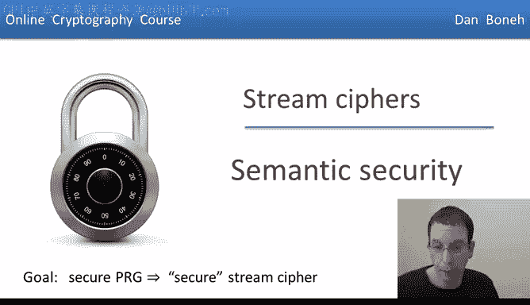
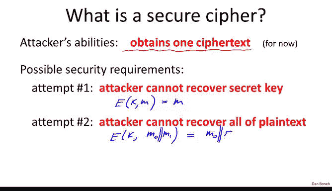
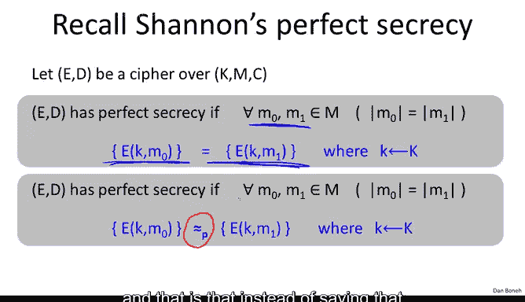
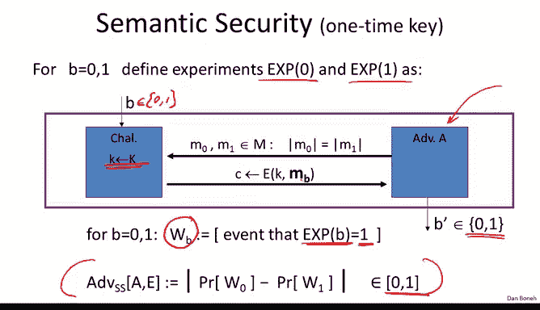
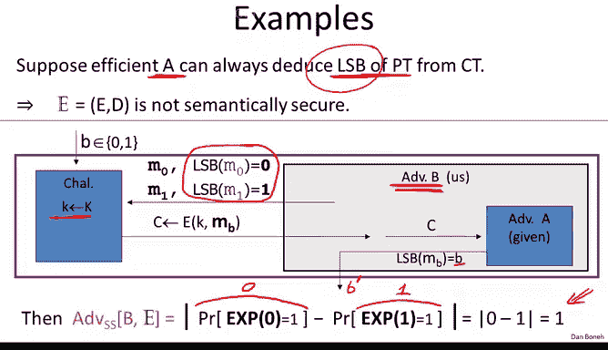
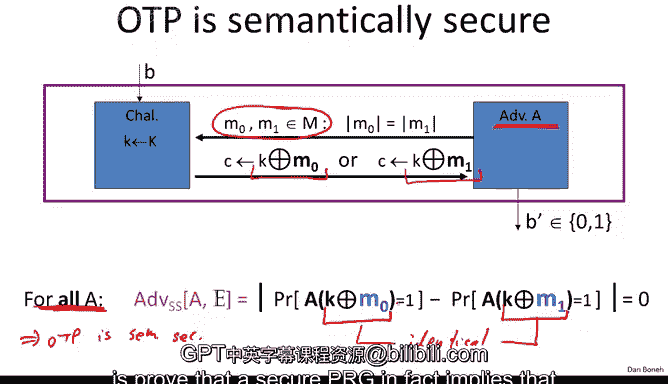

# 斯坦福大学《密码学｜Cryptography 1》中英字幕 - P11：11_01_02_语义安全.zh_en - GPT中英字幕课程资源 - BV1Rf421o79E

My goal for the next two segments is to show you that if we use a secure PRG。

 well get a secure stream cipher。 The first thing we have to do is define what does it mean for a stream cipher to be secure。

So whenever we define security we always define it in terms of what can the attacker do and what is the attacker trying to do in the context of stream ciphers remember these are only used with a one time key and as a result that most the attacker is ever going to see is just one ciphertex encrypted using the key that we're using and so we're going to limit the attacker's ability to basically obtain just one ciphertext and in fact later on we're going to allow the attacker to do much。

 much， much more but for now we're just going to give them one ciphertex。

And we want to define what does it mean for the cipher to be secure。

 So the first definition that comes to mind is basically to say， well。

 maybe we want to require that the attacker can't actually recover the secret key。 Okay。

 so given the Cypher text， you shouldn't be able to recover the secret key。

 But that's a terrible definition because think about the following brilliant cipher。 So you'll hear。

 But the way we encrypt a message using a key K is basically we just output the message。 Okay。

 this is a brilliant cipher。Yeah， of course， it doesn't do anything。 given a message。

 it just outputs the message as the Cypher textex。 So this is not a particularly good encryption scheme。

 However， given the Cyphertex， namely the message， the poor attacker cannot recover the key because it doesn't know what the key is。

 And so as a result， this cipher， which clearly is insecure。

 would be considered secure under this requirement for security。 So this definition would be no good。

 Okay， just recovering the secret key is the wrong way to define security。

So the next thing we can try and attempt is basically to say， well。

 maybe the attacker doesn't care about the secret key what he really cares about is the plain text。

 so maybe it should be hard for the attacker to recover the entire plain text。

 but even that doesn't work because let's think about the following encryption scheme so suppose what this encryption scheme does is it takes two messages so I'm going to use two lines to denote the concatenation of two messages M0 line line M1 means concatenate M0 and M1 and imagine what the scheme does is really it outputs M0 and the clear and concatennates to that the encryption of M1 perhaps even using with the one time pad and so here the attacker is going to be given one cipher text。

And his goal would be to recover the entire plain text。

 but the poor attacker can't do that because here maybe we encrypted M1 using the one time pad。

 so the attacker can't actually recover M1 because we know the one time pad is secure。

 given just one ciphertext。So this construction would satisfy the definition。

 but unfortunately clearly this is not a secure encryption scheme because we just leaked half of the plain text M0 is completely available to the attacker。

 so even though he can't recover all of the plain text。

 he might be able to recover most of the plain text and that's clearly insecure。

So of course we already know the solution to this and we talked about Shannon's definition of security。

 perfect secrecy， where Shannon's idea was that in fact， when the attacker intercepts a ciphertex。

 he should learn absolutely no information about the plain text。

 he shouldn't even learn one bit about the plain text or even he shouldn't learn he shouldn't even be able to predict a little bit about a bit of the plain text。

 absolutely no information about the plain text。So let's recall very briefly Shannon's concept of perfect secrecy。

 basically we said that， you know given a cipher， we said the cipher has perfect secrecy。

 if given two messages of the same length， it so happens that the distribution of cipherts。

 yeah if we pick a random key and we look at the distribution of cipher text we encrypt M0。

 we get exactly the same distribution as when we encrypt M1。

 The intuition here was that if the adversary observes the cipher textex。

 then he doesn't know whether it came from the distribution。

 the result of encrypting M0 or it came from the distribution is the result of encrypting M1 and as a result he can't tell whether we encrypted M0 or M1 and that's true for all messages of the same length and as a result。

 a poor attacker doesn't really know what message was encrypted。

 Of course we already said that this definition is too strong in the sense that it requires really long keys if cipher that has short keys can't possibly satisfy this definition and in particular stream ciphers cant satisfy this definition。

Okay， so let's try to weaken the definition a little bit and let's think to the previous segment and we can say that instead of requiring that the two distributions be absolutely identical。

 what we can require is that the two distributions just be computationally indistinguishable。

 in other words， a poor， efficient attacker cannot distinguish the two distributions。

 even though the distributions might be very， very， very different。

But just given a sample for one distribution and a sample for another distribution。

 the attacker can tell which distribution he was given a sample from。

 It turns out this definition is actually almost right， but is still a little too strong。

 It still cannot be satisfied。 So we have to add one more constraints。

 and that is that instead of saying that this definition should hold for all M0 M1。

 It needs to hold for only pairs M0 M1 that the attacker can actually exhibit。

Okay， so this actually leads us to the definition of semantic security and so again。

 this is semantic security for a one time key， in other words。

 when the attacker is only given one sphertext。And so the way we define semantic security is by defining two experiments。

 okay， we'll define experiment 0 and experiment 1 and more generally we'll think of these as experiment parentheses B where B can be 0 or1。

Okay， so the way the experiment is defined as follows。

 we have an adversary that's trying to break the system in adversary A。

 that's kind of the analog of a statistical test in the world of a pseudoran generators。

And then a challenger does the following， so really we have two challengers。

 but the challengers are so similar that we can just describe them as a single challenger that in one case takes as inputs the bit set to zero and the other case takes as inputs the bit set to one and let me show you what these challengers do。

The first thing the challenger is going to do is it's going to pick a random key。

And then the adversary basically is going to output two messages M0 and M1 Okay so this is an explicit pair of messages that the attacker wants to be challenged on。

 and as usual we're not trying to hide the length of the messages we require that the messages be equal length。

And then the challenger basically will outputs either the encryption of M0 or the encryption of M1。

 Okay， so in experiment 0， the challenger will output the encryption of M0 in experiment1。

 the challenger will output the encryption of M1。 Okay。

 so that's the difference between the two experiments。

And then the adversary is trying to guess basically whether he was given the encryption of M0 or given the encryption of M1。

Okay， so here's a little bit of notation。 Let's define the event WB to be the event that an experiment B the adversary output1。

Okay， so that's just an event that basically an experiment 0。

 w0 means that the adversary output of one， an experiment 1， W1 means the adversary output of one。

And now we can define the advantage of this adversary。Basically。

 to say what this is called the semantic security advantage of the adversary A against the scheme E to be the difference of the probability of these two events。

 In other words， we're looking at whether the adversary behaves differently。

When he was given the encryption of M0 from when he was given the encryption of M1。

And I want to make sure this is clear， so I'm going to say it one more time。So in experiment0。

 he was given the encryption of M0， and experiment1， he was given the encryption of M1。

 Now we're just interested in whether the adversary output one or not。In these experiments。

If in both experiments， the adversary output1 with the same probability。

 that means that the adversary wasn't able to distinguish the two experiments。

 Expiment0 basically looks to the adversary the same as experiment 1。

 because in both cases it output one with the same probability。However。

 if the adversary is able to output one in one experiment with significantly different probability than in the other experiment。

 then the adversary was actually able to distinguish the two experiments so。

To say this more formally， essentially the advantage again because it's a difference of two probabilities。

 the advantage is a number between 0 and 1， if the advantage is close to0。

 that means that the adversary was not able to distinguish experiment0 from experiment1， however。

 if the advantage is close to1， that means the adversary was very well able to distinguish experiment 0 from experiment1 and that really means that he was able to distinguish an encryption of M0 from an encryption of M1。

Okay， so that's our definition。 Actually that's just the definition of the advantage And then the definition is just what you would expect。

 basically we'll say that a symmetric encryption scheme is semantically secure。

 if for all efficient adversaries， here I'll put this in quotes again， for all efficient adversaries。

 the advantage is negligible In other words， no efficient adversary can distinguish the encryption of M0 from the encryption of M1 and basically this is what it says repeatedly that for these two messages that the adversary was able to exhibit he wasn't able to distinguish these two distributions。

😊。

Now I'm want to show you this is actually a very elegant definition， it might not seem so right away。

 but I want to show you some implications of this definition and you'll see exactly why the definition is the way it is。

Okay， so let's look at some examples。So the first example is suppose we have a broken encryption scheme。

 in other words， suppose we have an adversary A that somehow， given the ciphertext。

 he's always able to deduce the least significant bit of the plain text。

Okay so given the encryption of M0， this adversary is able to deduce the least significant bit of M0。

 so that's a terrible encryption scheme because it basically leaks the least significant bit of the plain text just given the ciphert。

So I want to show you that the scheme therefore is not semantically secure。

 so that kind of shows that if a system is semantically secure。

 then there is no attacker of this type。Okay， so let's see why is the system not semantically secure。

 Well， so what we're going to do is we're going to basically use our adversary who's able to learn the least significant bits。

 We're going to use him to break semantic security。

 So we're going to use him to distinguish experiment 0 from experiment 1 so here's what we're going to do。

 We're algorithm B。 We're going to build algorithm B and this algorithm B is going to use algorithm A in its belly。

 Okay so the first thing that's going happen is， of course。

 the challenger is going to choose a random key。 and the first thing that's going to happen is we need to output two messages。

😊，The messages that we're going to output basically are going to have differently significant bits。

 So one message is going to end with0 and one message is going to end with one。

Now what is the challenger are going to do， the challenger is going to give us the encryption of either M0 or M1。

 depending on whether we're in experiment zero and experiment1。

And then we just forward this Cyphertex to the adversary。Okay， so adversary A。

 Now what's the property of adversary A， given the Cyphertext。

 adversary A can tell us what the least significant bits of the plain text is。 In other words。

 the adversary is going to output the least significant bit of M0 or M1。 But lo and behold。

 that's basically the bit B。 And then we're just going to output that as our guess。

 So it's call this thing B prime。Okay， so now this describes the semantic security adversary。

 and now you tell me what is the semantic security advantage of this adversary？Well。

 so let's see so in experiment0， what's the probability that adversary B outputs 1？Well。

 in experiment zero， it's always given the encryption of M0。And therefore。

 adversary A was always output the least significant bit of M0。

 which happens to be 0 and experiment 0， B always outputs 0。 so the probability that outputs 1 is 0。

However in experiment1 we're given the encryption of M1 so how likely is adversary B to output1 in experiment 1。

 well it always outputs one again by the properties of algorithm A and therefore the advantage basically is one。

 so this is a huge advantage it's as big as it's going to get。

 which means that this adversary completely broke the system。Okay。

 so we consider so under semantic security， basically just deducing the least significant bit is enough to completely rate the system under a semantic security definition。

OkayNow the interesting thing here， of course， is that this is not just about the least significant bit。

 In fact， take any precate of the message。 for example， the most significant bits。

 you know bit number7， maybe the X or of all the bits in the message and so on and so forth。

 any kind of information， any bits about the plain text that can be learned basically would mean that the system is not semantically secure。

 So basically all the adversary I have to do would be to come up with two messages M0 and M1 such that under one thing that a learns its the value0 and the other thing the value is1。

 So for example， if a was able to learn the x or of all the bits of the message then M0 and M1 would just have different Xors for all the bits of their messages and then this adversary A would also be sufficient to break semantic security。

Okay， so basically if thecipher is antially secure。

 then no bit of information is revealed to an efficient adversary。Okay。

 so this is exactly a concept of perfect secrecy only applied just to efficient adversaries rather than all adversaries。

So the next thing I want to show you is that in fact， the one time pad in fact。

 is semanically secure， it better be semantically secure because it's in fact， it's more than that。

 it's perfectly secure。 So let's see why that's true。Well， so again it's one of these experiments。

 so suppose we have an adversary that claims to break semantic security of the one time pad。

The first thing the adversary is going to do is he's going to output two messages M0 and M1 of the same length。

Now what does he get back as a challenge， as a challenge。

 he gets either the encryption of M0 or the encryption of M1 under the one time pad。

 and he's trying to distinguish between those two possible Cytexts that he gets right in experiment 0。

 he gets the encryption of M0 and experiment when he gets the encryption of M1。 Well。

 so let me ask you so what is the advantage of adversary A against the one time pad。

So remember the property of the one time pad is that Kx or M0 is distributed identically to Kx or M1 in other words。

These distributions are absolutely identical distribution， distributions， identical。

 This is a property of Xor。 If we Xor the random pad K with anything， either M0 or M1。

 we get uniform distribution。 So in both cases， algorithm A is given as inputs exactly the same distribution。

 namely the uniform distribution on Cyphertexts。And therefore。

 it's going to behave exactly the same in both cases because it was given the same distribution as input。

 And as a result， its advantage is 0， which means that the one time pad is semantically secure。

 And the interesting thing here is not only is it semantically secure。

 It's semantically secure for all adversaries。 We don't even have to restrict the adversaries to be efficient。

 No adversary doesn't matter how smart you are。 No adversary will be able to distinguish Kx or M0 for Kx or M1。

 because the two distributions are identical。 Okay， so the one time pad is semantically secure。 Okay。

 so that completes our definition of a semantic security。

 And the next thing we're going to do is prove that a secure PR G， in fact。

 implies that the stream cyclepher is semantically secure。

