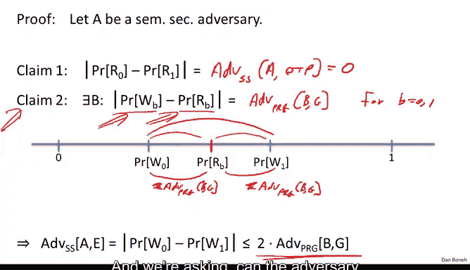
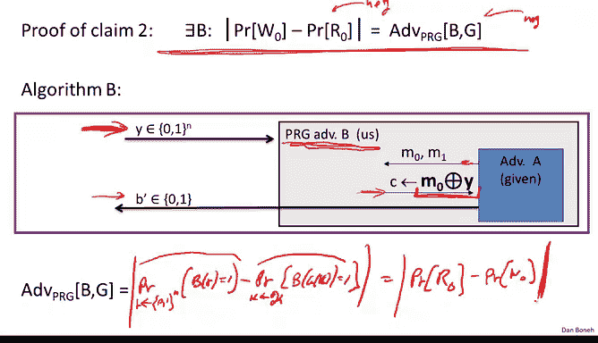

# 斯坦福大学《密码学｜Cryptography 1》中英字幕 - P12：12_01_03_流密码是语义安全的（可选）.zh_en - GPT中英字幕课程资源 - BV1Rf421o79E

So now that we understand what a secure PRG is and we understand what semantic security means。

 we can actually argue that a stream cipher with a secure PRG is in fact semanically secure。

 So that's our goal for this segment。 It's a fairly straightforward proof and we'll see how it goes。

So the theorem we want to prove is that basically given a generator G that happens to be a secure pseudorunund generator。

 in fact， the stream cipher that's derived from this generator is going to be semantically secure and I want to emphasize that there was no hope of proving the theorem like this for perfect secrecy for Shannon's concept of perfect secrecy because we know that a stream cipher cannot be perfectly secure because it has short keys and perfect secrecy requires keys to be as long as the message。

So this is really kind of the first example that we see where we're able to prove that a cipher with short keys has security。

 the concept of security is semantic security， and this actually validates that really this is a very useful concept。

 in fact， you know we'll be using semantic security many。

 many times throughout the course Okay so how do we prove a theorem like this。

 What we're actually going to be doing is we're going to be proving the con positive。

 What we're going to show is the following。 We're going to prove the statement down here。

 but let me parse it for you。 Suppose you give me a semantic security adversary A。😊。

What we'll do is we'll build PR G adversary B that satisfied this inequality here。 Now。

 why is this inequality useful， Basically， what do we know。

 We know that if B is an efficient adversary， then we know that since G is a secure generator。

 we know that this advantage is negligible secure generator has a negligible advantage against any efficient statistical test。

 So the righthand side basically is going to be negligible。

 but because the right hand side is negligible， we can deduce that the lefthand side is negligible。

 And therefore the adversary that you looked at actually has negligible advantage in attacking the stream cipher E Okay so this is how this will work。

 basically all we have to do is given an adversary A， we're going to build an adversary B。

 we know that B has negligible advantage against a generator。

 but that implies that a has negligible advantage against a stream cipher。😊。

So let's do that so all we have to do again is given an A we have to build B so let a be a semantic security adversary against the streamcipher so let me remind you what that means basically there's a challenger。

 the challenger starts off by choosing a keyK and then the adversary is going to output two messages to equal length messages and he's going to receive the encryption of M0 or M1 and then he outputs B prime okay that's what a semantic security adversary is going to do。

So now we're going to start playing games with this adversary and that's how we're going to prove our Lemo。

Alright， so the first thing we're going to do is we're gonna to make the challenger also choose a random R。

 Okay， a random string R。 So， well， you know， the adversary doesn't really care what the challenger does internally。

 The challenger never uses R。 So this doesn't affect the adversary's advantage at all。

 The adversary just doesn't care that the challenger also picks R。 But now comes the trick。

 what we're going do is we're instead of encrypting using Gk we're going to encrypt using R。

 And you can see on basically what we're doing here， essentially， we're changing the challenger。

 So now the challenge Cyphertext is encrypted using a truly random pad is opposed to the pseudoran pad GK。

Okay now the property of the pseudoran generator is that its output is indistinguishable from truly random。

 so because the PRG is secure， the adversary can tell that we made this change。

 The adversary can tell that we switched from a pseudoran string to a truly random string， again。

 because the generator is secure。Well， but now look at the game that we ended up with so the adversary advantage couldn't have changed by much because he can't tell the difference。

 but now look at the game that we ended up with now this game is truly a onetime pad game。

 This is a semantic security game against the onetime pad because now the adversary is getting a one- time pad encryption of M0 or M1。

 but in the one-time pad we know that the adversary advantage is zero because you can't beat the one-time pad。

 the one- time pad is secure unconditionally secure。And as a result， because of this， essentially。

 since the adversary couldn't have tell the difference when we moved from pseudoran to random。

 but he couldn't win the random game。 that also means that he couldn't win the pseudoran game。

 And as a result， the streamcipher， the original stream cipher must be secure。

 So that's the intuition for how the proof is going go。

 but I want to do it rigorously once from now on， we're just going to argue by playing games with a challenger and we won't be doing things as formal as I'm going to do next。

 but I want to do formally and precisely once just so that you see how these proofs actually work。

 Okay， so I'm going to have introduce some notation。

And I'll do the usual notation basically in the original semantic security game when we're actually using a pseudoran pad。

 I'm going to use W0 and W1 to denote the event that the adversary outputs1 when it gets the encryption of M0 or gets the encryption of M1 respectively so w0 corresponds to openinging 1 when receiving the encryption of M0 and W1 corresponds to outputting 1 when receiving the encryption of M1。

So that's as in the standard definition of semantic security。Now， once we flipped to the random pad。

 I'm going to use R0 and R1 to denote the event that the adversary outputs one when receiving the one time pad encryption of M0 or the onetime pad encryption of M1。

 So we have four events， W0 W1 from the original semantic security game and R0 and R1 from the semantic security game once we switched over to the one time pad。

So now let's look at relations between these variables。 So first of all。

 r0 and r1 are basically events from a semantic security game against a one time pad。

 So the difference between these probabilities is， as we said。

 it's basically the advantage of algorithm a of adversary a against the one time pad。

 which we know is 0 so that's great so that basically means that probability of R 0 is equal to the probability of R1。

😊，So now let's put these events on a line on a line segment between0 and 1。

 So here are the events W0 and W1 are the events we're interested in。

 we want to show that these two are close。Okay， and the way we're gonna do it is basically by showing。

 oh， and I should say， and here is probability R 0 and R 1。 And since they're both the same。

 I just put them in the same place。 What we're gonna do is we're gonna to show that both W 0 and W1 are actually close to the probability of R B。

 And as a result， it must be close to one another。 Okay so the way we do that is using a second claim。

 So now we're interested in the distance between probability of W IB and probability of RB。 Okay。

 so we'll prove the claim in a second。 Let me just state the claim。

 The claim says that there exists in adversary B says that the difference between these two probabilities is basically the advantage of B。

Against the generator。 And this is for both bees。Okay， so given these two claims。

 the theorem is done because basically what do we know。

 we know that this distance is now less than the advantage of B against G。 that's from claim 2。

 And similarly， this distance is less actually， it's even equal to。 I don't have to say less。

 It's equal to the advantage。Of B against G。And as a result。

 you can see that the distance between W 0 and W1 is basically most twice the advantage of B against G。

 That's basically the theorem we were trying to prove。

Okay so the only thing that remains is just proving this claim2 and if you think about what claim2 says it's basically captures the question of what happens in experiment0。

 what happens when we replace the pseudoran pad GK by a truly random pad R right here an experiment0。

 say we're using a pseudoran pad and here in experiment0 we're using a truly random pad and we're asking can the adversary we tell the difference between these2 and we want to argue that he cannot because the generator is secure。

Okay， so here's what we're going to do。 So let's prove claim to。 So we want to argue that， in fact。

 there is a PR G adversary B that has exactly the difference of the two probabilities as its advantage。

 Okay， and since the point is， since this is negligible， this is negligible。

And that's basically what we wanted to prove。Okay so let's look at statistical test B。

 so what is statistical test B it's going to use adversary A in its belly。

 So we get to build statistical test B however we want。

 as we said it's going to use adversary A inside of it for its operation and it's a regular statistical test so it takes an end bit string as inputs and it's supposed to output you know random or non random0 or1。

Okay， so let's see。 So it's gonna the first thing it's going to do is it's going to run adversary A and adversary A is going to output two messages M0 and M1。

And then what aversary B is going to do is basically going to respond with M0 x or the string that it was given as inputs。

All right， that's the statistical S and then whatever a outputs it's going to output as its output。

And now let's look at its advantage， so what can we say about the advantage of this statistical test against the generator？

Well， so by definition， it's the probability that if we choose a truly random string。

 So here R is in 0，1 to the n。 It's the probability that R that B outputs1。

Minus the probability is that when we choose the pseudorandom string， the outputs one。Okay。Okay。

 but let's think about what this is， So what can you tell me about the first expression。

 so what can you tell me about this expression over here？Well， by definition。

 that's exactly if you think about what's going on here。

 this is exactly the probability R 0 right because this game that we're playing with the adversary here is basically he outputs M0 M1 right here。

 he output an M0 m1 and he got the encryption of M0 under a truly one time pad。Okay。

 so this is basically a probability of ours here， here， let me write this a little better。

So is a basic level probability of R0。Now what can we say about the next expression， Well。

 what can we say about what happens when B is given a pseudoran string y as input Well， in that case。

 this is exactly experiment0 and a true string cipher game because now we're computing M X or M0。

 x or Gk， so this is exactly w0。Okay， that's exactly what we had to prove。

 So it's kind of a trivial proof。 Okay， so that completes the proof of claim 2。 And again。

 just to make sure this is all clear， once we have claim 2， we know that W 0 must be close to W 1。

 And that's that's the theorem。 That's what we have to prove。

Okay， so now we've established that a stream cipher is in fact， semantically secure。

 assuming that the PRG is secure。

