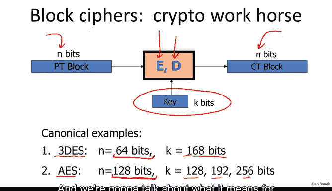
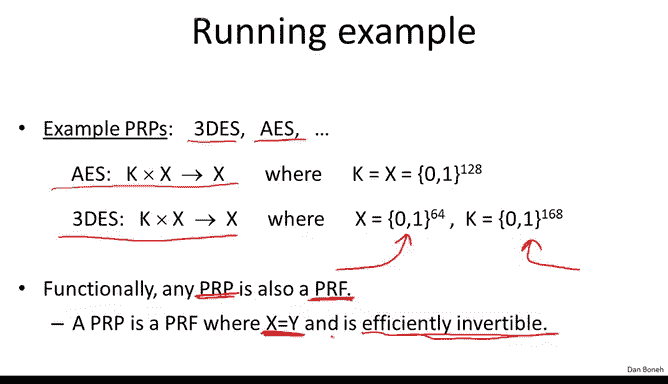
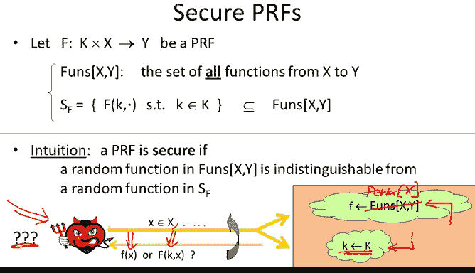
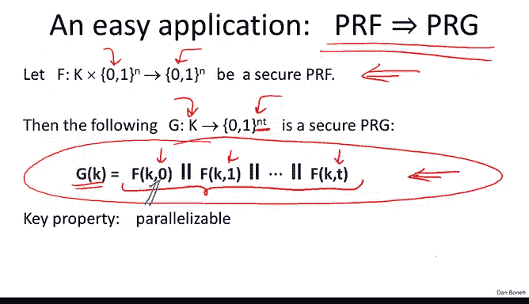

# 斯坦福大学《密码学｜Cryptography 1》中英字幕 - P13：13_02_01_什么是分组密码.zh_en - GPT中英字幕课程资源 - BV1Rf421o79E

Now that we understand stream ciphers， we're going to move on and talk about a more powerful primitive called a block cipher。

So a block cipher is made up of two algorithms， E and D。

 these are encryption and decryption algorithms， and both of these algorithms take as input a key K。

 Now the point of a block cipher is that it takes an n bit plain text as inputs and it outputs exactly the same number of bits as outputs。

 so it maps n bits of inputs to exactly n bits of outputs。

Now there are two canonical examples of block ciphers。

 the first one is called triple De in triple De the block size。

 namely the number of input bits is 64， so triple Ds will map 64 bit blocks to 64 bit blocks and it does it using a key that's 168 bits long We're going to talk about how triple De is built and the next segment。

Another block cipher， which is more recent， is called AAS。 Now AS has slightly different parameters。

 So here the block size is 128 bit， so AA will map 128 bit of input to 128 B of output and it actually has three possible sizes of keys and I wrote down these sizes over here。

 basically the longer the key， the slower the cipher is but presumably the more secure it is to break and we're going to talk about what it means for block cyphers to be secure in just a minute。

 Now block ciphers are typically built by iteration they take in is input a key K， for example。

 in the case of AA the key could be 128 Bs long and the first thing that happens to the key is it gets expanded into a sequence of keys K1 to Kn called round keys。

Now the way the cipher uses these round keys is by iteratively encrypting the message again and again and again using what's called a round function。

 So here we have this function R that takes two inputs。

 this function R is going to be called a round function it takes this input the round key and it takes this input the current state of the message so here we have our input message say for AES the message would be 128 bits exactly because each block in AAS is exactly 128 bits and in the first thing that happens is we apply the first round function using the key K1 to the message and we get some new message out as a result。

Then we take this message M1， we apply the next round function to it using a different key using the key K2。

 and we get the next round message out and so on and so forth。

 until all the rounds have been applied。 And then the final output is actually the result of the cipher。

 And again， this would be also in the case of AE S。 This was 128 B。

And the resulting cphertex would also be 128 bits。 Now。

 different cphers have different number of rounds and they have different round functions So for example。

 for triple Ds， the number of rounds is 48 and we're going to see exactly how the round function for triple Ds works for AES。

 for example， the number of rounds is only 10 and again。

 we're going to look at how the round functions for AES work as well in just a minute。

Before we do that， I just wanted to mention performance numbers。

 So you can see here these are the performance numbers for the two typical block cphers triple as an A yes and these are the corresponding numbers for the stream ciphers that we looked at in the previous module RRC4 salsa and soa Monook and you can see that the block cphers are considerably slower than stream ciphers。

 but we'll see that we can do many things with block ciphers that we couldn't do very efficiently with constructions like RRC4 Now my goal for this we to show you how block ciphers work。

 but more importantly， I want to focus on showing you how to use block ciyphers correctly for either encryption or integrity or whatever application you have in mind So to show you how to use block cphers correctly。

 it actually makes a lot of sense to abstract the concept a little bit so that we have kind of a clean abstract concept of a block cipher to work with。

 and then we can argue and reason about what constructions are correct and what constructions are incorrect。

 And so in abstraction， it's a very elegant abstraction of。

Blolock cipher is what's called a pseudorandom function and a pseudoran permutation。

 so let me explain what these things are。So a pseudo random function basically is defined over a key space an input space and an output space and all it is is basically a function that takes a key in an input as inputs and outputs some element in the output space so it takes an element in K an element in x and outputs an element in y。

😊，And the only requirement essentially is that there' is an efficient way to evaluate the function for functions we're not requiring the D be invertible。

 we just need them to be eable given the key and the input X。

 Now a related concept that more accurately captures what a block cipher is Its called a pseudoran permutation。

 So a pseudoran permutation is again defined over a key space and then just a set X。

And what it does is it takes an element in the key space and element in x and outputs basically one element in x。

 Now， as usual， the function E should be easy to evaluate。

 so there should be an algorithm to evaluate the function E。 But more importantly。

 once we fix the key K， it's important that this function E be1 to1。 In other words。

 if you think of the space X as a set here and here's the same set X again。

 then basically the function E， what it does is it's a one to one function。

 So every element in x gets mapped to exactly one element in x。😊。

And then because it's one to one， of course it's also invertible。 So given some output。

 there's only one input that maps to that output and the requirement is that there is an efficient inversion algorithm called a D that given a particular output Well output the original pre-image that mapped to that output So really a pseudo random permutation captures very accurately syntactically what a block cipher is。

 and often I'll use the terms interchangeably， either a block saferpher or a pseudoran permutation I'll use whichever term depending on the context where we're discussing things。

 so we have two examples as we said of pseudoran permutations， tripledes and AS， say for aS 128。

 the key space would be 128 bit and the output space would be 128 bit for triple does as we said the block size is only 64 bit and the key size is 168 bit so we'll use these running examples actually throughout So whenever I say a PRp concretely you should be thinking AE or triple。

Now， one thing that I wanted to point out is that in fact， any pseudo random permutation。

 namely any block cipher， you can also think of it as a PRf， In fact。

 a PRRP is a PRf that has more structure in particular。

 PRRP is a PRf where the input space and the output space are the same。

 So x is equal to y and in fact is efficiently invertible once you have the secret keyk so in some sense a PRRP is a special case of a PR although that's not entirely accurate and we'll see y in just a second。

So so far we've just described the kind of the syntactic definition of what is a pseudoranna permutation and a pseudoranno function。

 so now let's talk about what it means for a PRF or PRP to be secure and this concept will essentially capture what it means for a block cipher to be secure so this is why I wanted to show you these definitions before we look at actual blockcipher constructions so at least it's clear in your mind what it is we're trying to construct。

Okay， so here we have PRf。😡，And I'm going to need a little bit of notation， not too much， though。

 So I'm going to need to define the set funds of X Y。

 This is basically the set of all functions from the set X to the set Y。

 thenoted here is a big circle。 Funds of X Y。 Now， the set is gigantic。 It size is basically。

 you know， the size of y to the size of x。 So， for example， for A yes。 remember。

 both x and y would be 2 to the 128。 So for A yes， the size of the set is enormous。

 It'll be 2 to the 128 times 2 to the 128。

So it's kind of a double exponential。 So this is a gigantic number。

 This is more particles than they are in the universe。 But regardless。

 we can kind of think of this set abstractly。 We never have to kind of write it down。

 We can just keep it in our head and not worry about computing on it。

 So this is a particular gigantic set of the set of all functions from X to Y。

Now we're going to look at a much smaller set of functions， namely I'll call this set S sub F。

 and that's going to denote the set of all functions from x to Y that are specified by the PRf as soon as we fix a particular keyK so we fix the keyK。

 we let the second argument load and that basically defines a function from x to Y and we're going to look at a set of all such functions for all possible keys in the key space。

 so if you think about it again for AE if we're using 128 bit keys。

 the size of this I'll say SES is basically going to be 2 to the 128。 So much。

 much much smaller than the set of all possible functions from X to Y。

And now we say that a PRf is secure， basically if a random function from x to Y。

 so literally we pick some arbitrary function in this gigantic set of all functions from x to Y。

 and we say that the PRf is secure， if， in fact a random function from x to Y is indistinguishable from a pseudo random function from x to Y。

 namely， when we pick a random function from the set S F so more precisely basically again。

 the uniform distribution and the set of pseudo random function is indistinguishable from the uniform distribution and a set of all functions。

😊，Let me be just a little bit more precise just to give you a little bit more intuition about what I mean by that and then we'll move on to actual constructions。

 so let me be a bit more precise about what it means for a PRf to be secure。

And so what we'll do is basically the following。 So we have our adversary just trying to distinguish truly random function from a pseudoran function。

 So what we'll do is we let them interact with one of the two。

 So here in the top cloud we're choosing a truly random function in the bottom cloud we're just choosing a random key for a pseudoran function and now what this adversary is going to do is he's going to submit points in x。

 so he's going to submit a bunch of x's， in fact， he's going to do this again and again and again。

 So he's going to submit x1 x2 x3 x4 and then for each one of those queries。

 we're going to give them either the value of the truly random function at the point x or the value of the pseudoran function at the point x。

 so the adversary doesn't know which one he's getting by the way。

 for all queries he's always getting either the truly random function or the pseudoran function。

 In other words， he's either interacting with a truly random function for all his queries or he's interacting with a pseudoran function for all his queries and we say that。

The PRf is secure if this poor adversary can't tell the difference。

 He cannot tell whether is interacting with a truly random function or interacting with a pseudoran function。

 and we're going to come back actually later on and define PRfs more precisely。

 But for now I wanted to give you the intuition for what it means for PRf to be secure so you'll understand what it is that we're trying to construct when we construct these pseudoran functions。

 and I should say that the definition for a pseudoran permutation is pretty much the same。

 except instead of choosing a random function， we're going to choose a random permutation on the set X。

 In other words， a random one to one function on the set X。

 the adversary can either query this random function on the set X or he can query a pseudoran permutation and the PRRP is secure if the adversary cannot tell the difference so again。

 the goal is to make these functions and permutations look like truly random functions of permutations。

Okay， so let's look at a simple question， so suppose we have a secure PRF。

 so we know that this PRF F happens to be defined in the set X and it so happens。

 you know it outputs 128 bits every time it so happens that this PRF cannot be distinguished from a truly random function from x to 01 to the 128。

Now we're going to build a new PRF， let's call this PRFG。

 and the PRFG is going to be defined as follows， we say if x is equal to 0， always output 0。

 otherwise if x is not equal to 0， just output the value of F。So my question to you is。

 do you think this G is a secure PRf？Well， so the answer of course。

 is that it's very easy to distinguish the function G from a random function。

 All the adversary has to do is just query the function at x equals 0 for a random function。

 the probability that the result is going to be0 is1 over2 to the 128 whereas for the pseudo random function。

 he's always going to get zero because at zero the function is always defined to be0 no matter what the key。

And so all he would do is he would say， hey， I'm interacting with a pseudoran function if he gets0 at x equals0 and he'll say I'm interacting with a random function if he gets non-ze at x equals 0。

 so it's very easy to distinguish this G from random。

 So what this example shows is that even if you have a secure PRf it's enough that on just one known inputs。

 the output is kind of not random， the output is fixed and already the entire PRf is broken。

 even though you realize everywhere else the PRf is perfectly indistinguishable from random。😊。

Okay， so let's just show you the power of PRf。 let's look at a very easy application。

 I want to show you that， in fact， pseudo random functions directly give us a very simple pseudo random generator。

 Okay so let's assume we have a pseudo random function。

 So this one happens to go from n bits to n bits。 and then let's define the following generator。

 Its seed space is going to be the key space for the PRf and its output space is going to be basically t blocks of n bits each。

 Okay so you can see the output is a total of n times t bits for some parameter T that we can choose。

😊，And it turns out basically， you can do this very simple construction。

 This is sometimes called counter mode where essentially you take the PRF and you value it at 0。

 you value it1。 you value it at 2 at 3 at 4 up to T， and you can catnate all these values。

 That's the generator。 Okay， so we basically took the key for the PRF。

 And we expanded it into n times T bits。A key property of this generator is that it's parazable。

 And what I mean by that is if you have two processors or two cores that you can compute on。

 then you can have one core compute the even entries of the output。

 and you can have another core compute the odd entries of the output。 So basically。

 if you have two cores， you can make this generator run twice as fast as it would if you only have a single core。

 So the nice thing about this is， of course， we know that pseudo random generators give us stream ciphers。

 And so this is an example of a parallelizable stream cipher。

 And I just wanted to point out that many of the stream ciphers that we looked at before。

 for example， RC4， those were inherently sequential。

 So even if you have two processors you couldn't make the streamci work any faster than if you just had a single processor。

Now the main question is why is this generator secure and so here I'm only going to give you a little bit of intuition and we're going to come back and argue this more precisely later on。

 but I'll just say that security basically falls directly from a PRf property and the way we reason about security is we say well this PRf by definition is indistinguishable from a truly random function on 128 bits so in other words。

 if I take this generator and instead I define a generator using a truly random function in other words I'll write the output of the generator as f of0 concateated f of1 and so on and so forth using a truly random function。

Then the output of the generator using the truly random function would be indistinguishable from the output of the generator using a pseudo random function。

 That is the essence of the security property of a PRf。But with a truly random function。

 you notice that the output is just truly random because for a truly random function。

 F of0 is a random value。 F of1 is an independent random value。

 F of2 is an independent random value and so on and so forth。

 So the entire output is a truly random output。 And so with a truly random function。

 this generator produces truly random output and is therefore a perfectly secure generator。

And so you see how the PRf security property lets us argue security。 Basically。

 we argue that when we replace the PRf with a truly random function。

 the construction is necessarily secure， and that says that the construction with a pseudo random function is also secure。

 Okay， and we're going to see a couple more examples like this later on。

So now you understand what a block ciypher is and you have intuition for what security properties it's trying to achieve and in the next segments we're going to look at constructions for block ciphers。

