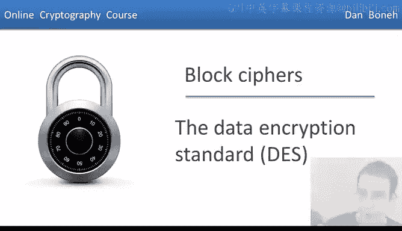
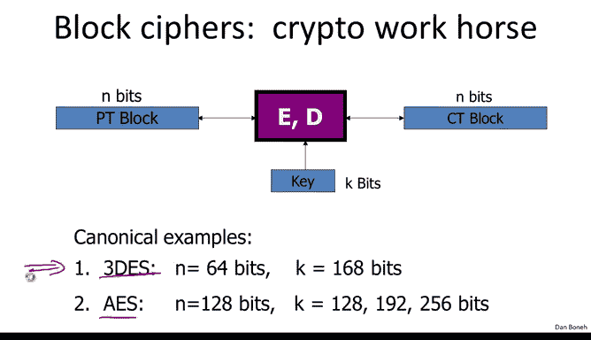
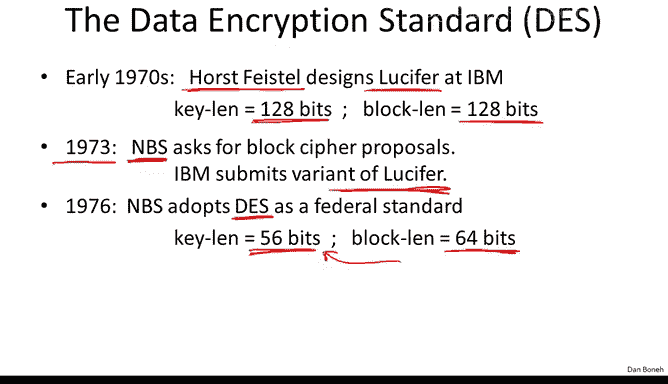
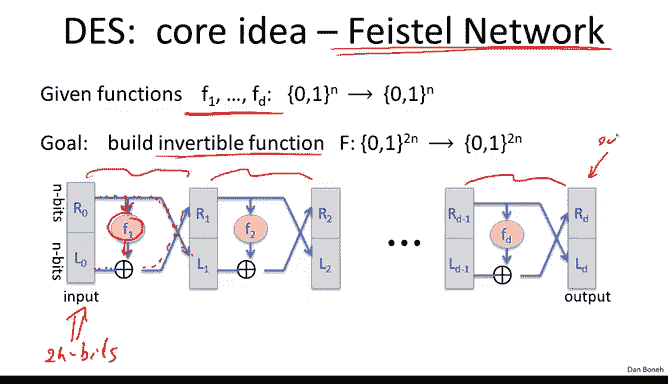
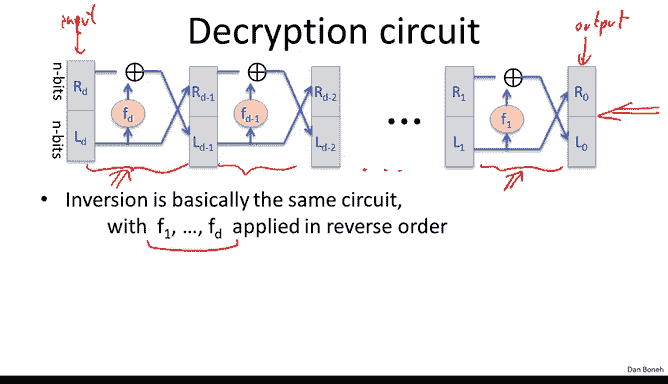
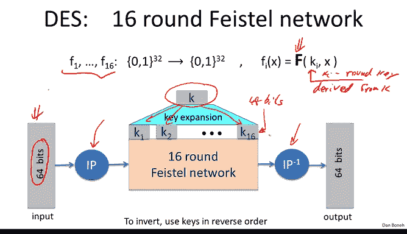
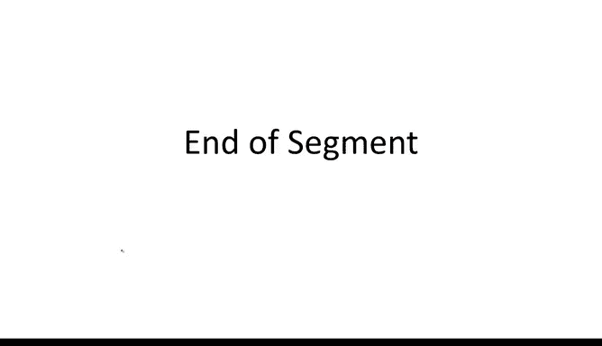

# 斯坦福大学《密码学｜Cryptography 1》中英字幕 - P14：14_02_01_数据加密标准.zh_en - GPT中英字幕课程资源 - BV1Rf421o79E

So now that we understand what block ciphers are， let's look at a classic example called the data encryption standard。

So just a quick reminder， block ciphers basically map n bits of input to n bits of output。

 and we talked about two canonical examples， triple Ds and AES in this segment we're going to talk about DEs and we'll talk about triple DS actually in the next segment。

And then I also mentioned before the block cphers are often built by iteration in particular we're going to look at block ciphers that are built by a form of iteration where a keyK is first expanded into a bunch of round keys and then a round function is applied to the input message again and again and again and essentially after all these round functions are applied we obtain the resulting ciphertex and again we're going to look at how DES。

 the data encryption standard uses this format I just want to be clear that in fact to specify a block cipher of this type。

 one needs to specify the key expansion mechanism and one needs to specify the round function in the segment here I'm going to focus on the round function and I'm not going talk much about key expansion but I just wanted to mention that in fact key expansion is also a big part of describing how block cipher works。

Okay， so let's talk about the history of DES， essentially in the early 1970s。

 IBM realized that their customers are demanding some form of encryption。

 and so they formed a crypto group and the head of that group was H Feisttelel。

 who in the early 70s designed a cipher called Lucifer。Now it's interesting。

 in fact Lucifer had a number of variations but one of the later variations in fact had a key length that was 128 bits in a block length that's also 128 Bs in 1973 the government realized that it's buying many commercial off theself computers and so it wanted its suppliers to actually have a good crypto algorithm that they could use in products sold to the government so in 1973。

 the National Bureau of Standard as it was called at the time put out a request for proposals for a block cipher that's going to become a federal standard and in fact IBM submitted a variant of Luccifer that variant actually went through some modification during the standardization process and then finally 1976。

 the National Bureau of Standard adopted a Des as a federal standard and in fact for Des it's interesting that the key length was far reduced from Luciffer it's only 56 Bs and the block length was also reduced after 64 bits and in fact these decisions especially the decision to reduce。

The key length is kind of the Achilles heel of DES and was a source of many complaints over its life in particular already back in 1997 Des was broken by exhaustive search meaning that a machine was able to search through all two to the 56 possible keys to recover a particular challenge key and in fact we're going to talk about exhaustive search quite a bit it's quite an interesting question and there are various ways to defend against exhaustive search。

And basically this 1997 experiment kind of spelled the doom of DES。

 it meant that if DESs itself is no longer secure。 and as a result。

 the National Institute of Standards as it became known issued a request for proposals for next generation block cipher standard and in 2000 is standardized on a cipher called Rinale。

 which became the advanced encryption standard AES and we'll talk about AES later on。

 but in this segment I want to describe how DES works。 Now DES as a cipher。

 it's an amazingly successful cipher it has been used in banking industry， In fact。

 it a classic network called the electronic clearinghouse。

 which banks used to clear checks with one another。

 and DS is used for integrity in those transactions。 It's also used in commerce In fact。

 it was very popular up until recently as the main encryption mechanism for the web Of course now that's been replaced with AES and and other ciphers。

 Overall it's a very successful cipher in terms of deployment。

 DS also has a very rich history of attacks which we'll talk about。Next segment。

Okay so now let's talk about the construction of DES。

 So the core idea behind DES is what's called a Fstel network due to a horse Fisttel。

 And basically it's a very clever idea for building a block cipher out of arbitrary functions F1 to FD。

 Okay， so imagine we have these functions F1 to FD that happens to map n bits to n bits。

 Now these are arbitrary functions。 They don't have to be invertible or anything。

What we want to do is build an invertible function out of those D functions and the way we'll do it is by building a new function we'll call capital F that maps two n bits to two n bits and the construction is described right here So here we have our inputs you notice there are two blocks of n bits in other words。

 the input is actually two n bits。The R and L stand for right and left。 Typically。

 people describe a Ptel network from top to bottom。

 in which case these nbits really would be right and left。

 but here it's more convenient for me to describe it horizontally。

 So if we follow the R input you realize it basically gets copied into the L output without any change at all however。

 the L input is changed somewhat basically what happens is the R input is fit into the function F1 and the result in is xor with L0 and that becomes the new R1 input。

Okay so this is called one round of a Psto network and it's done using the function F1。

 Now we do this again with another round of the Fto network with a function F2 and we do it again and again and again till we get to the last round and we do it again with the function FD。

 And finally the output is R LD。

So if you like we can write this in symbols that basically L is simply equal to R minus1。And R I。

 let's see。 that's the more complicated one。 R I is equal。 Well， let's just follow the lines here。

 R I is just equal to F。I applied to R I minus1 X or li。Okay。

 and this is basically I goes from1 to D。 So this is the equation that defines a fivestone network mapping a2 and bit input to2 n bit outputs So here we have again I just copied the picture of the five network。

 and the amazing claim is that in fact， it doesn't matter which functions you give me for any functions F1 to FD that you give me the resulting fivestone network function is。

 in fact invertible And the way we're going to prove that is basically we're going to construct an inverse because not only is an invertible。

 it's efficiently invertible。So let's see so let's look in one round of a F network。

 So here this is the inputs R LI and this is the output R plus1 L plus1 And now what I'm going to ask you is to invert this So let's see so suppose now the input that we're given is R plus1 li plus1。

And we want to compute RLI， so we want to compute the round in the reverse direction。

So let's see if we can do it。Well， let's look at R。 So R is very easy。

 Basically R is just equal to L plus1。 So L plus1 just becomes R。

 But now let me ask you to write the expression for L in terms of R plus1 and L plus1。

So I hope everybody sees that basically li plus1 is fed into the function。 F plus1。

 The result is xor with R plus1。 and that gives the li input。

 So this is the inverse of one round of a fiveyle network And if we draw this as a diagram。

 let's just write the picture for the inverse。 So here you notice the input is R plus1 li plus1 and the output is ri right So we're computing。

 we're inverting the round。 So you notice that the inverse of a fiveyle round looks pretty much the same as the five round and the forward direction。

 It's literally just for technical reason it's kind of the mirror image of one another。

 but it's basically the same construct。 And when we put these inverted rounds back together。

 we essentially get the inverse of the entire five network。

 So you notice we start off with round number D with the inverse of round number D then we do the inverse of round number D minus-1 and so on and so forth until we get to the inverse of the first round and we get our。

Output， which is r 0 L0 this is the input。 and we manage to invert basically RdlD and get R0 L0。

 And the interesting thing is that basically the inversion circuit looks pretty much the same as the encryption circuit。

 and the only difference is that the functions are applied in reverse order we started with FD and ended with F1 whereas when we were encrypting。

 we started with F1 and ended with FD。 So for hardware designers。

 this is very attractive because basically if you want to save hardware。

 you realize that your encryption hardware is identical to your decryption hardware。

 So you only have to implement one algorithm and you get both algorithms the same way。

 the only difference is that the functions are applied in reverse order。

 So this phleton mechanism is a general method for building invertible functions from arbitrary functions F1 to FD and in fact。

 it's used in many different block ciphers。

Although interestingly， it's not actually used in AE。

 So there are many other block ciphers that use a Fsal network or of course。

 they differ from Ds in the functions F1 to FD。 but AE actually uses a completely different type of structure that's actually not a phsal network。

 We'll see how AE works in a couple of segments。 So now that we know what Fsto networks are。

 let me mention an important theorem about the theory of Fsto networks that shows why they're a good idea。

 The theorem is due to Luan rockoff back in 1985。 and it says the following。

 supposeupp I have a function that is a secure pseudoran function。

 Okay so it's indistinguishable from random and happens to act on nbits。

 So it maps nbits to n bits and uses a key K。 Then it turns out that if you use this function in three rounds of a phsal network what you end up with is a secure pseudoran permutation。

 In other words， what you end up with is an invertible function that's indistinguishable from a truly random。

Vertible function。 And I hope you remember that the definition of a secure block cipher is that it needs to be a secure pseudo random permutation。

 So what this theorem says is if you start with a secure pseudo random function。

 you end up with a secure block cipher。 Basically， that's what this says。

 Now let me explain in a little bit more detail what's actually going on here。 So essentially。

 the PRf is used in every round of the Psta networks。 In other words， here。

 what's actually computed is the PRf using one secret key K 0。

 here what's computed is the PRf using a different secret key， of course， applied to R1。

 And here we have yet another secret key。 K1 applied K2 applied to R2。

And you notice this is why basically this F construction uses keys in K cubed， in other words。

 it uses three independent keys， so it's very important that the keys are actually independent。

 so really we need three independent keys。And then we end up with a secure pseudo random permutation。

 Okay， so that's the theory behind Pto networks。 now we understand that we can actually look at the specifics of DES。

 So DES is basically a 16 round5to network。 Okay， so there are functions F1 to F 16 that map 32 bit to 32 B。

 And as a result， that D ES itself act on 64 bit blocks 2 times 32。

Now the 16 round functions and DES are actually all derived from a single function F just used with different keys。

 So in fact， these are the different round keys， so KI is a round key。

And it's basically derived from the key K derived。From the 56 bit， the S key E K。 Okay。

 now'll describe what this function F is in just a minute。

 But basically that you see that by using 16 different round keys。

 we get 16 different round functions， and that gives us the F network。

So just at a high level how the Ds works， basically you have a 64 bit input the first thing it does is this initial permutation that just permutees the 64 bits around。

 namely it maps bit number one to bit number 6 bit number two the bit number 17 and so on This is not for security reasons this is just specified in the standard then we go into the 16 round Fstel network that actually you now know how it works basically uses the function F1 to F16 as specified before and then basically we have another permutation this is called the final permutation that's just the inverse of the initial permutation again。

 it just permutees bits around this is not necessary for security reasons and then we finally get the final outputs。

Okay， now as we said， there's a key expansion step which I'm not going to describe。

 but basically this 56 bit De key is expanded into these round keys where each round key is 48 bits。

So we have 16 48 bit round keys and they're basically used in the 16 rounds of DES and then when you want to invert to cipher。

 all you do is you use these round keys， these 16 round keys in reverse order。

Okay， so now that we understand that there's structure。

 the only thing that's left to do is specify the function capital left。

 So let me explain how this function works。 So basically， it takes its inputs。 It's 32 bit value。

 Let's call it X。 But in reality， you remember， this is our 0 or 1 or 2 or 3 and so on and so forth。

 These are 32 bit values。And then it takes also a 48 bit round key， so here we have our key KI。

 which happens to be 48 bits。The first thing it does is it goes through an expansion box and this expansion box basically takes three2 bits and maps them into 48 bits。

Now all the expansion box does is just replicate some bits and move other bits around。

 so for example， bit number one of x is replicated into positions 2 and 48 in the output。

Bit number two of x is positioned in as bit number three of the output and so on and so forth。

 just by replicating some of the bits of x， we expand the input into 48 bits。

The next thing we do is we compute an XO with the round key。

 sometimes people say that cryptographers only compute XOs。

 this is an example of that where well we just do Xors in this function and then comes the magic of DES where actually these 48 bits are broken into8 groups of six bits。

I think7，8。 And so let me draw。 And then what happens is， so yes， each one of these。

Each one of these wires is six bits。And then they go into what are called S boxes。

 and I'll explain the X boxes in just a minute， the X boxes are kind of the smarts of DS。S 8。

 and then the S box is basically a map 6 bits to4 bits。

 So the outputs of the S boxes are these four bits。 they're collected。 This gives us 32 bits， right。

8 groups of four bits gives us 32 bits。And then finally。

 this is fed into yet another permutation which just maps the bits around。 So for example。

 bit number one will go to bit number9， bit number two will go to bit number 15 and so on。

 So it just permes the 32 bits around， and that's the final 32 bit outputs of this F function。Okay。

 so by using different round keys， essentially we get different round functions。

 and that's how we form the 16 round functions of Ds。 Now。

 the only thing that's left to specify are these S boxes。

 So the S boxes literally are just functions from 6 bits to4 bits。

And they're just implemented as a lookup table So describing a function from six bit to four bits basically amounts to writing the output of the function on all two to the six possible inputs。

2 to the 6 is 64。 So we just have a table that literally contains 64 values where each values，4 bits。

 So here's an example， this happens to be the fifth S box。

 And you see that this is a table that contains 64 values right， it's4 by 16。

 So 64 values and for example， if you want to look at the output that corresponds to0，1，1，0，11。

 then you you look at these two bits， this is 0，1 and you look at these four bits， this is 11。

01 and you see that the output is 1，0，0，1， the4 bits output 1，0。

01 so the S boxes are just implemented as these tables。

 now the question is how are these s box is chosen。

 How are these tables actually chosen by the designers of this。

To give you some intuitions for that， let's start with a very bad choice for S boxes。

So imagine the S boxes were linear。 What do I mean by that。

 I mean that imagine that these six bit inputs literally were just ext with one another in different ways to produce the four bit outputs。

Okay another way of writing that is that we can write the S box as a matrix vector product。

 So here you have the matrix AI and the vector， the six bit vector X。

 and you can see that if we write this matrix vector product basically we take the inner product of this vector with the input vector remember these are all bits。

 So the six bit vector inner product another six bit vector we do that module2。

 you realize basically what we're computing is x2 x or x3 because only position two and position 3 have ones in it and similarly the next inner product will produce x1 x4 x4 x or x5 and so on and so forth Okay so you can literally see that if the s boxes are implemented this way then all they do is just apply the matrix a to the input vector x which is why we say that in this case。

 the S boxes are completely linear。Now， I claim that， in fact， if the S boxes were linear。

 then des would be totally insecure。 And the reason is， if the S boxes are linear。

 then all that des does is just compute Xor of various things and permute and shuffle bits around。

 So it's just Xors and bit permutations， which means that as a result。

 all of des is just a linear function。

In other words， there will be a matrix B。Of these dimensions。 Basically。

 it's a matrix B that has with 832。 Basically， what I would do is I would write the 64 bit message plus the 16 round keys as one long vector right So the message is 64 Bs。

 and there are 16 round keys， each one is 48。 and that if you do the math， it's basically 832。

 Okay so I write these guys， the keys in the message is one long vector。

 And then it would be this matrix that essentially， when you compute these matrix vector products。

 essentially， you get the different bits of the cphertex。 So there's 64 of these rows。

 And as a result， you get 64 bits of cphertext。 Okay so this is what it means for D S to be linear。

 So if you think a little bit about this， you realize the S boxes are the only non nonlinear part of Ds。

 So if the S boxes were linear。 there's the entire circuit is linear and therefore can be expressed as this matrix。

Now if that's the case， then DES would be terrible as a secure pseudo random permutation。

 and let me give you a very simple example， basically if you take the XO of three outputs of DES。

 well let's think what that means。Basically， we would be looking at B times the matrix B that defines D E S times one vector。

Plus X or B times another vector， X or B times the third vector。

 we could take the B out of the parentheses。 So we'll be basically doing B times this vector over here。

 But of course， K X or K X or K X or K。 This is just K。And so if you think about what that means。

 basically we just got back Ds of k at the point M1 x or M2 x or M3。

 but this means that now De has this horrible relation that can be tested right so basically if you x or the output of three values M1 M2 and3。

 you'll get the value of des at the point M1 x or M2 x or M3。

Now this is not a relation that's going to hold for a random function。

 a random function is not going to satisfy this equality。

 and so you get a very easy test to tell you that De is not a random function。And in fact。

 it's not even maybe you can take that as a small exercise。

 it's not even difficult to see that given enough input output pairs。

 you can literally recover the entire secret key。Yeah。

 you just need 832 input output pairs and you'll be able to recover the entire secret key。

And so if the X boxes were linear， this would be completely insecure。

It turns out actually even if the X boxes were close to being linear， in other words。

 the S boxes were linear most of the time， so maybe for 60 out of the 64 inputs。

 the x boxes were linear， it turns out that would also be enough to break Ds and we're gonna to see why later on in particular。

 if you choose the X boxes at random。 it turns out they'll tend to be somewhat close to linear functions as a result。

 you'll be able to totally break the you'll just be able to recover the key in basically very little time。

 And so the designers of De actually specified a number of rules they use for choosing the S boxes。

 and it's not surprising the first rule is that these functions are far away from being linear。

 so in other words， there is no function that agrees with a large fraction of the outputs of the S box。

And then there are all these other rules， for example， there are exactly four to one maps， right。

 so every output has exactly four pre images and so on and so forth。

 So we understand now why they chose the S boxes the way they did。 and in fact。

 it's all done to defeat certain attacks on Ds。Okay， so that's the end of the description of DES。

 and then in the next two segments we're going to look at the security of DES。

