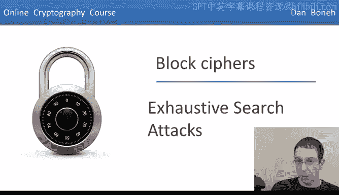
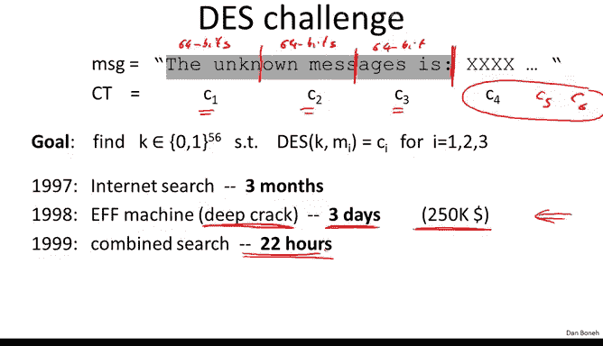
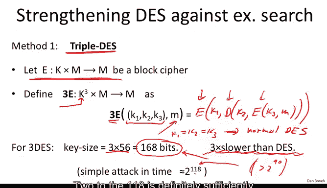
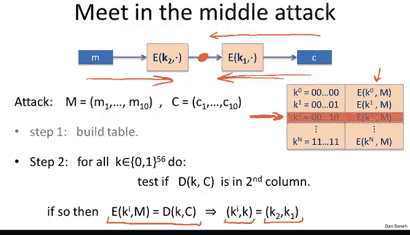
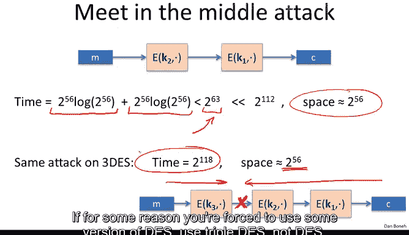
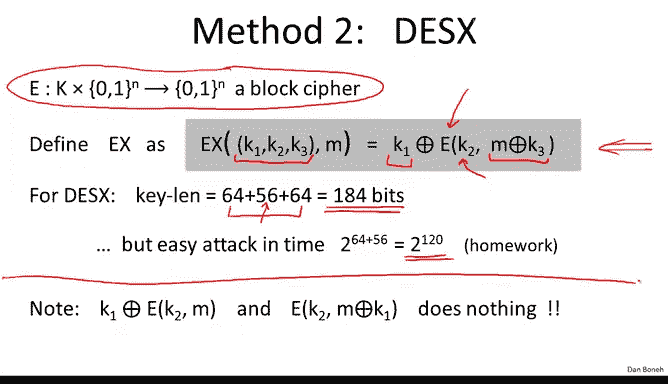

# 斯坦福大学《密码学｜Cryptography 1》中英字幕 - P15：15_02_02_穷举搜索攻击.zh_en - GPT中英字幕课程资源 - BV1Rf421o79E

Now that we understand how De works， let's look at a few attacks on De and we're going to start with an attack called Exusive Search。

So our goal here is basically that given a few input output pairs， MICI。

 our goal is to find the key that maps these Ms to the Cs， in other words。

 our goal is to find the key that maps M1 M2 M3 into C1， C2， C3 and as I said。

 our goal is to find the key that does this mapping。The first question is。

 how do we know that this key is unique？ And so let's do a little bit of analysis to show that。

 in fact， just one pair is enough to completely constrain a DS key。

 and that's why this question makes sense。 Okay， so let's see， So we're going to prove the simple M。

 Now let's assume that Ds is what's called an ideal cipher。

 So what is an ideal cipher basically we're going to pretend like Ds is made up of random invertible functions。

 In other words， for every key， Ds implements a random invertible function。

 Since there are two to the 56 keys in DES， we're going to pretend like Ds really is a collection of2 to the 56 functions that are invertible from 0164 to 0164。

Okay， so of course， De is not a collection of2 to the 56 random functions。

 but we can idealize the cipher and pretend that it is such a collection。Then what can we say。

 then in fact， it turns out just given one message in Cyphertext。

 you just give me one pair message in Cyphertext， There is already only one key that maps this message to that Cyphertext。

So already， just given one pair M and C， I can ask you， find me the key that maps M to C。

 and the solution is very likely to be unique。 In fact。

 it's going to be unique with probability roughly 99。5%。

 I should say that the statement is true for all M and C and the probability is just over the choice of the random permutation that make up the cipher。

So let's do the proof。 This is fairly straightforward。

 So what we're basically asking is what's the probability that there exists some key that's not equal to k。

 such that well C， we know is equal to Ds of k comma M by the definition of C and M。

 But we're asking how likely is it that there's this other key K prime that also satisfies this equality。

 you realize that if this is true， such a key K prime exists， then just given an M and C。

 you can't decide whether the right key is k or k prime， because both of them work。

 but I want to argue that this happens with low probability。 Well。

 so what does it mean that there exists a key K prime that that satisfies this relation， Well。

 we're asking what's the probability that the first key。

 you know the all zero key satisfies it or the second key satisfies it or the third key satfi and so on and so forth。

 So by the union bound， we can bound this probability by the sum over all ps K prime over all 56 bit keys。

Of the probability that there's。KM is equal to this。K primer。

Okay so we're asking basically what is this probability for a fixed keyK prime that it happens to collide with the keyk at the message M。

 Well， let's think about this for a second。 let's fix this value let's suppose it's some fixed value and then we're asking how likely is it that a random permutation pi k prime at the point m happens to produce exactly the same output as the key k at the point m。

 Well， it's not difficult to answer and see that in fact this is for a single key K prime。

 the probability is at most1 over2 to the 64 right there are 2 to the 64 possible outputs for the permutation what's the probability that it lands exactly on this output。

 Well， it's 1 over 2 to the 64。And we're summing over all two to the 56 keys so we just multiply the two。

 we get one over two to the8， which is basically1 over 256 so the probability that the key is not unique is1 over 256。

 therefore the probability that it is unique is one minus that which is 99。5%。Okay。

 so already if you give me one plain text Cyphertex pair， the key is completely determined。

 there's only one key that will map that plain text to that Cyphertext and the question is just can you find that key？

Now， it turns out， in fact， if you give me two pairs。

 So you give me M1 and M2 and their corresponding outputs C1 and C2。

 the probability basically just do exactly the same analysis。

 the probability basically becomes one that there's only one such key。 Okay essentially this is very。

 very， very， very close to one。 and basically it says given two pairs， it's very。

 very likely that only one key will map this pair of messages to this pair of Cyphertex。

 And as a result again， we can ask， well， find me that unique key。 And by the way。

 the same is true for A。 if you look at A 128， again， just given two input output pairs。

 there's going to be only one key with very high probability。

 So essentially now we can ask for this exhaustive search problem， I give you two or three pairs。

 And I ask you， well， find me the key。So how are you going to do it。

 well are you going to do it by exhaustive search， essentially by trying all possible keys one by one until you find the right one？

So this is what's known as the De challenge so let me explain how the D challenge worked the challenge was issued by a company called RSA and what they did is basically they published a number of Cyphertexts but three of the Cyphertexs had known plain texts so in particular what they did is they took the message here the unknown message is colon and you can see they broke it up into blocks If you look at these these are basically eight byte blocks 8 bytes as you know is 64 bits。

So each one of these is 64 bits and then they encrypted them using a secret key。

 they encrypted all using the same secret key to get kind of three ciphertext。

 so this gives us three plain text ciphert pairs and then they gave us a whole bunch of other ciphertext。

 you know C4， C5， C6 and a challenge was decrypt these guys using the key that you found from an exhaustive search over the first three pairs that you were given。

😊，O。So that was called a De challenge， and let me tell you a little bit about how long it took to solve it。

So interestingly， in 1997， using an internet search using a distributed donet basically。

 they were able to search through enough of the keyspace to find the correct key in about three months。

 you realize the key space has size2 to the 56， but on average you only have to search through half the keyspace to find the key and so it took them three months。

Then kind of a miraculous thing happened。 The EFF actually contracted Paul Ccher to build special purpose hardware to break D yes。

 This was a machine called Deep crackrack。 It cost about $250，000。

 and it broke the next days challenge in only three days。😊，Interestingly， by the way。

 RSA said that they would pay $10，000 for each solution of the challenge。

 so you can see that this is not quite economical， they spent $250k， they got $10。

000 for solving the challenge。The next thing that happened is in 1999 RSA issued another challenge and they said well。

 you got to solve it in half the time of the previous solution。

 and so using both DeepCrack and the internet search together。

 they were able to break De in 22 hours。So the bottom line here is essentially。

 Des is completely dead。Essential， if you forget or you lose your Des 56 bit key。

 don't worry within 22 hours， you can actually recover it and in fact。

 anyone can recover it and so Des essentially is dead and no longer secure and just kind of a final nail in the coffin as hardware technology improved。

 There was another project called Copa cabana they used FPgas just off the shelf。

 FPga only 120 FPgas it only cost $10000 and they were able to break to do an exhaustive key search in about seven days。

 So very， very cheap hardware just off the shelf you can break Des already very quickly。

 So the lesson from all this is essentially 56 bit ciphers are totally totally dead。

And so the question is what to do People really liked as it was deployed in a lot of places。

 there were a lot of implementations， there was a lot of hardware support for it。

 so the question was what to do and so the first thing that came to mind is well maybe we can take Des and we can kind of artificially expand the key size so we strengthen it against this exhaustive search attack。

And the first idea that comes to mind is basically well let's iterate the blockci for a couple of times and this is what's called triple D so triple D is a general construction。

 basically it says the following suppose you give me a blockci for E So of here it has a keyspace K and it has a message space M and an output space of course M as well。

 let's define the triple construction which now uses three keys。😊。

And it's defined as follows basically here， the triple construction is uses three independent keys。

 encrypts the same message block as before， and what it does is it will encrypt using the key K3。

Then it will decrypt using the key K2， and then it will encrypt again， using the key K1。 Okay。

 so basically encrypting three times using three independent keys。

 You might be wondering why is it doing E D， E， Why not just do E， E， E。

 Why do we have to have a D in the middle。 Well， that's just for a kind of a hack。

 You notice what happens if you set up K1 equals K2 equals K3。

What happens if all three keys are the same？Well， basically。

 what would happen is1 E and 1 D would cancel and it will just get normal Ds out。

 So it's just a hack so that if you have a hardware implementation of triple Ds。

 you can set all three keys to be the same and you'll get a hardware implementation of single Ds。

 Of course， it'll be three times as slow as a regular implementation of single Ds， but nevertheless。

 it's still an option。 Okay， so for triple Ds， in fact， now we get a key size that's three times 56。

 which is 168 bits。So this is 168 B is way too long to actually do exhaustive search on that will take time 2 to the 168。

 which is more than all the machines on earth working for 10 years would be able to do。

 Unfortunately， of course， the cipher is three times slower than D。

 So this is a real problem with triple De。 Now I want to mention that， in fact。

 you might think that triple De has security2 to the 168。 But in fact。

 there is a simple attack that actually runs in time 2 to 118。

 and I want to show you how that attack works。 so but in fact，2 to the 118 is still a large number。

 In fact， anything that kind of bigger than 2 to the 190 is considered sufficiently secure。

2 to 118 is definitely sufficiently secure against exhaustive search and generally is considered a high enough level of security。

 So clearly， triple is three times as slow as Ds。

So the question is why did they repeat the cipher three times。

 why not repeat the cipher just two times or in particular the question is what's wrong with double Des so here we have doubledess basically you see it uses only two keys and it uses only two applications of the block cipher and as a result it's only going to be twice as slow as DES。

 not three times as slow as DES。Well， the key length for double De is two times 56。

 which is 112 bits。And in fact， doing exhaustive search on a space of 112 bits is too much。

2 to 112 is too big of a number to do exhaustive search over such a large space。

So the question is what's wrong with this construction Well。

 it turns out this construction is completely insecure and I want to show you an attack。

So suppose I'm given a bunch of inputs， say M1 to M10。

 and I'm given the corresponding outputs C1 to C10。What's my goal。

 well my goal is basically to find keys， you know a pair of keys， K1， K2。

Such that if I encrypt the message， you the message capital M using these keys， in other words。

 if I do this encryption， this double does encryption。

 then I get the spherex vector that was given to me。Okay， so our goal is to solve this equation here。

Now you stare at this equation a little bit and you realize， hey， wait a minute。

 I can rewrite it in kind of an interesting way， I can apply the decryption algorithm and then what I'll get is that I'm really looking for keys K1 K2 that satisfy this equation here。

Where basically all I did is I applied the decryption algorithm using K1 to both sides Now whenever you see an equation like this。

 what just happened here is that we separated our variables into two sides。

 The variables now appear on independent sides of the equation。

 and that usually means that there is a faster attack and exhaustive search and in fact this attack is called a meat in the middle attack where really the meat in the middle is going to somehow attack this particular point in the construction。

Okay， so we're going try and find a key that maps M to a particular value here and maps C to the same value。

 Okay， so let me show you how the attack works。 So the first thing we're going to do is we're gonna to build a table here。

 Let me clear up some space here。 The first step is to build a table that for all possible values of K2 encrypt M under that value。

 Okay， so here we have this table。 So you notice these are all， I'll say like this。

 These are all2 to the 56 De keys， single desk keys。 Okay， so the table has2 to the 56 entries。😊。

And what we do is basically for each entry， we compute the encryption of M under the appropriate key。

 So this is the encryption of M under the all0 key， the encryption of M under the one key。

 And then at the bottom， we have the encryption of M under the all one key。 Okay。

 so there are two to the 56 entries。 and we sort this table based on the second column。 Okay。

 so far so good。 So by the way， this takes time to build this table takes time2 to the 56。

 And I guess we also want to sort。 sorting takes n log n time。

 So its2 to the 56 times loggged it to the 56。So now that we have this table。

 we've essentially built all possible values in the forward direction for this point。

Now what we're going to do is this meet in the middle attack where now we try to go in the reverse direction with all possible keys K。

 essentially we compute a decryption of C under all possible keys。

 K1 okay so now for each potential decryption， remember the table holds all possible values in the midpoint so then for each possible decryption we check。

 hey use a decryption in the table in the second column in the table if it isn't a table then aha we found a match。

And then what do we know， we know that essentially， well we found the match， So we know that， say。

 for example， a decryption using the particular key K1 happened to match this entry in the table。

 you know， K sub2 or more generally K I。 Then we know that the encryption of M under KI is equal to the decryption of C under K。

Okay so we kind of build this meet in the middle where the two sides， you know。

 the encryption of M under KI and the decryption of C under K collided。But if they collided。

 then we know that in fact， a pair K I and K is equal to the pair that we're looking for。

And so we've just solved our challenge。 So now let's look at what's the running time of this。 Well。

 we had to build a table and sort it。 And then for all possible decryptions。

 we had to do a search through the table。 So there were two to the 56 possible decryption。

 Each search in a sorted table takes log of2 to the 56 time。 If you just work it out。

 This turns out to be 2 to the 63， which is way， way， way， way， way smaller than  two to the 112。

 Okay， so this is a serious attack。 It's probably doable today。😊。

That runs in a total time of 2 to 63， which is about the same time as the exhaustive search attack on Ds。

 So really doubledess really didn't solve the exhaustive search problem because well。

 there's an attack on that runs in about the same time as exhaustive search on single deaths。

 Now someone might complain that in fact， this algorithm well we have to store as big table。

 So it takes up a lot of space。 but you know so be it。 that's nevertheless。

 the running time is still quite smaller， significantly smaller than 2 to 112。

 Now you notice by the way， the same attack applies to tripleds。

 What you would do is you would implement a man in the middle attack against this point。

 you would build a table of size 2 to the 56 of all possible encryptions of M。

 and then you would try to decrypt with all2 to 112 keys until you find a collision and when you find a collision。

 you' basically found K1 K2 K3 so even tripled has an attack that basically explores only2 to 112 possible keys。

 but 2 to 112 is a large enough number。triple D， in fact， is far as we know， is sufficient secure。

 I should mention that triple D is actually a NISist standard。

And so triple Ds is actually used quite a bit。 And in fact， Des should never， ever， ever be used。

 if for some reason， you're forced to use some version of Des use triple D not Des。 Okay。

 I want to mention one more method for strengthening des against exhaustive search attacks。

 this method actually is not standardized by Nist， because it doesn't defend against more subtle attacks on Des。

 But nevertheless， if all you worry about is exhaustive search。

 and you don't want to pay the performance penalties of triple Ds， then this is an interesting idea。

 So let me show you how it works。 So let E be a block cipher that operates on n bit blocks。

 We're going to define the Ex construction and for Des we're gonna to get de X to be the following。

 So we use three keys K1 K2 K3。 And then basically before encryption， we XO with K3。

 then we encrypt using K2。 And then after encryption， we XO with K1。 That's it。

 That's the whole construction。 So basically， you notice it doesn't slow the block cipher much because all we did is we apply the cipher plus two additional exors。

 which are super。

The key length for this is， in fact， well， we got two keys that are as long as the block size and we've got one key that's as long as the key size。

 So the total is 184 bits。 Now it turns out actually the best attack that's known is actually an attack that takes time 2 to 120。

 and it's actually fairly simple。 So it's a generic attack on EX。

 It will always take time basically the block size plus the key size。

 and it's a simple homework problem for you to try to figure out this attack。

 I think this is a good exercise。OkayIn fact， there is some analysis to show that there is no exhaustive search attack on this type of construction。

 so it's a fine construction against exhaustive search。

 but there are more subtle attacks on theEF that we'll talk about in the next segment that basically this construction will not prevent。

One thing that I want to point out， unfortunately I found this mistake in a number of products is if you just decide to XO on the outside。

 or if you just decide to x on the inside as opposed to Xering on both sides， which is what DeX does。

 in Xor is both on the outside。

And on the inside， if you just do one of them， then basically this construction does nothing to secure your cipher。

 It'll still be as vulnerable to exhaustive search as the original block cipher E。 Okay。

 so this is another homework problem。 And actually you'll see that as part of our homework。Okay。

 so this basically concludes our discussion of exhaustive search attacks。

 and next we'll talk about more sophisticated attacks on DES。

