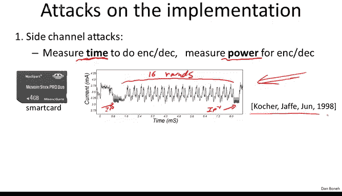
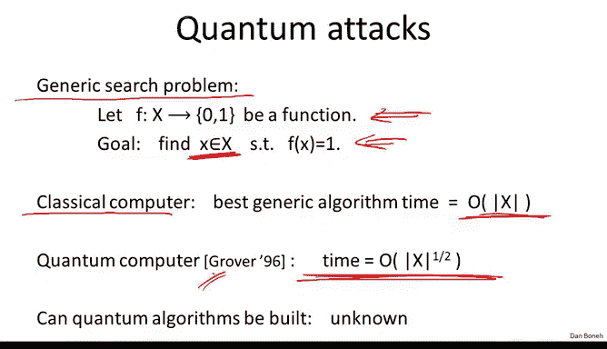

# 斯坦福大学《密码学｜Cryptography 1》中英字幕 - P16：16_02_03_对分组密码的更多攻击.zh_en - GPT中英字幕课程资源 - BV1Rf421o79E

There is an immense literature on attacking block ciphers In this segment。

 I just want to give you a taste for what these attacks look like。

 and I hope I'll convince you that you should never， ever。

 ever design your own block cipher and just stick to the standards like Tri Ds and AES。😊。

The first set of attacks I want to talk about are attacks on the implementation of the block cipher。

As an example， imagine you have a smart card that's implementing a block cipher。 So the smart card。

 for example， could be used for credit card payments and might have a secret key inside of it to authenticate your credit card payments as you stick the card into a payment terminal say。

 So now if an attacker obtains your smart card， what he could do is he could actually take the smart card to a lab。

 and then run the card and measure very precisely how much time the card took to do encryption and decion。

 Now， if the amount of time that the implementation took to do encryption depends on bits of the secret key。

 then by measuring the time the attacker will learn something about your secret key， and in fact。

 he might even be able to completely extract your secret key。

 and there are many examples of implementations that simply by measuring the time very precisely for many operations of encryption algorithm。

 you can completely extract the secret key。😊，Another example is rather than just measuring the time。

 you can actually measure the power consumption of the card as it's operating。

 So literally you can connect it to a device that will measure the current that the card is drawing。

 And then graph the current very， very precisely。 Now， these cards are not very fast。

 And as a result， you can actually measure the exact amount of power consumed at every clock cycle as the card was executing。

 When you do that， you actually get graphs of this form。

 So this is an example of a smart card operating while it's doing the disk computationation。

 So you can see very clearly here is when it was doing the initial permutation。

 Here is when it's doing the final permutation。 And then here you can count there are actually 16 hills and troughs corresponding to the 16 rounds。

 And essentially， when you zoom in on a graph like this。

 you can basically read the keybits off one by one just by looking at how much power of the card consumed as it was doing their different operations。

 It turns out that even cards that take steps to mask this type of information。😊。

Are still vulnerable， There's an attack called a differential power analysis where basically you measure the power consumed by the card over many。

 many， many runs of the encryption algorithm and as long as there is any even small dependence between the amount of current consumed and the bits of the secret key basically that dependence will show up after enough runs of the encryption algorithm and as a result you'll be able to completely extract the secret key so these attacks were actually discovered by Paul Cocher and his colleagues after the cryptography research and there's actually a fairly large industry devoted to just defending against these power attacks。

😊，As far as timing attacks are concerned， I want to mention that these are real。

 they're not just about smart cards。 for example， you can imagine a multicore processor or where the encryption algorithm is running on one core and the attacker code happens to be running on another core Now these cores actually share the same cache and as a result。

 an attacker can actually measure can actually look at the exact cache misses that the encryption algorithm incurred it turns out that by looking at cache misses。

 you can completely figure out the secret key used by the algorithm。

 So one core can essentially extract information from the other core just by looking at cache misses。

So implementing these blockyphers is actually quite subtle because you have to make sure that the side channel attacks don't leak information about your secret key。

Another type of attack that's been discussed in the literature is what's called a fault attack。

 so here basically if you're attacking a smart card。

 you can actually cause the smart card to malfunction， perhaps by overclocking it。

 perhaps by warming it up， essentially you can cause the processor to malfunction and output erroneous data it turns out that if doing encryption there are errors in the last round of the encryption process that the resulting ciphertex that are produced are enough to actually expose the secret keyK it's quite an interesting result that in fact if you have any errors if you ever output a wrong result that actually could completely compromise your secret key。

So of course， the defense against this means that before you output the result of your algorithm。

 you should check to make sure that the correct result was computed Now。

 of course that's not trivialvial because how do you know that the error didn't happen in your checking algorithm。

 but there are known ways around that。 So basically you can actually compute something three or four times take majority over all those results and be assured that the output really is correct as long as not too many faults occurred inside of your computation these are attacks on the implementation。

 I hope these examples can assure you that not only should you not invent your own block ciphers。

 you should never even implement these crypto primitives yourself because A you have to make sure there are no side channelnel attacks on your implementation and B you have to make sure that the implementation is secure against fault attacks so instead you should just use standard libraries like the ones available in open SSL and many other libraries out there。

So don't implement these primitives yourself， just use existing libraries。Alright。

 so now I want to turn to kind of more sophisticated attacks on block ciphers and I'll particularly talk about how these attacks apply to theS。

 so these attacks were discovered by Bhamm and Chamir back in 1989 and I'll particularly describe a version of the attack discovered by Mattsui in 1993。

😊，So the goal here is basically given many， many， many input output pairs。

 can we actually recover the key better than exhaustive search。

 So anything that runs better than exhaustive search already counts as an attack on the block cipher。

 Okay， so the example I want to give you is what's called linear cry analysis。 And here。

 imagine it so happens that you know C is the encryption of M using keyk。😊。

And it suppose it so happens that if I look at a random key and a random message。

 somehow there's a dependence between the message， Cyphertext and the key bits。 in particular。

 if I exhor a subset of the message bits。 So this is just a subset。

Of the message bits。If I exhort that with a certain subset。Of the Cyphertex bits。 So these two。

 the attacker sees， the attacker has the message and the attacker has a Cyphertext。

 and then you compare that to an Xhor of a subset of the key bits。Now。

 if the two were completely independent， which is what you'd like。

 you definitely don't want your message and your ciphertex to somehow predict your keybits。

 if the two were like completely independent， then this equality will hold with probability exactly one half。

But suppose it so happens that there's a bias and this probability holds with probability half plus epsilon force some small epsilon。

It so happens that， in fact， for deaths， there is such a relation。

 the relation holds specifically because of a bug in the design of the fifth S box。

 It turns out the fifth S box happens to be too close to a linear function。

 And that linear function basically as it propagates through the entire dead circuit generates a relation of this type。

 You notice this is basically a linear relation that's being computed here。 So this small， tiny。

 tiny linearity in the fifth S box generates this relation over the entire circuit where the epsilon is tiny。

 epsilon is one over 2 to the 21。 And I wrote down what that is。 So the bias is really， really。

 really， really small。 But nevertheless， there is a bias using this particular subset of it。 Now。

 I'm not going to show you how to derive this relation。 or I'm not going to show you even what it is。

 I'll just tell you how to use a relation like this once you find it。😊，Okay。

 so here's our relation that we have。And the question is how to use it。

 So with a little bit of statistics， you can actually use an equation like this to determine some of the keybits and here's how you do it。

 Suppose you were given one over Epsilon squared message Cyphertex pairs and these have to be independently random messages and the corresponding cphertex。

What you would do is you would use the formula above。 In fact。

 you would use the left hand side of the formula above to compute this relation between the message and Cyphertext for all the pairs you were given。

 Now， what do you know， You know that for half plus epsilon。Of these values。

 you know that these things will be equal to an X or of the keybits。

 So if you take majority over all the values you've computed。

 it turns out it's not so difficult to see that in fact。

 you'll get the correct prediction for the Xer of the  keybits with probably 97。7%。 In other words。

 if this relation happens to be correct more than half the time， then the majority will be right。

And because there's a bias， there's an epsilon bias。

 The probability that you will be correct more than half the time is， in fact，97。7%。

 in which case the majority， in fact， will give you the correct Xor of the keybits。

 so this is kind cool within one of epsilon square time。

 you can figure out an exor of a bunch of keybits。 So now let's apply this to De。

 So for Des we have epsilon， which is one over 21， which means that if you give me two to the 42 input output of pairs。

 I can figure out an Xor of the keybits。 And now it turns out I'm not going exactly show you how roughly speaking。

 using this method， you don't just get one keybit。 In fact， you get two keybits。

 you can kind of use this relation once going in a forward direction and once's going in the backward direction。

 So that gives you two xors of bits of the secret key so that two bits of information about the secret key。

 And then it turns out you can get 12 more bits because essentially you can figure out what the inputs are to the fifth。

B okay， so I'm not going to exactly show you how， but it turns out you can get 12 more bits。

 which is a total of 14 bits overall。 So now using this method。

 you've recovered 14 bits of the secret key。 And of course， it took you time 2 to the 42 Okay。

 so then what do you do Well， so the rest of it is easy。

 Now what you're gonna do is you're going to do exhaustive search and the remaining bits。

 Well how many remaining bits are there。 Well， there are 42 remaining bits。

 So the exhaustive search would take you time2 to the 42。 So what's the total attack time。 Well。

 the first step of the algorithm to determine the 14 bits took 2 to the 42 time。

 and the remaining brute force search also took2 to the 42 time。 So overall。

 the attack took 2 to the 43 time。Okay so now this is much better than exhaustive search within 2 to the 43 time we broke deaths。

 but of course， this required 2 to the 42 random input output pairs。

 whereas exhaustive search only required three pairs。

Okay so this is a fairly large number of input output pairs that are needed。

 but given such a large number， you can actually recover the key faster than exhaustive search。Okay。

 so what's the lesson in all this？The lesson is firstly any tiny bit of linearity。

 basically in the fifth S box， which was not designed as well as the other Sbox basically led to an attack on the algorithm。

A tiny bit of linearity already introduced this linear attack and I want to emphasize again that this is not the sort of thing you would think of when you design a cipher and so again。

 the conclusion here is there are very subtle attacks on block ciphers one which you will not be able to find yourself and so just stick to the standards don't ever。

 ever， ever， ever design your block cipher。 Okay so that's all I want to say about sophisticated attacks now let's move on to the last type of attack that I want to mention。

 which what I'll call quantum attacks which are again are these are generic attacks on all block ciphers So let me explain what I mean by this。

So first of all， let's look at a generic problem， it's a generic search problem。

 Suppose I have a function on some large domain X that happens to be to output either0 or1。

 and it so happens that this function is mostly0 and there's like maybe one input where the function happens to evaluate to one。

And your goal is basically， you know， find me the input where the function happens to be1。

 Maybe there's only one such input， but your goal is to find it。Well， so on a classical computer。

 what can you do， The function is given to you is given to you as a black box。

 So the best you can do is just try all possible inputs。 So this is going to take time。

 which is linear in the size of the domain。 Now， it turns out there's an absolutely magical result。😊。

That says that if you build a computer that's based on quantum physics as opposed to classical physics。

 you can solve this problem faster。So let me explain what I mean by this。 So first of all。

 in the 70s and 80s， it was observed。 I think it was actually Richard Feynman。

 who observed this initially that said that it turns out to be very difficult to simulate quantum experiments on a classical computer。

So Feynman said， hey， if that's the case， maybe these quantum experiments are computing things that a classical computer can't compute。

 so they're somehow able to compute very quickly， things that are very difficult to do classically and that turned out to be correct and in fact the example I want to show you is one of these amazing things that in fact if you could build a quantum computer that's using quantum physics。

 then is in fact you can solve this search problem， not in time X but in time square root of X。😊。

So somehow， even though the computer doesn't know anything about the function F screening as a black box。

 nevertheless， it's able to find a point when the function is1 in times square root of x。

 I'm not going to explain this here， but at the end of the class we're going to have an advanced topics lecture。

 and if you'd like me to explain how this algorithm works。

 I can explain it in that advanced topics lecture。 It's actually quite interesting and in fact。

 quantum computers have quite an impact on crypto and again， as I said。

 I can explain this in the very last lecture。😊，All right。

So what does it have to do with breakingking block ciphers so far it's just a generic search problem？

Well， oh， actually， I guess I should say before I show you the application， I should mention that。

 well， you might be wondering well can someone build a quantum computer and this is still completely unknown。

 but at this point nobody really knows if we can build large enough quantum computers to actually take advantage of this beautiful algorithm to the Grover。

Al right， so what does this have to do with block ciphers Well。

 so suppose I give you a message in a cipherex pair。Just one or just a few。

 we can define a function as follows。 but it's a function on K。 It's a function on the key space。

 and the function will basically output one。 if it so happens at the encryption of M with k matchs to C and it will output 0 otherwise。

 Now we argue that basically this is exactly the type of function that's one at one point in the key space。

 and that's it。 So by grover's algorithm， we can actually find the secret key in time square root of k。

 So what does that mean for De， this would totally destroy Des。

 this would say then in time2 to the 28 you can find a key2 to the 28 is's about 200 million to 200 million steps。

 which is you know this takes a millisecond on a modern computer。 This would totally Des。

 But even a yes with 128 bit keys， you would be able to find the secret key in time roughly2 to the 64。

 and2 to the 64 is these days considered insecure。 That's within the realm of exhaustive search。

 And so basically， if somebody was able to build a quantum。

Peter we would then say that AS128 is no longer secure。

Instead， if somebody， you know if tomorrow you open up a newspaper and you read an article that says。

 you know so and so built a quantum computer， a conclusion。

 the consequence of all that is that you should immediately move to block cphers that use 256 bits because then the running time of Gover's algorithm is 2 to the 128 which is more time than we consider feasible and basically there are example cphers with 256 bit。

 for example， AES 256 This is one of the reasons why AES was designed with 256 bits in mind。

 but to be honest this is not the only reason there are other reasons why you wanted to have larger key sizes。

Okay， so this is， as I said， just a taste of the different attacks on block ciphers。

 and I'm going to leave it at that if we decide on quantum for the last topic of the course。

 then we'll cover that in the very last lecture。