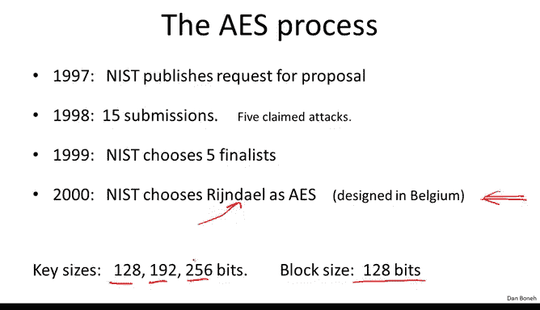
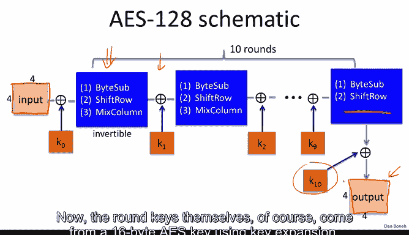
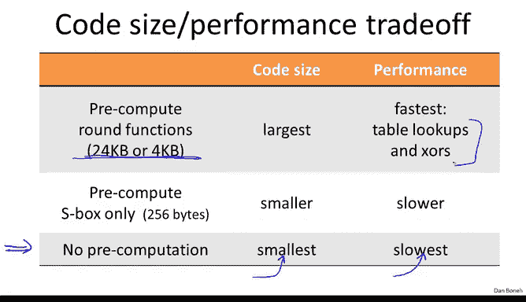
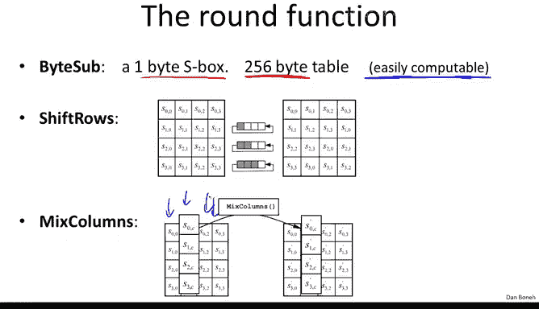
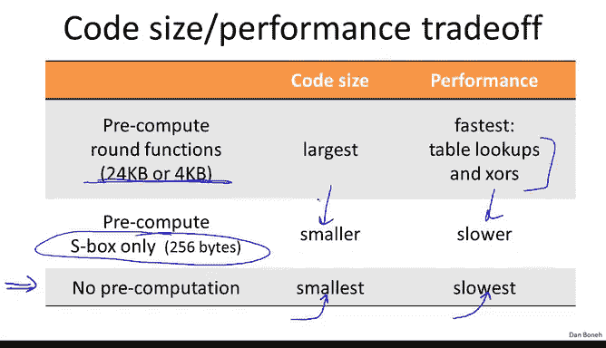
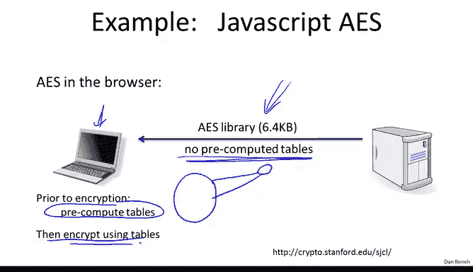
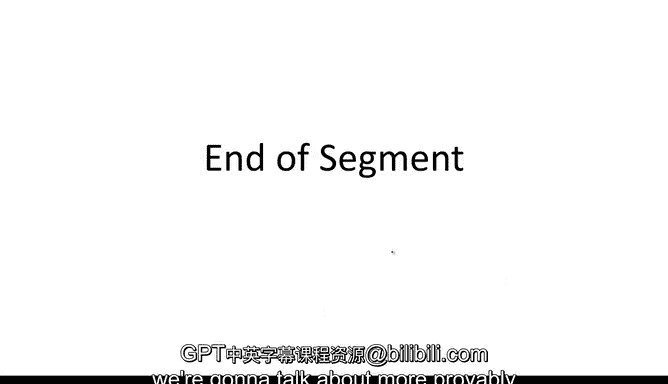

# 斯坦福大学《密码学｜Cryptography 1》中英字幕 - P17：17_02_01_AES分组密码.zh_en - GPT中英字幕课程资源 - BV1Rf421o79E

Over the years it became clear that Des and triple Ds are simply not designed for modern hardware and are too slow。

 as a result， NIS started a new process to standardize in a new B cipher called the Advanced encryptncion standard or AES for short。

N started this effort in 1997 when it requested proposals for a new block cipher。

 it received 15 submissions a year later， and finally in the year 2000。

 it adopted the cipher called Rindel as the advanced encryption standard。

 this was a cipher design in Belgium and we already said that itss block size is 128 bits and it's got three possible key size is 128 bits。

 192 and 256 and now the assumption is that the larger the key sizes。

 the more secure the block cipher is as a pseudoran permutation。

But because it also has more rounds involved in its operation， the slower the cipher becomes。

 so the larger the key， supposedly the more secure the cipher。

 but also the slower it becomes so for example， AES128 is the fastest of these ciphers and AES 256 is the slowest。

Now AES is built as what's called a substitution permutation network it's not a Fsto network remember that in a Fsal network half the bits were unchanged from round to round in a substitution permutation network all the bits are changed in every round and the network works as follows so here we have the first round of the substitution permutation network where the first thing we do is we exor the current state with the round key in this case the first round key then we go through a substitution layer where blocks of state are replaced with other blocks based on what the substitution table says。

And then we go through a permutation layer where bits are permuted and shuffled around。

And then we do this again， we exO with the next round key。

 we go through a substitution phase and we' permute to bits around and so on and so on and so forth until we reach the final round where we exO with the very last round key and then out the output。

Now， an important point about this design is that in fact， because of how it's built。

 every step in this network needs to be reversible so that the whole thing is reversible。

And so the way we would decrypt essentially is we would take the output and simply apply each step of the network in reverse order。

 So we start with a permutation step and we have to make sure that step is reversible then we look at the substitution layer and we have to make sure this step is reversible and this is very different from DES indeed D yes。

 if you remember the substitution tables were not reversible at all。

 In fact they mapped six bits to four bits whereas here everything has to be reversible。

 otherwise it would be impossible to decrypt and of course the X or with the round key is reversible as well Okay so inversion of substitution permutation network is simply done by applying all the steps in the reverse order。

So now that we understand the generic construction， let's look at the specifics of AES。

 So AES operates on 128 bit block， which is 16 bys。

 So what we do with AES is we write those 16 bytes as a 4 by four matrix each cell in the matrix contains one by。

And then we start with the first round， so we X with the first round key。

 and then we apply a certain function that includes substitutions and permutations and other operations on the state。

And again， these three functions that are applied here have to be invertible so that， in fact。

 the cpher can be decrypted。And then we ex with the next round key and we do that again， again。

 we apply the round function and XO with the round key。

 and we do that again and again and again we do it 10 times。

 although interestingly in the last round， the mixed column step is actually missing。

And then finally， we ex over the last round key and out the output again in every phase here。

 we always always always keep this 4 by four array， and so the output is also 4 by4。

 which is 16 bytes， which is 128 bits。Now the round keys themselves of course come from a 16 byte AS key using key expansion。

 so the key expansion maps us from a 16 bytes AS key into 11 keys each one being 16 bytes so these keys themselves are also4 by4 array that's exhored into the current state Okay so that's the schematic of how AAS works and the only thing that's left to do is specify these three functions byte subshift row and mixed column。

And those are fairly easy to explain， so I'm just going to give you the high level description of what they are and those interested in the details can look it up online。

So the way by subtitution works is literally it's one S box containing 256 bytes。

 and essentially what it does is it applies the S box to every byte in the current state。

 So let me explain what I mean by that。 So the current state is going to be this 4 by4 table。

 So here we have the 4 by4 table and to each element in the table， we apply the S box。

 So let's call it the a table。 and then what we do is essentially for all4 by four entries。

 essentially the next step AIJ becomes the current step evaluated at the lookup table。😊。

So we use the current cell as an entry， as an index into the lookup table。

 and then the value of the lookup table is what's output。Okay， so that's the first step。

The next step that happens。Is a shift row step which is basically just a permutation so essentially we kind of do a cyclic shift on each one of the rows so you can see the second row is cyclically shifted by one position this third row is cyclically shifted by two positions and the third row is cyclically shifted by three positions and the last thing we do is mix columns where literally we apply a linear transformation to each one of these columns so there's a certain matrix that multiplies each one of these columns and it becomes at the next columns so this linear transformation is applied independently to each one of the columns。

Now I should point out that so far shift rows and mixed columns are very easy to implement in code。

 and I should say that the by substitution itself is also easily computable so that you can actually write code that takes less than 256 bytes to write and you can kind of shrink the description of AAS by literally storing code the computes the table rather than hardwiring the table into your implementation。

And in fact， this is kind of a generic fact about AES that if you can of allow no precomputation at all。

 including computing the S box on the fly， then in fact you get a fairly small implementation of AES so it could fit on very constrained environments where there isn't enough room to hold complicated code but of course this would be the slowest implementation because everything is computed now on the fly and as a result the implementation obviously is going to be slower than if things were precomputd and then there's a straightoff for example。

 if you have a lot of space and you can support large code。

 you can actually precompute quite a bit of the three steps that I just mentioned in fact there are multiple options of precomputs you can build a table that's only 4 kilobyte big you can build a table that's even longer。

 maybe 24 kilobytes so basically you'll have these big tables in your implementation but then your actual performance is going to be really good because all you're doing is just table lookups and X-Os。

 you're not doing any other complicated arithmetic and as a result。

He can do a lot of pre computationutation， these three steps here。

 byte sub shift rows and mixed columns can be converted just into a number of small number of table lookups and some exOs。

All you can do is just compute the S box。 so now your implementation would just have 256 by hardcoded。

 the rest would just be code。 that's actually computing these three functions。

 The performance would be slower than in the previous step but the code footprint would also be smaller and overall there's this nice tradeoff between code size and performance so on highend machines on highend servers where you can afford to have a lot of code。

 you can precompute and store these big tables and get the best performance。

 whereas on lowend machines like8 bit smart cars or think of like an  eight bit wristwatch you would actually have a relatively small implementation of AA but as a result of course。

 it won't be so fast。 So here's an example that's a little unusual suppose you wanted to implement A and ja so you can send an A library to the browser and have the browser actually do AES by itself。

So in this case what you'd like to do is you'd like to both shrink the code size so that on the network there's minimum traffic to send the library over to the browser。

 but at the same time you'd like the browser performance to be as fast as possible so this is something that we did a while ago。

 essentially the idea is that the code that actually gets sent to the browser doesn't have any precomputer table and as a result it's fairly small code。

 but then the minute it lands on the browser what the browser will do is it will actually precompute all the tables So in some sense the code goes from this being small and compact it gets bloated with all these precomputer tables。

 but those are stored on the laptop which presumably has a lot of memory and then once you have the precomputer tables you actually can encrypt using them and that's how you get the best performance so if you have to send an implementation of AES over the network you can kind get the best of all worlds where the code over the network is small but when it reaches the target client it can kind of inflate itself and then get the best performance as it's doing encryption on the clients。

Now AES is such a popular block cipher now essentially when you build crypto into products。

 essentially you're supposed to be using AES and as a result。

 Intel actually put AS support into the processor itself So since Westmere there are special instructions in the Intel processor to help accelerate AES and so I listed these instructions here。

 they come in two pairs A innc and AS in class and then there's AS keygen So let me explain what they do So AES innc essentially implements one round of AES namely apply the three functions in the X or with the round key and AS and class basically implements the last round of AES remember the last round didn't have the mixed columns phase it only have the subbytes and shift rows and so that's what AES and class does and the way you call these instructions is using 128 bit registers which correspond to the state of AES and so you would have one register containing the state and one register。

taining the current round key。 And then when you call AE on these two registers。

 basically they would run one round of AE and place the result inside this XMm1 state register。

 And as a result， if you wanted to implement the whole AE。

 All you would do is you would call A9 times and then you would call A and class one time。

 and these 10 instructions are basically the entire implementation of AE。 That's it。

 It's that easy to implement A on this hardware。 And they claim because these operations are now done inside the processor。

 not using external instructions。 they're implemented in the processor。

 they claim that they can get a 14 x speedup over， say an implementation that's running on the same hardware but implementing A without these special instructions。

 So this is quite a significant speedup。 and in fact。

 there are now lots of products that make use of these special instructions。

 And let's just say that this is not specific to Intel。

 if you're an AMD fan A also implemented exactly kind of similar instructions in their bulldozer architecture。

Further and future architectures。Okay， so let's talk about the security of AES。

 I want to mention just two attacks here。 Obviously AS has been studied quite a bit。

 but the only two attacks on the full AE are the following two。 So first of all。

 if you wanted to do a key recovery， the best attack basically is only four times faster than exhaustive search。

 which means that instead of 128 B key really you should be thinking of A is 126 bit key because exhaustive search really is kind of four times faster than it should。

 Of course， root to 126 is still more time than we have to compute and this really does not hurt the security of AES。

The more significant attack actually is on AES256， it turns out there's a weakness in the key expansion at design of AES。

 which allows for what's called a related key attack。

 so what's a related key attack essentially if you give me about2 to the 100 input output pairs for AES but from four related keys。

 so these are keys that are very closely related namely key number two is the same as key number one except that a few bits of key number one have been flipped Similarlyly key number three is the same as key number one except that a few bits are flipped and the same for key number4。

😊，These are very closely related keys if you like their heming distance is very short。

 but if you do that then in fact there is a2 to the 100 attack now you should say well2 to 100 is still impractical。

 this is still more time than you can actually run today but nevertheless the fact that it's so much better than an exhaustive search attack is so much better than2 to the 256 this is kind of a limitation of the cipher but generally it's not a significant limitation because it requires related keys and so in practice of course you're supposed to be choosing your keys at random so that you have no related keys in your system and as a result this attack wouldn't apply but if you do have related keys then there's a problem。

😊，So this is the end of the segment and in the next segment we're going to talk about more provably secure constructions for block ciphers。

