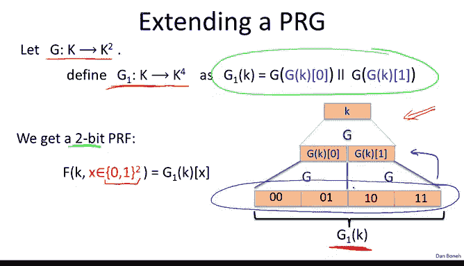
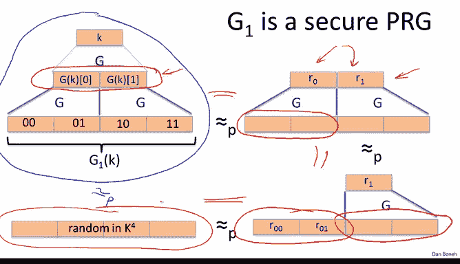
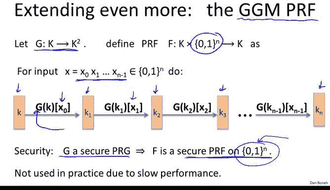

# 斯坦福大学《密码学｜Cryptography 1》中英字幕 - P18：18_02_02_基于PRG的分组密码.zh_en - GPT中英字幕课程资源 - BV1Rf421o79E

In this segment， we ask whether we can build block ciphers from simpler primitives like pseudorandom generators。

 And we're going to show that the answer is yes。

So to begin with， let's ask whether we can build pseudoran functions as opposed to pseudo randomm perutations from a pseudorandom generator。

 Can we build a PRF from a PRG， Our ultimate goal， though， is to build a block cipher。

 which is a PRP， and we'll get to that at the end。Okay。

 for now we build a PRf so let's start with a PRG that doubles its input Okay so the seed for this PRG is an element in K and the output is actually two elements in K。

 So here we have a schematic of this generator that basically takes this input a seed in K and outputs two elements in K as its output And now what does it mean for this PRG to be secure。

 recall this means that essentially the output is indistinguishable from a random element inside of K squared。

Now it turns out it's very easy to define basically what's called a1 bit PRf from this PRG。

 So what's a1 bit PRf， it's basically a PRf whose domain is only one bit Okay so so it's a PRf that just takes one bit as inputs and the way we'll do it is we'll say if the input bit X is0 output the left outputs and if the input bit X is one output the right outputs of the PRf okay in symbols basically we have what we wrote here。

Now it's straightforward to show that in fact if G is a secure PRG。

 then this one bit PRf is in fact a secure PRF， if you think about it for a second。

 this is really a totalology， it's really just staying the same thing twice。

 so I'll leave it for you to think about this briefly and see and convince yourself that in fact this theorem is true。

The real question is whether we can build a PRF that actually has a domain that's bigger than just one bit。

 ideally we'd like the domain to be 128 bits， just say as A yes has。So the question is。

 can we build 128 bit PRf from a pseudoran generator？

Well so let's see if we can make progress So the first thing we're going to do is we're going to say。

 well again， let's start with a PRG that doubles its input。

 let's see if we can build a PRG that quadruples its inputs okay so it goes from K to K to the fourth instead of K to K squared。

Okay， so let's see how to do it。 So here we start with our original PRG that just doubles its input。

 But now remember the fact that this is a PRG means that the output of the PRG is indistinguishable from two random values in K。

 Well， if the output looks like two random values in K。

 we can simply apply the generator again to those two outputs。

 So let's say we apply the generator once to the left output and once to the right output。

And we're going to call the output of that this quadruple of elements， we're going to call that G1K。

And I wrote down in symbols what this generator does。

 but you can see basically from this figure exactly how the generator works。

Okay so now that we have a generator from K to K to the fourth。

 we actually get a 2 bit PRf namely what we'll do is we'll say given 2 bits， 0，0，0，1。

10 or 11 we'll simply output the appropriate block that's the output of G1k so now we can basically have a PRf that takes four possible inputs as opposed to just two possible inputs as before。

So the question you should be asking me is why is this G1K secure。

 why is it a secure PRG that is why is this quadruple of outputs indistinguishable from random and so let's do a quick proof of this we'll just do a simple proof by pictures。

So here's our generator that we want to prove is secure。

 and what that means is we want to argue that this distribution is indistinguishable from a random forttopple in K to the fourth。

Okay， so our goal is to prove that these two are indistinguishable。 Well。

 let's do it one step at a time。 We know that the generator is a secure generator。 Therefore。

 in fact， the output of the first level is indistinguishable from random。 In other words。

 if we replace the first level by truly random strings。

 these two are truly random picked in the key space。😊。

Then no efficient adversary should be able to distinguish these two distributions。 In fact。

 if you could distinguish these two distributions， it's easy to show that you would break the original PRG。

But essentially you can see that the reason we can do this a replacement we can replace the output of G with truly random values is exactly because of the definition of the PRG。

 which says that the output of the PRG is indistinguishable from random so we might as well just put random there and no efficient adversary can distinguish the resulting two distributions so far so good。

 but now we can do the same thing again to the left hand side In other words。

 we can replace these two pseudoran outputs but truly random outputs。And again。

 because the generator G is secure， no efficient adversary can tell the difference between these two distributions。

Put it differently if an adversary can distinguish these two distributions。

 then we would also get an attack on the generator G。

And now finally we're going to do this one last time we're going to replace this pseudoran pair by a truly random pair。

 and then lo and behold， we get the actual distribution that we were shooting for。

 we will get a distribution that's really made of four independent blocks。

And so now we've proved this transition basically that these two are inistinguishable。

 these two are distinguishistinguishable， and these two are inistinguishable。

 and therefore these two are indtinguishable， which is what we wanted to prove。

Okay， so this is kind of the high level idea for the proof。

 it's not too difficult to make this rigorous， but I just wanted to show you kind of the intuition for how the proof works。

Well， if we were able to extend the generator's output once。

 there's nothing preventing us from doing it again。

 So here's a generator G1 that outputs four elements in the key space。 And remember。

 the output here is indistinguishable from a random forupple。 That's what we just proved。😊。

And so there's nothing preventing us from applying the generator again。

 So we'll take the generator apply to this random looking thing。

 and we should be able to get this random looking thing， this pair over here that's random looking。

 and we can do the same thing again and again and again。

And now basically we've built a new generator that outputs elements in K to the8 as opposed to K to the fourth。

And again， the proof of security is pretty much the same as the one I just showed you。Essential。

 you gradually change the outputs into truly random output。

 So we would change this to a truly random output then this， then that， then this， then that。

 and so on and so forth。Until finally， we get something that's truly random and therefore the original two distributions we started with G2K and truly random are indistinguishable。

Okay， so far so good， so now we have a generator that outputs elements in K to the8。

Now if we do that， basically we get a 3 bit PRF， in other words， at 000。

 this PRF would output this block and so on and so forth until the 111， it would output this block。

Now， the interesting thing is that， in fact， this PRf is easy to compute。 So， for example。

 suppose we wanted to compute the PRf at the 。101。 It's a 3 bit PRf。 So 101。 How would we do that？

 Well， basically， we would start from the original key K。And now we would apply the generator G。

 but we would only pay attention to the right output of G because the first bit is 1。

 and then we would apply the generator again， but we would only pay attention to the left output of the generator because the second bit is0。

And then we would apply the generator again and only pay attention to the right output because the third bit is 1 and that would be the final output right so you can see that that led us to 101 and in fact。

 because the entire generator is pseudoarran， we know in particular that this output here is pseudoran。

Okay， so this gives us a three bit PR。Well， if it worked three times。

 there's no reason why it can't work n times。And so if we apply this transformation again and again。

 we arrive at it's what's called the GGM PRF， GGM stands for Gold right Gold Vaser and Mi Kli。

 these are the inventors of this PRF。And the way it works is as follows。

 so we start off with a generator that just doubles its output and now we're able to build a PRF that acts on a large domain。

 namely of domain of size 01 to the n。Where n could be as big as 128 or even more。 So let's see。

 suppose we're given an input in01 to the end， let me show you how to evaluate the PRF。

Well by now you should actually have a good idea for how to do it essentially we start from the original key and then we apply the generator and we take either the left or the right side depending on the bit x0。

 and then we arrive at the next key K1 and then we apply the generator again and we take the left or the right side depending on x1 and we arrive at the next key and then we do this again and again until finally we arrive at the output so we've processed all n bits and we arrive at the output of this function。

 and basically we can prove security again pretty much along the same lines as we did before and we can show that if G is a secure PRG then in fact we get a secure PRf on01 to the end on a very large domain。

😊，So that's fantastic， so now we have essential we have a PRF that's provably secure assuming the underlying generator is secure and a generator is supposedly much easier to build than an actual PRF and in fact it works on blocks that could be very large in particular 01 to the 128。

 which is what we needed。So you might ask well why is this thing not being used in practice and the reason is that it's actually fairly slow。

 so imagine we plug in as a generator， imagine we plug in the sal sub generator。

So now to evaluate this PRF at 128 bit inputs， we would basically have to run the salsa generator 128 times one time per bit of the input。

 but then we would get a PRf that's 128 times slower than the original salsa， and that's much。

 much much slower than A yes A yes is a heuristic PRF。But nevertheless。

 it's much faster than what we just got here。 And so even though this is a very elegant construction。

 it's not used in practice to build pseudo random functions。

 although in a week we will be using this type of construction to build a message integrity mechanism。

So the last step is basically now that we have built a PRF。

 the question is whether we can actually build a block cipher。 In other words。

 can we actually build a secure PRP from a secure PRG。

 Everything we've done so far is not reversible。 Again， if you look at this construction here。

 we can't decrypt， basically given the final output。

It's not possible to go back， or at least we don't know how to go back to the original inputs。

 So now the question of interest is， can we actually solve the problem we wanted to solve initially。

 namely can we actually build a block cipher from a secure PRG。

 So I'll let you think about this for a second and mark the answer。

So of course I hope everybody said the answer is yes and you already have all the ingredients to do it。

 in particular， you already know how to build a PRf from a pseudoran generator and we said that once we have a PRf。

 we can plug it into the Luby Raoff construction， which if you remember was just a three round fiistal。

 So we said that if you plug a secure PRf into a three round Fsistal。

 you get a secure PRRP So combining these two together basically gives us a secure PRRP from pseudoran generator and this is provably secure as long as the underlying generator is secure。

So it's a beautiful result， but unfortunately again。

 it's not used in practice because it's considerably slower than heuristic instructionss like ASES。

Okay， so this completes our module on constructing pseudo random perutations and pseudo random functions。

 and then in the next module we're going to talk about how to use these things to do proper encryptions。

