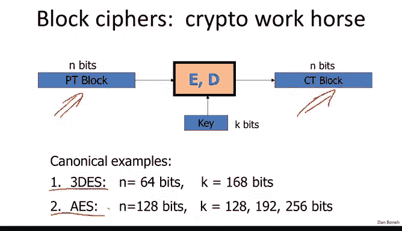
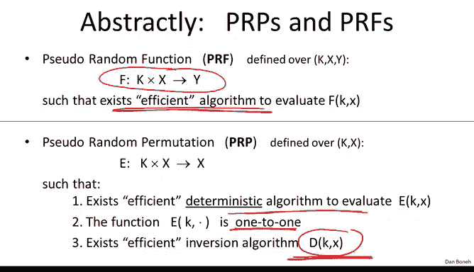
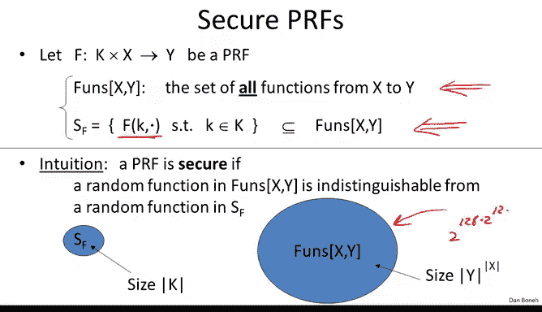

# 斯坦福大学《密码学｜Cryptography 1》中英字幕 - P19：19_02_01_回顾PRP与PRF.zh_en - GPT中英字幕课程资源 - BV1Rf421o79E

Now that we know what block cphers are and we know how to construct them。

 let's see how to use them for secure encryption， but before that I want to briefly remind you of an important abstraction called a pseudo random function and a pseudoran permutation。

 so as we said in the last module， block cpher's map nbits of inputs to end bits of outputs and we saw two examples of block ciphers tripled as an A yes。

Now an important abstraction of the concept of a block cipher is captured by this idea of a PRP and a PRf and remember that a pseudorandom function。

 a PRf basically is a function that takes two inputs。

 it takes a key in an element in some set X and an outputs an element in some set Y and for now the only requirement is that there's an efficient algorithm to evaluate this function We're going to talk about security for PRfs in just a minute。

And then similarly， there's a related concept called a pseudo random permutation。

 which is similar to a PRF， in fact theres also an efficient algorithm to evaluate the pseudo random permutation。

 however there's an additional requirement that there also an algorithm D they will invert this function E so a PRP is basically a PRf but where the function is required to be1 to1 for all keys and there's an efficient inversion algorithm So now let's talk about how to define secure PRFs。

 so we already said that essentially the goal of a PRf is to look like a random function from the set X to Y。

So to capture that more precisely， we defined this notation。

 funds Xy to be the set of all functions from the set X to the set Y。Similarly。

 we defined the set S sub F to be the set of all functions from the set X to y that are defined by the PRF。

 In other words， once you fix the key K， you obtain a function from the set X to the set Y and the set of all such functions given a particular PRf would be the set S sub F。

So as we said last time funds Xy is generally a gigantic set of all functions from x to Y。

 I think I mentioned that in fact for AAS where x and y are2 to the 128。

 the size of this set is 2 to the 128 times2 to the 128 it's a double exponential which is an absolutely enormous number。

 on the other hand the number of functions defined by the AES block cipher is just two to the 128。

 namely one function from each key and what we'd like to say is that a random choice from this huge set is indistinguishable from a random choice from this small set。

And what do we mean by indistinguishable， we mean that an adversary who can interact with a random function in here can't distinguish that interaction from an interaction with a random function in here and let's define that more precisely。

So we're going to as usual define two experiments， experiment zero and experiment one。

 and our goal is to say that the adversary can't distinguish these two experiments。So in experiment0。

 the challenger basically is going to choose a random pseudoran function Okay。

 so he's going to fix the keyK at random and that's going to define this function little F over here to be one of the functions implemented by the PRF。

In experiment1， on the other hand， the challenger is going to choose a truly random function from the set X to the set Y。

 and again， we're going to call this truly random function， little F。

 either way in either experiment0 or experiment1， the challenger ends up with this little function F that's either chosen from the PRf or chosen as a truly random function from x to Y。

Now the adversary basically gets to query this function little F。

 so he gets to submit a query X1 and he obtains the value of f at the point x1。

 then he gets to submit an x2 and he obtains the value to f at the point x2 and so on and so forth。

 he makes Q queries and so he learns the value of the function little F at those Q points and now his goal is to say whether the function little F is chosen truly at random from funds X Y or chosen just from the set of functions implemented by the PRf So he outputs a certain bit B prime and will refer to that output as the output of experiments either experiment0 or experiment1。

And as usual， we say that the PRf is secure if， in fact。

 the adversary can't distinguish these two experiments。 In other words。

 the probability that he outputs 1 experiment 0 is the same。

 pretty much the same as the probability that he outputs one in experiment1。 In other words。

 the difference of these two probabilities is negligible。

 So this captures nicely the fact that the adversary couldn't distinguish a pseudo random function from a truly random function from the set X to Y。

Now， the definition for a secure pseudoran permutation， a secure PRRP。

 which is basically a secure block cipher， is pretty much the same。 In experiment0。

 the adversary is going to choose a random instance of the PRRP。

 So he's going to choose a random K and define little f to be the function that corresponds to little K within the pseudoran permutation and experiment1 the adversary is going to choose not a truly random function from x to Y but a truly random1 to1 function from x to X。

 so it's a goal over PRRP is to look like a random permutation from x to x。

 name a random1 to one function from the set X to itself。

 So the little function little f here is again going to be a random function from the set x to itself。

 And again， the challenger ends up with this function little F is before the adversary gets to submit queries。

 and he gets to see the results of those queries and then he shouldn't be able to distinguish again。

 experiment0 from experiment1。 So again， given the。

Value of the function F at Q points chosen by the adversary。

 He can't tell whether the function F came from a PRp or whether it it's a truly random limitation from x to X。

 So let's look at a simple example。 Supp the set x contains only two points0 and1。 In this case。

 perms X is really easy to define。 essentially， there are two points。 and we're looking at01。

 And we're asking， what is the set of all invertible functions on the set 01。 Well。

 there are only two such functions。 One function is the identity function。

 And the other function is basically the function that does crossovers， namely this function here。

 These are the only two invertible functions and the said01。 So really。

 perms x only contains two functions in this case。 Now， let's look at the following PRRP。

 The key space is gonna be 01。 and of course， x is gonna be 01。

 And let's define the PRp is basically x X or K。 Okay， so that's our PRp。 And my question to you is。

 is this a secure PRp。 In other words， is this PRP indistinguishable from。

Random function on termss X。I hope everybody said yes。

 because essentially the set of functions implemented in this PRRP is identical to the set of functions in perms X。

 So a random choice of key here is identical to a random choice of function over here。

 and as a result a two distributions either super random or random identical So clearly an adversary can't distinguish the two distributions Now we already said that we have a couple of examples of secure PRpss triple die in AS and I just wanted to mention that if you want to make things very concrete。

 here's a concrete security assumptions about AS just to give an example。

 say that all algorithms that run in time2 to the 80 have advantage against AS at most two to the minus-40 This is on a reasonable assumption about AS and I just wanted to state it for concreteness。

 So let's look at another example。 consider again the PRRP from the previous question namely xx or K。

 remember the set x was just one bit namely the value 0 and1 and this time。

Asking， is this PRp a secure PRf？In other words， is this PRRP indistinguishable from a random function from x to X Now the set of random functions from x to X funds xx in this case contains only four elements。

 there are the two invertible functions which we already saw namely the identity function and the negation function。

 that's a function that sends0 to 1 and1 to0， but there are two other functions namely the function that sends everything to0 and the function that sends everything to1 these are four functions inside funds of Xx and the question is is this PRRP that we just looked at？

Is it also indistinguishable from a random choice from Funds XX？So I hope everybody said no。

 and the reason it's not a secure PRF is because there's a simple attack。

 namely the attacker supposed to distinguish whether he's interacting with this PRP or is he interacting with a random function from Fz XX。

And the distinguisher is very simple。 Basically we're going to query the function at both x equals 0 and x equals1。

 and then if we get a collision， in other words， if f of0 is equal to f of1， then for sure。

 we're not interacting with a PRRP。 in which case we can just output1 In other words。

 we're interacting with a random function。 In other words， we say0。

 So let's look at the advantage of this distinguisher Well when it's interacting with a PRRP we'll never output a1 because f of0 can never be equal to f of1。

 In other words， the probability of outputting1 is0。 However。

 when we interact with a truly random function in funds X X。

 the probability that f of0 is equal to f of1 is exactly one half because half the functions satisfy f of0 is equal to f of1 and half the functions don't。

 So then we'll output one with probability1 half。 So the advantage of this distinguisher is one half。

 which is not negligible and as a result， this PRRP here is not a secure PRf。

Now it turns out this is only true because the set X is very small and in fact there is an important lemma called the PRf switching lemma that says that a secure PRRP is in fact a secure PRf whenever the set X is sufficiently large and by sufficiently large I mean say the output space of AES which is2 to 128 So by this lemma which will state more precisely in a second AES if it's a secure PRRP。

 it is also a secure PRf So thelemma basically says the following。

 if you give me a PRRP over the set X。

Then for any adversary did queries， the PRP at most Q points。

 so it makes most Q queries into the challenge function。

Then the difference between its advantage in attacking the PRP when compared to our random function is very close to its advantage in distinguishing the PRP from a random permutation。

 In fact， the difference is bounded by this quantity here and since we said that x is very large。

 this quantity Q squared over 2 x is negligible。Okay that's going to be our goal。

 So essentially when again， when x is large， say 2 to 128 Q say is gonna be 2 to the 32 that that's a billion queries that the adversary makes。

 then still the ratio is going to be negligible in which case we say that the adversary is an advantage in distinguishing the PRRP from a random function。

 it's pretty much the same as its advantage in distinguishing the PRRP from a random permutation。

 So again， if basically if E is already a secure PRRP， then it's already a secure PRf。 So for AS AS。

 we believe it's secure PRRP， and therefore AES， we can also use it as a secure PRf。

And so as a final note， I just want to mention that really from now on。

 you can kind of forget about the inner workings of AAS and tripleDs。

 we're simply going to assume that both are secure PRPs and then we're going to see how to use them。

 but whenever I say PRP or PRF， you should be thinking in your mind basically AAS or tripleDS。

